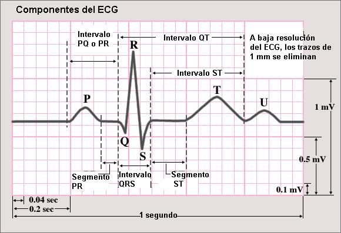
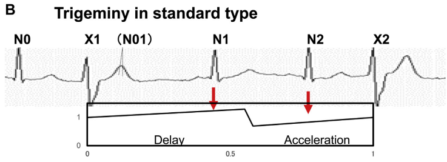
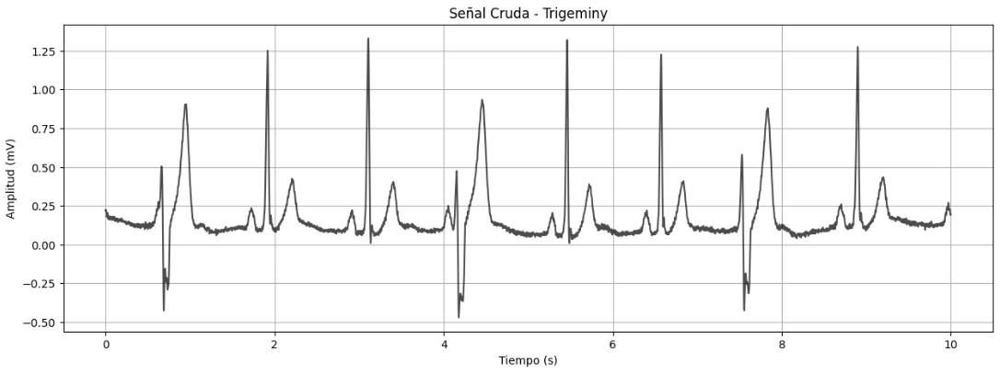
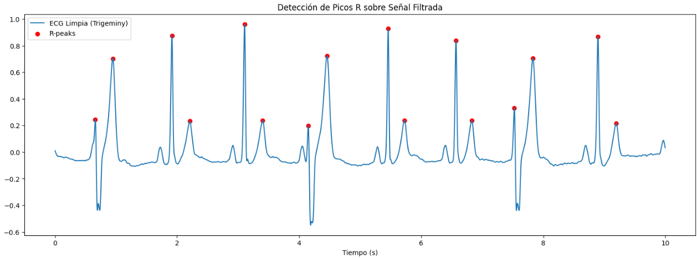
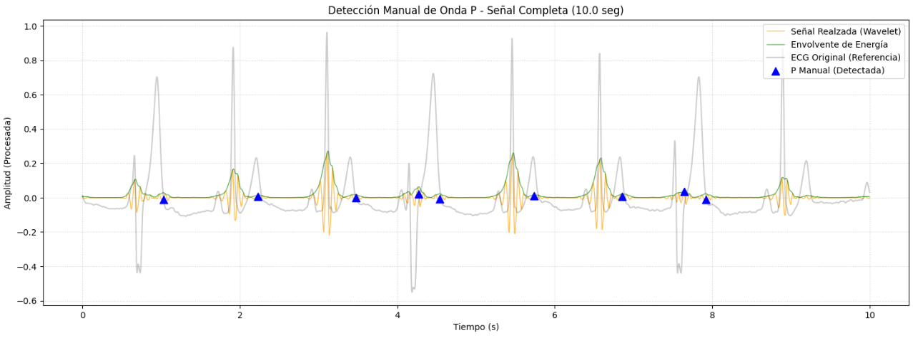
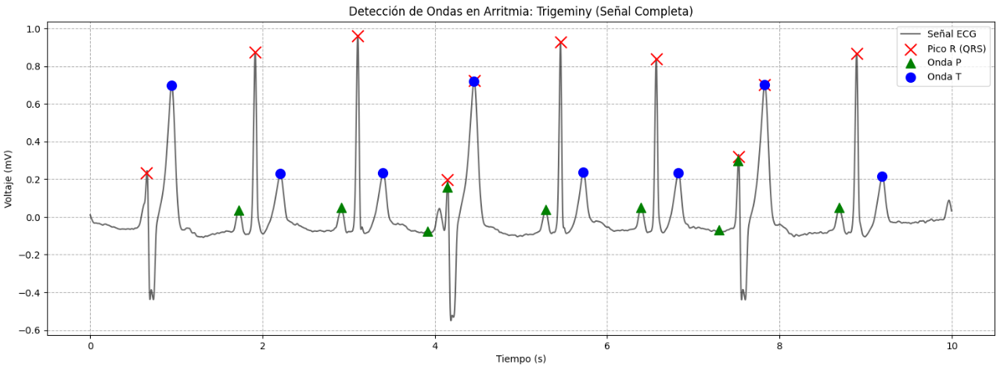
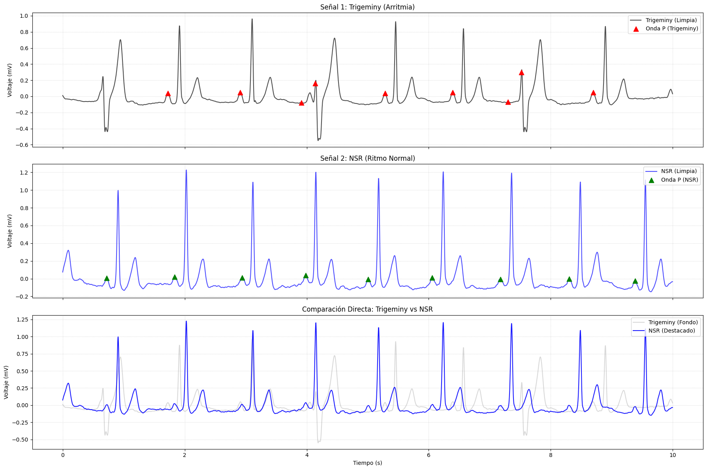
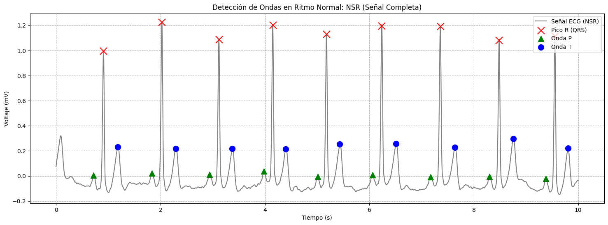

# Laboratorio 10: Procesamiento y Análisis de Señales EKG (Trigeminismo vs NSR)

**Curso:** Introducción a Señales  
**Fecha:** 25 de Noviembre, 2025
**Grupo:** 6  

## Índice

- [1. Introducción](#1-introducción)
- [2. Objetivos](#2-objetivos)
- [3. Metodología](#3-metodología)
- [4. Resultados](#4-resultados)
- [5. Discusión](#5-discusión)
- [6. Conclusiones](#6-conclusiones)
- [7. Participación de Integrantes](#7-bibliografía)
- [8. Participación de Integrantes](#8-participación-de-integrantes)

---

## 1. Introducción

El **Electrocardiograma (EKC o ECG)** es la representación gráfica de la actividad eléctrica del corazón en función del tiempo. Es una herramienta fundamental en la práctica clínica para el diagnóstico de diversas cardiopatías y trastornos del ritmo.

  
   
  <em>Figura 1: Componentes básicos de una señal de ECG normal [1].</em>

 

Una señal de ECG estándar se compone de una serie de ondas y complejos que reflejan eventos electrofisiológicos específicos:
*   **Onda P:** Representa la despolarización auricular, el inicio del ciclo cardiaco.
*   **Complejo QRS:** Corresponde a la despolarización ventricular, caracterizado por ser la deflexión de mayor amplitud.
*   **Onda T:** Refleja la repolarización ventricular, marcando la recuperación eléctrica del corazón antes del siguiente latido.

En este laboratorio, se analiza una patología específica conocida como **Trigeminismo** (o *Trigeminy*). Esta es una arritmia ventricular caracterizada por un patrón rítmico recurrente donde *dos latidos sinusales normales son seguidos sistemáticamente por un complejo prematuro (extrasístole). Este patrón altera la regularidad de los intervalos R-R y modifica la morfología de la señal, presentando desafíos únicos para los algoritmos de detección automática en comparación con un Ritmo Sinusal Normal (NSR) [2].

  
   
  <em>Figura 2: Patrón ECG carácterísticode del Trigeminismo [2].</em>

---

## 2. Objetivos

El presente laboratorio busca cumplir con las siguientes metas académicas y técnicas:

*   Identificar y segmentar las ondas P, complejos QRS y ondas T en una señal diagnosticada con trigeminismo, utilizando tanto algoritmos manuales (basados en procesamiento de señales) como librerías especializadas (NeuroKit2).
*   Evaluar la eficacia y precisión de los métodos manuales implementados frente a los algoritmos automáticos de la librería NeuroKit2.
*    Contrastar las características morfológicas y de detección entre un ECG patológico (Trigeminismo) y un ECG fisiológicamente normal (NSR).

---

## 3. Metodología

Para el desarrollo de este análisis se ha seguido un flujo de trabajo estructurado en Python, detallado a continuación:

1.  **Carga de Señales:**
    *   Importación de la base de datos en formato `.pkl` (dataset MIT-BIH).
    *   Exploración del diccionario de clases y extracción de la señal de interés (Clase: *Trigeminy*, Fila: 0).

2.  **Preprocesamiento:**
    *   Ajuste de la frecuencia de muestreo ($f_s = 360$ Hz).
    *   Limpieza de la señal cruda para eliminar ruido de alta frecuencia y línea base mediante filtros digitales.

3.  **Métodos Manuales de Detección (Picos R):**
    *   Implementación de un algoritmo basado en derivadas, cuadratura e integración (inspirado en Pan-Tompkins) para localizar los complejos QRS.

4.  **Métodos Manuales de Detección (Onda P):**
    *   Aplicación de filtrado paso-banda y Transformada Wavelet para realzar la energía en el rango de frecuencias de la onda P.
    *   Uso de envolventes de Hilbert para la localización de picos auriculares.

5.  **Procesamiento Automático (NeuroKit2):**
    *   Aplicación de la función `ecg_process` para la detección integral y segmentación de ondas P, QRS y T.

6.  **Comparativa Patológica vs. Normal:**
    *   Extracción y procesamiento de una señal de Ritmo Sinusal Normal (NSR).
    *   Superposición y análisis visual de ambas señales.

7.  **Generación de Reporte:**
    *   Visualización de resultados mediante gráficas anotadas y redacción de conclusiones.

---

## 4. Resultados

A continuación, se presentan los gráficos resultantes del procesamiento de las señales.

### 4.1 Señal de Trigeminismo Original
Visualización de la señal cruda extraída del dataset, mostrando el patrón característico de la arritmia antes del filtrado.

*Figura 3: Señal ECG cruda de la clase Trigeminismo (Fila 0) muestreada a 360 Hz.*

### 4.2 Análisis de Señal Patológica (Trigeminismo)

Se evaluaron tres enfoques distintos para la detección de eventos en la señal de arritmia procesada.

| Método | Descripción y Resultado Gráfico |
| :--- | :--- |
| **1. Detección Manual de Picos R** | Se aplicó el algoritmo manual basado en derivadas y energía para identificar los complejos QRS.   *Figura 4: Identificación de los picos R sobre la señal filtrada.* |
| **2. Detección Manual de Onda P** | Mediante el realce por Wavelets y envolvente de Hilbert, se intentó aislar la actividad auricular.   *Figura 5: Detección de ondas P utilizando procesamiento avanzado.* |
| **3. Detección Automática (NeuroKit2)** | Resultados obtenidos utilizando la librería especializada para segmentar P, QRS y T de forma integral.   *Figura 6: Segmentación completa en la señal de arritmia.* |

### 4.3 Comparativa: Trigeminismo vs. NSR
Para validar los resultados, se procesó una señal de Ritmo Sinusal Normal (NSR) bajo las mismas condiciones y se comparó directamente con la patología.

*Figura 7: (Arriba) Señal de Trigeminismo. (Centro) Señal Normal. (Abajo) Superposición de ambas para resaltar la irregularidad del ritmo y la morfología.*

### 4.4 Detección Automática en Señal Normal
Desempeño del algoritmo `NeuroKit2` en condiciones fisiológicas ideales (referencia).

*Figura 8: Detección robusta de complejos P, QRS y T en ritmo sinusal normal.*

---

## 5. Discusión

Los resultados obtenidos permiten analizar el comportamiento de la señal ECG tanto en condiciones patológicas (trigeminismo) como en ritmo sinusal normal, así como evaluar el desempeño relativo de los distintos métodos de detección aplicados. En primer lugar, la Figura 3 muestra la señal de trigeminismo original, donde se aprecia claramente el patrón repetitivo latido normal – latido ectópico – latido normal, característico de esta arritmia. 

Posteriormente, al aplicar el algoritmo de detección manual de picos R, la Figura 4 evidencia que la metodología basada en derivadas y energía es capaz de identificar buena parte de los complejos QRS; sin embargo, también muestra que varios de los picos detectados no corresponden estrictamente a picos R reales. Esto ocurre porque la señal de trigeminismo presenta una morfología ventricular irregular, donde algunos complejos ectópicos poseen amplitudes reducidas o pendientes menos pronunciadas, lo que induce al método manual a confundir pequeñas fluctuaciones o componentes auriculares como posibles picos R. Este comportamiento resalta una limitación inherente de los algoritmos basados en umbrales y derivadas: su desempeño depende fuertemente de que la señal mantenga una morfología relativamente estable, condición que no se cumple en este tipo de arritmia. 

De forma complementaria, cuando se evalúa la detección automática mediante NeuroKit2, la Figura 6 muestra una segmentación más completa, ya que el algoritmo identifica simultáneamente ondas P, complejos QRS y ondas T. No obstante, a pesar de su mayor precisión global, se observan ciertas confusiones entre ondas P y picos R, así como entre picos R y ondas T, especialmente en las zonas donde la arritmia genera variaciones abruptas en la amplitud o la duración de los ciclos. Estas inconsistencias se visualizan claramente en la superposición de algunos marcadores, lo que sugiere que, si bien el modelo fisiológico subyacente de NeuroKit2 es más robusto, la morfología anómala del trigeminismo puede desafiar incluso a los algoritmos automáticos avanzados. 

Por otra parte, la Figura 7, muestra la comparación de la señal trigeminada y la señal de ritmo sinusal normal (NSR), lo cual permite observar cómo las variaciones estructurales entre ciclos afectan la detección. Mientras que la señal NSR presenta una periodicidad estable y morfología homogénea, la señal patológica introduce irregularidades en la amplitud y forma de las ondas. Finalmente, la Figura 8, correspondiente a la detección automática en una señal normal, confirma que NeuroKit2 alcanza su máximo desempeño en condiciones fisiológicas ideales. Aquí, el algoritmo detecta con alta precisión las ondas P, QRS y T, manteniendo coherencia temporal entre ciclos y localizando cada componente en su posición típica dentro del intervalo PR, QRS y QT. 

Metodologia

	1. Vincular la placa BITalino a la PC mediante Bluetooh y configurar el canal A4 como EEG estableciendo una frecuencia de muestreo de 1000 Hz (cumple el criterio de Nyquist para 48Hz)
	2. Con la piel correctamente limpia, colocar los electrodos como se muestra en la imagen:
	3. 

---

## 6. Conclusiones

Del presente trabajo de laboratorio se concluye que:

1.  Los resultados evidencian la importancia de desarrollar algoritmos capaces de adaptarse a variaciones morfológicas pronunciadas, especialmente en ECGs patológicos como el trigeminismo. Los métodos tradicionales, diseñados principalmente para ritmos normales, muestran limitaciones cuando enfrentan patrones irregulares.
2.  La precisión en la detección de eventos (como la onda P o los complejos ventriculares) continúa siendo un desafío en escenarios no convencionales. Refinar estos algoritmos es fundamental para avanzar hacia diagnósticos automáticos más confiables, considerando la estrecha relación temporal entre la actividad auricular y ventricular.
3.  La comparación entre señales normales (NSR) y patológicas permitió evidenciar el performance de los métodos manuales y del NeuroKit. Este enfoque comparativo no solo facilita identificar fortalezas y debilidades de cada técnica, sino que también contribuye a establecer criterios de referencia para mejorar herramientas de análisis biomédico.

---

## 7. Bibliografía

[1] “Descripcion de un ECG,” *Evidencias de fisiología de Iris*, Mar. 30, 2013. [Online].  Available: https://irisperaza25.blogspot.com/2013/03/descripcion-de-un-ecg.html (accessed Nov. 25, 2025).

[2] K. Takayanagi, A. Okamoto, H. Higuchi, et al., “Ectopic cycle length estimation from the quantified distribution patterns of ventricular bigeminy and trigeminy,” *Rhythm O₂*, vol. 1, no. 3, Article 100032, 2021.

[3] B. A. Teplitzky, M. McRoberts, y H. Ghanbari, “Deep learning for comprehensive ECG annotation,” *Heart Rhythm*, vol. 17, no. 5 Pt B, pp. 881–888, 2020.

---

## 8 Participación de Integrantes

| Integrante | Aporte |
| :--- | :--- |
| Alvaro Untiveros | 33.33 % |
| Lucero Munive | 33.33 % |

| Fiorella Pérez | 33.33 % |

