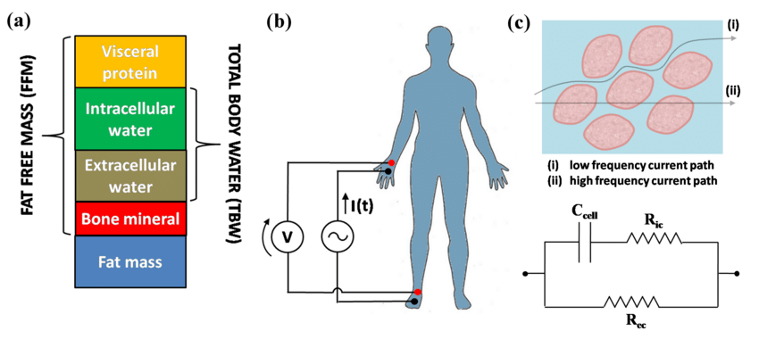

<!-- Primer entregable
Se utilizará HTML para hacer modificaciones estéticas del .md se cambian los encabezados en formato # a <h>-->

  <h1><b>Propuesta de Proyecto - Curso de ISB</b></h1>

<!-- Índice -->

  <b>Índice</b>
  <ul>
    <li><a href="#descripcion">Descripción</a></li>
    <li><a href="#opcion1">Opción 1: Bioimpedancia para la Detección Temprana...</a>
        <ul>
            <li><a href="#titulo_1">Título tentativo</a></li>
            <li><a href="#problematica_1">Problemática a abordar</a></li>
            <li><a href="#objetivos_1">Objetivos a alcanzar</a></li>
            <li><a href="#herramientas_1">Herramientas a utilizar</a></li>
        </ul>
    </li>
    <li><a href="#opcion2">Opción 2: Clasificación de emociones con ECG...</a>
        <ul>
            <li><a href="#titulo_2">Título tentativo</a></li>
            <li><a href="#problematica_2">Problemática a abordar</a></li>
            <li><a href="#objetivos_2">Objetivos a alcanzar</a></li>
            <li><a href="#herramientas_2">Herramientas a utilizar</a></li>
            <li><a href="#estado_del_arte_2">Estado del arte</a></li>
        </ul>
    </li>
    <li><a href="#referencias_generales">Referencias</a></li>
    <li><a href="#aporte_1">Aporte de los Integrantes</a></li>
  </ul>

*26/08/2025*

<h3 id="descripcion"><b>Descripción</b></h3>

A continuación, se presenta la propuesta de proyecto para el curso de Introducción a las Señales Biomédicas (ISB).

Tal como se conversó en clase, esta propuesta detalla dos posibles temáticas para el desarrollo del proyecto final. La primera opción se centra en el análisis de señales de bioimpedancia eléctrica, una temática de especial interés debido a que se cuenta con un modelo de Machine Learning preexistente y funcional para la detección de colelitiasis, el cual ha sido replicado y mejorado a partir de una referencia, cuyos códigos son adjuntados con el dataset en la carpeta <b>galestone</b>.

No obstante, reconociendo que la viabilidad de la adquisición y el procesamiento de esta señal debe ser evaluada en el marco específico de los objetivos del curso, se presenta una segunda temática como una alternativa robusta y viable.

---
 

  <h2><b>Opción 1:</b> Bioimpedancia para la Detección Temprana y Monitoreo de Patologías con Machine Learning y TinyML</h2>

<h3 id="titulo_1"><b>Título tentativo:</b></h3>

Sistema no invasivo basado en bioimpedancia y machine-learning para la detección temprana y monitoreo de patologías(*)

<h3 id="problematica_1"><b>Problemática a abordar:</b></h3>

Las enfermedades no transmisibles (ENT) constituyen la principal causa de morbimortalidad a nivel global, ejerciendo una presión creciente sobre la sostenibilidad de los sistemas de salud <a href="#ref1">[ref]</a>. En este contexto, un pilar fundamental para la gestión eficaz de estas patologías reside en el desarrollo de herramientas que permitan tanto una detección temprana como un monitoreo continuo de forma accesible, no invasiva y de bajo costo. Dicha necesidad se ve acentuada por las limitaciones inherentes a los métodos de diagnóstico convencionales, como las técnicas de imagenología o los análisis de laboratorio complejos. La frecuente centralización de estas tecnologías en centros hospitalarios restringe su aplicabilidad para el cribado masivo y el seguimiento ambulatorio, dificultando el acceso a diagnósticos oportunos para amplios sectores de la población, particularly en entornos de atención primaria o con recursos limitados <a href="#ref1">[ref]</a>.

Ante esta problemática, el análisis de señales de bioimpedancia eléctrica (BIE) surge como una tecnología prometedora, siendo una técnica no invasiva, segura, portátil y de relativamente bajo costo en comparación a métodos de diagnóstico convencionales. Esta técnica se basa en la exposición a flujos de corriente eléctrica de tejidos biológicos, para caracterizar su conductividad eléctrica, ofreciendo información valiosa sobre la composición corporal, el estado de los fluidos y la integridad celular <a href="#ref1">[ref]</a>.

<i>Imágen 1: Bioelectrical Impedance Analysis (BIA) principle of work, tomada de: [ResearchGate] <a href="#ref1">[ref]</a></i> 

 

La versatilidad y el potencial de la BIE puede ser aplicada a múltiples enfermedades no transmisibles, tanto para un diagnóstico temprano o pre-diagnóstico no invasivo, como para el monitoreo de síntomas que pueden alertar sobre la enfermedad. Entre estas podemos ejemplificar la detección temprana de colelitiasis (cálculos biliares), el monitoreo de insuficiencia cardiáca (IC), o incluso estimaciones de obesidad o sarcopenia.

 

Dentro de los casos de aplicación de la BIE para el alcance del proyecto, se propone la integración en alguna de las dos primeras como:

<h4 id="calculos_1">1) <b>Detección Temprana de Colelitiasis:</b></h4>

Es una de las enfermedades digestivas más comunes, con alta prevalencia (6% de la población mundial), teniendo América del Sur la prevalencia combinada más alta, con un 11,2% <a href="#ref1">[ref]</a>. Es de especial interés el diagnóstico pre clínico o de etapas tempranas de la enfermedad, debido a su alta incidencia, así como a la poca sintomatología que presentan los pacientes en estadíos tempranos.

El diagnóstico estándar depende de la ecografía abdominal, una técnica no siempre disponible para un cribado masivo. Investigaciones recientes, como el estudio "Early prediction of gallstone disease with a machine learning-based method from bioimpedance and laboratory data", han revelado que las alteraciones metabólicas sistémicas que conducen a la formación de cálculos biliares modifican las propiedades eléctricas del cuerpo de una manera que la BIE puede detectar <a href="#ref1">[ref]</a>

<h4 id="ic_1">2) <b>Monitoreo de Insuficiencia cardíaca (IC):</b></h4>

Es un síndrome clínico complejo y progresivo, que afecta a más de 64 millones de personas en todo el mundo, y representa una de las principales causas de hospitalización en adultos mayores, suponiendo una tasa de 50% de mortalidad en los 5 primeros años desde el diagnóstico <a href="#ref1">[ref]</a>. En el Perú, esta condición constituye una de las principales causas de ingreso en servicios de cardiología en pacientes de la tercera edad, y representando hasta un 7.2% de mortalidad intrahospitalaria en hospitales referentes nacionales como el hospital Edgardo Rebagliati <a href="#ref1">[ref]</a>.

Uno de los principales desafíos en el manejo crónico de la IC es la prevención de episodios de descomposición aguda, los cuales son la principal causa de hospitalizaciones recurrentes. Estos eventos de descompensación son predecidos por una acumulación lenta y progresiva de fluidos (edemas o retención de líquidos), un estado que a menudo es subclínico en sus fases iniciales, sin embargo debido a la naturaleza del edema (acumulación hídrica), que supone cambios en la conductividad de los tejidos corporales, la utilización de un sensor de bioimpedancia para cuantificar la sobrecarga hídrica, como el propuesto en "Bioimpedance Spectroscopy-Based Edema Supervision Wearable System for Noninvasive Monitoring of Heart Failure" representan alternativas de especial interés. <a href="#ref2">[ref]</a>

 

<h3 id="objetivos_1"><b>Objetivos a alcanzar:</b></h3>

<ol>
  <li>
    <b>Objetivo General:</b>
    <ol type="a">
      <li>
        Desarrollar un sistema no invasivo basado en cuantificación de parámetros de bioimpedancia eléctrica y algoritmos de machine learning capaz de funcionar como una herramienta de apoyo para la detección temprana de colelitiasis o para el monitoreo de la acumulación de fluidos en pacientes diagnosticados con insuficiencia cardíaca. Integrando adquisición de señales, procesamiento, desarrollo del modelo de AI y despliegue en dispositivos físicos mediante TinyML.
      </li>
    </ol>
  </li>
   
  <li>
    <b>Objetivos Específicos:</b>
    <ol>
      <li>Definir y estandarizar el procedimiento para la obtención de señales de bioimpedancia, utilizando instrumentación comercial o un sistema basado en módulos, para asegurar la captura de datos confiables y reproducibles.</li>
      <li>Realizar un análisis descriptivo y exploratorio de los datos para identificar y caracterizar los patrones y diferencias significativas en los parámetros de bioimpedancia (resistencia, reactancia, ángulo de fase) asociados a la patología escogida.</li>
      <li>Desarrollar algoritmos para el preprocesamiento de las señales crudas y aplicar técnicas de ingeniería de características (feature engineering) para construir un conjunto de variables predictivas óptimas a partir de la data de BIE.</li>
      <li>Desarrollar y optimizar modelos de machine learning específicos:
        <ol type="a">
          <li>Entrenar y validar un modelo de clasificación supervisada para la detección de colelitiasis.</li>
          <li>Entrenar y validar un modelo para la estimación del nivel de sobrecarga hídrica en pacientes con insuficiencia cardíaca.</li>
        </ol>
      </li>
      <li>Optimizar e implementar uno de los modelos desarrollados en una plataforma de hardware de bajo consumo (TinyML).</li>
      <li>Validar el desempeño del modelo final utilizando un conjunto de datos de prueba independiente y métricas cuantitativas estándar para cuantificar su potencial clínico.</li>
    </ol>
  </li>
</ol>

<h3 id="herramientas_1"><b>Herramientas a utilizar:</b></h3>

Para la consecución de los objetivos planteados, el proyecto empleará un conjunto de herramientas de hardware, software y una revisión de posibles datasets.

<ol>
  <li>
    <h4 id="hardware_1"><b>Hardware:</b></h4>
    <ol type="a">
      <li>
        <h5><b>Hardware para Adquisición de Datos y Prototipado:</b></h5>
        La selección del hardware de adquisición es un paso crítico que depende directamente de la técnica de análisis de bioimpedancia requerida para la patología en estudio. Principalmente, existen tres categorías de análisis <a href="#ref1">[ref]</a>:
        <table>
        <tr>
            <th>Técnica</th>
            <th>Descripción</th>
        </tr>
        <tr>
            <td><b>Monofrecuencia (SF-BIA)</b></td>
            <td>Utiliza una única frecuencia de corriente (generalmente 50 kHz) para estimar la composición corporal total. Es la técnica más común en dispositivos comerciales de bajo costo.</td>
        </tr>
        <tr>
            <td><b>Multifrecuencia (MF-BIA)</b></td>
            <td>Emplea varias frecuencias discretas. Se basa en el principio de que las corrientes de baja frecuencia no penetran las membranas celulares y fluyen por el agua extracelular (ECW), mientras que las de alta frecuencia atraviesan las células, midiendo el agua corporal total. Esto permite diferenciar entre los compartimentos de fluido.</td>
        </tr>
        <tr>
            <td><b>Espectroscopia (BIS)</b></td>
            <td>Realiza un barrido a través de un amplio espectro de frecuencias para modelar la respuesta eléctrica completa de los tejidos. Es la técnica más precisa para la evaluación del estado de los fluidos.</td>
        </table>
      </li>
      <li>
        <h5><b>Balanzas de Bioimpedancia Comerciales:</b></h5>
        Entre los productos comerciales, más utilizados para obtención de datos generales de bioimpedancia, podemos encontrar la Xiaomi Mi Body Composition Scale 2 <a href="#ref1">[ref]</a>, la cuál es una alternativa prometedora dada su disponibilidad, bajo costo y la capacidad documentada para extraer sus datos de impedancia a través de librerías de código abierto vía Bluetooth. Adicionalmente, se podrán utilizar otros dispositivos como la Balanza Control Corporal Bioimpedancia Euromar <a href="#ref1">[ref]</a> o similares para realizar mediciones complementarias y aprovechar los electrodos colocados en las manos para un BIA segmental, así como la realización de medidas comparativas para asegurar la consistencia de los datos.
      </li>
      <li>
        <h5><b>Módulos Analizadores de Impedancia:</b></h5>
        Se tiene en consideración el uso de circuitos integrados especializados AD5933 <a href="#ref1">[ref]</a> o el AD5941 de la línea multicanal AD594X <a href="#ref1">[ref]</a>. Estos componentes permitirían un análisis de espectroscopia de bioimpedancia completo (barrido en frecuencia), ofreciendo datos mucho más ricos. Sin embargo, debido al coste, la complejidad en su implementación y a su disponibilidad limitada en el mercado peruano, se consideran una vía secundaria o de expansión.
      </li>
      <li>
        <h5><b>Microcontroladores:</b></h5>
        El modelo de machine learning final será optimizado e implementado en una plataforma de bajo consumo. Las opciones principales son el Arduino Nano 33 BLE Sense y el ESP32, elegidos por su capacidad de cómputo, conectividad inalámbrica y compatibilidad TinyML.
      </li>
    </ol>
  </li>
   
  <li>
    <h4 id="software_1"><b>Software:</b></h4>
    El proyecto se apoyará en un ecosistema de software de código abierto que abarca desde la gestión de datos hasta el despliegue del modelo en el dispositivo final.
    <ol type="a">
      <li>
        <h5><b>Almacenamiento y Gestión de Datos:</b></h5>
        Se implementará una estrategia de almacenamiento dual para garantizar la flexibilidad y seguridad de los datos. Inicialmente, los datos recolectados se almacenarán localmente en formatos estructurados como CSV para el análisis y prototipado offline. Para facilitar la recolección en tiempo real y la colaboración, se utilizará una base de datos en la nube con un plan gratuito robusto, siendo Google Firebase (Firestore) la opción principal.
      </li>
      <li>
        <h5><b>Análisis, Procesamiento y Modelado:</b></h5>
        El desarrollo se centrará en el lenguaje Python dentro de entornos de trabajo interactivos como Jupyter Notebooks o Google Colab. Se prevé la utilización del siguiente conjunto de librerías científicas:
        <ul>
            <li> Pandas y NumPy: Para la manipulación, operaciones numéricas con los datasets.
            </li>
            <li> SciPy: Para el procesamiento de señales.
            </li>
            <li> Matplotlib y Seaborn: Para la visualización de datos.
            </li>
            <li> Scikit-learn: Para implementar, entrenar y evaluar los modelos de ML clásicos.
            </li>
            <li> TensorFlow: Para el diseño y entrenamiento de modelos de DL en caso de ser requeridos.
            </li>
        </ul>
      </li>
      <li>
        <h5><b>Despliegue en Dispositivos Embebidos (TinyML):</b></h5> 
        Uso de TensorFlow Lite for Microcontrollers para convertir, optimizar e implementar los modelos en hardware seleccionado.
      </li>
    </ol>
  </li>
   
  <li>
    <h4 id="datasets_1"><b>Datasets:</b></h4>
    <table>
      <tr>
        <th>Nombre del Dataset</th>
        <th>Resumen y Relevancia para el Proyecto</th>
        <th>Acceso</th>
      </tr>
      <tr>
        <td><b>Gallstone Prediction Dataset (UCI)</b></td>
        <td>Dataset Principal. Contiene los datos exactos del paper de referencia para colelitiasis (BIE, demografía, laboratorios).</td>
        <td><a href="https://archive.ics.uci.edu/dataset/1150/gallstone-1" target="_blank">UCI Machine Learning Repository</a></td>
      </tr>
      <tr>
        <td><b>BIA and Echocardiography in Heart Disease</b></td>
        <td>Dataset pequeño (n=40), vincula directamente mediciones de BIE con parámetros ecocardiográficos en pacientes con cardiopatía.</td>
        <td><a href="https://figshare.com/articles/dataset/Echocardiographic_and_bioimpedance_findings_/5404246?file=9310174" target="_blank">Figshare</a></td>
      </tr>
      <tr>
        <td><b>NHANES (Ciclos con BIE, ej. 1999-2004)</b></td>
        <td>El dataset público más grande con BIE. Miles de registros de la población general de EE.UU. con BIE (resistencia a 50 kHz) y datos de composición corporal por DEXA.</td>
        <td><a href="https://wwwn.cdc.gov/Nchs/Nhanes/Search/DataPage.aspx" target="_blank">CDC - NHANES Data Search</a></td>
      </tr>
      <tr>
        <td><b>Bioimpedance for Sarcopenia Screening</b></td>
        <td>Dataset de un estudio para detectar sarcopenia. Contiene datos de BIE con una etiqueta clínica clara.</td>
        <td><a href="https://zenodo.org/records/6378787" target="_blank">Zenodo</a></td>
      </tr>
      <tr>
        <td><b>MIMIC-IV (Medical Information Mart for Intensive Care)</b></td>
        <td>Base de datos de UCI de referencia mundial. No contiene datos de BIE. Su valor es proporcionar el contexto clínico para miles de pacientes con IC.</td>
        <td><a href="https://physionet.org/content/mimiciv/2.2/" target="_blank">PhysioNet - MIMIC-IV</a></td>
      </tr>
      <tr>
        <td><b>Reference Percentiles for BIA Phase Angle</b></td>
        <td>Tabla de referencia con valores normales del Ángulo de Fase, aplicable en el feature engineering.</td>
        <td><a href="https://figshare.com/articles/dataset/Table_1_Brazilian_Reference_Percentiles_for_Bioimpedance_Phase_Angle_of_Healthy_Individuals_XLSX/20240652?file=36174948" target="_blank">Figshare</a></td>
      </tr>
      <tr>
        <td><b>UK Biobank</b></td>
        <td>Dataset (~500k participantes). Contiene mediciones de BIE y datos clínicos. Requiere una aplicación de investigación formal.</td>
        <td>UK Biobank (Acceso Restringido)</td>
      </tr>
      <tr>
        <td><b>ESSE-RF Study (Russian BIA Reference Data)</b></td>
        <td>Publicación del estudio ESSE-RF con datos de referencia de BIE de más de 13,000 adultos en Rusia. Requiere una aplicación de investigación formal.</td>
        <td><a href="https://pubmed.ncbi.nlm.nih.gov/24755478/" target="_blank">PubMed (Publicación del Estudio)</a> (Acceso a datos restringido)</td>
      </tr>
    </table>
  </li>
</ol>

---

  <h2><b>Opción 2:</b> Clasificación de emociones con ECG y hardware de bajo costo</h2>

<h3 id="titulo_2"><b>Título tentativo del proyecto:</b></h3>

Clasificación de emociones con ECG y hardware de bajo costo para la detección temprana de depresión.

<h3 id="problematica_2"><b>Problemática a abordar:</b></h3>

La depresión constituye actualmente uno de los principales problemas de salud pública en el Perú. Solo en el año 2024, los establecimientos del Ministerio de Salud (Minsa) atendieron 256 563 casos de depresión, de los cuales el 75 % correspondieron a mujeres. Este trastorno afecta principalmente a adultos (41.11 %) y jóvenes (26.79 %), además de un elevado riesgo de suicidio en casos graves. A pesar de su alta prevalencia, la detección temprana de la depresión sigue siendo un desafío, ya que depende de cuestionarios clínicos y de la expresión verbal de síntomas, lo que muchas veces retrasa el diagnóstico por estigmas sociales o falta de acceso a atención especializada <a href="#ref16">[1]</a>. En este contexto, las señales biomédicas, como el electrocardiograma (ECG), han demostrado ser sensibles a las variaciones emocionales y podrían convertirse en herramientas objetivas y complementarias para la identificación temprana de estados emocionales alterados asociados a la depresión.

<h3 id="objetivos_2"><b>Objetivos a alcanzar:</b></h3>

Desarrollar un sistema de clasificación de emociones basado en ECG que, mediante la extracción de intervalos RR y el uso de algoritmos de machine learning, permita diferenciar estados emocionales básicos en tiempo real con hardware de bajo costo.

<h3 id="herramientas_2"><b>Herramientas a utilizar:</b></h3>

A continuación se detallan los siguientes materiales a nivel de hardware y software.

<ol>
  <li>
    <h4><b>Hardware:</b></h4>
    <ol type="a">
      <li>
        <h5><b>Adquisición:</b></h5>
        Para la adquisición de las señales se ha considerado los siguientes materiales de manera inicial:
        <ul>
            <li>Módulo ECG AD8232 o MAX30003 (opción del módulo integrado en el X-space Bio para las 3 derivadas).</li>
            <li>Electrodos desechables Ag/AgCl + cables snap.</li>
            <li>Arduino UNO/Nano o ESP32 (en el caso del X-space el ESP32).</li>
            <li>Cinta elástica y alcohol isopropílico (preparación de piel).</li>
            <li>Sensor de temperatura LM35 (opcional).</li>
            <li>Batería, cable USB/USBC.</li>
        </ul>
      </li>
      <li>
        <h5><b>Requerimientos de PC:</b></h5>
        <ul>
            <li>CPU 4-8 núcleos, 16GB RAM (mínimo).</li>
            <li>GPU NVIDIA (CUDA 8 GB+).</li>
        </ul>
      </li>
    </ol>
  </li>
   
  <li>
    <h4><b>Software:</b></h4>
    <ol type="a">
      <li>
        <h5><b>Adquisición:</b></h5>
        <ul>
            <li>Arduino IDE / PlatformIO (muestreo).</li>
            <li>Python + bleak (BLE), pyserial (serial) para captura.</li>
            <li>CSV/EDF como formato de guardado.</li>
        </ul>
      </li>
      <li>
        <h5><b>Preprocesamiento ECG/HRV:</b></h5>
        Se utilizará programación en el lenguaje Python 3.10+ con las siguientes librerías:
        <ul>
            <li><b>Principales:</b> numpy, scipy, pandas</li>
            <li><b>Especializadas a nivel fisiológico:</b> NeuroKit2, biosppy o wfdb (detección de picos R, limpieza)</li>
            <li><b>Especializadas en HRV:</b> pyHRV / hrvanalysis (métricas HRV: SDNN, RMSSD, LF/HF, Poincaré)</li>
            <li><b>Eliminación de ruido:</b> pywt (denoising por wavelets)</li>
        </ul>
      </li>
    </ol>
  </li>
   
  <li>
    <h4><b>Datasets:</b></h4>
    

    Para entrenar y validar (train/test) los diversos modelos de machine learning, hemos considerado la posibilidad de utilizar Datasets públicos, tales como:
    

    <ul>
        <li><b>AMIGOS Dataset:</b>
            <ul>
                <li>Señales: ECG, EEG, GSR (respuesta galvánica de la piel).</li>
                <li>Emociones etiquetadas en valencia (positiva/negativa) y arousal (bajo/alto).</li>
                <li>Incluye anotaciones en 1ª y 3ª persona.</li>
                <li><b>Enlace:</b> <a href="http://www.eecs.qmul.ac.uk/mmv/datasets/amigos/" target="_blank">AMIGOS: A Dataset for Affect, Personality and Mood Research</a></li>
            </ul>
        </li>
        <li><b>DEAP Dataset:</b>
            <ul>
                <li>32 sujetos viendo videos musicales.</li>
                <li>Señales: EEG + fisiológicas (incluye ECG).</li>
                <li>Etiquetas emocionales: valencia, arousal, dominancia.</li>
                <li><b>Enlace:</b> <a href="https://www.eecs.qmul.ac.uk/mmv/datasets/deap/" target="_blank">DEAP Dataset</a></li>
            </ul>
        </li>
        <li><b>DREAMER Dataset:</b>
            <ul>
                <li>Señales: ECG, EEG.</li>
                <li>Clasificación de emociones discretas (alegría, tristeza, enojo, calma, etc.).</li>
                <li>Usa cuestionarios de autoevaluación para etiquetar emociones.</li>
                <li><b>Enlace:</b> <a href="https://zenodo.org/records/546113" target="_blank">DREAMER Dataset</a></li>
            </ul>
        </li>
        <li><b>WESAD Dataset (Wearable Stress and Affect Detection):</b>
            <ul>
                <li>Señales: ECG, BVP, EDA, EMG, RSP, TEMP.</li>
                <li>Registrado con sensores portables.</li>
                <li>Etiquetas de estrés, diversión, estado neutro.</li>
                <li><b>Enlace:</b> <a href="https://archive.ics.uci.edu/dataset/468/wesad+wearable+stress+and+affect+detection" target="_blank">WESAD - UCI Machine Learning Repository</a></li>
            </ul>
        </li>
    </ul>
    

    En el artículo de Hasnul et al. (2021), se realiza una comparación mediante la siguiente tabla a diversos Datasets usados comúnmente en este tipo de estudios <a href="#ref17">[2]</a>.
    

    

        
         <i>Tabla 1: Comparación de datasets para reconocimiento de emociones.</i>
    

  </li>
</ol>

<h3 id="estado_del_arte_2"><b>Estado del arte:</b></h3>

El estudio de Patil et al. (2023) implementó un sistema embebido de bajo costo para la detección en tiempo real de las emociones. En su estudio emplearon un sensor ECG AD8232 y un sensor de temperatura LM35, ambos conectados a una placa Arduino. En cuanto a la metodología, se trabajó con 10 voluntarios a quienes se les indujeron distintas emociones mediante estímulos audiovisuales, mientras que las señales de ECG eran registradas y preprocesadas para eliminar ruido y artefactos. Posteriormente, se calcularon los intervalos RR como características principales del ECG y, junto con la temperatura corporal, se usaron para entrenar y validar dos modelos de machine learning: Support Vector Machine (SVM) y Naive Bayes, apoyándose además en el dataset WESAD. En términos de desempeño global, el clasificador SVM mostró una exactitud superior, alcanzando un 98%, junto con un Hamming Loss de 0.0197 y el segundo modelo que fue de Naive Bayes obtuvo un 96% de precisión y un Hamming Loss más alto (0.042).Por lo tanto , el modelo de SVM demostró ser mejor, con menos pérdidas y mayor precisión <a href="#ref19">[4]</a>.

    
     <i>Figura 1: Arquitectura del sistema propuesto por Patil et al.</i>

 

El estudio de Wang et al. (2023)  propone un método denominado HRV Emotion Recognition (HER) que aprovecha la información local de la variabilidad de la frecuencia cardiaca (HRV) derivada del ECG. En su investigación empleó el dataset DREAMER. Para el preprocesamiento, se aplicó un filtro basado en wavelets con el fin de eliminar ruido y conservar los picos R de los ECG, a partir de los cuales se calcularon los intervalos RR y se obtuvieron las señales HRV. Posteriormente, se introdujo la técnica de Amplitude Level Quantization (ALQ), que analiza patrones locales en diferentes bandas de frecuencia de la HRV, complementada con el método Emotion Quantification Analysis (EQA) para mapear las emociones en el espacio bidimensional de valencia-arousal. Finalmente, estas características fueron clasificadas mediante un modelo de regresión logística (LR). En cuanto al desempeño, el modelo HER alcanzó una exactitud promedio de 84.3% en la clasificación de 17 emociones, superando a modelos comparativos como PETSFCNN, LSTM-CNN y Wave-Scatter. Además, emociones como tristeza, pasión, esperanza, miedo, disgusto, confianza y relajación lograron precisiones superiores al 90%. Se comprobó también que el preprocesamiento de filtrado era fundamental, ya que sin él la exactitud descendía a  80.4% <a href="#ref20">[5]</a>.

La Figura 2 ilustra el flujo del sistema propuesto para el reconocimiento de emociones a partir de ECG: En primer lugar se realiza el preprocesamiento de la señal con la detección de picos R y el cálculo de secuencias HRV; luego, en la etapa de extracción de características, se aplica una cuantificación por amplitud y generación de reglas junto con la minería de patrones basados en reglas; finalmente, estas características alimentan al modelo clasificador de múltiples emociones.

    
     <i>Figura 2: Flujo del sistema HER propuesto por Wang et al.</i>

 

La Figura 3 muestra la matriz de confusión del modelo HER. Se observa un alto desempeño en emociones como tristeza (94%), miedo (95%), esperanza (100%), disgusto (90%), relajación (92%) y confianza (100%), entre otras. También se identifican algunas confusiones entre clases, por ejemplo: ansiedad con sorpresa, gratitud con tristeza, e intimidad con confianza.

    
     <i>Figura 3: Matriz de confusión del modelo propuesto (HER) al clasificar 17 emociones usando el dataset DREAMER.</i>

---

<h2 id="referencias_generales">Referencias</h2>
<ol>
  <li id="ref1">Referencia 1 para Opción 1...</li>
  <li id="ref2">Referencia 2 para Opción 1...</li>
  <li id="ref3">Referencia 3 para Opción 1...</li>
  <li id="ref4">Referencia 4 para Opción 1...</li>
  <li id="ref5">Referencia 5 para Opción 1...</li>
  <li id="ref6">Referencia 6 para Opción 1...</li>
  <li id="ref7">Referencia 7 para Opción 1...</li>
  <li id="ref8">Referencia 8 para Opción 1...</li>
  <li id="ref9">Referencia 9 para Opción 1...</li>
  <li id="ref10">Referencia 10 para Opción 1...</li>
  <li id="ref11">Referencia 11 para Opción 1...</li>
  <li id="ref12">Referencia 12 para Opción 1...</li>
  <li id="ref13">Referencia 13 para Opción 1...</li>
  <li id="ref14">Referencia 14 para Opción 1...</li>
  <li id="ref15">Referencia 15 para Opción 1...</li>
  <li id="ref16">Establecimientos del Minsa atendieron más de 250 000 casos de depresión a lo largo del año 2024. (s/f). Gob.pe. Disponible en: <a href="https://www.gob.pe/institucion/minsa/noticias/1088925-establecimientos-del-minsa-atendieron-mas-de-250-000-casos-de-depresion-a-lo-largo-del-ano-2024" target="_blank">https://www.gob.pe/institucion/minsa/noticias/1088925-establecimientos-del-minsa-atendieron-mas-de-250-000-casos-de-depresion-a-lo-largo-del-ano-2024</a></li>
  <li id="ref17">Hasnul, M. A., Aziz, N. A. A., Alelyani, S., Mohana, M., & Aziz, A. A. (2021). Electrocardiogram-based emotion recognition systems and their applications in healthcare. A review. <i>Sensors, 21</i>(15), 5015. <a href="https://doi.org/10.3390/s21155015" target="_blank">https://doi.org/10.3390/s21155015</a></li>
  <li id="ref18">DS Hammad y H. Monkaresi, “Detección de emociones basada en ECG mediante extracción paralela de características temporales y espaciales utilizando una red neuronal convolucional”, <i>Traitement Du Signal</i>, vol. 39, n.º 1, págs. 43–57, febrero de 2022.Disponible en: <a href="https://doi.org/10.18280/ts.390105" target="_blank">https://doi.org/10.18280/ts.390105</a></li>
  <li id="ref19">V. K. Patil, V. R. Pawar, S. P. Kulkarni, T. A. Mehta, and N. R. Khare, “Real Time Emotion Recognition with AD8232 ECG Sensor for Classwise Performance Evaluation of Machine Learning Methods,” <i>International Journal of Engineering. Transactions C: Aspects</i>, vol. 36, no. 6, pp. 1040–1047, Jan. 2023.Available: <a href="https://doi.org/10.5829/ije.2023.36.06c.02" target="_blank">https://doi.org/10.5829/ije.2023.36.06c.02</a></li>
  <li id="ref20">Wang, L., Dong, X., Lu, X., & Fang, X. (2023). ECG multi-emotion recognition based on heart rate variability signal features mining. <i>Sensors, 23</i>(22), 8636. <a href="https://doi.org/10.3390/s23218636" target="_blank">https://doi.org/10.3390/s23218636</a></li>
</ol>

<h2 id="aporte_1">Aporte de los Integrantes</h2>

| Integrante               | Aporte   |
|--------------------------|----------|
| Alvaro Untiveros         | 33.33 %  |
| Lucero Munive            | 33.33 %  |
| Fiorella Pérez           | 33.33 %  |