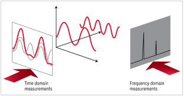
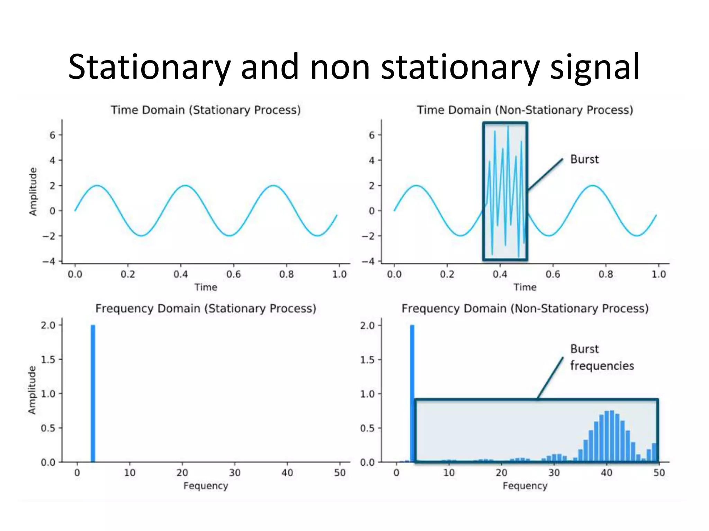
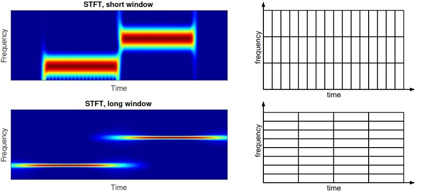
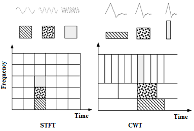
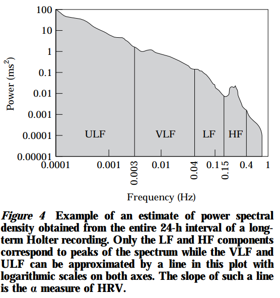
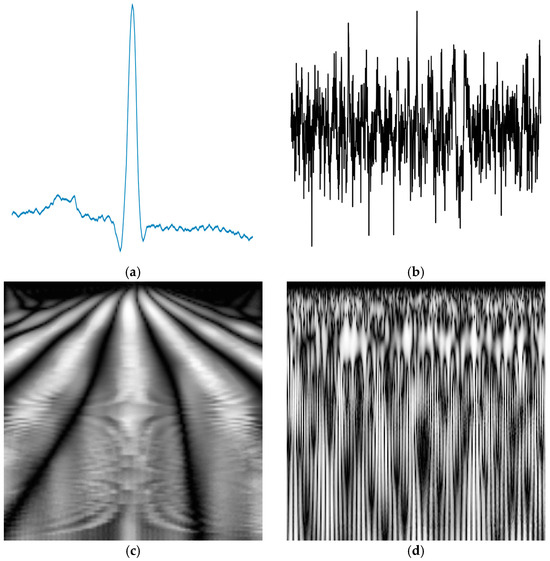
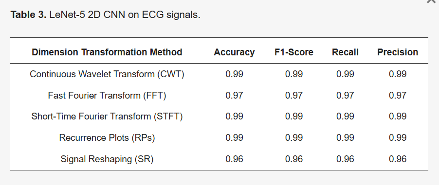

# Análisis Espectral Avanzado en Señales Biomédicas
## Comparativa Técnica: FFT, STFT y CWT

## I. Introducción

El análisis de señales fisiológicas (como el electrocardiograma **ECG**, electroencefalograma **EEG** o electromiograma **EMG**) es fundamental para el diagnóstico médico moderno. Sin embargo, estas señales rara vez presentan información clara a simple vista en el dominio del tiempo (amplitud vs. tiempo).

Para extraer características ocultas (biomarcadores, arritmias, patologías), es necesario transformar la señal al **dominio de la frecuencia**.

*Fig 1. Representación conceptual de una señal vista en el dominio temporal (izquierda) y su descomposición espectral (derecha).*

El desafío principal en biomedicina es que las señales son **No Estacionarias**: sus propiedades estadísticas y frecuencias dominantes cambian abruptamente en el tiempo (como por ejemplo el inicio repentino de una convulsión). Las herramientas clásicas fallan al analizar estos cambios dinámicos, lo que motiva el uso de técnicas de tiempo-frecuencia avanzadas.

*Fig 2. Diferencia entre una señal estacionaria (predecible) y una no estacionaria típica en biología.*

---

## II. Marco Teórico y Fundamentos Matemáticos

A continuación, se detalla la evolución matemática de las tres herramientas principales de procesamiento espectral.

### 1. Transformada Rápida de Fourier (FFT)

La FFT (*Fast Fourier Transform*) es un algoritmo eficiente para calcular la Transformada Discreta de Fourier (DFT). Descompone una señal en una suma infinita de senos y cosenos.

#### Definición Matemática
$$X[k] = \sum_{n=0}^{N-1} x[n] \cdot e^{-j \frac{2\pi}{N} k n}$$

Donde:
*   $x[n]$ es la señal discreta de entrada.
*   $X[k]$ representa la magnitud y fase en la frecuencia $k$.
*   El término $e^{-j...}$ es la base sinusoidal compleja (Fórmula de Euler).

#### Limitación: La Ceguera Temporal
La FFT integra la información sobre **toda la duración** de la señal.
> **Problema:** Al observar el espectro $|X[k]|$, sabemos *qué* frecuencias existen, pero perdemos totalmente la información de *cuándo* ocurrieron. Si un paciente sufre una arritmia de 2 segundos dentro de un registro de 1 hora, la FFT "diluirá" ese evento y será indetectable.

---

### 2. Transformada de Fourier de Tiempo Corto (STFT)

Para recuperar la información temporal, la STFT divide la señal en pequeños segmentos usando una **ventana deslizante** ($w[n]$) y aplica la FFT a cada segmento independientemente. Esto genera un mapa de Tiempo-Frecuencia (Espectrograma).

#### Definición Matemática
$$STFT \{x[n]\}(m, k) = \sum_{n=-\infty}^{\infty} x[n] \cdot w[n - m] \cdot e^{-j \frac{2\pi}{N} k n}$$

Donde $w[n-m]$ es la ventana centrada en el instante $m$.

#### El Dilema de Resolución (Principio de Incertidumbre)
La STFT está limitada por el Principio de Incertidumbre de Gabor-Heisenberg: **No se puede tener resolución perfecta en tiempo y frecuencia simultáneamente.**
*   **Ventana Ancha:** Buena resolución de frecuencia ($\Delta f \downarrow$), mala resolución temporal ($\Delta t \uparrow$).
*   **Ventana Estrecha:** Buena resolución temporal ($\Delta t \downarrow$), mala resolución de frecuencia ($\Delta f \uparrow$).

*Fig 3. Representación de la resolución fija de la STFT. El tamaño de las "cajas" de información es constante, obligando a elegir entre precisión temporal o frecuencial.*

---

### 3. Transformada Wavelet Continua (CWT)

La CWT soluciona el problema de la resolución fija mediante el **Análisis Multiresolución**. En lugar de una ventana de tamaño fijo, utiliza una función base llamada "Wavelet Madre" ($\psi$) que se estira y comprime.

#### Definición Matemática
$$CWT(a, b) = \frac{1}{\sqrt{|a|}} \int_{-\infty}^{\infty} x(t) \cdot \psi^* \left( \frac{t - b}{a} \right) dt$$

Donde:
*   **$a$ (Escala):** Factor de dilatación.
    *   $a$ pequeño (Wavelet comprimida) $\rightarrow$ Captura **Frecuencias Altas** con gran precisión temporal.
    *   $a$ grande (Wavelet estirada) $\rightarrow$ Captura **Frecuencias Bajas** con gran precisión espectral.
*   **$b$ (Traslación):** Ubicación temporal del análisis.

*Fig 4. Comparación de teselado tiempo-frecuencia. A la izquierda (STFT) la resolución es fija. A la derecha (CWT), la resolución se adapta: ventanas cortas para frecuencias altas y largas para bajas, ideal para señales biológicas.*

#### Ventaja en Biomedicina
La CWT imita la naturaleza de las señales biomédicas (que suelen tener transitorios rápidos de alta frecuencia y ritmos de fondo lentos), permitiendo detectar morfologías complejas como el complejo QRS en ECG o espigas en EEG con precisión superior.

---

## III. Estado del Arte y Evidencia Académica

Para validar la aplicación de estas transformadas, se analizan dos documentos fundamentales: el estándar clínico internacional para FFT y un estudio de vanguardia (2025) sobre STFT/CWT en Inteligencia Artificial.

### A. El Estándar FFT: Variabilidad de la Frecuencia Cardíaca
> **Referencia:** Task Force of the European Society of Cardiology and the North American Society of Pacing and Electrophysiology. (1996). *"Heart rate variability: standards of measurement, physiological interpretation and clinical use"*. European Heart Journal.

**Análisis de la Evidencia:**
Este documento de consenso establece cómo la **FFT** debe usarse para evaluar el sistema nervioso autónomo. A pesar de las limitaciones temporales de la FFT, es la herramienta ideal para registros largos (5 minutos a 24 horas) donde se asume cierta estabilidad estadística.

*Fig 5. Análisis de Densidad Espectral de Potencia (PSD) extraído del documento de la Task Force (Fig. 4). Se observan claramente los picos de energía obtenidos mediante FFT:*
*   **VLF/LF (Very Low/Low Frequency):** Asociados a mecanismos simpáticos y hormonales.
*   **HF (High Frequency):** Asociado al ritmo respiratorio (parasimpático).
*   *Interpretación:* La separación nítida de estas bandas valida el uso de FFT para diagnósticos basales, aunque no pueda detectar en qué segundo ocurrió un cambio de estrés.

---

### B. Comparativa Moderna: STFT y CWT en Deep Learning
> **Referencia:** Lekkas, G., et al. (2025). *"Time–Frequency Transformations for Enhanced Biomedical Signal Classification with Convolutional Neural Networks"*. MDPI BioMedInformatics.

**1. De 1D a 2D: La Transformación**
El estudio propone que para clasificar patologías complejas (arritmias/epilepsia) usando Inteligencia Artificial, la señal temporal simple es insuficiente. Se compara el uso de transformadas de tiempo-frecuencia para convertir la señal en "imágenes" que una red neuronal pueda interpretar.

*Fig 6. Preprocesamiento de la señal biomédica (Fuente: Lekkas et al., 2025). La señal cruda (Raw) pasa por etapas de filtrado y transformación. La representación en tiempo-frecuencia (CWT/STFT) revela patrones morfológicos que son invisibles en la gráfica de amplitud temporal.*

**2. Resultados Cuantitativos**
Los autores entrenaron modelos de Redes Neuronales Convolucionales (CNN) alimentados con estas transformaciones. Los resultados demuestran la superioridad de preservar la información temporal y frecuencial simultáneamente.

*Fig 7. Comparativa de desempeño (Fuente: Lekkas et al., 2025). Se evidencia que:*
*   Los métodos basados en transformadas de tiempo-frecuencia (como STFT y CWT) superan a los métodos clásicos.
*   Se alcanza una alta precisión (**Accuracy**) y sensibilidad en la clasificación, demostrando que visualizar "cuándo" ocurren las frecuencias (vía CWT/STFT) es crítico para el diagnóstico automatizado moderno.

---

## Aporte de cada integrante
| Integrante               | Aporte   |
|--------------------------|----------|
| Alvaro Untiveros         | 33.33 %  |
| Lucero Munive            | 33.33 %  |
| Fiorella Pérez           | 33.33 %  |