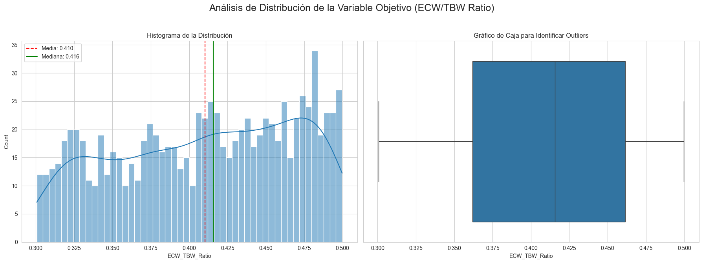
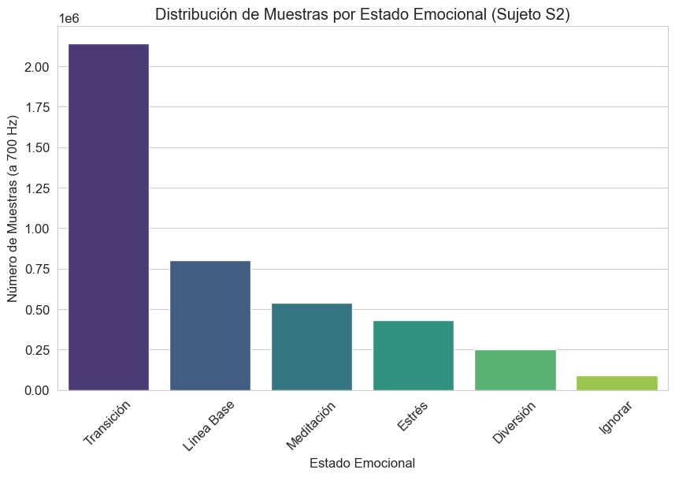
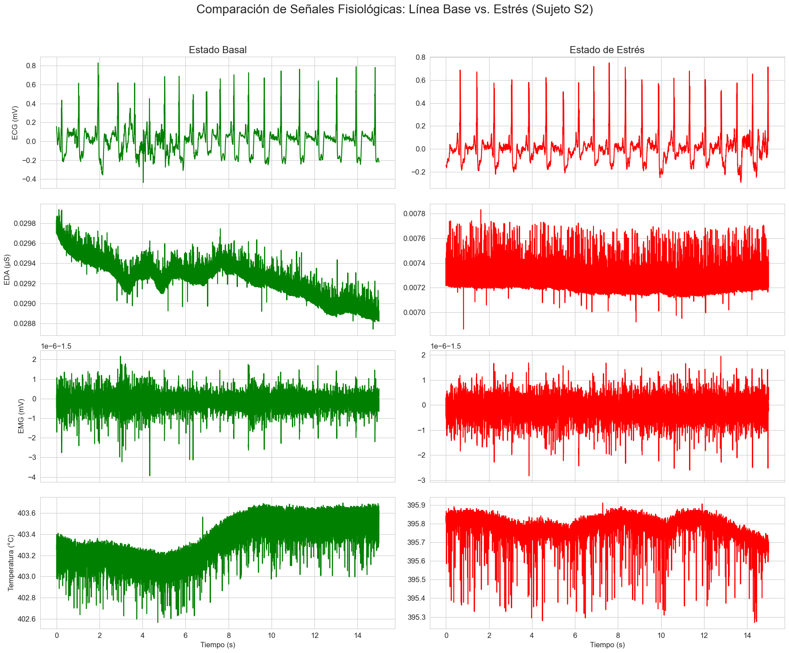
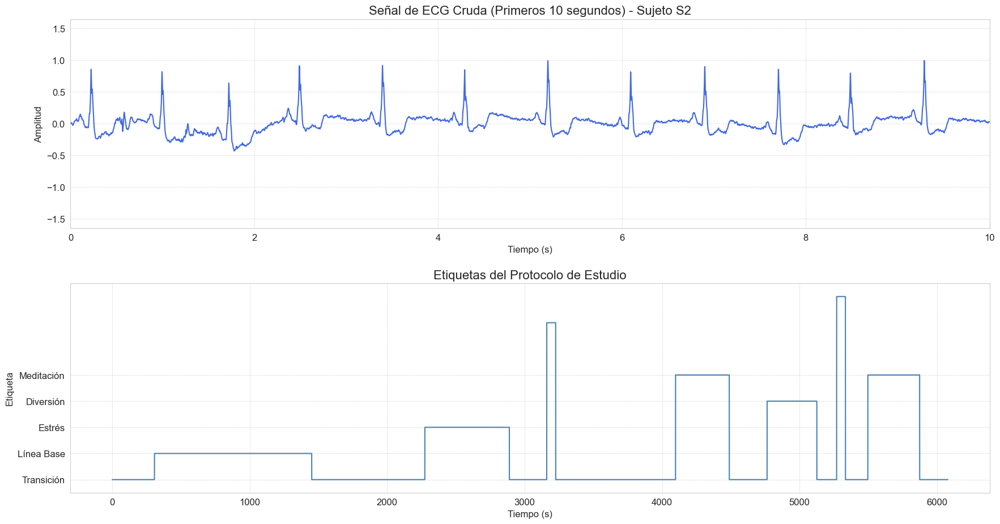
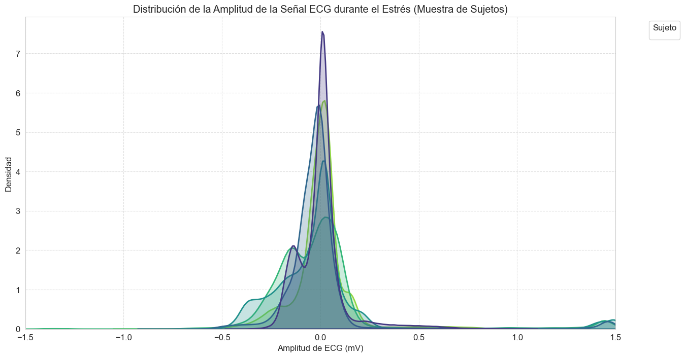

# **Análisis de Bases de Datos para el Proyecto Final de ISB**
---
**Curso:** Introducción a las Señales Biomédicas (ISB)

**Fecha:** 02/09/2025

## Resumen del Laboratorio 2

Este documento contiene el análisis de bases de datos realizado para el Laboratorio 2 del curso de ISB. El objetivo principal fue explorar y preparar datasets para dos posibles proyectos de señales biomédicas, los análisis profundos y detallados de cada opción se encuentran en los notebooks correspondientes con los nombres de **Bioimpedancia** y **Clasificacion_Emociones_ECG**, en esta parte se presentan los hallazgos más relevantes:
1.  **Opción 1 (Descartada):** Detección de Insuficiencia Cardíaca (IC) mediante datos de bioimpedancia eléctrica (BIE) del dataset NHANES.
2.  **Opción 2 (Seleccionada):** Clasificación de emociones y estrés a partir de señales de ECG del dataset WESAD.

En un primer momento, se intentó validar el proyecto en torno a la bioimpedancia para la detección de IC, analizando el dataset público NHANES. Sin embargo, debido a las limitaciones encontradas en la naturaleza de los datos, se optó finalmente por utilizar el dataset WESAD para la clasificación de emociones con ECG. A continuación, se presenta un resumen detallado de lo que se hizo en ambos análisis.

---

## Opción 1 (Descartada): Análisis de Bioimpedancia para Predicción de Insuficiencia Cardíaca (Dataset NHANES)

### 1. Introducción y Objetivo del Notebook

El objetivo de este análisis exploratorio era investigar la viabilidad de utilizar el dataset **NHANES (National Health and Nutrition Examination Survey)** para encontrar una correlación entre las mediciones de bioimpedancia eléctrica (BIE) y la prevalencia de **Insuficiencia Cardíaca (IC)**. La hipótesis era que la acumulación de fluidos, un síntoma clave de la IC, podría ser detectada a través de cambios en la impedancia corporal, ofreciendo un potencial marcador de bajo costo y no invasivo.

### 2. Pasos del Análisis Realizado

El proceso de análisis de este complejo dataset público implicó varias etapas:

#### 2.1. Carga y Exploración de Datos
*   Se descargaron y exploraron los archivos del dataset NHANES, que se publican en ciclos de varios años y están segmentados en múltiples archivos (demográficos, de laboratorio, de examen, etc.).
*   El esfuerzo se centró en identificar y fusionar los archivos que contenían:
    *   Datos de **bioimpedancia** (específicamente, la resistencia a 50 kHz).
    *   Datos **demográficos** (edad, sexo).
    *   Datos **clínicos** que pudieran servir como indicador o proxy de la Insuficiencia Cardíaca.

#### 2.2. Limpieza y Preprocesamiento
*   Se realizó un extenso trabajo de limpieza para manejar los valores faltantes y los códigos específicos del survey (ej. `777`, `999` para "no sabe / no contesta").
*   Se fusionaron los DataFrames seleccionados utilizando el ID de secuencia del encuestado (`SEQN`) como clave.

#### 2.3. Visualizaciones y Hallazgos
*   Se intentó realizar un análisis comparativo para observar si existían diferencias estadísticamente significativas en los valores de impedancia entre el grupo de control y los individuos con alguna condición cardíaca reportada.
*   Se generaron boxplots y se realizaron pruebas estadísticas para evaluar esta relación.

### 3. Dificultades y Justificación del Descarte

A pesar del potencial de un dataset tan grande, se encontraron limitaciones fundamentales que llevaron a descartar este enfoque para el proyecto:

*   **Naturaleza de los Datos de BIE (Limitación Principal):** El dataset NHANES proporciona únicamente un **valor puntual de BIE (resistencia a 50 kHz)**, no una **señal cruda de bioimpedancia** en función del tiempo o de la frecuencia. Esto impedía la aplicación de las técnicas de procesamiento de señales (filtrado, análisis en frecuencia, extracción de características de la forma de onda) que son el núcleo del curso de ISB. El dato disponible es una *característica* ya extraída, no una *señal*.
*   **Ambigüedad de la Variable Objetivo:** Identificar una etiqueta clara y fiable para "Insuficiencia Cardíaca" en una encuesta de salud general resultó ser muy complejo. Los diagnósticos están a menudo auto-reportados o codificados de manera indirecta, lo que introduce ruido y dificulta la creación de un grupo de "casos" bien definido para entrenar un modelo.

*   **Complejidad del Dataset:** La estructura de NHANES, con sus múltiples archivos, documentación extensa y códigos específicos, requería un esfuerzo de preprocesamiento desproporcionado para el alcance del laboratorio, desviando el foco del análisis de la señal en sí.

### 4. Conclusión del Notebook de Bioimpedancia

Aunque el dataset NHANES es una fuente de datos de salud pública de inmenso valor, su estructura y el tipo de datos de BIE que contiene no se alineaban con los objetivos pedagógicos del curso de "Introducción a las Señales Biomédicas". La imposibilidad de trabajar con señales crudas y la dificultad para definir una variable objetivo clara hicieron que este enfoque fuera inviable. Por estas razones, se decidió pivotar hacia la Opción 2, que ofrecía un problema mejor definido y datos mucho más adecuados para el curso.

---

## Opción 2 (Seleccionada): Análisis Exploratorio de Datos (Dataset WESAD - Emociones con ECG)

### 1. Introducción y Objetivo del Notebook

Este notebook detalla el análisis del dataset **WESAD (WEarable Stress and Affect Detection)**. El objetivo fue comprender las señales fisiológicas, con un enfoque en el **Electrocardiograma (ECG)**, para validar su viabilidad en la creación de un modelo de Machine Learning capaz de clasificar estados de estrés y emociones.

### 2. Metodología: CRISP-DM para Señales Biomédicas

El proyecto se guió por el modelo **CRISP-DM**, adaptado al dominio de las señales biomédicas. Este notebook se centra en las fases de **Comprensión del Negocio** y **Comprensión de los Datos**.

### 3. Descripción y Exploración del Dataset WESAD

#### 3.1. Carga de Datos y Estructura
*   Se utilizó la API de Kaggle para descargar y descomprimir el dataset WESAD directamente en el entorno de trabajo.
*   Los datos de cada sujeto se encuentran en archivos `.pkl`, que contienen señales sincronizadas y etiquetadas de dos dispositivos:
    *   **RespiBAN (Pecho):** ECG, EDA, EMG, TEMP, ACC, RESP (muestreadas a 700 Hz).
    *   **Empatica E4 (Muñeca):** ACC, BVP, EDA, TEMP (muestreadas a frecuencias menores).
*   Se definieron las etiquetas de estado emocional proporcionadas por el protocolo:

| Etiqueta | Estado Experimental |
| :---: | :--- |
| **0** | Transición / No definido |
| **1** | Línea Base (Neutral) |
| **2** | Estrés |
| **3** | Diversión |
| **4** | Meditación |

#### 3.2. Exploración Inicial (Sujeto S2)
Se cargaron los datos del sujeto S2 en un DataFrame de `pandas` para un análisis inicial.

*   **Distribución de Etiquetas:** Se visualizó la cantidad de muestras para cada estado emocional, confirmando la disponibilidad de datos suficientes para las clases de interés.

*   **Conversión y Visualización de Señales:** Se convirtieron las señales crudas a sus unidades físicas (mV para ECG, μS para EDA, etc.) y se graficaron segmentos de 15 segundos para comparar los estados de "Línea Base" y "Estrés".

*   **Hallazgos Clave en S2:**
    *   **ECG:** Aumento claro de la frecuencia cardíaca (picos R más juntos) durante el estrés.
    *   **EDA:** Aumento significativo en la conductancia de la piel (mayor sudoración) durante el estrés.
    *   **EMG y TEMP:** Se observó mayor tensión muscular y una ligera disminución de la temperatura periférica, respuestas consistentes con el estrés.

#### 3.3. Análisis a Nivel de Población (Todos los Sujetos)
*   Se cargaron y combinaron los datos de los 15 sujetos disponibles en un único DataFrame.
*   **Distribución Global de Etiquetas:** El análisis de la distribución total de etiquetas confirmó que el desbalance de clases es manejable y hay datos robustos para cada categoría.
*   **Variabilidad Inter-Sujeto:** Se analizó la distribución de la amplitud de la señal ECG durante el estrés para una muestra de sujetos. Aunque existen variaciones naturales entre individuos, los patrones generales de respuesta se mantuvieron consistentes, validando la generalización potencial del modelo.

### 4. Conclusión de la Fase de Comprensión de Datos

El análisis del dataset WESAD confirmó su alta idoneidad para el proyecto por las siguientes razones:
1.  **Etiquetas Claras y Desbalance Aceptable:** Datos suficientes y bien definidos para cada clase.
2.  **Patrones Fisiológicos Evidentes:** Diferencias claras y coherentes en las señales (especialmente ECG) entre los estados emocionales.
3.  **Consistencia Inter-Sujeto:** Patrones de respuesta generalizables a pesar de la variabilidad individual.
4.  **Riqueza de Señales Crudas:** A diferencia del enfoque con NHANES, WESAD proporciona señales crudas de alta frecuencia, ideales para aplicar las técnicas de procesamiento de señales del curso.

Basado en este análisis exhaustivo, se concluye que el dataset WESAD es la base de datos ideal para continuar con las fases de preparación de datos, modelado y evaluación del proyecto.

---

## Referencias

1.  Zhu L, Zhu L, Hong W, Wang W, Wu Y, Lin J, et al. Early prediction of gallstone disease with a machine learning-based method from bioimpedance and laboratory data. Medicine (Baltimore). 2024 Feb 23;103(8):e37251.
2.  Centers for Disease Control and Prevention (CDC), National Center for Health Statistics (NCHS). National Health and Nutrition Examination Survey (NHANES) [Dataset]. 1999-2004. Hyattsville, MD: US Department of Health and Human Services, CDC. Disponible en: https://wwwn.cdc.gov/nchs/nhanes/
3.  Schmidt P, Reiss A, Duerichen R, Marberger C, Van Laerhoven K. Introducing WESAD, a multimodal dataset for wearable stress and affect detection. En: Proceedings of the 20th ACM International Conference on Multimodal Interaction; 2018. p. 400-8. https://www.kaggle.com/datasets/orvile/wesad-wearable-stress-affect-detection-dataset
4.  Patil VK, Al-Gaashani MS, Deshmukh PR, K Omprakash, Ab-Rahman MS. Real Time Emotion Recognition with AD8232 ECG Sensor for Classwise Performance Evaluation of Machine Learning Methods. Int J Eng Trans C Asp. 2023;36(6):1040-7.
5.  Wang L, Li Z, Li Y, Wang H, Zhang X. ECG multi-emotion recognition based on heart rate variability signal features mining. Sensors (Basel). 2023 Oct 27;23(21):8636.
6.  Hammad DS, Monkaresi H. ECG-based emotion recognition by parallel extraction of temporal and spatial features using a convolutional neural network. Trait Du Signal. 2022;39(1):43–57.

---
## Aporte de cada integrante
| Integrante               | Aporte   |
|--------------------------|----------|
| Alvaro Untiveros         | 33.33 %  |
| Lucero Munive            | 33.33 %  |
| Fiorella Pérez           | 33.33 %  |