

# **Laboratorio 3** - Uso de BiTalino para sEMG

--- 
## Índice
- [1.Introduccion](#1-introducción)
- [2. Objetivos](#2-objetivos)
- [3. Materiales](#3-materiales)
- [4. Procedimiento](#4-procedimiento)
- [5. Resultados](#5-resultados)
- [6. Conclusiones](#6-conclusiones)
- [7. Referencias](#7-referencias)

---

## **1. Introducción**
---
La electromiografía (EMG) es un procedimiento que permite evaluar el funcionamiento de los nervios y músculos mediante la medición de la diferencia de potenciales. A través de la aplicación de corrientes de baja intensidad en la piel o mediante electrodos de aguja estériles insertados en el músculo, se mide la capacidad de conducción nerviosa y la actividad eléctrica generada por las fibras musculares durante la contracción. Estos datos se procesan con instrumentos computarizados que traducen la señal en gráficos caracteristicos de EMG, lo que posibilita determinar si un nervio o músculo presenta alteraciones en su funcionamiento [1].

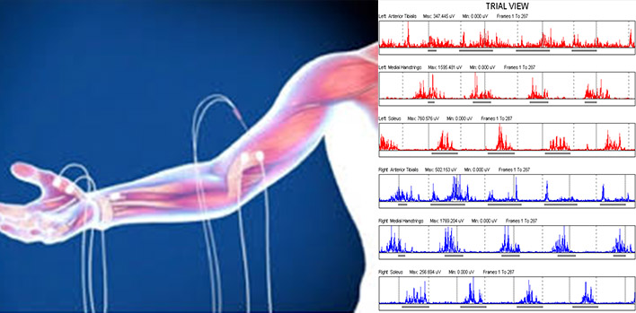

Dentro de sus variantes, la electromiografía de superficie (sEMG) ofrece la ventaja de ser no invasiva ya que emplea electrodos colocados en la piel para captar las señales eléctricas musculares sin necesidad de agujas. Aunque su precisión en la detección de unidades motoras individuales es menor que la EMG intramuscular, su facilidad de uso y comodidad para el paciente la convierten en una herramienta ampliamente utilizada sobretodo en el campo de rehabilitación [2].

La sEMG resulta fundamental para comprender la fisiología muscular. Cada movimiento cotidiano, como sostener un vaso de agua sin romperlo, requiere la acción coordinada de múltiples fibras musculares controladas por neuronas motoras. El cerebro envía señales a través de la médula espinal que llegan a las motoneuronas, las cuales desencadenan potenciales de acción en las fibras musculares. Estas descargas producen un desequilibrio de voltaje en la membrana celular que provoca la contracción, y es precisamente esa actividad bioeléctrica la que capta la electromiografía [3].

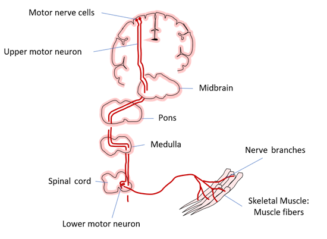

Figura 1. Camino de la señal (roja) desde el cerebro a través de la médula espinal hasta las fibras musculares cuando pensamos en una acción [3].

## **2. Objetivos**
---

### **Objetivo General**
Registrar y analizar señales de electromiografía de superficie (sEMG) mediante el uso del kit BITalino, con el fin de comprender la actividad eléctrica muscular durante la contracción y relacionarla con la función de las unidades motoras.

### **Objetivos específicos**

- Aprender a configurar el sistema BITalino y el software OpenSignals para la adquisición de señales EMG.  
- Adquirir y graficar las señales EMG en tiempo real, evaluando su variación con la contracción muscular.  
- Interpretar los resultados obtenidos (amplitud, frecuencia y forma de onda), con base en referencias científicas actuales, identificando su relevancia en la evaluación de la actividad muscular.  

## **3. Materiales**
---
| Material | Foto referencial | Detalles |
|----------|--------|----------|
| **Kit BITalino (R)EVOLUTION** |  | - 1 cable de 2 hilos   - 1 cable de 3 hilos   - 5 electrodos   - 1 batería recargable LiPo 3.7V   - 1 guía de inicio rápido   - 1 placa BITalino |
| **Laptop o PC con OpenSignals** | 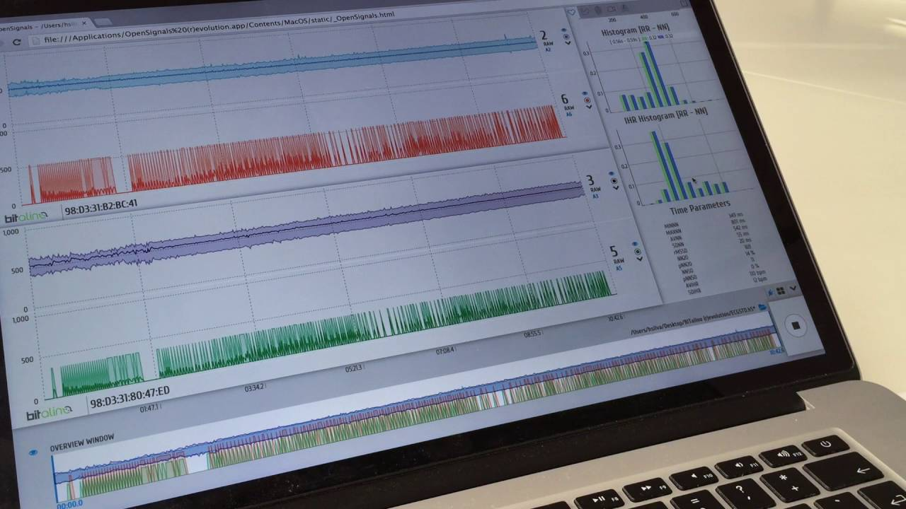 | Con software OpenSignals instalado para la visualizacion de señales |
| **Guía de Laboratorio** |  | Documento de referencia para la práctica |

## **4. Procedimiento**
---
### Preparación previa

* Primero, se instaló el software OpenSignals (r)evolution desde la página oficial de BITalino.  
* Luego, se encendió el módulo y se realizó la conexión por Bluetooth.  
* En el software se seleccionó el dispositivo y se activó el canal EMG (**A1**).  

* Los electrodos se colocaron justo antes de iniciar para asegurar una buena conductividad.  
* Finalmente, con el brazo en reposo, se verificó que la señal estuviera estable y, posteriormente, se realizó una contracción leve para confirmar que la amplitud de la señal aumentara.

  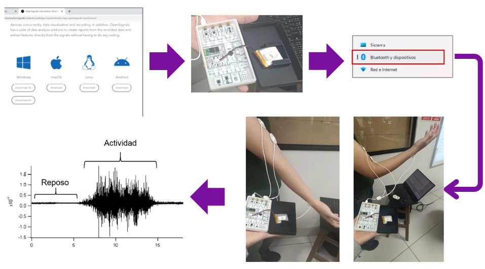

---

### Procedimiento de las pruebas

Se realizaron dos tipos de pruebas para evaluar la actividad muscular:  
- **Primera prueba:** Bíceps braquial, durante la flexión de codo.  
- **Segunda prueba:** Cabeza lateral del tríceps braquial, durante la extensión de codo.  

Las mediciones se realizaron en tres condiciones, y cada una de ellas se replicó tres veces para garantizar la confiabilidad de los datos:

1. **Reposo:** para obtener el estado basal de la señal.  
2. **Contracción sin oposición:** el participante realizó el movimiento libremente, sin resistencia externa.  
3. **Contracción con oposición:** otra persona aplicó resistencia manual sobre el antebrazo para aumentar la activación muscular.

> 🔹 *Nota:*  
> **Secuencia temporal en ambas pruebas**
>Cada repetición siguió la siguiente estructura:
>- **10 segundos** en reposo para obtener la señal basal.  
>- **30 segundos** de contracción sin oposición .  
>- **10 segundos** en reposo.  
>- **30 segundos** de contracción con oposición (resistencia manual aplicada por otra persona).
>
>Esta secuencia se repitió tres veces en cada prueba para obtener mediciones confiables y comparables.
---

## **Primera prueba: Contracción del bíceps braquial**

En esta prueba se evaluó la activación del **bíceps braquial** durante la flexión de codo.  
El ejercicio se realizó con el brazo dominante (derecho).

### **Ubicación de los electrodos**

La configuración siguió un montaje **bipolar** según la guía BITalino :

  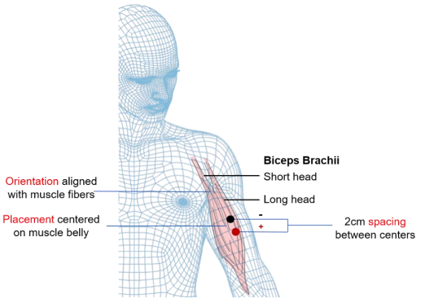

| **Positivo (IN+)** | **Negativo (IN-)** | **Referencia (Tierra)** |
|--------------------|--------------------|-------------------------|
| Parte superior del vientre muscular, cercano al hombro. | Parte inferior del vientre muscular, próximo al pliegue del codo. | Ubicado en una zona neutra, como un hueso , en este caso sobre la apófisis estiloides de la muñeca. |

> **Nota:**  
> La distancia entre los centros de los electrodos positivo y negativo es de **2 cm**, colocados de forma alineada con la dirección de las fibras musculares.

### **Representación visual de las condiciones**

| **Reposo** | **Sin oposición** | **Con oposición** |
|:----------:|:----------------:|:----------------:|
| <video src="https://github.com/user-attachments/assets/f68b83eb-41d0-4bb1-9840-b5055be92fdf" width="250" height="250" controls></video> | <video src="https://github.com/user-attachments/assets/2a598a30-607b-42cb-95e7-1bff6f94a0a0" width="250" height="250" controls></video> | <video src="https://github.com/user-attachments/assets/bc9b4dfa-7c06-4d7b-bc51-e619728bd505" width="250" height="250" controls></video> |
| Brazo relajado, sin activación muscular | Flexión del codo libre, sin resistencia externa | Flexión del codo con resistencia manual aplicada hacia la extensión |

---
## **Segunda prueba: Contracción del tríceps braquial**

En esta prueba se evaluó la activación de la cabeza lateral del tríceps braquial, responsable principalmente de la extensión del codo.

### **Ubicación de los electrodos**
La colocación siguió las recomendaciones  [SENIAM](http://seniam.org/tricepsbrachiilateralhead.html) para la cabeza lateral del tríceps:

| **Aspecto**                  | **Descripción** |
|------------------------------|-----------------|
| **Electrodo positivo (IN+)** | Ubicado en el 50% de la línea imaginaria entre la cresta posterior del acromion (hombro) y el olécranon (codo), dos dedos lateralmente a esta línea. |
| **Electrodo negativo (IN-)** | Colocado 20 mm (2 cm) distal al positivo, siguiendo la dirección de las fibras musculares. |
| **Electrodo de referencia (tierra)** | En una zona neutra, en este caso la apófisis estiloides de la muñeca. |
| **Orientación** | Alineados paralelos a la línea entre el acromion y el olécranon, siguiendo la dirección de las fibras musculares. |

### **Representación visual de las condiciones**

| **Tríceps en reposo** | **Tríceps sin oposición** | **Tríceps con oposición** |
|:---------------------:|:--------------------------:|:--------------------------:|
| <video src="https://github.com/user-attachments/assets/f14ac5b9-b1e5-467c-ada9-e72a91181bb4" width="250" height="250" controls></video> | <video src="https://github.com/user-attachments/assets/e0a4b153-1b53-4a3e-982e-4c91fba9b535" width="250" height="250" controls></video> | <video src="https://github.com/user-attachments/assets/67880428-f923-45ac-b058-34e93e8361c0" width="250" height="250" controls></video> |
| Brazo relajado, sin activación muscular | Extensión libre del codo, sin resistencia externa | Extensión del codo con resistencia manual aplicada hacia la flexión |

---
## **5. Resultados**
---
*En esta parte se presenta los principales análisis del procesamiento de las señales, el cual se encuentra detallado en la carpeta **Procesamiento_señales en el archivo procesamiento_senales.ipynb** o en el pdf con el mismo nombre*

### 5.1 Metodología de Procesamiento de la Señal
El primer paso del análisis consiste en transformar los datos crudos del sensor a unidades físicas con significado fisiológico y eliminar el ruido que enmascara la actividad muscular.

#### 5.1.1 Conversión de ADC a Milivoltios (mV)

La señal adquirida por el kit BITalino se entrega como una serie de valores de un Conversor Análogo-Digital (ADC), que son unidades arbitrarias. Para poder comparar estos valores con la literatura científica y entender su magnitud real, es indispensable convertirlos a milivoltios (mV). Según el manual del fabricante (BITalino, 2020) [4], se utilizan las siguientes ecuaciones:

$E_{MG}(V) = \frac{(\frac{ADC}{2^n} - \frac{1}{2}) \times VCC}{G_{EMG}}$  *(Ecuación 1)*

$E_{MG}(mV) = E_{MG}(V) \times 1000$  *(Ecuación 2)*

Donde:
- **ADC:** El valor crudo de la muestra.
- **n:** La resolución del ADC (10 bits para este dispositivo).
- **VCC:** El voltaje de operación (3.3 V).
- **G_EMG:** La ganancia del sensor de EMG (1009).

#### 5.1.2 Filtrado Pasa-Banda

Una vez en milivoltios, la señal aún contiene componentes no deseados. La señal sEMG fisiológicamente útil se encuentra en un rango de frecuencia específico. Para aislarla, se aplica un **filtro pasa-banda** (Konrad, 2005) [5]. Este filtro elimina:

1.  **Ruido de baja frecuencia (< 20 Hz):** Principalmente artefactos de movimiento, que causan una ondulación o deriva en la línea base de la señal, especialmente visible en periodos de reposo.
2.  **Ruido de alta frecuencia (> 450 Hz):** Ruido electrónico ambiental que no forma parte de la señal biológica.

La siguiente figura ilustra el efecto de este filtrado en un segmento que transiciona del reposo a una contracción lenta del bíceps. Se puede observar claramente cómo el filtro estabiliza la línea base.

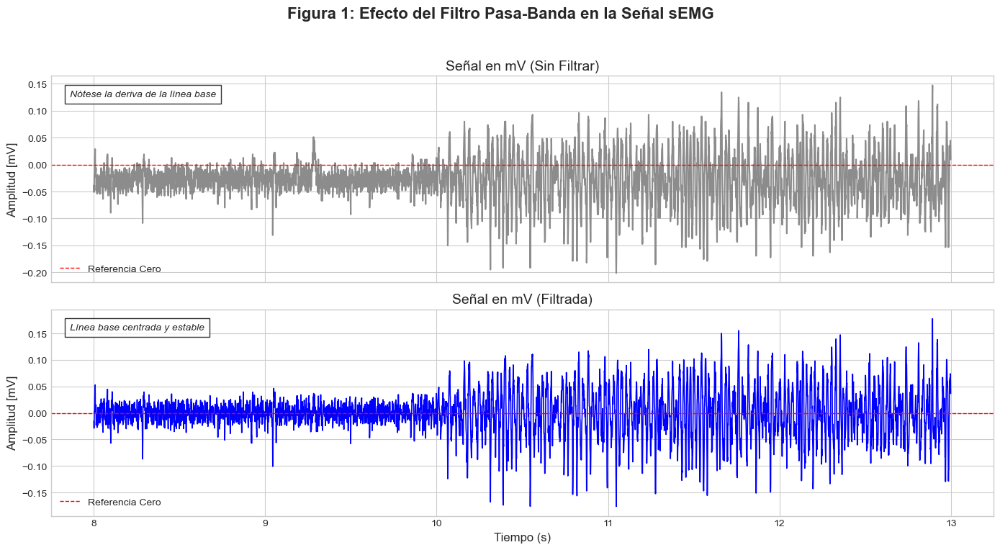

#### 5.1.3 Tono Muscular y Cuantificación de la Activación (RMS)
Incluso en un estado de aparente reposo, un músculo esquelético mantiene una ligera contracción residual conocida como **tono muscular**. Esta actividad es crucial para mantener la postura y la preparación para el movimiento. En la señal sEMG, el tono muscular se manifiesta como una actividad eléctrica de baja amplitud y fluctuante, que representa la activación asincrónica de unas pocas unidades motoras [6]. Es importante distinguir este fenómeno fisiológico del ruido electrónico.

La señal sEMG filtrada (Figura 1, abajo) es una señal oscilante con un promedio cercano a cero, lo que dificulta la cuantificación directa de su "intensidad". Para obtener una medida representativa de la activación muscular, se calcula su envolvente. El método estándar es el **Valor Cuadrático Medio (RMS)**, calculado sobre ventanas de tiempo móviles. El RMS proporciona una medida de la potencia de la señal y se ha demostrado que tiene una correlación más consistente con el nivel de fuerza muscular que otras técnicas [7].

La siguiente figura muestra un segmento de la señal filtrada en reposo, ilustrando el tono muscular, y la correspondiente señal RMS que se usará para el resto del análisis.

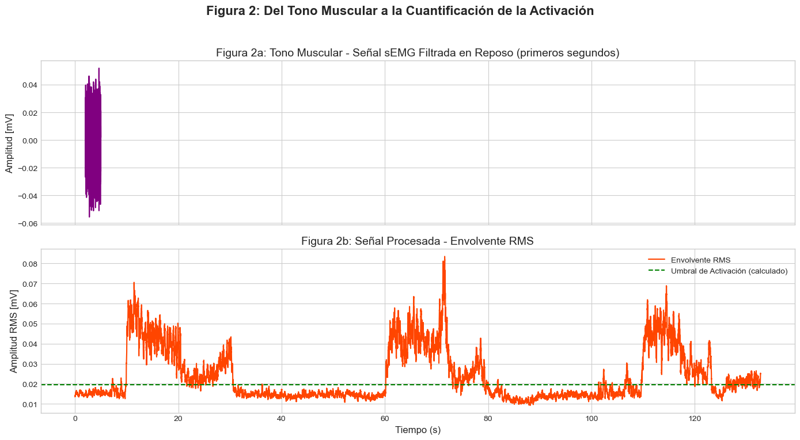

### 5.2. Análisis en el Dominio del Tiempo

Una vez establecida la metodología de procesamiento, se procede a analizar la actividad muscular durante los ensayos completos. Se utiliza un algoritmo de detección de eventos para identificar objetivamente los periodos de contracción, definidos como los segmentos donde la señal RMS supera un umbral estadístico **(media + 3*DE de la actividad en reposo inicial)** [8]. Estos periodos se marcan con áreas sombreadas en las siguientes gráficas.

#### 5.2.1 Análisis del Músculo Bíceps Braquial

Se comparó la activación del bíceps bajo dos condiciones: contracciones lentas sin oposición y contracciones voluntarias máximas (CVM) con oposición.

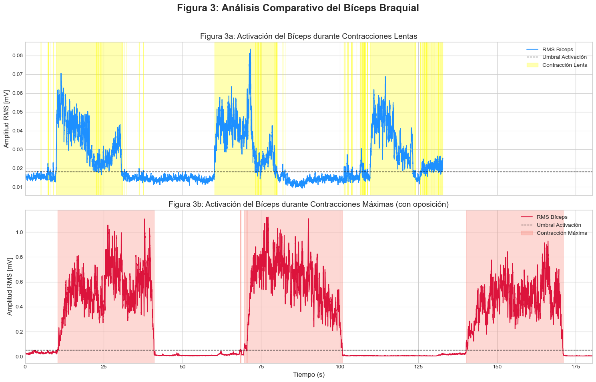

**Interpretación de la Figura 3:** La comparación de la actividad del bíceps es reveladora. En la Figura 3a (contracciones lentas), las ráfagas de actividad alcanzan un pico de amplitud RMS de aproximadamente **0.08 mV**. Por el contrario, en la Figura 3b (contracciones máximas), la amplitud pico es drásticamente mayor, llegando a valores en torno a **0.7 mV**. Esta diferencia de magnitud, de casi un orden de magnitud, ilustra directamente la ley del reclutamiento neuromuscular: a mayor demanda de fuerza, el sistema nervioso central incrementa tanto el número de unidades motoras activas como su frecuencia de disparo, resultando en una mayor actividad eléctrica total [9].

#### 5.2.2 Análisis del Músculo Tríceps Braquial

Se repitió el análisis para el tríceps, comparando una prueba de contracciones lentas con una de CVM.

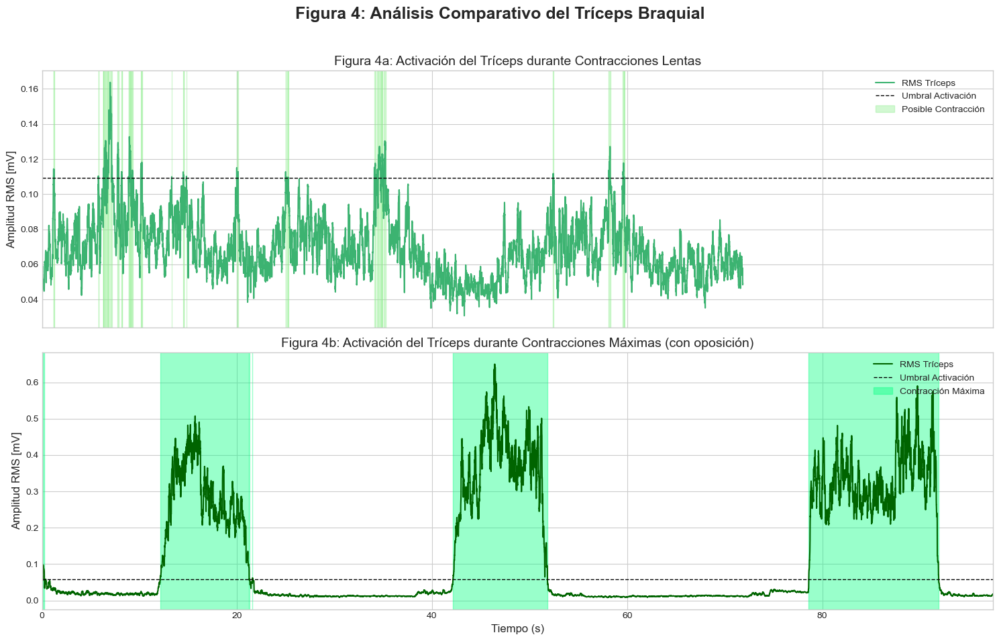

**Interpretación de la Figura 4:** El análisis del tríceps muestra resultados interesantes. La Figura 4b, correspondiente a la CVM, presenta un patrón claro y robusto, con picos de RMS de hasta **0.4 mV**, similar en comportamiento al bíceps bajo la misma condición. Sin embargo, la Figura 4a (contracciones lentas) muestra una señal de muy baja amplitud, donde el detector de eventos apenas logra identificar picos claros por encima del umbral. Como se mencionó en la descripción del procedimiento, esto puede deberse a múltiples factores: una posible colocación subóptima de los electrodos, un nivel de tono muscular basal relativamente alto que enmascara las contracciones de baja intensidad, o que la naturaleza del movimiento de extensión lenta no demandó un reclutamiento muscular significativamente superior al del tono. Este resultado subraya la importancia de una correcta técnica de medición para capturar de forma fiable la actividad muscular de baja intensidad.

#### 5.2.3 Comparación de la Dinámica de Activación

Para analizar no solo la magnitud sino también la forma de la activación muscular, se segmentó y alineó la primera ráfaga de contracción de los tres ensayos principales.

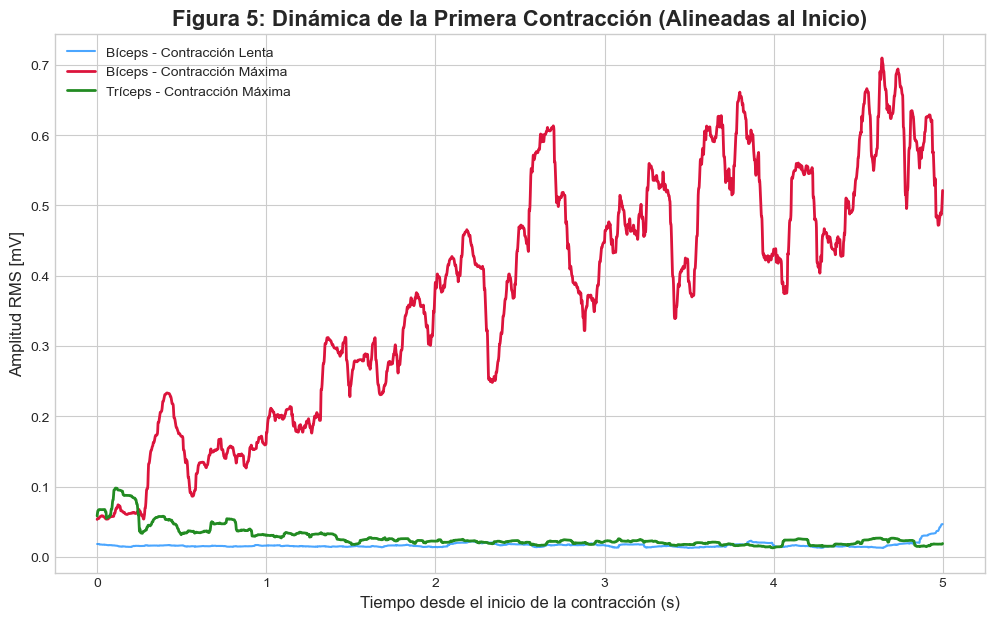

**Interpretación de la Figura 5:** Esta vista detallada permite comparar la dinámica de la activación. Se observa que las contracciones máximas (la roja para el bíceps y la verde para el tríceps) no solo alcanzan una mayor amplitud, sino que también presentan una pendiente de subida mucho más pronunciada en comparación con la contracción lenta (azul). Esto sugiere un reclutamiento de unidades motoras más rápido y sincrónico cuando la demanda de fuerza es alta e inmediata. Por el contrario, la contracción lenta del bíceps muestra una subida más gradual y una amplitud menor y más fluctuante, lo que es coherente con un control motor más fino y una activación muscular menos intensa, donde las unidades motoras son reclutadas de manera más progresiva [9].

### 5.3. Análisis en el Dominio de la Frecuencia

Además de la amplitud, la distribución de frecuencias de la señal sEMG contiene información valiosa. El análisis espectral permite verificar que la señal registrada se encuentra dentro del ancho de banda fisiológico esperado para la actividad muscular. Para ello, se calcula el **Espectro de Densidad de Potencia (PSD)**, que muestra cómo se distribuye la energía de la señal en las diferentes frecuencias [10].

Para asegurar un análisis robusto, se seleccionó manualmente un segmento estable de 5 segundos dentro de la primera contracción voluntaria máxima (CVM) registrada para cada músculo. Se utilizó la **señal filtrada** (previa a la rectificación y RMS) para este análisis.

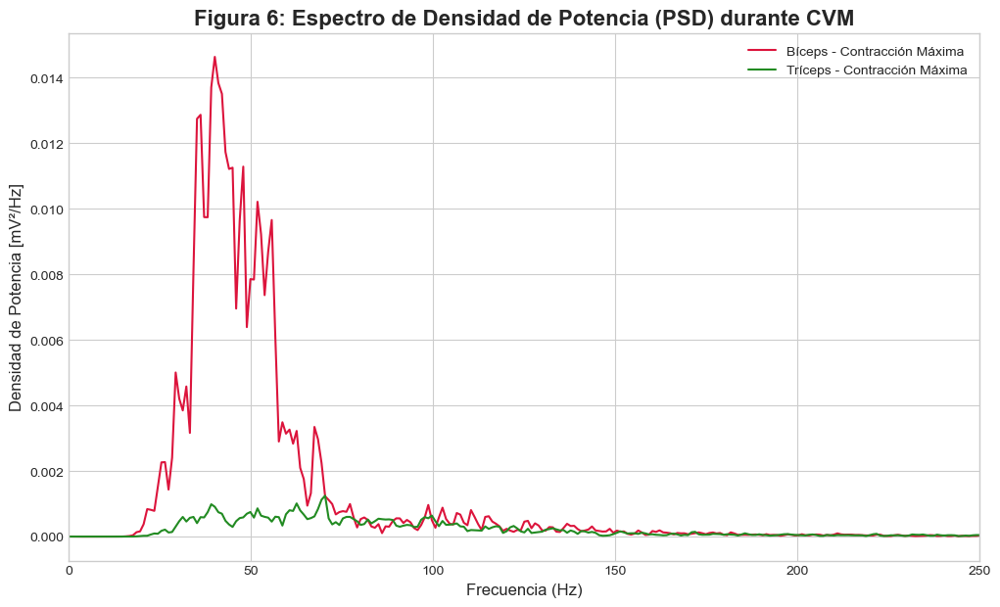

**Interpretación de la Figura 6:** El análisis espectral confirma las características esperadas de una señal sEMG. Para ambos músculos durante la contracción máxima, la mayor parte de la energía se concentra en la banda de frecuencia entre aproximadamente 40 Hz y 150 Hz.

El **bíceps** muestra un pico de potencia dominante y claro alrededor de los **45 Hz**. El **tríceps**, por su parte, también presenta su mayor actividad en este rango, aunque con una distribución de potencia y un pico que parecen estar a una frecuencia ligeramente superior, lo cual es normal debido a las diferencias anatómicas y de reclutamiento de fibras entre ambos músculos.

Esta distribución es consistente con la literatura y valida la calidad de la adquisición. Demuestra que la señal registrada corresponde a la suma de potenciales de acción de las unidades motoras y no a ruido aleatorio. La disminución de la potencia por encima de los 150-200 Hz también es típica, debido a los efectos de filtrado de los propios tejidos biológicos entre las fibras musculares y el electrodo en la piel [10].

---

## **6. Conclusiones**

Este laboratorio cumplió exitosamente su objetivo de registrar y analizar señales de electromiografía de superficie (sEMG) para comprender la actividad eléctrica muscular. Mediante el uso del kit BITalino y un riguroso protocolo de procesamiento de señales, fue posible transformar los datos crudos en una representación cuantificable y fisiológicamente interpretable de la activación de los músculos bíceps y tríceps braquial.

Los resultados en el **dominio del tiempo** demostraron de manera concluyente la relación positiva entre la demanda de fuerza y la amplitud de la señal sEMG. Se observó que la amplitud de la envolvente RMS durante las contracciones voluntarias máximas (CVM) con oposición fue hasta un 10 veces mayor que la registrada durante las contracciones lentas y sin carga. Este hallazgo valida experimentalmente los principios fundamentales del control motor: el **reclutamiento de un mayor número de unidades motoras** y el incremento en su frecuencia de disparo para generar mayores niveles de fuerza. Además, el análisis de la dinámica de la contracción reveló que las activaciones máximas presentan una pendiente de reclutamiento más pronunciada, sugiriendo una activación neuronal más rápida y sincrónica para tareas de alta intensidad.

El análisis en el **dominio de la frecuencia** validó la calidad y naturaleza fisiológica de las señales adquiridas. El Espectro de Densidad de Potencia (PSD) confirmó que la mayor parte de la energía de la señal durante las CVM se concentra en la banda de 40-150 Hz, lo cual es consistente con la literatura para señales sEMG de músculos esqueléticos. Esto permitió diferenciar la actividad mioeléctrica del ruido aleatorio y de los artefactos, reforzando la fiabilidad de los resultados obtenidos.

El estudio también reveló algunas de las limitaciones prácticas de la sEMG. La dificultad para registrar una señal clara durante la contracción lenta del tríceps subraya la sensibilidad de la técnica a factores como la colocación precisa de los electrodos y el nivel de tono muscular basal, que puede enmascarar la actividad de baja intensidad. Asimismo, al no realizarse registros simultáneos de ambos músculos, no fue posible analizar el fenómeno de co-activación agonista-antagonista, un aspecto importante del control motor para la estabilización articular.

Como trabajo futuro, sería valioso realizar mediciones simultáneas para estudiar la co-activación, así como analizar contracciones isométricas sostenidas para investigar los cambios espectrales (un desplazamiento hacia frecuencias más bajas) asociados a la fatiga muscular.

---
## **7. Referencias**
---

[1] Istanbul Onkoloji, “What is EMG? When is it done?”, Healthy lifestyle (blog), Jul. 28, 2017. [En línea]. Disponible: İstanbul Onkoloji. [Consultado: 8-Sep-2025].

[2] M. A. Cavalcanti. García y T. M. M. Vieira, “Surface electromyography: Why, when and how to use it”, Revista Andaluza de Medicina del Deporte, vol. 4, no. 1, pp. 17–28, 2011.

[3] M. Proença and K. Mrotzeck, BITalino (r)evolution Home Guide #1: Electromyography (EMG) – Exploring Muscular Signals. Lisbon, Portugal: PLUX – Wireless Biosignals S.A., Feb. 2021 .

[4] Electromyography (EMG) Sensor User Manual [Internet]. Available from: https://support.pluxbiosignals.com/wp-content/uploads/2021/11/electromyography-emg-user-manual.pdf 

[5] (PDF) The abc of emg [Internet]. ResearchGate. Available from: https://www.researchgate.net/publication/270895853_The_abc_of_emg

[6] Staudenmann D, Roeleveld K, Stegeman DF, van Dieën JH. Methodological aspects of SEMG recordings for force estimation – A tutorial and review. Journal of Electromyography and Kinesiology. 2010 Jun;20(3):375–87.

[7] Clancy EA, Morin EL, Merletti R. Sampling, noise-reduction and amplitude estimation issues in surface electromyography. Journal of Electromyography and Kinesiology. 2002 Feb;12(1):1–16.

[8] Morey-Klapsing G, Arampatzis A, Brüggemann GP. Choosing EMG parameters: comparison of different onset determination algorithms and EMG integrals in a joint stability study. Clinical Biomechanics. 2004 Feb;19(2):196–201.

[9] De Luca C. SURFACE ELECTROMYOGRAPHY: DETECTION AND RECORDING [Internet]. 2002. Available from: https://www.delsys.com/downloads/TUTORIAL/semg-detection-and-recording.pdf 

[10] Phinyomark, A., Nuidod, A., Phukpattaranont, P. and Limsakul, C. (2012) Feature Extraction and Reduction of Wavelet Transform Coefficients for EMG Pattern Classification. Electronics and Electrical Engineering, 122, 1392-1215. - References - Scientific Research Publishing [Internet]. Scirp.org. 2018 [cited 2025 Sep 9]. Available from: https://www.scirp.org/reference/referencespapers?referenceid=2290336

