# Laboratorio 4: Análisis de Señales de Electrocardiografía (ECG)
---

## 1. Introducción

El electrocardiograma (ECG) es un procedimiento no invasivo que representa gráficamente la actividad eléctrica del corazón, registrada a través de electrodos colocados en la superficie corporal. Constituye una herramienta diagnóstica esencial en cardiología, ya que permite documentar el ritmo y la frecuencia cardíaca, así como identificar alteraciones en la conducción eléctrica y en la repolarización ventricular. Además de su valor en el diagnóstico de enfermedades cardiovasculares, se utiliza en el seguimiento de pacientes en tratamiento y en la detección de alteraciones hidroelectrolíticas [1].

  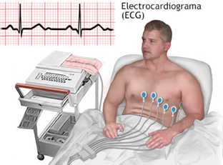
  
<b>Figura 1.</b> Electrocardiograma en un paciente [2].

### 1.1. Técnica del ECG Estándar

El ECG convencional ofrece 12 derivaciones, es decir, 12 vistas distintas de la actividad eléctrica del corazón. Cada derivación mide la diferencia de voltaje entre distintos electrodos. De estas 12 derivaciones, 6 son del plano frontal (I, II, III, aVR, aVL y aVF) y 6 son del plano horizontal o precordiales (V1 a V6) [3]. Para registrar estas señales, se utilizan 10 electrodos, lo que permite una visualización tridimensional de la actividad cardíaca y facilita la identificación de múltiples alteraciones [1, 4].

  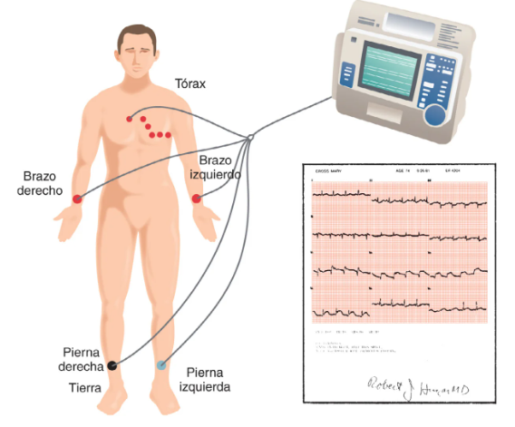
  
<b>Figura 2.</b> Colocación estándar de los 10 electrodos para un ECG de 12 derivaciones [4].

### 1.2. Componentes del Trazado Electrocardiográfico

Para interpretar un ECG, se deben reconocer las principales ondas, intervalos y segmentos que forman el trazado. En la Figura 3 se observa un registro típico, donde cada componente corresponde a una fase específica de la actividad eléctrica del corazón [3].

-   **Onda P →** Despolarización de las aurículas.
-   **Intervalo PR →** Tiempo de conducción desde las aurículas hasta los ventrículos.
-   **Complejo QRS →** Despolarización de los ventrículos, que representa la contracción principal del corazón.
-   **Intervalo QT →** Es el tiempo total desde que los ventrículos se activan hasta que terminan de recuperarse (despolarización + repolarización).
-   **Intervalo RR →** Es el espacio entre dos picos R seguidos; sirve para calcular la frecuencia cardíaca.
-   **Segmento ST →** Inicio de la repolarización ventricular.
-   **Onda T →** Repolarización completa de los ventrículos.
- **ST–T (segmento ST más onda T)** → En conjunto, muestran todo el proceso de recuperación de los ventrículos.

- **Onda U** → A veces aparece después de la onda T; es pequeña y está relacionada con la fase final de la relajación del corazón.
-   **Intervalo RR →** Distancia entre dos picos R consecutivos, utilizada para calcular la frecuencia cardíaca.

  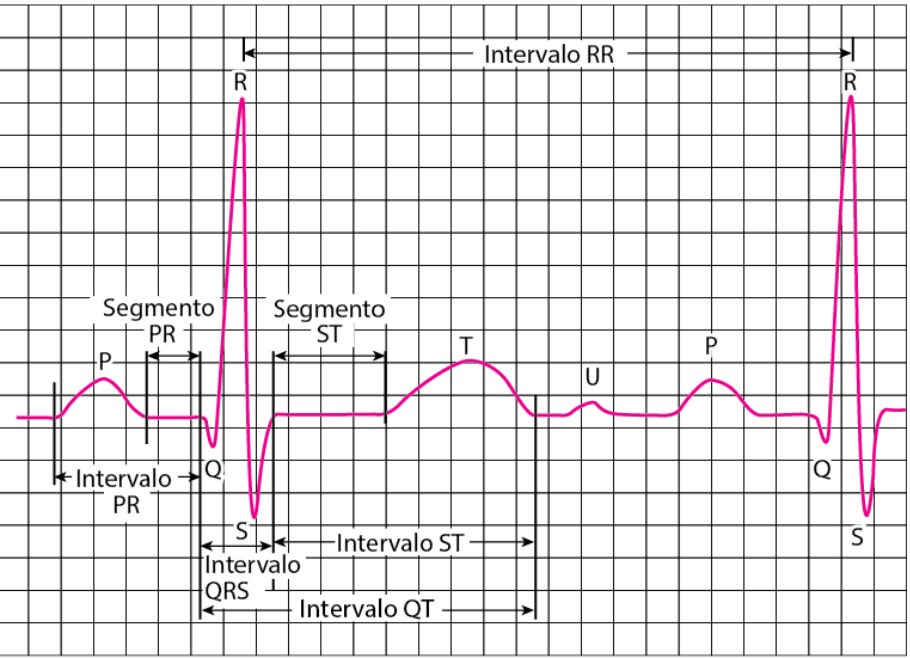
  
<b>Figura 3.</b> Ondas, intervalos y segmentos de un ciclo cardíaco típico en un ECG [3].

---
## 2. Objetivos

### 2.1. Objetivo General

Adquirir, procesar y analizar señales electrocardiográficas (ECG) utilizando el sistema BITalino y el software OpenSignals, con el propósito de comprender la respuesta cardiovascular a diferentes estados fisiológicos y aplicar técnicas de procesamiento de señales biomédicas para extraer información relevante.

### 2.2. Objetivos Específicos

-   Registrar señales de ECG en las derivaciones I y II durante condiciones de reposo, apnea y recuperación post-ejercicio.
-   Aplicar un procesamiento de señales para filtrar el ruido, detectar eventos cardíacos (picos R) y segmentar los datos según el protocolo experimental.
-   Calcular y comparar métricas clave del dominio del tiempo (BPM, HRV) para cuantificar el efecto de cada condición fisiológica.
-   Interpretar los resultados obtenidos en el contexto de la fisiología cardiovascular y las limitaciones de la adquisición de la señal.
---
## 3. Materiales

| Material | Foto referencial | Detalles |
|----------|--------|----------|
| **Kit BITalino (R)EVOLUTION** |  | - 1 cable de 2 hilos   - 1 cable de 3 hilos   - 5 electrodos   - 1 batería recargable LiPo 3.7V   - 1 guía de inicio rápido   - 1 placa BITalino |
| **Laptop o PC con OpenSignals** | 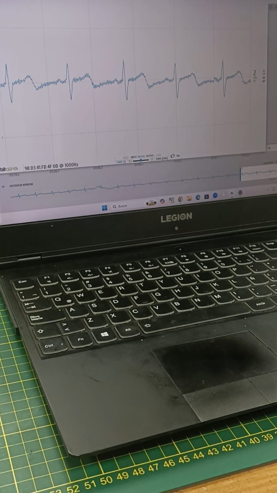 | Con software OpenSignals instalado para la visualizacion de señales |
| **Guía de Laboratorio** | 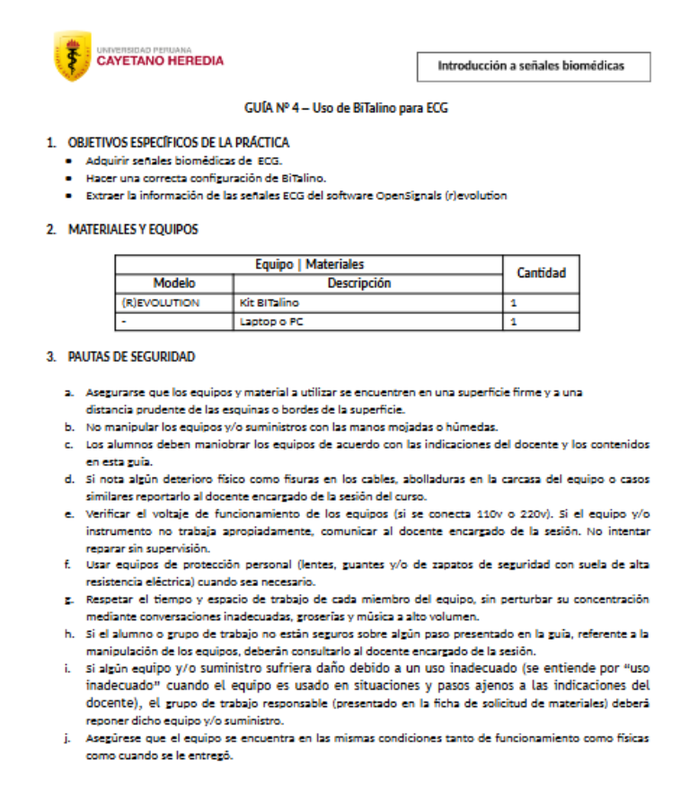 | Documento de referencia para la práctica |
---

## 4. Metodología

### 4.1. Preparación y Adquisición de la Señal

1. **Configuración del Sistema:**  
   Se conectó la placa **BITalino** a la computadora mediante **Bluetooth** y se configuró el software **OpenSignals** para la adquisición de la señal ECG a una frecuencia de muestreo de **1000 Hz**.

  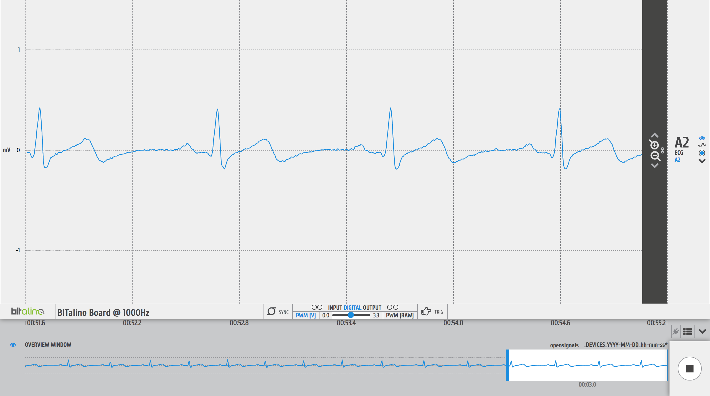
  
<b>Figura 4.</b> ECG Bitalino.

2. **Colocación de Electrodos:**  
   Los electrodos se colocaron en las muñecas del sujeto para registrar las derivaciones bipolares de las extremidades, siguiendo las convenciones del triángulo de Einthoven:

   - **Derivada I:**  
     Electrodo positivo (+) en la muñeca izquierda, electrodo negativo (-) en la muñeca derecha y electrodo de referencia (tierra) en una zona neutra como la cresta ilíaca.  

   - **Derivada II:**  
     Electrodo positivo (+) en la muñeca izquierda, electrodo negativo (-) en la muñeca derecha.  
     Para la segunda medición, se registró la **Derivada II** cambiando la configuración según la guía del dispositivo.  
     Las mediciones de las dos derivaciones se realizaron de forma consecutiva, no sincrónica.

  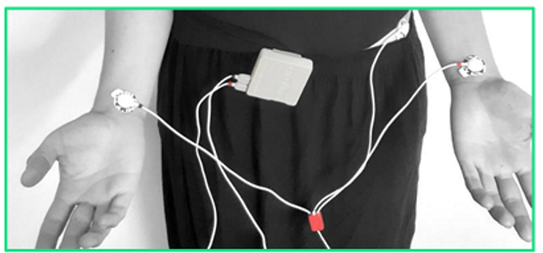
  
<b>Figura 4.</b> Posicionamiento de los electrodos, primera derivada.

3. **Protocolo Experimental:**  
   Se llevaron a cabo tres pruebas distintas para cada derivación:

   #### a) Prueba de Reposo y Apnea  
   Se registró una señal continua siguiendo una secuencia temporizada de respiración normal y contención de la respiración (apnea).  

   **Secuencia temporal:**
   - **0 – 30 s:** Respiración normal  
   - **30 s – 1 min:** Apnea  
   - **1 – 2 min:** Respiración normal  
   - **2 min – 2 min 30 s:** Apnea  
   - **2 min 30 s – 3 min 30 s:** Respiración normal  
   - **3 min 30 s – 4 min:** Apnea  
   - **4 min – final:** Respiración normal  

   **Resultados:**

   | Condición   | Derivada I                        | Derivada II                       |
   |-------------|-----------------------------------|-----------------------------------|
   | Con apnea   |<video src="https://github.com/user-attachments/assets/c3b1f966-d948-45a7-b723-40f0f6ef051a" width="320" height="240" controls></video>    | <video src="https://github.com/user-attachments/assets/fcdd897b-42ec-4d40-a7f4-86dc5127ebc8" width="320" height="240" controls></video>   |
   | Sin apnea   |  <video src="https://github.com/user-attachments/assets/40d3d88d-3287-49fd-ba54-90e6d288311a" width="320" height="240" controls></video> |  <video src="https://github.com/user-attachments/assets/4ff38b0b-b050-429d-bde1-b9a23573f8de" width="320" height="240" controls></video> |

   ---

   #### b) Prueba Post-Ejercicio  
   El sujeto realizó **15 minutos de actividad física aeróbica (correr)**.  
   Inmediatamente después, se registró la señal de ECG en reposo para evaluar la respuesta cardíaca durante la recuperación.

  <video src="https://github.com/user-attachments/assets/da8b05a6-ff84-4431-911e-2e584e4a54e3" width="200" height="150" controls></video>

  
   **Resultados:**

   | Condición            | Derivada I                                  | Derivada II                                 |
   |----------------------|---------------------------------------------|---------------------------------------------|
   | Después de agitación |<video src="https://github.com/user-attachments/assets/29a7202d-af2a-41ba-839d-26f0eb4bb5c8" width="320" height="240" controls>|<video src="https://github.com/user-attachments/assets/9a02b5a1-97a9-40b7-a8e1-23e30370c967" width="320" height="240" controls></video> |

4.  **Almacenamiento de Datos:** Todos los registros se guardaron en formato `.txt` para su posterior análisis.

### 4.2. Metodología de Procesamiento de la Señal

El análisis cuantitativo de las señales se realizó en un entorno de Python utilizando un Jupyter Notebook. En este informe se presentan los principales hallazgos, gráficos y tablas. **El código fuente completo y el detalle paso a paso del procesamiento se encuentran en la carpeta `Procesamiento_señales` en el archivo `procesamiento_ECG.ipynb` (y su correspondiente PDF).**

El procesamiento consistió en los siguientes pasos:

1.  **Carga de Datos:** Para simplificar el código de análisis, se utilizaron los archivos `_converted.txt` generados por OpenSignals. Estos archivos contienen los datos ya escalados a unidades físicas (Voltios), eliminando la necesidad de aplicar la fórmula de conversión del conversor analógico-digital (ADC).
2.  **Filtrado:** Se aplicó un filtro pasa-banda (0.5-40 Hz) para eliminar la deriva de la línea de base y el ruido de alta frecuencia [5].
3.  **Detección de Picos R:** Se implementó un algoritmo basado en umbral adaptativo para identificar la ubicación de cada pico R, el cual es la base para el análisis del ritmo [2].
4.  **Segmentación y Cálculo de Métricas:** Las señales de la prueba de apnea se segmentaron según el protocolo. Para cada segmento y condición, se calcularon la Frecuencia Cardíaca (BPM) y las métricas de Variabilidad de la Frecuencia Cardíaca (HRV) como SDNN y RMSSD [3].
5.  **Análisis Estadístico y de Clustering:** Se realizaron análisis comparativos (Boxplots, ANOVA) y un análisis de clustering morfológico de los complejos QRS mediante PCA y K-Means para identificar patrones en los datos [7, 8].
---
## 5. Resultados y Discusión

### 5.1. Preprocesamiento y Calidad de la Señal

El primer paso consistió en aplicar un filtro pasa-banda. La Figura 4 ilustra el efecto de este filtro en un segmento de reposo y en uno post-ejercicio.

  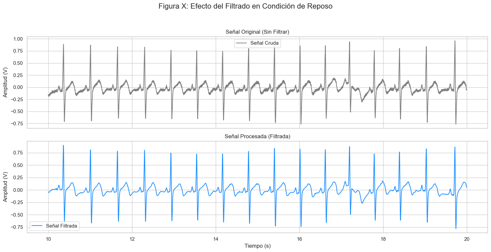
  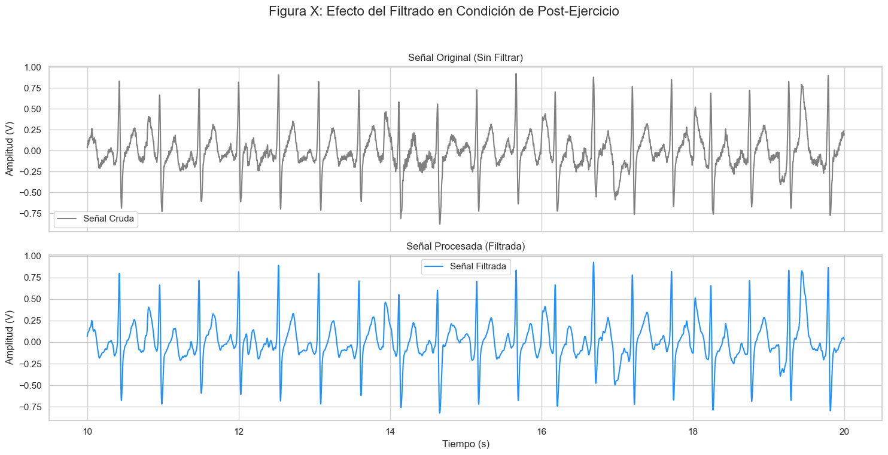
  
<b>Figura 4.</b> Efecto del filtro en reposo (arriba) y post-ejercicio (abajo). Se compara la señal cruda (gris) con la filtrada (azul).

**Discusión:** El filtrado elimina eficazmente la **deriva de la línea de base** en la señal de reposo y **atenúa el ruido de alta frecuencia** en la señal post-ejercicio, lo que resulta en una forma de onda más definida y facilita una detección de picos R precisa [5].

Una vez filtrada la señal, se procede a la detección de los picos R, que son la base para el análisis de ritmo. La Figura 5 muestra el resultado de este algoritmo sobre un segmento de la señal ya procesada.

  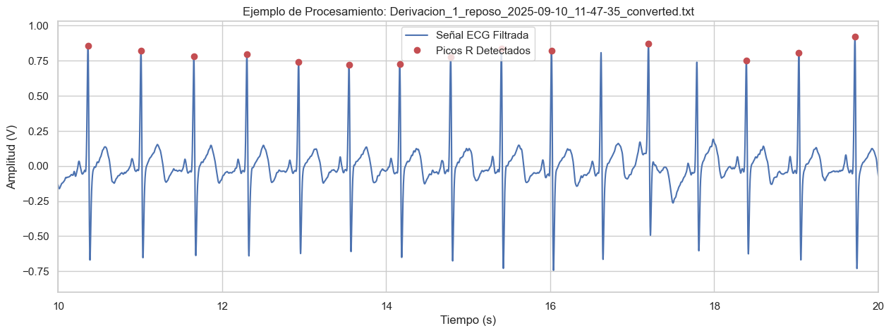
  
<b>Figura 5.</b> Ejemplo de detección de picos R (puntos rojos) sobre una señal de ECG filtrada.

**Discusión:** Como se observa en la Figura 5, el algoritmo identifica correctamente los picos R (marcados en rojo) como los puntos de máxima amplitud dentro de cada complejo QRS. La distancia mínima impuesta entre detecciones previene que otros componentes de la onda, como la onda T, sean erróneamente identificados. Esta detección precisa es el prerrequisito indispensable para el posterior cálculo de la frecuencia cardíaca y las métricas de variabilidad.

### 5.2. Verificación de la Segmentación Fisiológica

Se segmentaron las señales de reposo según el protocolo. La Figura 5 confirma visualmente la correcta aplicación del enventanado.

  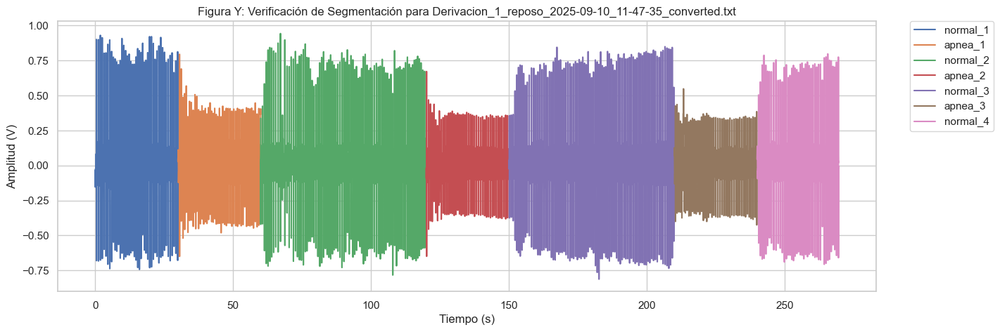
  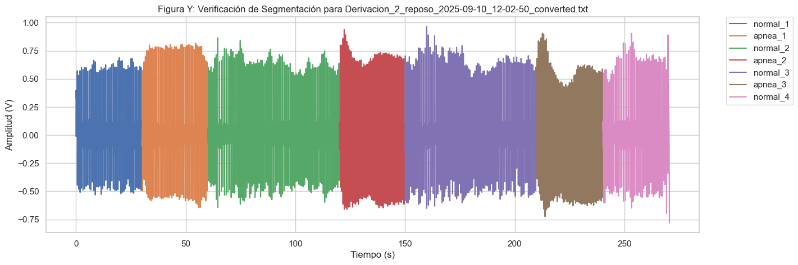
  
<b>Figura 6.</b> Verificación visual de la segmentación en la Derivación 1 (arriba) y la Derivación 2 (abajo). Cada color representa un evento fisiológico.

### 5.3. Análisis Comparativo entre Condiciones Fisiológicas

La Figura 6 compara las métricas cardíacas entre las tres condiciones.

  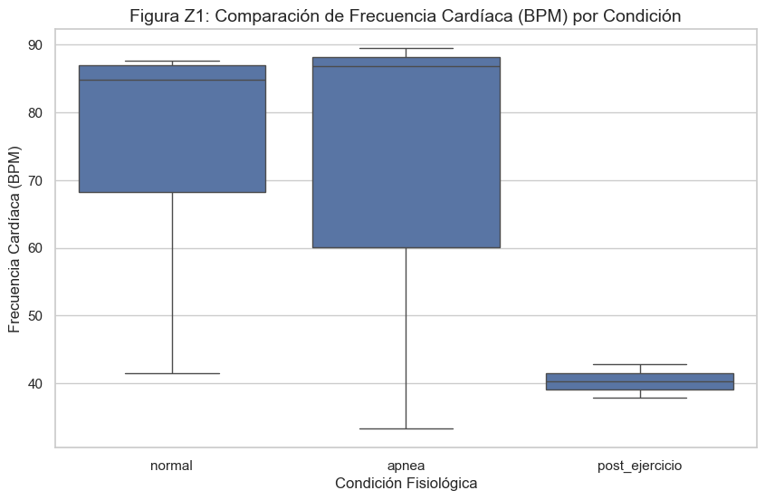
  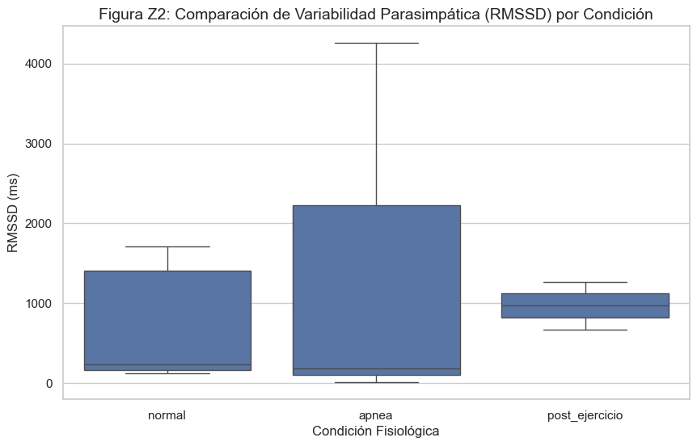
  
<b>Figura 7.</b> Comparación de las distribuciones de BPM (a) y RMSSD (b) entre las condiciones.

**Resultados del Análisis Estadístico (ANOVA):**
-   **Comparación de BPM (Normal vs. Apnea):** F(1, 10) = 0.18, p = 0.6777.

**Discusión:** Los resultados muestran un aumento del RMSSD durante la apnea, consistente con el **reflejo de inmersión** y un aumento del tono vagal [4, 3]. La diferencia en BPM no fue estadísticamente significativa, probablemente debido a la alta variabilidad. Los resultados **post-ejercicio son anómalos** (BPM bajo), atribuido a una **baja calidad de la señal** por artefactos que impidieron una detección de picos R fiable.

### 5.4. Comparación Morfológica entre Derivaciones

La Figura 7 compara la forma de onda del ECG en reposo y post-ejercicio entre las dos derivaciones.

  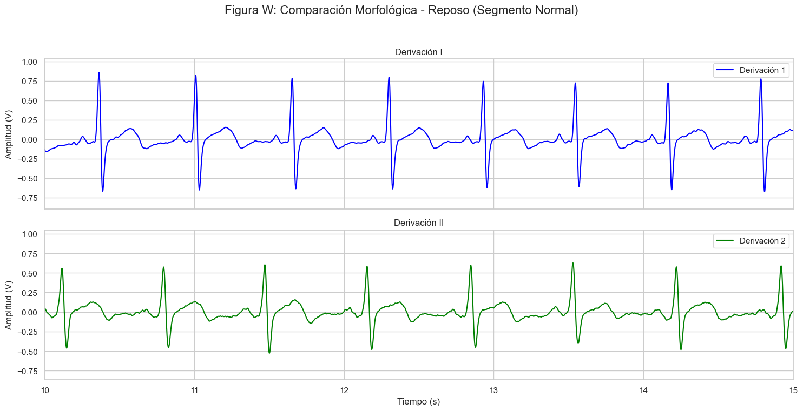
  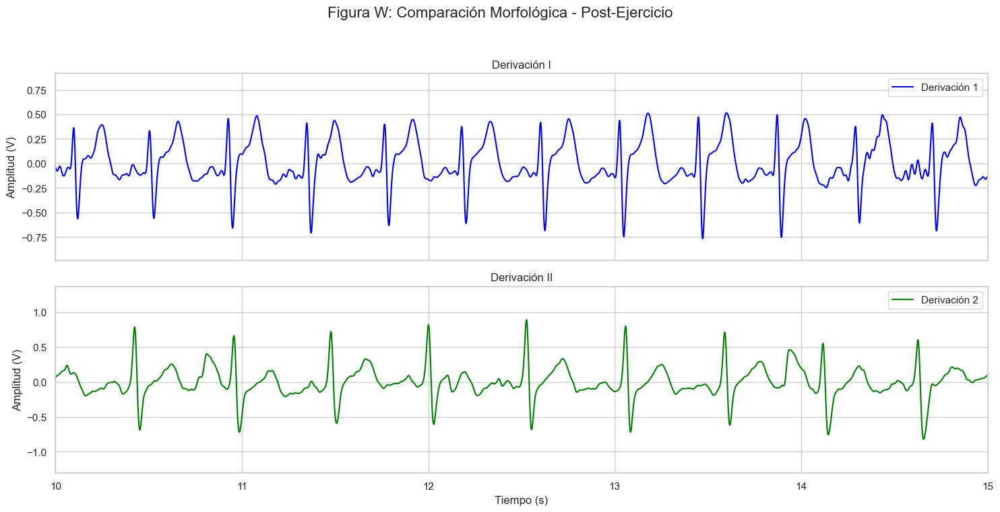
  
<b>Figura 7.</b> Comparación de la morfología del ECG entre Derivación I y II en reposo (arriba) y post-ejercicio (abajo).

**Discusión:** Consistentemente, la **Derivación I presenta una mayor amplitud del QRS**. Esto le confiere una mejor relación señal-ruido, haciéndola más robusta para el análisis automatizado del ritmo en este sujeto [6].

### 5.5. Análisis de Morfología de Latidos por Clustering

La Figura 8 y 9 muestran los resultados del clustering no supervisado para clasificar los latidos según su forma.

  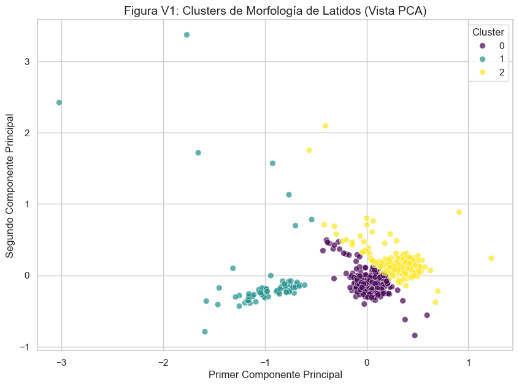
  
<b>Figura 8.</b> Clusters de latidos visualizados en el espacio de los componentes principales (PCA).

  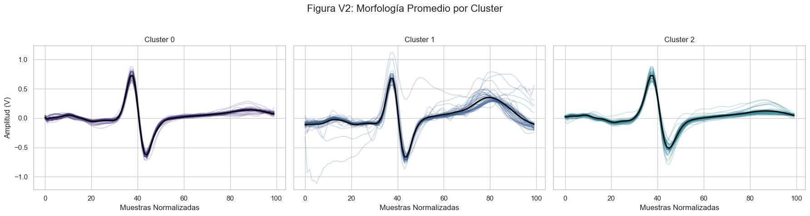
  
<b>Figura 9.</b> Morfología promedio de los tres clusters de latidos identificados.

**Discusión:** El análisis identificó tres patrones: **Cluster 0 y 2** corresponden a los **latidos sinusales normales**, cuyas sutiles diferencias se atribuyen a la modulación respiratoria. El **Cluster 1** agrupó con éxito los **latidos contaminados por artefactos y ruido**. Este método valida la calidad general del registro y permite la clasificación automática de latidos [7, 8].

### 5.6. Tabla Resumen de Métricas por Segmento

La Tabla 1 resume las métricas calculadas para cada segmento fisiológico. Los valores `NaN` indican segmentos donde la calidad de la señal impidió un cálculo fiable.

| Segmento   | Condición | Derivación | BPM (media) | SDNN (ms) | RMSSD (ms) | Observación Fisiológica      |
| :--------- | :-------- | :--------: | :---------: | :-------: | :--------: | :--------------------------- |
| normal_1   | Normal    |     1      |    87.61    |  114.72   |   123.59   | Ritmo basal inicial          |
| apnea_1    | Apnea     |     1      |    97.40    |   0.00    |    NaN     | Detección de solo 2 picos    |
| normal_2   | Normal    |     1      |    84.59    |  201.99   |   272.77   | Recuperación respiratoria    |
| normal_1   | Normal    |     2      |    41.45    |  1223.03  |  1710.02   | Posible artefacto inicial    |
| apnea_1    | Apnea     |     2      |    89.49    |   26.71   |   10.48    | Respuesta inicial a la apnea |
| normal_2   | Normal    |     2      |    65.43    |  1007.79  |  1376.49   | Recuperación respiratoria    |
| apnea_2    | Apnea     |     2      |    86.83    |  212.76   |   186.61   | Respuesta vagal sostenida    |
| apnea_3    | Apnea     |     2      |    33.33    |  3031.76  |  4259.26   | Bradicardia pronunciada      |

---
## 6. Conclusiones

Este laboratorio aplicó con éxito una metodología completa de adquisición y procesamiento de señales de ECG para investigar la respuesta cardiovascular a diferentes estímulos. Se confirmó la **respuesta fisiológica a la apnea**, manifestada a través de un aumento en la variabilidad del ritmo cardíaco (RMSSD), reflejo de una activación parasimpática. Sin embargo, el estudio también reveló la **vulnerabilidad de las mediciones a los artefactos**, especialmente post-ejercicio, donde el ruido impidió un análisis fiable. El análisis comparativo y de clustering demostraron ser herramientas valiosas para la **validación de la calidad de los datos** y la interpretación fisiológica, identificando la Derivación I como la más robusta y atribuyendo variaciones morfológicas de los latidos a la modulación respiratoria.

---

## 7. Referencias
[1] R. A. Watson Hernández, “Interpretación del electrocardiograma normal,” Revista Ciencia y Salud Integrando Conocimientos, vol. 6, no. 5, pp. 85–89, Oct.–Nov. 2022. doi: 10.34192/cienciaysalud.v6i5.549

[2] ADAM Certification Demo, “Electrocardiograma (ECG) — Electrocardiografía”, ADAM Multimedia, revisado el 8 mayo 2024. Disponible:https://adamcertificationdemo.adam.com/content.aspx?productid=118&pid=5&gid=003868

[3] T. Cascino y M. J. Shea, “Electrocardiografía (ECG; EKG),” Manual MSD profesional — Trastornos cardiovasculares: Pruebas y procedimientos cardiovasculares: Electrocardiografía, revisado por Jonathan G. Howlett, dic. 2023, modificado abr. 2025. Disponible: https://www.msdmanuals.com/es/professional/trastornos-cardiovasculares/pruebas-y-procedimientos-cardiovasculares/electrocardiograf%C3%ADa

[4] Elsevier, “Electrocardiograma de 12 derivaciones: derivaciones y ejes,” Elsevier Connect, 12 jun. 2023.Disponible:https://www.elsevier.com/es-es/connect/electrocardiograma-de-12-derivaciones-derivaciones-y-ejes

[5] De Mello, D. E., de Oliveira, A. C., & de Moraes, L. F. P. (2019). ECG signal processing for abnormalities detection. *Revista Brasileira de Engenharia Biomédica*, 35(1), 64-76.

[6] Pan, J., & Tompkins, W. J. (1985). A Real-Time QRS Detection Algorithm. *IEEE Transactions on Biomedical Engineering*, BME-32(3), 230–236. Disponible: https://ieeexplore.ieee.org/document/4122029

[7] Shaffer, F., & Ginsberg, J. P. (2017). An overview of heart rate variability metrics and norms. *Frontiers in public health*, 5, 258. Disponible: https://www.frontiersin.org/articles/10.3389/fpubh.2017.00258/full

[8] Sörnmo, L., & Laguna, P. (2005). Bioelectrical Signal Processing in Cardiac and Neurological Applications. *Elsevier Academic Press*.

[9] Kim, H. Y. (2014). Analysis of variance (ANOVA) comparing means of more than two groups. *Restorative dentistry & endodontics*, 39(1), 74-77. Disponible: https://www.ncbi.nlm.nih.gov/pmc/articles/PMC3916511/

[10] Kligfield, P., et al. (2007). Recommendations for the standardization and interpretation of the electrocardiogram: part I. *Journal of the American College of Cardiology*, 49(10), 1109-1127. Disponible: https://www.jacc.org/doi/full/10.1016/j.jacc.2007.01.024

[11] Martis, R. J., et al. (2013). Application of principal component analysis to ECG signals for automated diagnosis of cardiac health. *Expert Systems with Applications*, 40(11), 4745-4756. Disponible: https://www.sciencedirect.com/science/article/pii/S0957417412006690?via%3Dihub

---
## Aporte de cada integrante
| Integrante               | Aporte   |
|--------------------------|----------|
| Alvaro Untiveros         | 33.33 %  |
| Lucero Munive            | 33.33 %  |
| Fiorella Pérez           | 33.33 %  |
