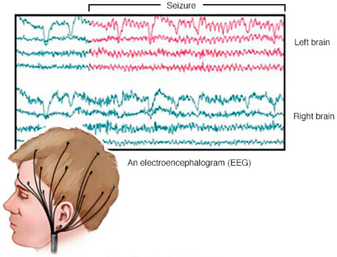
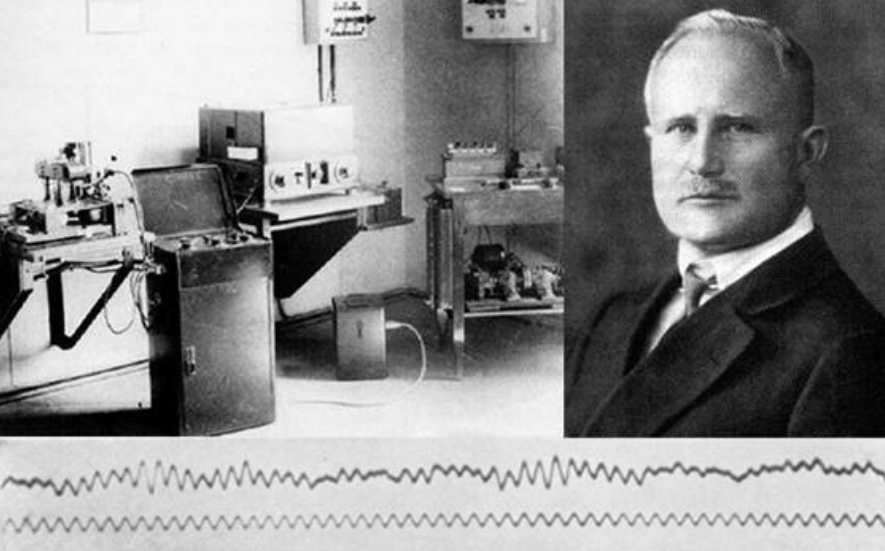
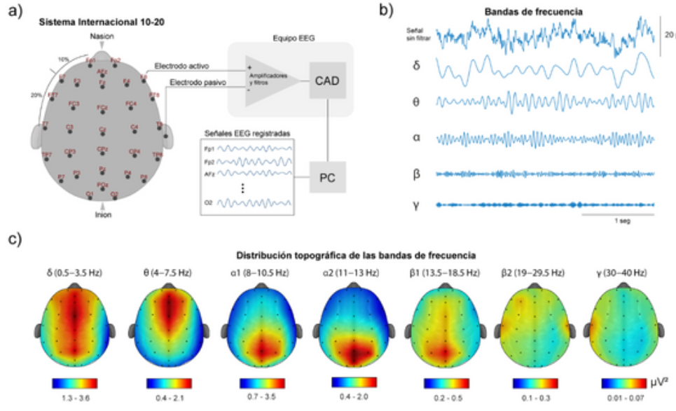
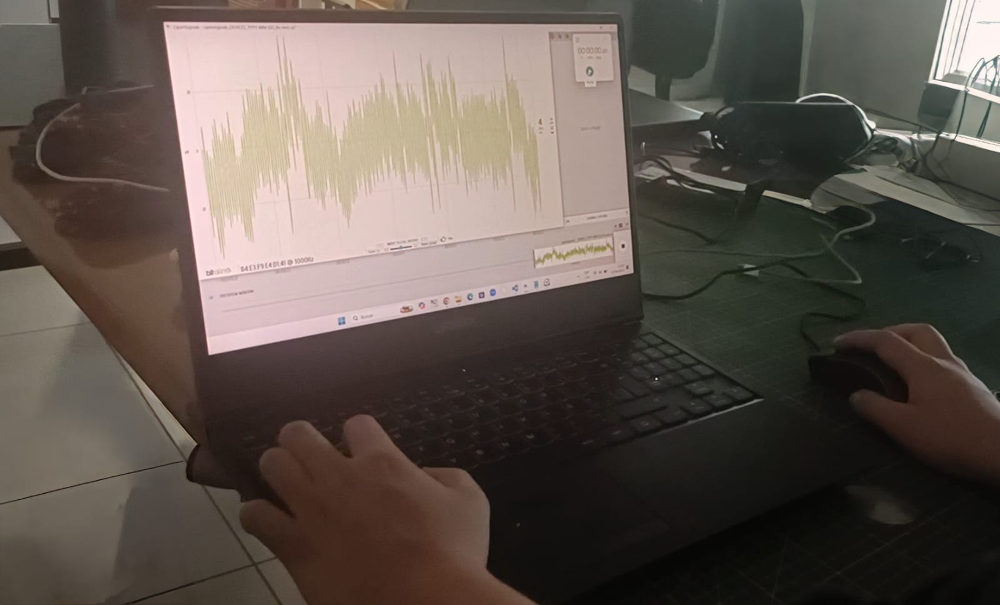
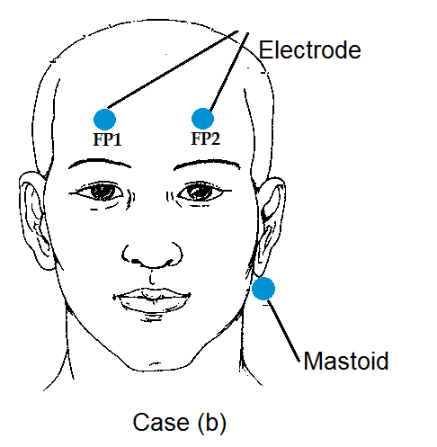
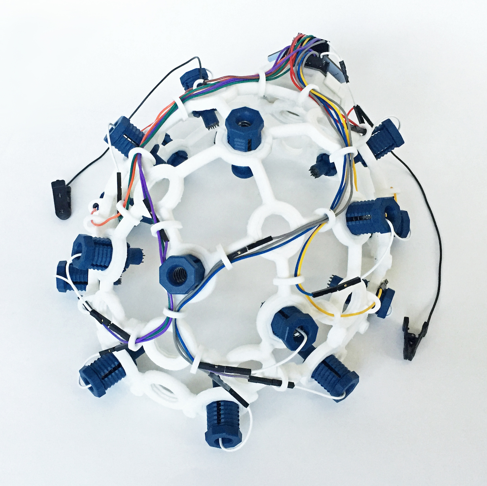
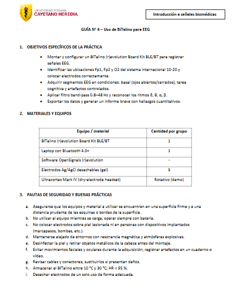
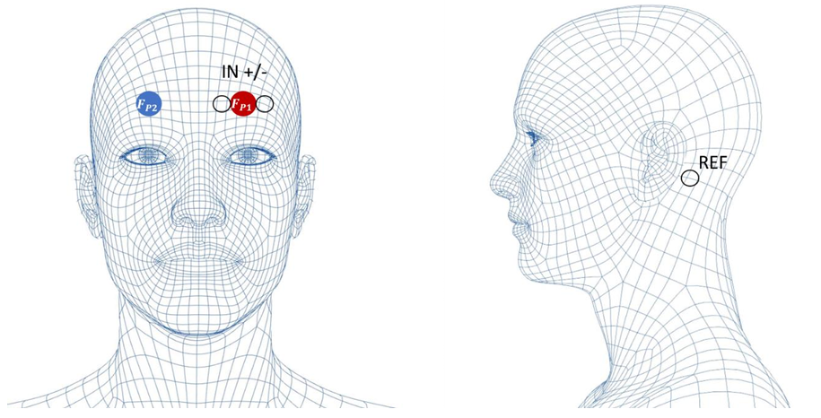
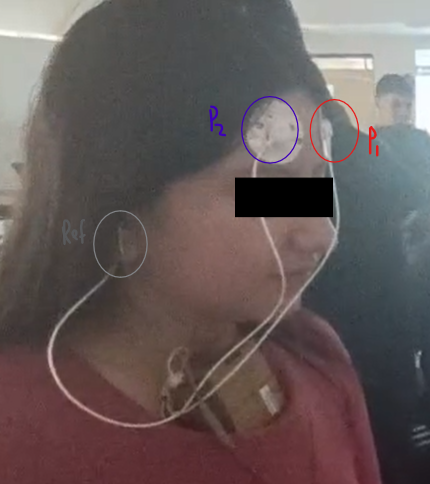
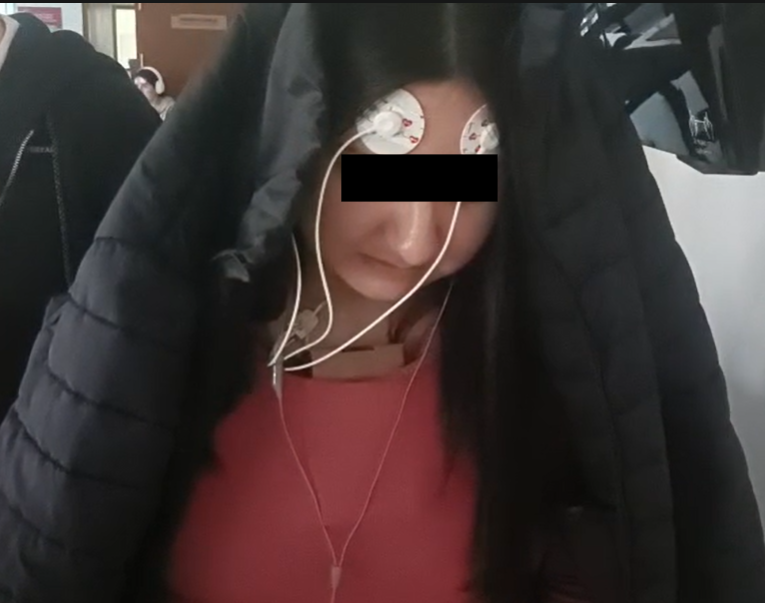

# Laboratorio 5: Análisis de Señales de Electroencefalograma (EEG)
---

## 1. Introducción
---
### Definición y origen histórico
La electroencefalografía (EEG) es una técnica no invasiva que registra la actividad eléctrica cerebral mediante electrodos colocados sobre el cuero cabelludo [1]. Este procedimiento permite medir de manera continua las señales generadas por poblaciones neuronales, principalmente células piramidales, durante las excitaciones sinápticas. Dichas señales presentan un carácter oscilatorio que refleja procesos cognitivos, emocionales y patológicos [2,3].

Para la adquisición estandarizada de estas oscilaciones se utiliza el sistema internacional 10-20, que define posiciones específicas de los electrodos (Fp1, Fp2, O2, entre otras) y asegura uniformidad en el registro y posterior análisis de las señales.

  
  
<b>Figura 1.</b> Medición de electroencefalografía (EEG)  [4].

El desarrollo de esta técnica fue posible gracias al trabajo pionero de Hans Berger en 1924, quien demostró que la actividad eléctrica cerebral podía registrarse desde el exterior mediante un galvanómetro [1]. A partir de este descubrimiento se identificaron distintos tipos de ondas cerebrales, cada una asociada a estados mentales y funciones específicas.

  
  
<b>Figura 2.</b> Hans Berger registró la electroencefalografía por primera vez en 1924 [5].

Como el tiempo, la EEG se consolidó como una de las herramientas más valiosas en la neurología y las neurociencias. Su alta resolución temporal, facilidad de implementación, portabilidad y bajo costo han favorecido su aplicación no solo en el diagnóstico clínico (epilepsia, trastornos del sueño, anestesia), sino también en la investigación experimental y en el desarrollo de interfaces cerebro-máquina (BCI), ampliando así su impacto en la práctica hospitalaria y en la investigación académica [3].

### Fundamentos y bandas de frecuencia [3]
Las señales EEG se caracterizan por su naturaleza oscilatoria, compuesta por ondas cerebrales que varían en frecuencia y amplitud. Estas ondas se clasifican en cinco tipos principales, cada una asociada a distintos niveles de actividad cerebral .

| Símbolo | Nombre | Rango de Frecuencia | Descripción |
|---------|--------|----------------------|-------------|
| δ | Delta | 0.2 – 3.5 Hz | **Sueño profundo**: amplitud más grande; aparece en fases 3 y 4 del sueño, estados de coma y algunas patologías como epilepsia. Asociada con procesos motivacionales e inhibitorios. Generada principalmente en el tálamo y corteza cingulada. |
| θ | Theta | 4 – 7.5 Hz | **Sueño ligero/memoria**: presente en etapas 1 y 2 del sueño y MOR. Asociada con memoria, emoción, atención focalizada y plasticidad cerebral. Generada en hipocampo y corteza prefrontal. |
| α | Alfa | 8 – 12.5 Hz | **Relajación/atención**: predominante en regiones parieto-occipitales.Predominio en estado de  relajación (ojos cerrados),vinculada con control cognitivo, atención selectiva y retención de información. Generador principal: tálamo (núcleo pulvinar). |
| β | Beta | 13 – 29 Hz | **Alerta/pensamiento**: se observa en regiones frontocentrales y temporales. Relacionada con vigilia, control motor, percepción y pensamiento lógico. Subdividida en beta lenta, media y rápida (concentración, ansiedad, estrés). |
| γ | Gamma | 30 – 90 Hz (hasta 200 Hz) | **Procesamiento cognitivo**: de menor amplitud. Asociada con procesos de atención, memoria de trabajo, percepción y conciencia. La oscilación de 40 Hz es clave en memoria y procesamiento sensorial. |

> Existe además una relación inversa entre frecuencia y amplitud: las bandas lentas (delta, theta) muestran mayor amplitud, mientras que las rápidas (beta, gamma) presentan menor amplitud.

  
  
<b>Figura 3.</b> Representación de registros EEG: a) Sistema internacional 10-20 y esquema simplificado del registro, b) señal sin filtrar y descomposición en bandas δ, θ, α, β y γ, y c) distribución topográfica de la potencia absoluta por banda de frecuencia (µV²) [3].

## 2. Objetivos
---

### Objetivo General
Registrar, procesar y analizar señales electroencefalográficas (EEG) mediante el uso del sistema BITalino (r)evolution Board Kit BLE/BT, aplicando el protocolo de colocación de electrodos del sistema internacional 10-20 y técnicas básicas de filtrado y análisis de ritmos cerebrales.

## Objetivos específicos

- Montar y configurar el dispositivo BITalino (r)evolution Board Kit BLE/BT para la adquisición de señales EEG.
- Identificar y ubicar correctamente las posiciones Fp1, Fp2 y O2 del sistema internacional 10-20 para la colocación adecuada de electrodos.
- Registrar segmentos de EEG en distintas condiciones experimentales: basal (ojos abiertos y cerrados), durante una tarea cognitiva y bajo la presencia de artefactos controlados.
- Aplicar un filtrado band-pass entre 0.8–48 Hz y reconocer en los registros los ritmos electroencefalográficos δ (delta), θ (theta), α (alfa) y β (beta).
- Exportar y documentar los datos obtenidos en un informe breve con los principales hallazgos cuantitativos.

## 3. Materiales
---

| Material | Foto | Detalles |
|----------|------|----------|
| 1 Kit BITalino (r)evolution | 

 | Componentes: 1 cable de 2 hilos, 1 cable de 3 hilos, 5 electrodos, 1 batería recargable LiPo 3.7 V, 1 guía de inicio rápido y 1 placa BITalino.    Especificaciones del canal EEG: ganancia interna 40 000×, filtro hardware pasabanda 0.8–48 Hz (suprime DC y 50/60 Hz), resolución ADC de 10 bits (≈3.2 μV/LSB), alta sensibilidad a artefactos de movimiento y de red eléctrica. |
| 1 Laptop o PC con OpenSignals | 

 | Con software OpenSignals instalado para la visualización y almacenamiento de señales EEG. |
| 3 Electrodos de superficie desechables | 

 | Se colocan en las posiciones Fp1, Fp2 y O2 del sistema internacional 10-20. |
| 1 Ultracortex Mark IV (dry-electrode headset) | 

 | Casco EEG de electrodos secos, utilizado en modalidad rotativa (demo). Permite un registro rápido sin necesidad de gel. |
| 1 Guía de laboratorio | 

 | Documento de referencia con instrucciones para el desarrollo de la práctica. |

## 4. Metodología

1. Vincular la placa BITalino a la PC mediante Bluetooth y configurar el canal A4 como EEG, estableciendo una frecuencia de muestreo de 1000 Hz.  
   - Esta tasa cumple con el criterio de Nyquist para registrar con fidelidad señales cerebrales de hasta 48 Hz, abarcando las principales bandas EEG (delta, theta, alfa, beta).

2. Preparar la piel y colocar los electrodos (Montaje de electrodos, 5 min).  
   - Limpiar las zonas correspondientes a Fp1, Fp2 y mastoide derecha para reducir la impedancia de contacto.  
   - Conectar el Electrodo 1 en Fp1, el GND en Fp2 y el Electrodo 2 en la mastoide derecha como referencia.  
   - Comprobar la impedancia en el software OpenSignals, asegurando valores inferiores a 20 kΩ.
  

  
  
<b>Figura 4.</b> Ubicación de electrodos en región frontal y referencia retroauricular/mastoidea.

3. Verificar la correcta colocación. Confirmar visualmente la fijación de los electrodos y asegurar que los cables estén sujetos para evitar artefactos por tracción.  

  
  
<b>Figura 4.</b> Ejemplo de colocación en sujeto con BITalino y electrodos en Fp1/Fp2 y referencia.

4. Adecuar el ambiente de registro. Realizar la adquisición en un espacio con iluminación tenue y bajo nivel de ruido.  
   - Reducir la luz para disminuir parpadeos y movimientos oculares, que generan artefactos de mayor amplitud que la señal EEG.  
   - Minimizar ruidos y estímulos externos para evitar tensión muscular y actividad EMG contaminante.  
   - Favorecer un entorno silencioso y controlado que permita observar con claridad ritmos como el alfa occipital durante reposo con ojos cerrados.  
 
 

  
  
<b>Figura 4.</b> Ejemplo de paciente en ambiente controlado y relajado para adquisición EEG.

5. Ejecutar el protocolo de adquisición. Mantener la duración total en 12 minutos y dividirla en fases para evaluar estados de reposo, tareas cognitivas y artefactos de forma controlada:  

   | Minuto | Condición      | Detalle                         | Señales                                  |
   |-------:|----------------|---------------------------------|------------------------------------------|
   | 0–1    | Basal 1        | Ojos abiertos, fijar un punto   | EEG reposo, menor actividad alfa         |
   | 1–2    | Basal 2        | Ojos cerrados                   | Incremento de ondas alfa (8–13 Hz)       |
   | 2–4    | Tarea cognitiva| Restar 7 desde 100 en silencio  | Mayor actividad beta, supresión alfa     |
   | 4–6    | Artefactos     | Parpadear cada 2 s y masticar   | Artefactos oculares y musculares inducidos|
   | 6–12   | Libre          | Diseño del grupo (música, respiración, etc.) | Señales variables según tarea |

6. Registrar y almacenar la señal adquirida.  
   - Registrar los datos de forma continua durante todo el protocolo.  
   - Guardar los archivos en la PC al finalizar, preferentemente en formato CSV o binario para análisis posterior.  
   - Anotar en la bitácora cualquier incidencia (movimientos, ruidos, ajustes de electrodos) que pueda influir en la interpretación de los datos.

## Referencias
---
[1] Rashid F, Islam SMR. Identification of EEG and fNIRS Signal Frequency Band Based on FPGA. Circuits Syst Signal Process. 2025;44:3199-222. Disponible en: https://link.springer.com/article/10.1007/s00034-024-02954-1
[2] Värbu K, Muhammad N, Muhammad Y. Past, Present, and Future of EEG-Based BCI Applications. Sensors (Basel). 2022;22(9):3331. Disponible en: https://www.mdpi.com/1424-8220/22/9/3331
[3] Rivera-Tello S, Huerta-Chávez V, Ramos-Loyo J. Actividad eléctrica cerebral: métodos de registro y análisis y sus implicaciones en la organización funcional del cerebro. e-CUCBA. 2023;10(19):204-12. ISSN: 2448-5225. Disponible en: http://e-cucba.cucba.udg.mx/index.php/e-Cucba/article/view/280/272
[4] Mayo Clinic Staff. Electroencefalograma (EEG). Mayo Clinic. 2024 May 29. Disponible en: https://www.mayoclinic.org/es/tests-procedures/eeg/about/pac-20393875#dialogId19474702
[5] Aykan B, Altındağ E, Elmalı AD. Elektroensefalografi. Actualización: 19 enero 2019 . Disponible en:https://www.itfnoroloji.org/semi2/eeg.htm

