# Laboratorio 5: Análisis de Señales de Electroencefalograma (EEG)

---

## Índice

- [1. Introducción](#1-introducción)
  - [1.1. Definición y Origen Histórico](#11-definición-y-origen-histórico)
  - [1.2. Fundamentos y Bandas de Frecuencia](#12-fundamentos-y-bandas-de-frecuencia)
- [2. Objetivos](#2-objetivos)
  - [2.1. Objetivo General](#21-objetivo-general)
  - [2.2. Objetivos Específicos](#22-objetivos-específicos)
- [3. Materiales y Equipos](#3-materiales-y-equipos)
- [4. Metodología](#4-metodología)
  - [4.1. Adquisición de Señales](#41-adquisición-de-señales)
  - [4.2. Procesamiento y Análisis de Señales](#42-procesamiento-y-análisis-de-señales)
- [5. Resultados y Discusión](#5-resultados-y-discusión)
  - [5.1. Verificación del Procesamiento Inicial de Señales](#51-verificación-del-procesamiento-inicial-de-señales)
  - [5.2. Análisis de Ritmos Alfa (Ojos Abiertos vs. Cerrados)](#52-análisis-de-ritmos-alfa-ojos-abiertos-vs-cerrados)
  - [5.3. Análisis de Ritmos Beta (Tarea Cognitiva)](#53-análisis-de-ritmos-beta-tarea-cognitiva)
  - [5.4. Análisis Tiempo-Frecuencia con Espectrogramas](#54-análisis-tiempo-frecuencia-con-espectrogramas)
  - [5.5. Detección de Artefactos de Parpadeo](#55-detección-de-artefactos-de-parpadeo)
  - [5.6. Clustering de Estados Cerebrales](#56-clustering-de-estados-cerebrales)
- [6. Cuestionario de Análisis (Basado en Guía BITalino)](#6-cuestionario-de-análisis-basado-en-guía-bitalino)
- [7. Conclusiones](#7-conclusiones)
- [8. Referencias](#8-referencias)

---

## 1. Introducción
---

### 1.1. Definición y Origen Histórico
La electroencefalografía (EEG) es una técnica no invasiva que registra la actividad eléctrica cerebral mediante electrodos colocados sobre el cuero cabelludo [1]. Este procedimiento permite medir de manera continua las señales generadas por poblaciones neuronales, principalmente células piramidales, durante las excitaciones sinápticas. Dichas señales presentan un carácter oscilatorio que refleja procesos cognitivos, emocionales y patológicos [2,3].

Para la adquisición estandarizada de estas oscilaciones se utiliza el sistema internacional 10-20, que define posiciones específicas de los electrodos (Fp1, Fp2, O2, entre otras) y asegura uniformidad en el registro y posterior análisis de las señales.

  
  
<b>Figura 1.</b> Medición de electroencefalografía (EEG) [4].

El desarrollo de esta técnica fue posible gracias al trabajo pionero de Hans Berger en 1924, quien demostró que la actividad eléctrica cerebral podía registrarse desde el exterior mediante un galvanómetro [1]. A partir de este descubrimiento se identificaron distintos tipos de ondas cerebrales, cada una asociada a estados mentales y funciones específicas.

  
  
<b>Figura 2.</b> Hans Berger registró la electroencefalografía por primera vez en 1924 [5].

Con el tiempo, la EEG se consolidó como una de las herramientas más valiosas en la neurología y las neurociencias. Su alta resolución temporal, facilidad de implementación, portabilidad y bajo costo han favorecido su aplicación no solo en el diagnóstico clínico (epilepsia, trastornos del sueño, anestesia), sino también en la investigación experimental y en el desarrollo de interfaces cerebro-máquina (BCI), ampliando así su impacto en la práctica hospitalaria y en la investigación académica [3].

### 1.2. Fundamentos y Bandas de Frecuencia [3]
Las señales EEG se caracterizan por su naturaleza oscilatoria, compuesta por ondas cerebrales que varían en frecuencia y amplitud. Estas ondas se clasifican en cinco tipos principales, cada una asociada a distintos niveles de actividad cerebral.

| Símbolo | Nombre | Rango de Frecuencia | Descripción |
|---------|--------|----------------------|-------------|
| δ | Delta | 0.2 – 3.5 Hz | **Sueño profundo**: amplitud más grande; aparece en fases 3 y 4 del sueño, estados de coma y algunas patologías como epilepsia. Asociada con procesos motivacionales e inhibitorios. Generada principalmente en el tálamo y corteza cingulada. |
| θ | Theta | 4 – 7.5 Hz | **Sueño ligero/memoria**: presente en etapas 1 y 2 del sueño y MOR. Asociada con memoria, emoción, atención focalizada y plasticidad cerebral. Generada en hipocampo y corteza prefrontal. |
| α | Alfa | 8 – 12.5 Hz | **Relajación/atención**: predominante en regiones parieto-occipitales.Predominio en estado de  relajación (ojos cerrados),vinculada con control cognitivo, atención selectiva y retención de información. Generador principal: tálamo (núcleo pulvinar). |
| β | Beta | 13 – 29 Hz | **Alerta/pensamiento**: se observa en regiones frontocentrales y temporales. Relacionada con vigilia, control motor, percepción y pensamiento lógico. Subdividida en beta lenta, media y rápida (concentración, ansiedad, estrés). |
| γ | Gamma | 30 – 90 Hz (hasta 200 Hz) | **Procesamiento cognitivo**: de menor amplitud. Asociada con procesos de atención, memoria de trabajo, percepción y conciencia. La oscilación de 40 Hz es clave en memoria y procesamiento sensorial. |

> Existe además una relación inversa entre frecuencia y amplitud: las bandas lentas (delta, theta) muestran mayor amplitud, mientras que las rápidas (beta, gamma) presentan menor amplitud.

  
  
<b>Figura 3.</b> Representación de registros EEG: a) Sistema internacional 10-20 y esquema simplificado del registro, b) señal sin filtrar y descomposición en bandas δ, θ, α, β y γ, y c) distribución topográfica de la potencia absoluta por banda de frecuencia (µV²) [3].

---
## 2. Objetivos
---

### 2.1. Objetivo General
Registrar, procesar y analizar señales electroencefalográficas (EEG) mediante el uso del sistema BITalino (r)evolution Board Kit BLE/BT, aplicando el protocolo de colocación de electrodos del sistema internacional 10-20 y técnicas básicas de filtrado y análisis de ritmos cerebrales.

### 2.2. Objetivos Específicos
- Montar y configurar el dispositivo BITalino (r)evolution Board Kit BLE/BT para la adquisición de señales EEG.
- Identificar y ubicar correctamente las posiciones Fp1, Fp2 y O2 del sistema internacional 10-20 para la colocación adecuada de electrodos.
- Registrar segmentos de EEG en distintas condiciones experimentales: basal (ojos abiertos y cerrados), durante una tarea cognitiva y bajo la presencia de artefactos controlados.
- Aplicar un filtrado band-pass entre 0.8–48 Hz y reconocer en los registros los ritmos electroencefalográficos δ (delta), θ (theta), α (alfa) y β (beta).
- Exportar y documentar los datos obtenidos en un informe breve con los principales hallazgos cuantitativos.

## 3. Materiales y Equipos

| Material | Foto | Detalles |
|:---|:---:|:---|
| **1 Kit BITalino (r)evolution** | 

 | Componentes: 1 cable de 2 hilos, 1 cable de 3 hilos, 5 electrodos, 1 batería recargable LiPo 3.7 V, 1 guía de inicio rápido y 1 placa BITalino. |
| **1 Laptop o PC con OpenSignals** | 

 | Con software OpenSignals instalado para la visualización y almacenamiento de señales EEG. |
| **3 Electrodos de superficie** | 

 | Se colocan en las posiciones Fp1, Fp2 y O2 del sistema internacional 10-20. |
| **1 Ultracortex Mark IV** | 

 | Casco EEG de electrodos secos, utilizado en modalidad rotativa (demo). |
| **Guía de laboratorio** | 

 | Documento de referencia con instrucciones para el desarrollo de la práctica. |

---
## 4. Metodología
---

### 4.1. Adquisición de Señales

Se realizaron adquisiciones en dos sujetos utilizando dos sistemas diferentes. En todos los casos, se procuró un ambiente controlado (iluminación tenue, bajo ruido) para minimizar artefactos de movimiento y tensión muscular.

  
  
<b>Figura 4.</b> Ejemplo de sujeto en ambiente controlado para la adquisición de EEG.

**Sujeto 1 (BITalino):**
-   **Montaje:** Se colocaron electrodos de superficie en las posiciones Fp1 y Fp2 (región frontal), con el electrodo de referencia en la mastoide derecha. La frecuencia de muestreo se estableció en 1000 Hz.
-   **Protocolos:**
    1.  **Reposo:** 30s con ojos cerrados, seguidos de 2 min con ojos abiertos (mirando un punto fijo), y finalizando con 30s de ojos cerrados. Este protocolo se repitió 3 veces.
    2.  **Tarea Cognitiva:** Se registraron 10s de línea base en reposo, seguidos de la tarea de restar mentalmente de 7 en 7 desde 100 hasta que el sujeto indicara haber terminado.
    3.  **Artefactos:** Se registraron 10s de línea base, seguidos de parpadeos voluntarios cada 2 segundos. Este protocolo se repitió 3 veces.
    4.  **Música:** Se registraron 10s de línea base, seguidos de la escucha de 6 canciones de diferentes géneros durante 30s cada una.

  
  
<b>Figura 5.</b> Ejemplo de colocación de electrodos en la región frontal para el registro con BITalino.

**Sujeto 2 (Ultracortex):**
-   **Montaje:** Se utilizó el casco de 8 canales con electrodos secos, cubriendo múltiples regiones del cuero cabelludo. La frecuencia de muestreo se estableció en 250 Hz. Sin embargo, debido a limitaciones en cuanto a la cantidad de equipos en el laboratorio, **SOLO UN EQUIPO PUDO REALIZAR LA MEDICIÓN**, por lo que solicitamos las mediciones y nos indicaron el protocolo de adquisición que realizaron en una sola grabación larga.

-   **Protocolo:** Se registró una señal continua con las siguientes tareas secuenciales:
    -   **0-1 min:** Línea base con ojos abiertos.
    -   **1-2 min:** Línea base con ojos cerrados.
    -   **2-4 min:** Tarea cognitiva (resta seriada).
    -   **4-6 min:** Artefactos controlados (parpadeo y masticación).
    -   **6-12 min:** Escucha libre de música.

### 4.2. Procesamiento y Análisis de Señales

El análisis cuantitativo de las señales se realizó en un entorno de Python utilizando un Jupyter Notebook. En este informe se presentan los hallazgos principales. **El código fuente completo y el detalle paso a paso del procesamiento se encuentran en la carpeta `Procesamiento_señales` en el archivo `procesamiento_EEG.ipynb` (Adicionalmente, junto a este archivo pueden encontra el PDF correspondiente al procesamiento).**

El flujo de trabajo consistió en los siguientes pasos:

1.  **Carga y Filtrado:** Se cargaron los archivos `_converted.txt` (BITalino) y el archivo `.txt` (Ultracortex). A todas las señales se les aplicó un **filtro pasa-banda (1-50 Hz)** para eliminar la deriva de la línea de base y el ruido de alta frecuencia, junto con un **filtro de muesca (60 Hz)** para atenuar la interferencia de la red eléctrica [6].
2.  **Segmentación:** Las señales se dividieron en segmentos correspondientes a cada tarea del protocolo para permitir su análisis individual.
3.  **Análisis Espectral:** Se utilizó el **método de Welch** para calcular el Espectro de Densidad de Potencia (PSD) y cuantificar la potencia en las bandas alfa y beta [7].
4.  **Análisis Estadístico:** Se aplicó una **prueba t de Student para muestras pareadas** para evaluar la significancia de los cambios en la potencia beta durante la tarea cognitiva.
5.  **Análisis Adicional:** Se implementó un algoritmo de **umbral adaptativo** para detectar artefactos de parpadeo y un análisis de **clustering (K-Means)** para la clasificación no supervisada de estados cerebrales a partir de sus características espectrales.

---
## 5. Resultados y Discusión
---
En esta sección se presentan los principales hallazgos del análisis de las señales de EEG, siguiendo el orden del procesamiento realizado en el cuaderno de Jupyter.

### 5.1. Verificación del Procesamiento Inicial de Señales

Antes de realizar cualquier análisis cuantitativo, es fundamental verificar visualmente la calidad de las señales tras los pasos iniciales de carga y filtrado. La Figura 6 muestra un extracto de 15 segundos de una de las señales filtradas del sistema BITalino, sirviendo como ejemplo representativo de la calidad general de los datos de este dispositivo.

  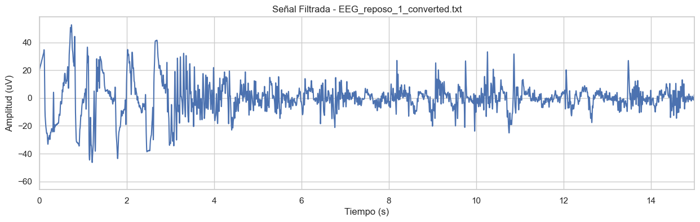
  
<b>Figura 6.</b> Muestra de la señal `EEG_reposo_1` (Sujeto 1) tras la aplicación de los filtros. Se observa una señal limpia, con oscilaciones características del EEG y libre de deriva de línea base.

Posteriormente, se validó la correcta segmentación de los datos según el protocolo experimental. La Figura 7 muestra cómo las señales de los ensayos largos fueron divididas en bloques de tiempo correspondientes a cada tarea, asegurando que los análisis posteriores se aplicaran a los datos correctos.

  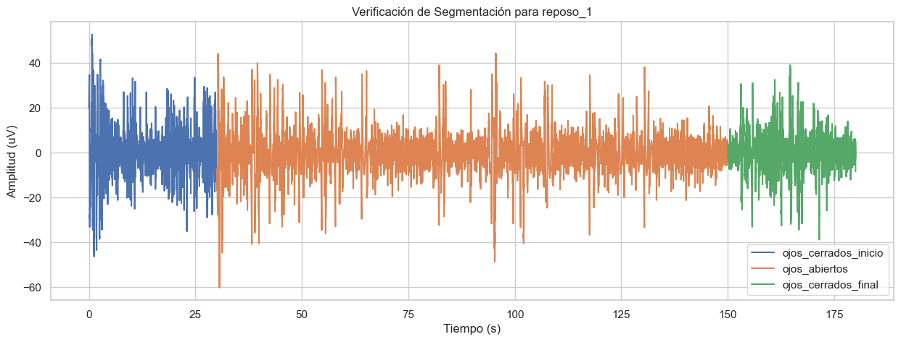
  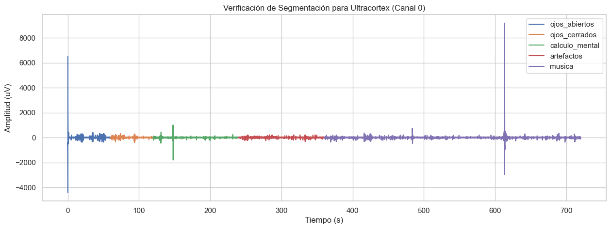
  
<b>Figura 7.</b> Verificación visual de la segmentación para un ensayo de reposo del Sujeto 1 (izquierda) y para el ensayo completo del Sujeto 2 (derecha). Cada color representa un evento fisiológico distinto.

**Discusión:** Estas verificaciones visuales confirman que los datos fueron cargados y preprocesados con éxito. Las señales filtradas muestran la morfología esperada para un registro de EEG, y la segmentación se alinea correctamente con los protocolos definidos. Con la calidad de los datos validada, se puede proceder al análisis cuantitativo.

### 5.2. Análisis de Ritmos Alfa (Ojos Abiertos vs. Cerrados)

Se comparó la potencia en la banda alfa (8-13 Hz) entre las condiciones de ojos abiertos y cerrados para ambos sujetos. El Espectro de Densidad de Potencia (PSD) se calculó para visualizar la distribución de la energía en las diferentes frecuencias (Figura 8), y la potencia media en la banda alfa se cuantificó y comparó en un gráfico de barras (Figura 9).

  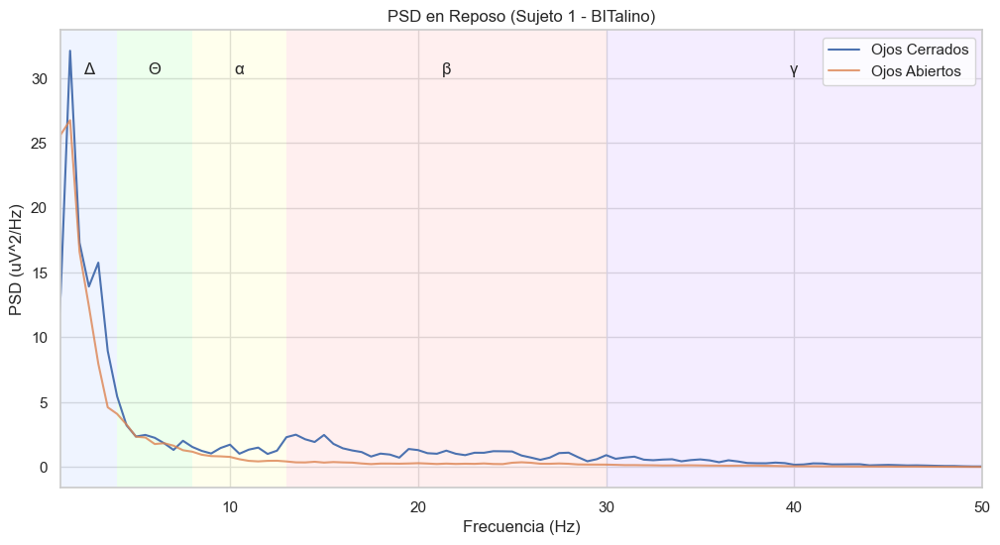
  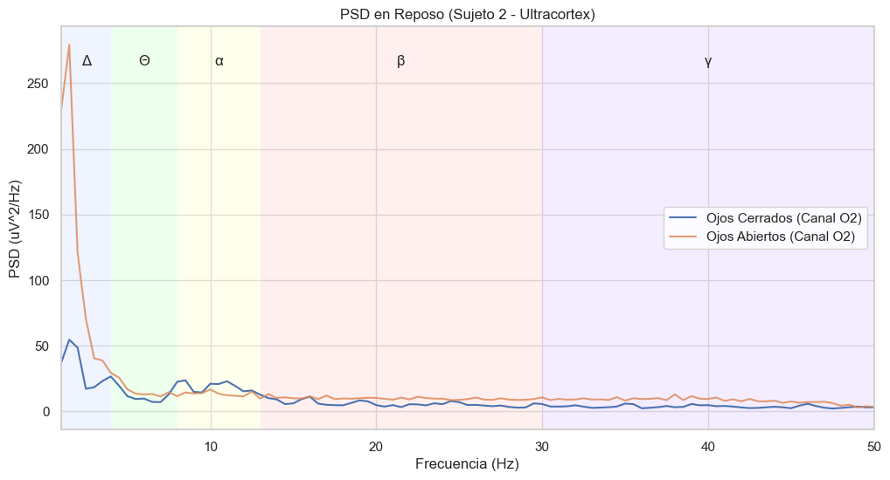
  
<b>Figura 8.</b> PSD en reposo para el Sujeto 1 (izquierda) y el Sujeto 2 (derecha, canal O2). Se observa un claro pico en la banda alfa (región amarilla) en la condición de ojos cerrados en ambos casos.

  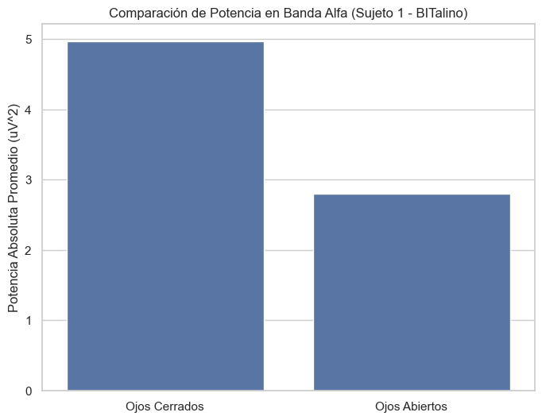
  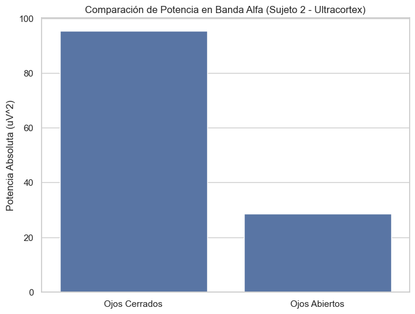
  
<b>Figura 9.</b> Potencia media cuantificada en la banda alfa. Ambos sujetos muestran un aumento significativo de la potencia con los ojos cerrados.

**Discusión:** Los resultados confirman de manera robusta el fenómeno de **desincronización alfa** [8]. Como se cuantifica en la Figura 9, la potencia alfa es drásticamente mayor con los ojos cerrados en ambos sujetos (Sujeto 1: 4.97 vs 2.80 uV²; Sujeto 2: 95.40 vs 28.47 uV²). La Figura 8 muestra que este aumento se debe a un pico de potencia pronunciado centrado alrededor de los 10 Hz. Este es un marcador clásico del estado de vigilia relajada de la corteza visual, que se desincroniza (y pierde potencia) al recibir estímulos visuales con los ojos abiertos [9].

### 5.3. Análisis de Ritmos Beta (Tarea Cognitiva)

Se evaluó el cambio en la potencia de la banda beta (13-30 Hz) durante una tarea de cálculo mental. La Figura 10 muestra el PSD y la Figura 11 la potencia media cuantificada.

  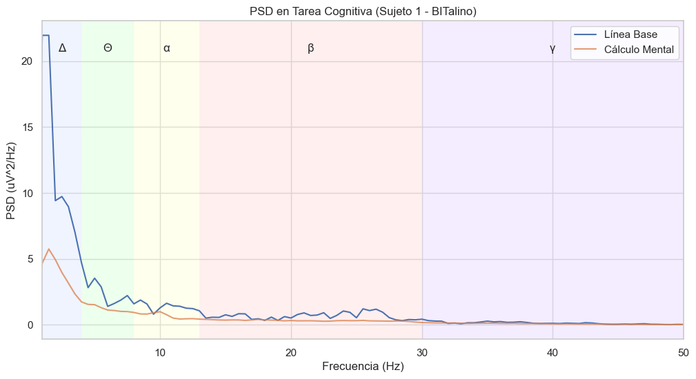
  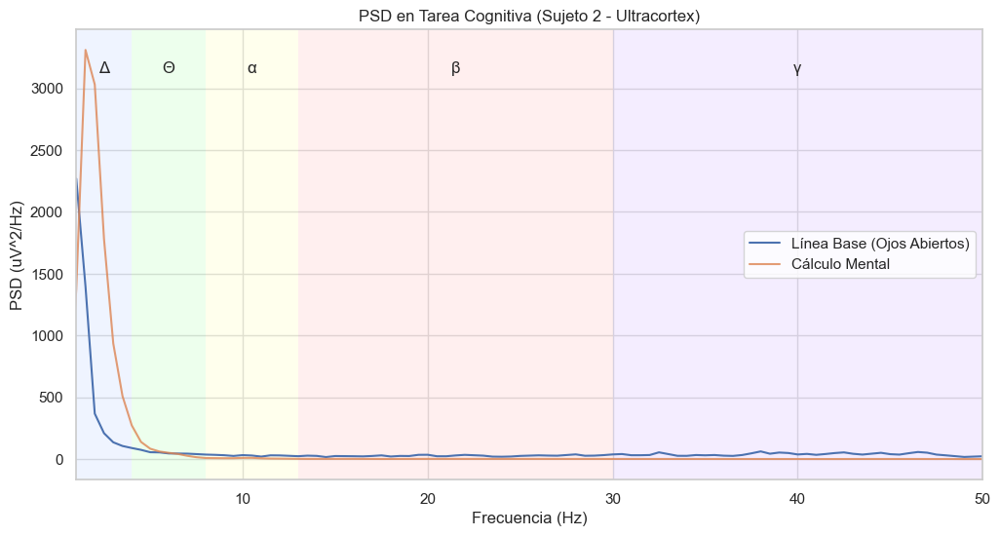
  
<b>Figura 10.</b> PSD durante la tarea cognitiva para el Sujeto 1 (izquierda) y el Sujeto 2 (derecha). No se observa un aumento claro en la banda beta (región roja).

  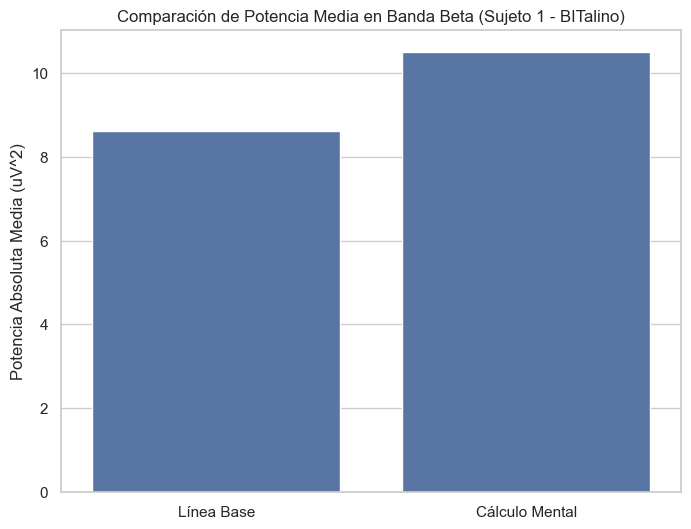
  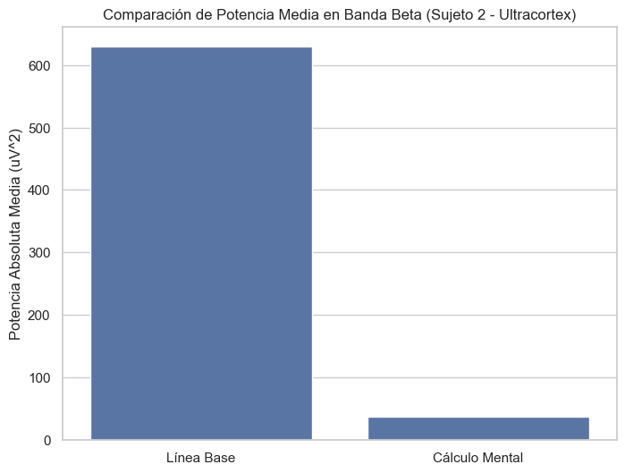
  
<b>Figura 11.</b> Potencia media en la banda beta. Sujeto 1 (izquierda) muestra un incremento no significativo (p=0.2464). Sujeto 2 (derecha) muestra una disminución estadísticamente significativa (p=0.0081).

**Discusión:** Los resultados fueron divergentes. El Sujeto 1 mostró una tendencia al aumento de potencia beta, acorde con la hipótesis de que esta banda refleja actividad cognitiva [10], pero el cambio no fue estadísticamente significativo. El Sujeto 2 mostró una **disminución significativa**, lo que sugiere que la línea de base pudo estar contaminada por artefactos musculares (EMG), cuya energía se solapa con la banda beta. Al concentrarse en la tarea, el sujeto pudo haberse relajado físicamente, reduciendo el EMG y la potencia medida.

### 5.4. Análisis Tiempo-Frecuencia con Espectrogramas

Se generaron espectrogramas para visualizar la evolución de la potencia de las frecuencias a lo largo del tiempo, permitiendo observar las transiciones entre estados.

  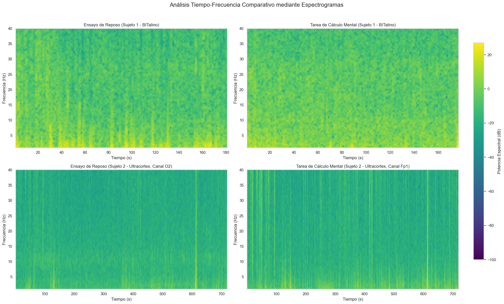
  
<b>Figura 12.</b> Espectrogramas comparativos. Se observa una sutil intensificación en la banda alfa (~10 Hz) en el Sujeto 1 (arriba izquierda) durante los periodos de ojos cerrados (0-30s y 150-180s). Los registros del Sujeto 2 (abajo) muestran una mayor energía general y artefactos transitorios (líneas verticales).

**Discusión:** Los espectrogramas confirman que las modulaciones de potencia buscadas son eventos de baja energía en comparación con la actividad de fondo y los artefactos. Esto refuerza la utilidad de los métodos de promediado como el de Welch (PSD) para cuantificar estados sostenidos, ya que son menos sensibles a la escala dinámica y a los eventos transitorios que un espectrograma.

### 5.5. Detección de Artefactos de Parpadeo

Se implementó un algoritmo con umbral adaptativo para identificar y contar los parpadeos voluntarios en los registros del Sujeto 1.

  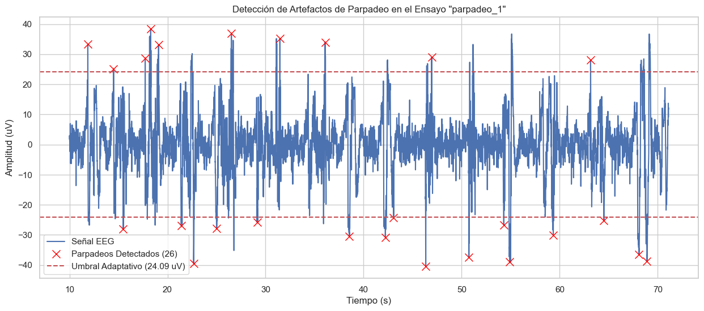
  
<b>Figura 13.</b> Detección de parpadeos (cruces rojas) en un ensayo del Sujeto 1. El umbral adaptativo (línea discontinua) se ajusta a la señal para identificar los picos de alta amplitud característicos del artefacto.

**Discusión:** El método adaptativo fue exitoso, detectando un total de 100 parpadeos en los tres ensayos. Este ejercicio demuestra la morfología y amplitud características de los artefactos electrooculográficos (EOG) y la importancia de técnicas de preprocesamiento para identificarlos, ya que pueden ser confundidos con actividad cerebral patológica [11].

### 5.6. Clustering de Estados Cerebrales

Se aplicó un algoritmo K-Means para clasificar de forma no supervisada los diferentes estados cerebrales del Sujeto 2 basándose en sus perfiles de potencia espectral.

  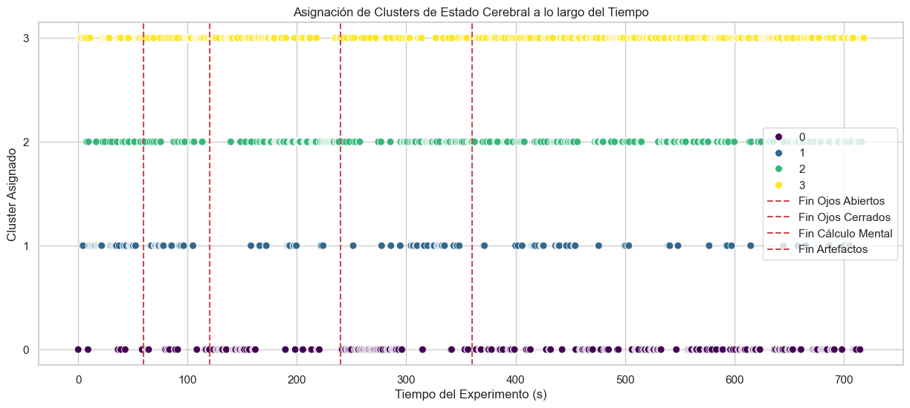
  
<b>Figura 14.</b> Asignación de los 4 clusters identificados a lo largo del tiempo del experimento del Sujeto 2. Las líneas verticales rojas marcan el final de cada tarea del protocolo.

  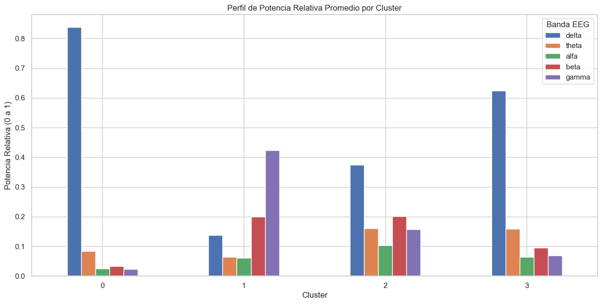
  
<b>Figura 15.</b> Perfil de potencia relativa promedio para cada uno de los 4 clusters. Cada cluster muestra una "firma espectral" distintiva.

**Discusión:** El clustering logró una separación exitosa de los estados:
-   **Clusters 0 y 3 (Dominancia Delta):** Correspondieron a los segmentos con **artefactos** (parpadeo, masticación) y ruido.
-   **Cluster 2 (Equilibrado):** Se asoció al estado de **vigilia con ojos abiertos**.
-   **Cluster 1 (Dominancia Beta/Gamma):** Se asoció a los estados de alta demanda cognitiva: **cálculo mental y escucha de música**.
Este resultado demuestra el potencial del aprendizaje automático para la exploración de datos de EEG y la identificación objetiva de estados cerebrales [12].

---

## 6. Cuestionario de Análisis (Basado en Guía BITalino)

---
Adicionalmente, se está incluyendo esta sección de respuestas a preguntas basadas en el análisis de la señal EEG que propone la misma guía del BITalino.

**Q1. Which are the significant frequencies for EEG acquisitions? Are they the same in all brain areas?**
   - Las frecuencias significativas son las que corresponden a las bandas Delta (1-4 Hz), Theta (4-8 Hz), Alfa (8-13 Hz), Beta (13-30 Hz) y Gamma (>30 Hz). No son las mismas en todas las áreas; por ejemplo, la banda Alfa es mucho más prominente en las regiones occipitales (visuales), mientras que la Beta es más fuerte en las regiones frontales y motoras durante la actividad.

**Q2. Which kind of filter is essential when working with EEG signals? Why do we need to apply such a filter?**
   - El **filtro pasa-banda** es imprescindible. Es crucial para eliminar la **deriva de la línea de base** (< 1 Hz), que puede saturar la señal, y para atenuar el **ruido muscular (EMG)** y otras interferencias de alta frecuencia (> 50 Hz) que pueden enmascarar la actividad neuronal de interés [6].

**Q3. Can you influence the EEG signal by your thoughts? What action can you do to trigger one frequency band of choice? Were you able to visualize the change in the signal?**
   - Sí, se puede modular conscientemente. La acción más simple es **cerrar los ojos** para aumentar la potencia en la **banda alfa**. Como se visualizó claramente en las Figuras 8 y 9, este cambio fue detectado y cuantificado con éxito en ambos sujetos.

**Q4. Show a screenshot of a relevant portion of EEG data within the experiment proposed. Does this signal correspond to what you expected? Why?**
   - La Figura 6 de este informe muestra una porción relevante. La señal corresponde a lo esperado: es una señal oscilatoria de baja amplitud, con una morfología compleja y libre de artefactos obvios, característica de un registro de EEG limpio.

**Q5. Is there any difference in the signal between the two locations FP1 and FP2?**
   - En este laboratorio, el BITalino usó un montaje bipolar entre Fp1 y Fp2, por lo que registró la diferencia entre ambos y no las señales individuales. Sin embargo, en un montaje referencial, podrían existir diferencias debido a la lateralización de funciones cerebrales o a factores técnicos como la colocación de los electrodos [13].

**Q6. Which frequencies are supposed to change in the given tasks? Describe what you see.**
   - Se esperaba que la frecuencia **alfa** aumentara al cerrar los ojos y que la frecuencia **beta** aumentara durante el cálculo mental. Se observó claramente el aumento de alfa. El cambio en beta fue inconsistente: en el Sujeto 1 aumentó ligeramente, mientras que en el Sujeto 2 disminuyó significativamente, probablemente debido a la reducción de artefactos musculares.

**Q7. To the best of your knowledge, does the EEG amplitude equal to the level of focus you have applied?**
   - No directamente. La amplitud del EEG no es un correlato directo del "nivel de foco". Más bien, el nivel de foco se relaciona con la **potencia en bandas de frecuencia específicas**, como la banda beta o gamma. Un mayor foco puede llevar a un aumento de la *potencia* en estas bandas, pero no necesariamente a un aumento de la *amplitud* general de la señal sin filtrar.

---
## 7. Conclusiones
---

Este laboratorio permitió aplicar con éxito un pipeline completo de adquisición y análisis de señales de EEG, comparando dos dispositivos y dos sujetos en diversas condiciones. Se validaron cuantitativamente fenómenos neurofisiológicos clave, como la **desincronización del ritmo alfa** al abrir los ojos.

El análisis reveló los desafíos prácticos del registro de EEG, destacando la **alta sensibilidad de la señal a los artefactos** musculares y oculares. Se demostró que estos artefactos pueden llevar a conclusiones erróneas, como se observó en el análisis de la banda beta del Sujeto 2.

Se implementaron con éxito técnicas de análisis avanzado. El uso de **espectrogramas** ofreció una visión dinámica de la señal, mientras que el **clustering no supervisado (K-Means)** demostró ser una herramienta poderosa para la clasificación automática de estados cerebrales, logrando diferenciar objetivamente entre reposo, actividad cognitiva y segmentos con artefactos. En conjunto, la práctica proporcionó una visión integral y aplicada de los fundamentos del análisis de señales EEG.

---
## 8. Referencias
---

[1] Rashid F, Islam SMR. Identification of EEG and fNIRS Signal Frequency Band Based on FPGA. *Circuits Syst Signal Process*. 2025;44:3199-222. Disponible en: https://link.springer.com/article/10.1007/s00034-024-02954-1

[2] Värbu K, Muhammad N, Muhammad Y. Past, Present, and Future of EEG-Based BCI Applications. *Sensors (Basel)*. 2022;22(9):3331. Disponible en: https://www.mdpi.com/1424-8220/22/9/3331

[3] Rivera-Tello S, Huerta-Chávez V, Ramos-Loyo J. Actividad eléctrica cerebral: métodos de registro y análisis y sus implicaciones en la organización funcional del cerebro. *e-CUCBA*. 2023;10(19):204-12. Disponible en: http://e-cucba.cucba.udg.mx/index.php/e-Cucba/article/view/280/272

[4] Mayo Clinic Staff. Electroencefalograma (EEG). *Mayo Clinic*. 2024 May 29. Disponible en: https://www.mayoclinic.org/es/tests-procedures/eeg/about/pac-20393875

[5] Aykan B, Altındağ E, Elmalı AD. Elektroensefalografi. Actualización: 19 enero 2019. Disponible en: https://www.itfnoroloji.org/semi2/eeg.htm

[6] Teplan M. Fundamentals of EEG measurement. *Measurement Science Review*. 2002;2(2):1-11. Disponible en: https://www.measurement.sk/2002/S2/Teplan.pdf

[7] Welch PD. The use of fast Fourier transform for the estimation of power spectra: a method based on time averaging over short, modified periodograms. *IEEE Transactions on Audio and Electroacoustics*. 1967;15(2):70-73. Disponible en: https://ieeexplore.ieee.org/document/1161901

[8] Pfurtscheller G, Lopes da Silva FH. Event‐related EEG/MEG synchronization and desynchronization: basic principles. *Clinical Neurophysiology*. 1999;110(11):1842-1857. Disponible en: https://pubmed.ncbi.nlm.nih.gov/10576479/

[9] Klimesch W. EEG alpha and theta oscillations reflect cognitive and memory performance: a review and analysis. *Brain Research Reviews*. 1999;29(2-3):169-195. Disponible en: https://pubmed.ncbi.nlm.nih.gov/10209231/

[10] Engel AK, Fries P. Beta-band oscillations—signalling the status quo? *Current Opinion in Neurobiology*. 2010;20(2):156-165. Disponible en: https://pubmed.ncbi.nlm.nih.gov/20359884/

[11] Fisch BJ. *Fisch and Spehlmann’s EEG Primer: Basic Principles of Digital and Analog EEG*. 3rd ed. Amsterdam: Elsevier; 1999.

[12] Abhang PA, Gawali BW, Mehrotra SC. *Introduction to EEG- and Speech-Based Emotion Recognition*. Amsterdam: Academic Press; 2016. Disponible en: https://www.sciencedirect.com/book/9780128044902/introduction-to-eeg-and-speech-based-emotion-recognition

[13] Sazgar M, Young MG. Overview of EEG, electrode placement, and montages. In: *Absolute Epilepsy and EEG Rotation Review*. Cham: Springer; 2019. p. 117-125. Disponible en: https://link.springer.com/book/10.1007/978-3-030-03511-2

---
## Aporte de cada integrante
| Integrante               | Aporte   |
|--------------------------|----------|
| Alvaro Untiveros         | 33.33 %  |
| Lucero Munive            | 33.33 %  |
| Fiorella Pérez           | 33.33 %  |
