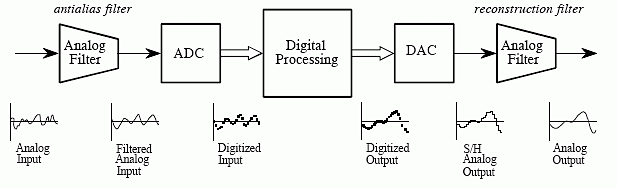
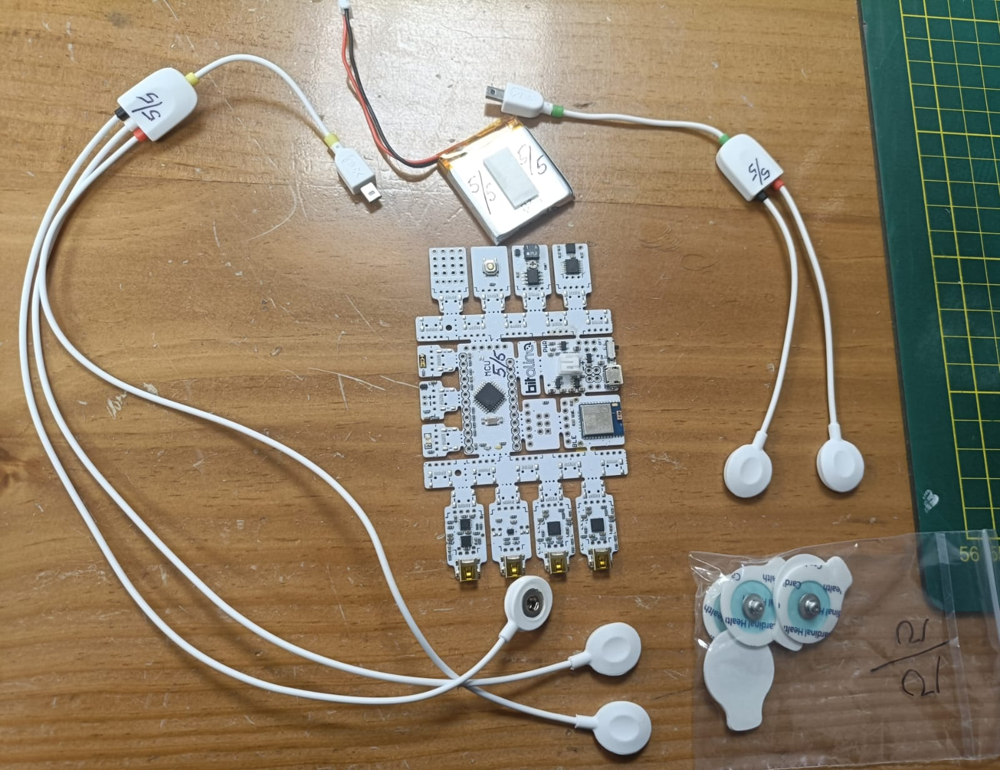

# Laboratorio 6: Diseño y Aplicación de Filtros Digitales para Señales Biomédicas (EMG y ECG)

## Introducción
---
El procesamiento digital de señales biomédicas se ha consolidado como una herramienta esencial para mejorar la calidad de registros fisiológicos como la electromiografía (EMG) y la electrocardiografía (ECG). Estas señales, ampliamente utilizadas en el diagnóstico muscular y cardíaco, suelen estar contaminadas por ruido de línea, artefactos de movimiento o interferencias electromagnéticas, lo que dificulta su interpretación directa. Aplicar filtros digitales adecuados permite mejorar la relación señal/ruido (SNR) y preservar las características morfológicas relevantes para el análisis clínico[1,2].

## Ventajas de los filtros digitales frente a los analógicos
A diferencia de los filtros analógicos, los filtros digitales ofrecen ventajas como estabilidad, reproducibilidad y flexibilidad en su implementación. Mediante algoritmos computacionales, es posible ajustar parámetros con precisión, adaptarse a distintos tipos de señales y realizar análisis tanto en tiempo real como en post-procesamiento [3]. Además, plataformas como BITalino han facilitado la adquisición de señales biomédicas en entornos no controlados, lo que incrementa la necesidad de técnicas de filtrado robustas [4].

## Tipos de filtros digitales: FIR vs IIR
Los filtros digitales se dividen principalmente en dos categorías: FIR (Finite Impulse Response) e IIR (Infinite Impulse Response).
 - Los filtros FIR garantizan fase lineal y estabilidad absoluta, lo que los hace ideales para preservar la morfología de ondas ECG como P, QRS y T [1].
 - Los filtros IIR son más eficientes computacionalmente y permiten alcanzar respuestas similares a los filtros analógicos con menos coeficientes, aunque pueden introducir distorsión de fase si no se diseñan adecuadamente [3].

## Consideraciones de señales EMG y ECG
Cada tipo de señal posee un espectro de frecuencia característico. En el caso de la ECG, el rango útil suele estar entre 0.5 y 150 Hz, mientras que en la EMG se extiende de 10 a 500 Hz [1]. Por tanto, la elección del filtro debe considerar tanto la banda de interés como el tipo de ruido predominante.Por otro lado , investigaciones recientes han evaluado filtros como Butterworth, Chebyshev, Gaussian y convolucionales, no solo por su capacidad para atenuar interferencias, sino también por su impacto en el rendimiento de modelos de clasificación automática [3,5].

  
  
<b>Figura 1.</b> Flujo de procesamiento digital de señales: la señal analógica pasa por un filtro antialiasing, luego se digitaliza mediante un ADC, es procesada digitalmente, convertida nuevamente a analógica con un DAC y finalmente suavizada con un filtro de reconstrucción.

## Objetivos
---
- Aplicar diferentes filtros digitales a señales biomédicas de ECG y EMG adquiridas con BITalino, con el fin de reducir el ruido y resaltar las características relevantes de cada registro.
- Seleccionar y justificar el filtro más adecuado para cada caso (2 ECG y 2 EMG).

## Materiales
---

| Material | Foto | N° | Detalles |
|----------|------|:--:|----------|
| Kit BITalino (r)evolution | 

 | 1 | Placa de adquisición de bioseñales (ECG, EMG, EDA, etc.) con resolución ADC de 10 bits y frecuencia de muestreo configurable (hasta 1000 Hz).    **Incluye:**   • 1 cable de 2 hilos   • 1 cable de 3 hilos   • 5 electrodos   • 1 batería recargable LiPo 3.7 V   • 1 guía de inicio rápido   • 1 placa BITalino |
| Entorno de programación en Python | 

 | 1 | Lenguaje de programación utilizado para el procesamiento digital de señales.|
| Herramienta pyFDA | 

 | 1 | Herramienta para el diseño, análisis y comparación de filtros digitales (FIR e IIR). Permite simular la respuesta en frecuencia y evaluar el desempeño de distintos filtros aplicados a señales biomédicas. |

En este cuaderno, se aborda el proceso de diseño, aplicación y evaluación de filtros digitales para el preprocesamiento de señales biomédicas reales. Se utilizarán dos tipos de señales adquiridas previamente con el dispositivo BITalino:

1.  **Electromiografía de Superficie (sEMG):** Registrada durante contracciones musculares del bíceps y tríceps.
2.  **Electrocardiografía (ECG):** Registrada en reposo y durante la recuperación post-ejercicio.

El objetivo principal es eliminar el ruido y los artefactos inherentes a cada señal para obtener una representación fidedigna de la actividad fisiológica. Para ello, se seguirá la siguiente metodología:

-   **Carga y Visualización de Datos Crudos:** Se cargarán las señales sin procesar y se convertirán a unidades físicas (mV) para establecer una línea base.
-   **Diseño de Filtros:** Se utilizará la herramienta `pyfdax` para diseñar un conjunto de filtros FIR e IIR con características específicas para cada tipo de señal.
-   **Aplicación y Comparación:** Cada filtro se aplicará a la señal correspondiente y se evaluará su rendimiento de forma visual (dominio del tiempo y frecuencia) y cuantitativa.
-   **Selección del Filtro Óptimo:** Se calculará la Relación Señal-Ruido (SNR) para cada caso y se generará una tabla comparativa para justificar la elección del filtro más adecuado para cada aplicación, priorizando tanto la limpieza de la señal como la preservación de su morfología característica.

## Referencias
[1] A. Chugh and C. Jain, “A Systematic Review on ECG and EMG Biomedical Signal Using Deep-Learning Approaches,” in Advances in Computational Intelligence and Communication: Proceedings of ICACIC 2023, Springer, 2023. Available: https://link.springer.com/chapter/10.1007/978-3-031-41925-6_11

[2] L. Sörnmo and P. Laguna, Bioelectrical Signal Processing in Cardiac and Neurological Applications. Burlington, MA, USA: Elsevier Academic Press, 2005. Available:https://www.elsevier.com/books/bioelectrical-signal-processing-in-cardiac-and-neurological-applications/sornmo/978-0-12-437552-9

[3] F. Zhou and D. Fang, “Multimodal ECG heartbeat classification method based on a convolutional neural network embedded with FCA,” Sci. Rep., vol. 14, no. 59311, 2024. Available: https://www.nature.com/articles/s41598-024-59311-0.pdf

[4] H. Silva et al., “BITalino: A Novel Hardware Framework for Physiological Computing,” in Proc. 36th Annu. Int. Conf. IEEE Eng. Med. Biol. Soc. (EMBC), 2014, pp. 593–596. Available: https://www.researchgate.net/publication/260987402_BITalino_A_Novel_Hardware_Framework_for_Physiological_Computing

[5] A. Sameh et al., “Digital phenotypes and digital biomarkers for health and diseases: a systematic review,” Artif. Intell. Rev., 2024. Available: https://link.springer.com/article/10.1007/s10462-024-11009-5
texto en cursiva