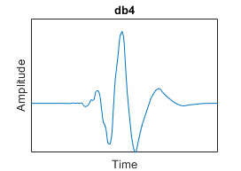
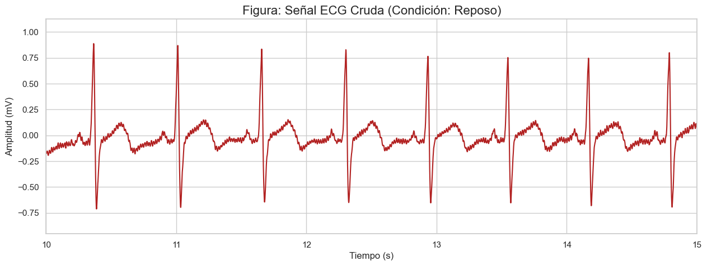
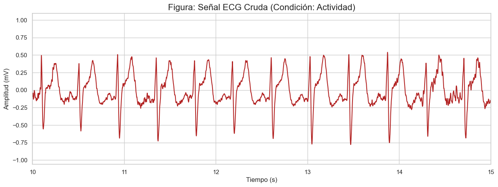
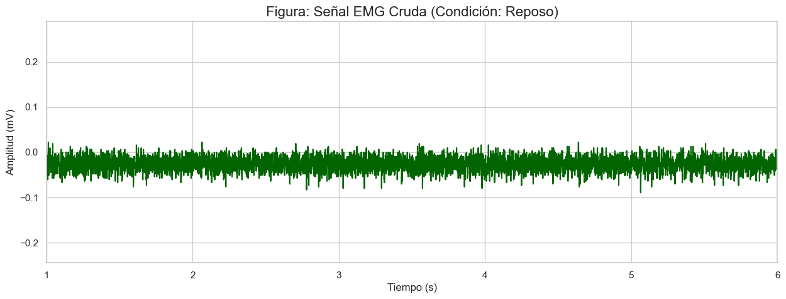
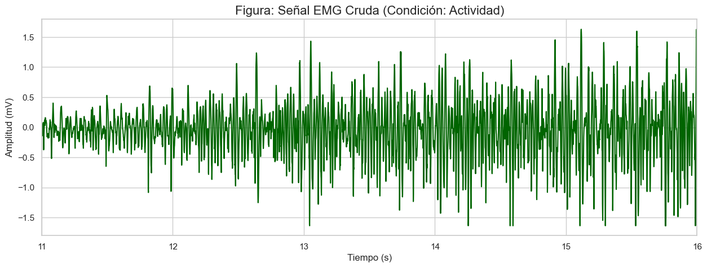
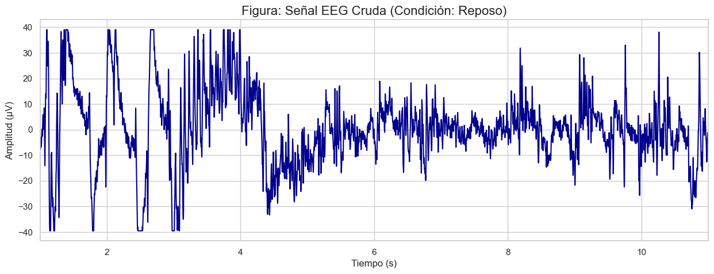
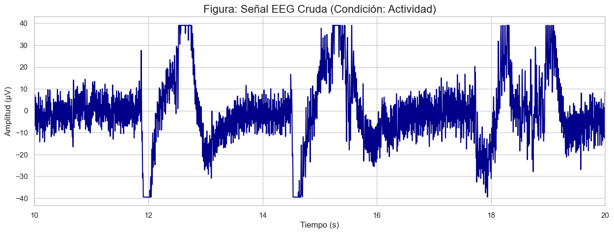
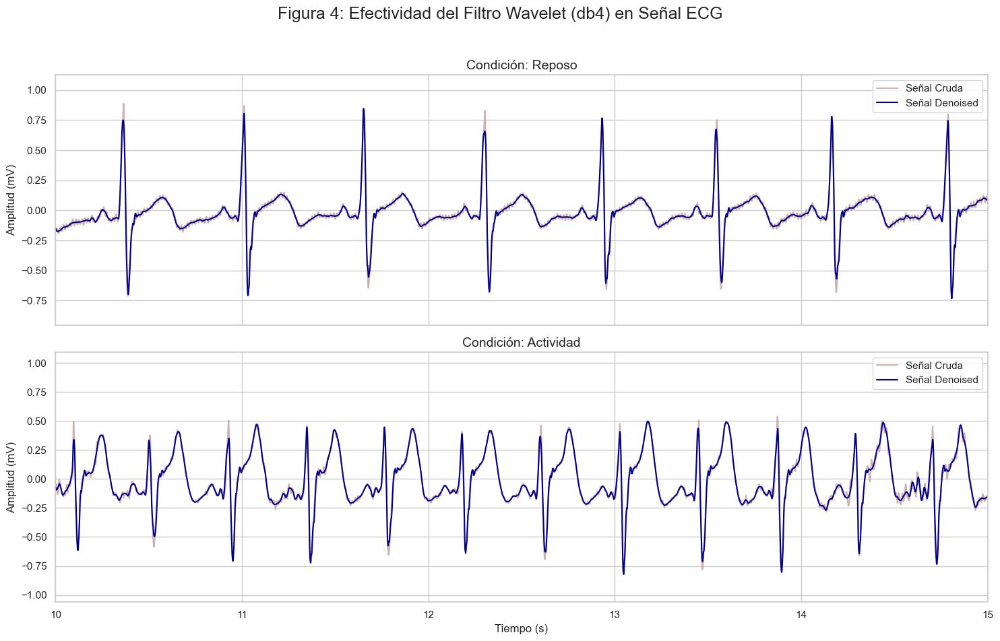
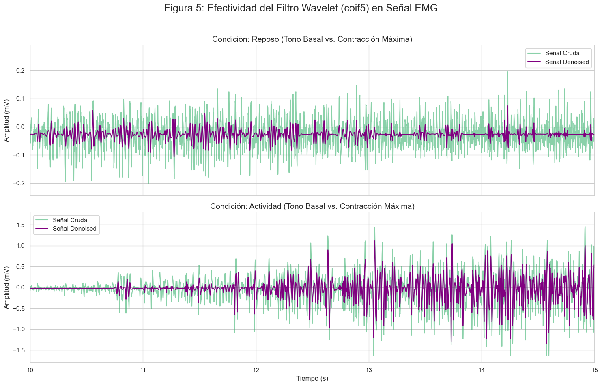
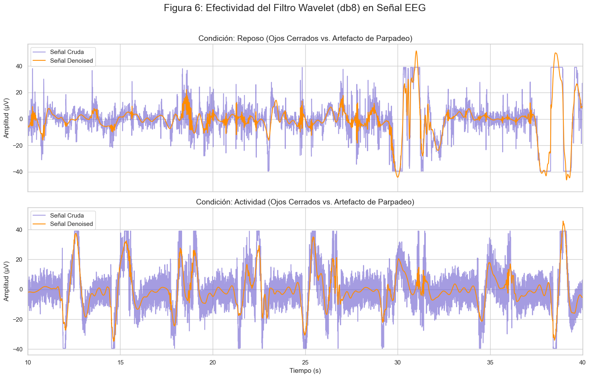

# Laboratorio 7: Filtrado Avanzado con Transformada Wavelet para Señales Biomédicas
---
## Índice

- [1. Introducción](#1-introducción)
  - [¿Qué hace la Transformada Wavelet?](#qué-hace-la-transformada-wavelet)
  - [Avances en clasificación de señales cardíacas](#avances-en-clasificación-de-señales-cardíacas)
  - [Aplicaciones en neuroingeniería y epilepsia](#aplicaciones-en-neuroingeniería-y-epilepsia)
  - [Perspectivas de integración con IA y filtrado avanzado](#perspectivas-de-integración-con-ia-y-filtrado-avanzado)
- [2. Objetivos Específicos](#2-objetivos-específicos)
- [3. Metodología y Diseño del Filtro](#3-metodología-y-diseño-del-filtro)
  - [3.1 Filtro para la Señal ECG](#31-filtro-para-la-señal-ecg)
  - [3.2 Filtro para la Señal EMG](#32-filtro-para-la-señal-emg)
  - [3.3 Filtro para la Señal EEG](#33-filtro-para-la-señal-eeg)
- [4. Resultados](#4-resultados)
  - [4.1 Señales Crudas para Análisis](#41-señales-crudas-para-análisis)
  - [4.2 Verificación del Filtrado Wavelet](#42-verificación-del-filtrado-wavelet)
- [5. Discusión](#5-discusión)
  - [5.1 Análisis del Filtrado en ECG](#51-análisis-del-filtrado-en-ecg)
  - [5.2 Análisis del Filtrado en EMG](#52-análisis-del-filtrado-en-emg)
  - [5.3 Análisis del Filtrado en EEG](#53-análisis-del-filtrado-en-eeg)
- [6. Conclusiones](#6-conclusiones)
- [7. Bibliografía](#7-bibliografía)

---

## 1. Introducción
---

El estudio de señales biomédicas ha dependido por mucho tiempo de herramientas clásicas como la Transformada de Fourier. Sin embargo, esta técnica no permite analizar bien fenómenos que cambian en el tiempo, ya que solo entrega información en el dominio de la frecuencia. Para intentar resolver esta limitación surgió la Transformada de Fourier de Tiempo Corto (STFT), pero aun así su capacidad de análisis es restringida porque usa ventanas fijas que obligan a sacrificar resolución en tiempo o en frecuencia. En este contexto, la Transformada Wavelet (WT) aparece como una alternativa más versátil, pues adapta la resolución según la frecuencia y permite observar detalles finos de la señal sin perder de vista su estructura general [1,2].

### ¿Qué hace la Transformada Wavelet?

La Transformada Wavelet (WT) permite realizar un análisis localizado en el tiempo de una señal completa, lo que significa que puede identificar eventos transitorios como picos breves, discontinuidades o rupturas que resultan complicados de detectar con otras herramientas de procesamiento.

Mientras que la Transformada de Fourier de Tiempo Corto (STFT) requiere definir una ventana fija, lo cual limita la resolución y puede ocultar ciertos detalles, el análisis wavelet ofrece una representación multiresolución [3].

<div align="center">
  
  <p><b>Figura 1.</b> Ejemplos de distintas familias de wavelets y sus aplicaciones.</p>
</div>

*   a) **Análisis tiempo–frecuencia** mediante wavelets continuas como Morlet y Bump, que permiten estudiar señales no estacionarias en múltiples escalas. 
*   b) **Detección de bordes y características** usando wavelets ortogonales (Haar, db4, db2), útiles para identificar cambios bruscos y transiciones en la señal. 
*   c) **Denoising**, ejemplificado con la Symlet (sym4), empleada en la reducción de ruido en señales biomédicas como ECG y EEG.
*   d) **Compresión** con wavelets biortogonales (bior4.4), que permiten representar y almacenar señales e imágenes con alta eficiencia manteniendo la calidad de reconstrucción.

### Avances en clasificación de señales cardíacas
En el área cardiaca, la WT se ha utilizado para diseñar métodos que clasifican automáticamente los latidos del corazón. Gracias a técnicas como el Wavelet Scattering Transform, se logra una mayor resistencia al ruido y una mejor capacidad de reconocer patrones entre diferentes pacientes, lo que incrementa la precisión de los diagnósticos [1]. Además, la combinación de wavelets con modelos de aprendizaje automático ha permitido desarrollar sistemas de adquisición de ECG que fusionan varias arquitecturas, aumentando la sensibilidad y la especificidad al momento de detectar anomalías cardíacas [4].

### Aplicaciones en neuroingeniería y epilepsia
Por otro lado, en el campo de la neuroingeniería, las wavelets se han convertido en una herramienta clave para el análisis de electroencefalogramas (EEG). En particular, se han aplicado en la detección automática de crisis epilépticas, facilitando tanto el trabajo clínico como el desarrollo de sistemas de monitoreo continuo. De esta manera, no solo se ahorra tiempo en el análisis, sino que también se aumenta la confiabilidad de los resultados, lo que resulta esencial en pacientes con epilepsia que requieren seguimiento constante [5,6].

### Perspectivas de integración con IA y filtrado avanzado
Finalmente, las investigaciones más recientes apuntan a la integración de la WT con técnicas de inteligencia artificial y aprendizaje profundo. Gracias a ello, se han diseñado bancos de filtros capaces de reconstruir señales discretas sin pérdidas, lo cual mejora notablemente el procesamiento en tiempo real [2,5]. Al mismo tiempo, estas aplicaciones ya se están implementando en sensores inteligentes y plataformas de telemedicina, lo que abre la puerta a una medicina más personalizada y a sistemas de monitoreo remoto de alta eficiencia [5].

## 2. Objetivos Específicos
---

1.  **Cargar y Visualizar Señales:** Cargar y visualizar segmentos representativos de señales de ECG, EMG y EEG, contextualizando cada una con su protocolo de adquisición para identificar los desafíos de ruido en cada caso.
2.  **Diseñar Filtros Wavelet Específicos:** Para cada tipo de señal, seleccionar y justificar rigurosamente una familia de wavelets y sus parámetros, basándose en la literatura científica y las características de la señal.
3.  **Aplicar y Verificar la Efectividad:** Implementar el filtrado wavelet y verificar visualmente su capacidad para eliminar ruido (denoising) en escenarios de baja y alta interferencia, preservando siempre las características morfológicas de interés.
4.  **Documentar el proceso de diseño** documentar la, aplicación y validación del filtro en un informe técnico.

## 3. Metodología y Diseño del Filtro
---

La selección de una familia de wavelets y sus parámetros es un paso crítico que depende de las características de la señal a analizar y del objetivo del filtrado. A continuación, se detalla el proceso de diseño para cada una de las señales biomédicas, respaldado por la literatura científica.

### 3.1 Filtro para la Señal ECG

**Protocolo de Adquisición y Artefactos Esperados:**
Las señales de ECG analizadas corresponden a un estado de reposo y a la recuperación post-actividad física. Este último es un escenario particularmente desafiante, ya que la señal suele estar contaminada por múltiples artefactos:
1.  **Ruido Muscular (EMG):** Temblores y contracciones musculares residuales generan ruido de alta frecuencia que puede enmascarar las ondas P y T.
2.  **Deriva de la Línea de Base:** La respiración agitada introduce oscilaciones de baja frecuencia.
3.  **Interferencia de la Red Eléctrica:** Ruido de 60 Hz proveniente de equipos electrónicos cercanos.

El objetivo principal del filtrado es eliminar estos artefactos para permitir una detección precisa de los picos R, paso fundamental para cualquier análisis de Variabilidad de la Frecuencia Cardíaca (HRV).

**Discusión de Familias Wavelet en la Literatura:**
Para el análisis de ECG, la morfología de la wavelet debe ser similar a la del complejo QRS para maximizar la eficiencia de la descomposición. Las familias más estudiadas son:
*   **Daubechies (db):** Wavelets como `db4` y `db6` son asimétricas y de soporte compacto. Su forma puntiaguda se asemeja a la del complejo QRS, lo que las hace excelentes para la detección de este evento transitorio. Son computacionalmente eficientes y ampliamente utilizadas en algoritmos de detección de QRS en tiempo real [7].
*   **Symlets (sym):** Son versiones "más simétricas" de las Daubechies. La simetría ayuda a reducir la distorsión de fase en la reconstrucción, lo cual es útil para análisis morfológicos detallados de las ondas P y T [8].
*   **Biorogonales (bior):** Ofrecen la propiedad de fase lineal, crucial en aplicaciones donde la alineación temporal precisa de diferentes ondas del complejo cardíaco es fundamental [9].

**Elección y Justificación Final:**
Se selecciona la wavelet **Daubechies 4 (`db4`) con un nivel de descomposición de 4**.

La justificación se centra en el objetivo de mejorar la **detección del pico R**. La `db4` es reconocida en la literatura por su capacidad para localizar eventos transitorios como el complejo QRS [7,10]. Al limitar la descomposición a 4 niveles, enfocamos el filtrado en las bandas de frecuencia más altas (>31 Hz), donde reside principalmente el ruido muscular y de la red eléctrica, dejando intactas las componentes de baja frecuencia que definen la morfología base del complejo QRS.

<div align="center">
  
  <p><b>Figura 2.</b> Forma de la función de escala y la wavelet madre para la Daubechies 4 (db4).</p>
</div>

### 3.2 Filtro para la Señal EMG

**Protocolo de Adquisición y Características de la Señal:**
Las señales de EMG corresponden a un estado de tono muscular basal y a una contracción isométrica máxima. La electromiografía de superficie (sEMG) es una señal no estacionaria que representa la suma de Potenciales de Acción de Unidades Motoras (MUAPs). El objetivo es eliminar el ruido de fondo sin distorsionar la amplitud y densidad de la señal, características relacionadas con la fuerza y la fatiga muscular.

**Discusión de Familias Wavelet en la Literatura:**
El filtrado de EMG debe preservar la información de los picos de los MUAPs.
*   **Coiflets (coif):** Poseen un alto número de momentos nulos, lo que las hace extremadamente eficientes para representar señales con componentes de tipo pico o polinomiales con muy pocos coeficientes, preservando así la morfología de los MUAPs durante el denoising [11].
*   **Symlets (sym) y Daubechies (db):** Aunque efectivas, su morfología puede no ser tan óptima como las Coiflets para la representación de los picos relativamente simétricos de los MUAPs.

**Elección y Justificación Final:**
Se selecciona la wavelet **Coiflet 5 (`coif5`) con un nivel de descomposición de 8**.

La justificación se basa en la necesidad de preservar la integridad morfológica de la señal para un análisis cuantitativo preciso. La familia Coiflets es superior para aproximar la señal en las zonas de picos que caracterizan la activación muscular. Al utilizar `coif5`, nos aseguramos de que el proceso de denoising limpie el ruido de fondo sin atenuar artificialmente la amplitud de la envolvente de la señal, un requisito fundamental para estudios de fuerza o fatiga muscular [11,12].

### 3.3 Filtro para la Señal EEG

**Protocolo de Adquisición y Bandas de Interés:**
Las señales de EEG analizadas provienen de un estado de reposo con ojos cerrados y de un protocolo con artefactos de parpadeo voluntario. El principal desafío es eliminar artefactos de gran amplitud (oculares, musculares) sin distorsionar las bandas de frecuencia de interés (Delta, Theta, Alpha, Beta, Gamma).

**Discusión de Familias Wavelet en la Literatura:**
La DWT es una técnica estándar para la descomposición y el denoising de EEG.
*   **Daubechies (db):** Es la familia más utilizada. Son ortogonales, permitiendo una descomposición de la energía sin redundancia. Wavelets de orden superior (como `db8`) tienen una mejor resolución en frecuencia, crucial para separar las distintas bandas rítmicas del EEG y para aislar y eliminar artefactos [13].
*   **Biorogonales (bior):** Populares para la eliminación de artefactos oculares (EOG) debido a su propiedad de fase lineal, que ayuda a reconstruir la señal neuronal subyacente sin desfase temporal [14].

**Elección y Justificación Final:**
Se selecciona la wavelet **Daubechies 8 (`db8`) con un nivel de descomposición de 8**.

La justificación se centra en la necesidad de una buena **resolución en frecuencia** para el análisis de la actividad neuronal. El EEG es fundamentalmente el estudio de oscilaciones en diferentes bandas. La wavelet `db8`, al ser de un orden superior, es más suave y tiene un soporte más largo, lo que le confiere una mejor capacidad para separar las componentes frecuenciales de la señal. Esto es esencial no solo para analizar las bandas cerebrales, sino también para aislar artefactos, ya que estos suelen tener una firma espectral característica. La ortogonalidad de la `db8` garantiza además que el análisis de potencia en cada banda sea preciso y cuantitativamente correcto [13,15].


## 4. Resultados
---

En esta sección se presentan los resultados visuales del proceso de carga y filtrado. Primero, se muestran las señales crudas seleccionadas para el análisis, contextualizadas con su protocolo de adquisición. Posteriormente, se presentan las figuras comparativas que demuestran la efectividad de los filtros wavelet diseñados.
El proceso detallado se encuentra en el notebook adjunto en la subcarpeta **/Procesamiento_wavelet**, así como en el pdf llamado **Procesamiento_wavelet_tarea.pdf**.


### 4.1 Señales Crudas para Análisis

Las siguientes figuras muestran un segmento representativo de cada tipo de señal biomédica antes de cualquier procesamiento, ilustrando los desafíos de ruido inherentes a cada una.

<div align="center">
  
  
  <p><b>Figura 3.</b> Señal ECG Cruda en condición de reposo (arriba) y post-actividad física (abajo).</p>
</div>
<br>
<div align="center">
  
  
  <p><b>Figura 4.</b> Señal EMG Cruda en condición de tono muscular basal (arriba) y contracción máxima (abajo).</p>
</div>
<br>
<div align="center">
  
  
  <p><b>Figura 5.</b> Señal EEG Cruda en condición de reposo con ojos cerrados (arriba) y durante un artefacto de parpadeo voluntario (abajo).</p>
</div>

### 4.2 Verificación del Filtrado Wavelet

Las siguientes figuras comparan la señal cruda (en color claro) con la señal filtrada (`denoised`, en color oscuro) para cada modalidad y condición.

<div align="center">
  
  <p><b>Figura 6.</b> Efectividad del filtro wavelet (db4, nivel 4) en la señal ECG. El panel superior corresponde a la condición de reposo y el inferior a la de post-actividad física.</p>
</div>
<br>
<div align="center">
  
  <p><b>Figura 7.</b> Efectividad del filtro wavelet (coif5, nivel 8) en la señal EMG. El panel superior corresponde al tono muscular basal y el inferior a la contracción máxima.</p>
</div>
<br>
<div align="center">
  
  <p><b>Figura 8.</b> Efectividad del filtro wavelet (db8, nivel 8) en la señal EEG. El panel superior corresponde al reposo con ojos cerrados y el inferior a la señal con artefacto de parpadeo.</p>
</div>

## 5. Discusión
---

La aplicación de los filtros wavelet diseñados a las señales de ECG, EMG y EEG en diferentes condiciones nos permite evaluar su efectividad. A continuación, se discuten los resultados obtenidos para cada modalidad, interpretando las figuras presentadas en la sección anterior.

### 5.1 Análisis del Filtrado en ECG (Figura 6)

La Figura 6 demuestra la efectividad del filtro wavelet `db4` en dos escenarios distintos:
*   **En la condición de Reposo (panel superior)**, la señal cruda ya presenta una calidad relativamente alta. El filtro wavelet actúa de forma sutil, eliminando el ruido de alta frecuencia de la línea de base sin introducir ninguna distorsión perceptible en la morfología del complejo QRS, ni en las ondas P y T. El resultado es una señal más limpia y suave, ideal para análisis morfológicos.
*   **En la condición de Actividad (panel inferior)**, la señal cruda está visiblemente contaminada por ruido muscular (EMG). Aquí, el filtro wavelet demuestra su verdadero potencial: elimina de forma contundente el ruido de alta frecuencia, revelando una señal ECG subyacente mucho más clara y definida. La preservación de la amplitud y forma del QRS, incluso en un entorno ruidoso, valida la elección del nivel de descomposición (`level=4`), que protegió las componentes fundamentales de la señal.

### 5.2 Análisis del Filtrado en EMG (Figura 7)

La Figura 7 ilustra la capacidad del filtro `coif5` para aislar la actividad muscular:
*   **En la condición de Reposo (panel superior)**, donde se registra el tono muscular basal, la señal cruda muestra un bajo nivel de actividad mezclado con ruido de fondo. El filtro wavelet elimina eficazmente este ruido de base, resultando en una señal `denoised` con una amplitud muy cercana a cero, lo cual es fisiológicamente correcto para un músculo en reposo.
*   **En la condición de Actividad (panel inferior)**, durante la contracción máxima, la señal cruda muestra una alta densidad de potenciales de acción. El filtro wavelet elimina el ruido de fondo sin atenuar la envolvente principal de la señal de contracción. Se preservan los picos de los MUAPs, que son la base de la señal EMG, demostrando que la elección de la wavelet `coif5` fue adecuada para mantener la integridad morfológica necesaria para análisis de fuerza o fatiga.

### 5.3 Análisis del Filtrado en EEG (Figura 8)

La Figura 8 muestra el rendimiento del filtro `db8` en el dominio del EEG:
*   **En la condición de Reposo (panel superior)**, la señal de ojos cerrados muestra una actividad neuronal de fondo. El filtro wavelet suaviza la señal, eliminando el ruido de alta frecuencia y haciendo más visibles las oscilaciones de menor frecuencia, como las ondas Alpha típicas de este estado.
*   **En la condición de Actividad (panel inferior)**, que contiene grandes artefactos de parpadeo, el filtro demuestra una notable capacidad de atenuación. Si bien no elimina por completo un artefacto tan dominante (para lo cual se requerirían técnicas más avanzadas como el Análisis de Componentes Independientes - ICA), sí reduce significativamente su componente de alta frecuencia y limpia la actividad neuronal circundante. La elección de una wavelet de orden superior como `db8` fue clave para actuar sobre el ruido sin destruir las delicadas ondas cerebrales subyacentes.

En conjunto, los resultados confirman que el diseño de filtros wavelet específicos para cada tipo de señal, basado en la literatura y los protocolos de adquisición, es un método robusto y eficaz para el preprocesamiento de señales biomédicas.

## 6. Conclusiones
---

Este laboratorio demostró exitosamente la aplicación y validación de la Transformada Wavelet como una herramienta avanzada y adaptable para el filtrado de diversas señales biomédicas. A través de un diseño de filtro específico para cada modalidad, se cumplieron los siguientes objetivos:

1.  **Se diseñaron y justificaron filtros wavelet específicos** para señales de ECG (`db4`), EMG (`coif5`) y EEG (`db8`), basando cada elección en la literatura científica y en las características morfológicas y de ruido de cada señal.
2.  **Se verificó visualmente la efectividad del filtrado** en múltiples condiciones. Los resultados demostraron que el método de denoising wavelet es capaz de eliminar eficazmente artefactos como el ruido muscular en el ECG, el ruido de fondo en el EMG y el ruido de alta frecuencia en el EEG.
3.  **Se confirmó la capacidad del método para preservar la información fisiológica crucial**. A pesar de la eliminación contundente de ruido, la morfología del complejo QRS en el ECG, los picos de activación en el EMG y las ondas subyacentes en el EEG se mantuvieron intactos, validando la robustez del enfoque.

En definitiva, este trabajo subraya la superioridad de la Transformada Wavelet sobre los métodos de filtrado tradicionales para el análisis de señales no estacionarias, proporcionando una base sólida para futuros análisis cuantitativos más precisos y fiables.

## 7. Bibliografía
---

[1] Z. Liu, G. Yao, Q. Zhang, J. Zhang, and X. Zeng, “Wavelet Scattering Transform for ECG Beat Classification,” *Computational and Mathematical Methods in Medicine*, vol. 2020, Article ID 3215681, 2020. Disponible en: https://onlinelibrary.wiley.com/doi/10.1155/2020/3215681

[2] C. Ramos, L. De la Cruz, et al., “Hybrid AI–Wavelet Model for Biomedical Signal Classification,” in *Proc. IEEE INTERCON*, 2023. Disponible en: https://ieeexplore.ieee.org/document/10326046

[3] J. A. Cortés, H. B. Cano Garzón, and J. A. Chaves O., “Del análisis de Fourier a las Wavelets - Transformada Continua Wavelet (CWT),” *Scientia Et Technica*, vol. XIII, no. 37, pp. 133–138, Dec. 2007.

[4] S. Su, Z. Zhu, S. Wan, F. Sheng, T. Xiong, et al., “An ECG Signal Acquisition and Analysis System Based on Machine Learning with Model Fusion,” *Sensors*, vol. 23, no. 17, 7643, 2023. Disponible en: https://www.mdpi.com/1424-8220/23/17/7643

[5] J. Sánchez-Ramírez, R. Rosales-Roldán, et al., “Comparison of Wavelet Families in EEG Signal Processing for Epileptic Seizure Detection,” *Procedia Computer Science*, vol. 138, pp. 65–72, 2018. Disponible en: https://www.sciencedirect.com/science/article/pii/S1877050918307865?via%3Dihub

[6] O. Faust, U. R. Acharya, H. Adeli, and A. Adeli, “Wavelet-based EEG Processing for Computer-Aided Seizure Detection and Epilepsy Diagnosis,” *Seizure*, vol. 26, pp. 56–64, 2015. Disponible en: https://www.seizure-journal.com/article/S1059-1311(15)00013-8/fulltext

[7] P. S. Addison, “Wavelet transforms and the ECG: a review,” *Physiol Meas*, vol. 26, no. 5, pp. R155-R199, 2005. Disponible en: https://iopscience.iop.org/article/10.1088/0967-3334/26/5/R01

[8] M. Alfaouri and K. Daqrouq, “ECG Signal Denoising By Wavelet Transform Thresholding,” *Am J Appl Sci*, vol. 5, no. 3, pp. 276-281, 2008. Disponible en: https://thescipub.com/pdf/ajassp.2008.276.281.pdf

[9] M. Unser and A. Aldroubi, “A review of wavelets in biomedical applications,” *Proc IEEE*, vol. 84, no. 4, pp. 626-638, 1996. Disponible en: https://ieeexplore.ieee.org/document/488704

[10] J. P. V. Madeiro, P. C. Cortez, F. de S. B. Dias, R. S. Siqueira, V. H. de Albuquerque, and G. H. M. Oliveira, “A new approach for QRS segmentation based on wavelet transforms and particle swarm optimization,” *Med Eng Phys*, vol. 34, no. 8, pp. 1154-1162, 2012. Disponible en: https://www.sciencedirect.com/science/article/abs/pii/S135045331100293X

[11] R. Kivi, M. Jäntti, S. Haimi, T. Grönfors, and T. Finni, “Can Wavelet-Based Denoising of Surface EMG Improve the Estimation of Muscle Force?,” *Sensors (Basel)*, vol. 22, no. 21, 8456, 2022. Disponible en: https://www.mdpi.com/1424-8220/22/21/8456

[12] A. Phinyomark, P. Phukpattaranont, and C. Limsakul, “Feature extraction and reduction of wavelet transform coefficients for EMG pattern classification,” *Elektron ir Elektrotechnika*, vol. 18, no. 5, pp. 91-96, 2012. Disponible en: https://www.ee.ktu.lt/journal/2012/5/17_1392-1215.pdf

[13] R. Hussein, R. Pal, L. Tamar, and R. Ward, “A Wavelet-Based Denoising and Artifact Removal of EEG Signals,” *IEEE Access*, vol. 8, pp. 137782-137797, 2020. Disponible en: https://ieeexplore.ieee.org/document/9156038

[14] V. Krishnaveni, S. Jayaraman, S. Aravind, V. Hariharasudhan, and K. Ramadoss, “Automatic identification and removal of ocular artifacts from EEG using wavelet transform,” *Meas Sci Rev*, vol. 7, no. 2, pp. 45-57, 2007. Disponible en: https://www.measurement.sk/2007/S2/Krishnaveni.pdf

[15] H. Adeli, S. Ghosh-Dastidar, and N. Dadmehr, “A wavelet-chaos methodology for analysis of EEGs and EEG subbands to detect seizure and epilepsy,” *IEEE Trans Biomed Eng*, vol. 54, no. 2, pp. 205-211, 2007. Disponible en: https://ieeexplore.ieee.org/document/4060287```