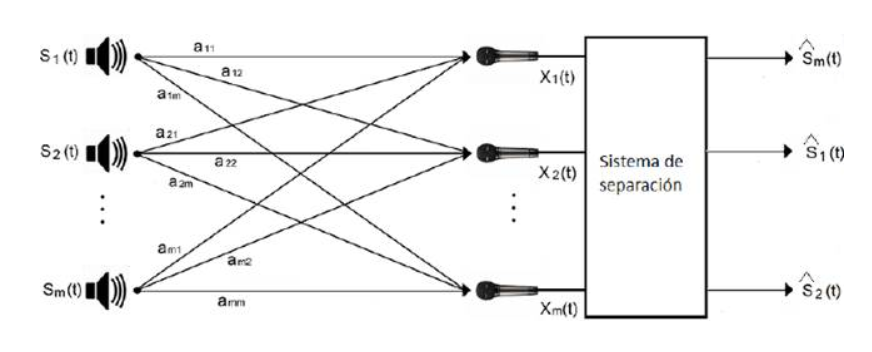
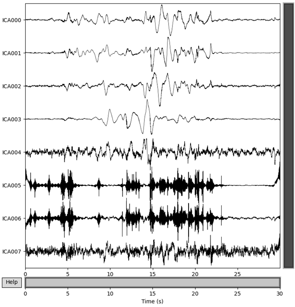
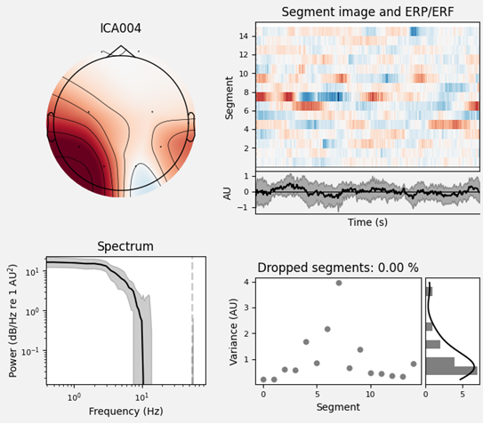
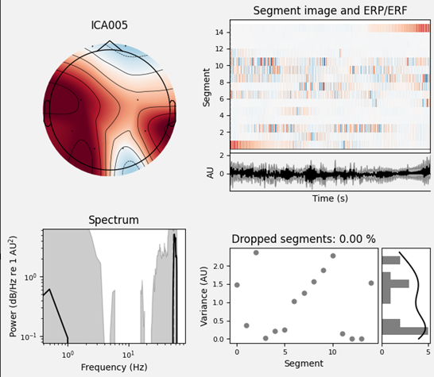
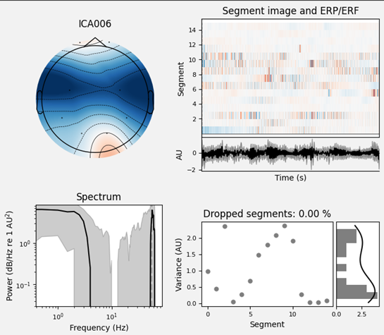
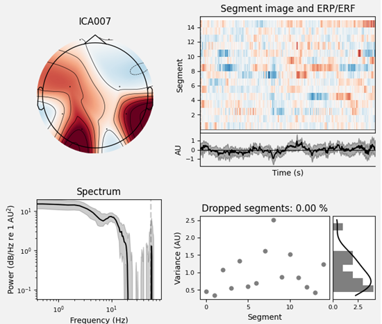
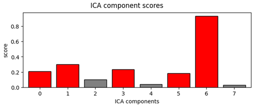
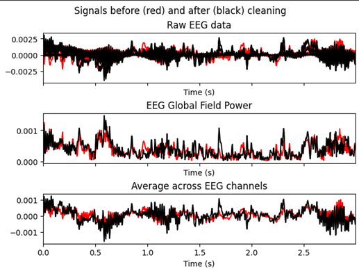

# Laboratorio 9 - Tratamiento de EEG
## Introducción
### Definición
El Análisis de Componentes Independientes (ICA, Independent Component Analysis) es una técnica estadística avanzada perteneciente al grupo de métodos de separación ciega de fuentes (Blind Source Separation, BSS). Su propósito principal es descomponer un conjunto de señales observadas en varios componentes independientes entre sí y con distribución no gaussiana. A diferencia del Análisis de Componentes Principales (PCA), que analiza únicamente correlaciones lineales, el ICA aprovecha estadísticas de orden superior para obtener una separación más precisa entre las fuentes subyacentes [1].

En términos matemáticos, el ICA asume que una señal observada x(t) puede expresarse como una combinación lineal de fuentes independientes s(t), de modo que x(t) = A s(t), donde A representa la matriz de mezcla desconocida. El objetivo es encontrar una matriz de separación W que permita recuperar las fuentes originales a través de y(t) = W x(t). Para lograrlo, el algoritmo optimiza una función de contraste, que mide la independencia entre los componentes mediante indicadores como la kurtosis, la negentropía o la información mutua [2].
### ICA en procesamiento de señales
En el ámbito del procesamiento de señales fisiológicas, el ICA se ha convertido en una herramienta fundamental, especialmente en el análisis de señales de electroencefalografía (EEG). Este tipo de señal, cuya amplitud oscila típicamente entre 20 y 100 µV, es muy susceptible a interferencias externas y artefactos producidos por el movimiento ocular, la actividad muscular o el entorno eléctrico. En este sentido, el ICA resulta extremadamente útil, ya que permite aislar las fuentes neuronales de interés y eliminar los componentes de ruido, mejorando de manera notable la calidad del registro y la interpretación clínica [3].

Asimismo, esta técnica se aplica con éxito para eliminar artefactos de electromiografía (EMG), movimientos oculares (EOG) y actividad cardíaca (ECG), sin comprometer la información cerebral relevante. Además, su integración en entornos computacionales modernos como MNE-Python o EEGLAB ha facilitado su incorporación en protocolos de investigación y diagnóstico clínico [4].

  
  
<b>Figura 1.</b> Electrocardiograma en paciente [2].

### Aplicaciones del ICA en neuroingeniería y diagnóstico
El ICA ha demostrado ser una herramienta versátil en múltiples aplicaciones de la neuroingeniería y la neurología clínica, gracias a su capacidad para analizar señales cerebrales complejas y revelar patrones ocultos en los datos.

Por ejemplo, en el estudio de la enfermedad de Alzheimer, se ha empleado ICA para identificar alteraciones en la conectividad cortical a partir de datos combinados de EEG, MEG y fMRI [5]. De manera similar, en el diagnóstico de trastornos del sueño, como el insomnio o la apnea, esta técnica contribuye a limpiar los registros polisomnográficos y a mejorar la detección de eventos fisiológicos relevantes [6].

Por otra parte, en el desarrollo de interfaces cerebro-computadora (BCI) y sistemas de monitorización epiléptica, el ICA se utiliza para extraer características relevantes de los potenciales evocados y reducir artefactos en tiempo real. En estos entornos, el algoritmo FastICA destaca por su baja complejidad computacional y su rápida convergencia, lo que permite su implementación en sistemas embebidos o FPGA orientados a aplicaciones biomédicas de baja latencia [7].

--- 
## Metodología  

### Adquisición y preparación de datos  

Se utilizó una grabación EEG obtenida mediante un sistema OpenBCI, con ocho canales ubicados según el sistema 10-20 (Fp1, Fp2, C3, C4, P7, P8, O1, O2) y una frecuencia de muestreo de 250 Hz.  
El archivo se procesó en MNE-Python, asignando el montaje estándar y seleccionando un segmento de 30 segundos (de 30 a 60 s) para el análisis.  

---

### Filtrado y preprocesamiento  

Antes de aplicar el ICA, la señal EEG fue sometida a filtrado pasa banda entre 1 y 55 Hz para eliminar el desplazamiento de baja frecuencia y ruido de alta frecuencia.  
Se aplicó además un filtro notch a 60 Hz para suprimir la interferencia eléctrica de la red.  
El espectro de densidad de potencia (PSD) antes y después del filtrado mostró una reducción significativa del ruido, conservando las bandas fisiológicas delta, theta, alfa, beta y parte de gamma.  

---

### Descomposición mediante ICA  

Se aplicó el algoritmo Picard ICA con ocho componentes, obteniendo la descomposición mostrada en la siguiente figura.  

  
  
Figura 1. Señales temporales de los componentes ICA000–ICA007.

Los primeros componentes (ICA000–ICA003) presentaron patrones suaves, coherentes con actividad neuronal, mientras que los componentes ICA004–ICA007 mostraron oscilaciones rápidas y de alta frecuencia, típicas de actividad muscular (EMG).  

---

### Análisis espectral y espacial de los componentes  

La inspección de los componentes ICA004–ICA007 permitió identificar las siguientes características:

- Alta potencia espectral en frecuencias superiores a 30 Hz.  
- Topografías periféricas o temporales, lo que sugiere una fuente extracerebral.  
- Actividad irregular y de corta duración en el dominio temporal.  

Estas observaciones justificaron la eliminación manual de los componentes 4, 5, 6 y 7.  

  
  
Figura 2. Propiedades del componente ICA004.

  
  
Figura 3. Propiedades del componente ICA005.

  
  
Figura 4. Propiedades del componente ICA006.

  
  
Figura 5. Propiedades del componente ICA007.

---

### Validación automática de artefactos musculares  

Para contrastar la selección manual, se utilizó el método automático `find_bads_muscle()` de MNE, el cual compara el espectro de cada componente con un patrón típico de ruido muscular.  

El gráfico siguiente muestra el puntaje de correlación de cada componente. Las barras rojas indican alta probabilidad de corresponder a un artefacto muscular.  

  
  
Figura 6. Puntuaciones de detección automática de artefactos musculares.

El resultado fue el siguiente:  

- Componentes musculares detectados manualmente: [0, 1, 2, 3]  
- Componentes musculares detectados automáticamente: [0, 1, 3, 5, 6]  

Ambos métodos coincidieron en los componentes 0, 1 y 3, lo que confirma la validez del criterio manual. Las diferencias observadas pueden deberse a que el método automático se basa únicamente en la potencia espectral, mientras que el análisis visual incluye también información topográfica y temporal.  

---

### Comparación antes y después de la limpieza  

Tras excluir los componentes ICA004–ICA007, se reconstruyó la señal EEG limpia.  
La comparación entre la señal original (en rojo) y la señal procesada (en negro) muestra una reducción evidente del ruido de alta frecuencia, sin pérdida de la información cortical.  

  
  
Figura 7. Comparación entre señal EEG original (rojo) y limpia (negro) después del proceso ICA.

El gráfico evidencia una mejora en la estabilidad temporal de la señal y una disminución en la potencia global, asociada a la eliminación de artefactos musculares.

---

## Resultados y Discusión  

El ICA permitió separar la señal EEG en ocho componentes independientes, de los cuales los últimos cuatro fueron identificados como ruido muscular. Los criterios de selección se basaron en la potencia espectral, la distribución espacial y la morfología temporal.  

La validación automática mostró una coincidencia parcial, lo que confirma la efectividad del criterio manual, ya que ambos métodos identificaron los componentes más ruidosos.  

El resultado final demuestra que el proceso ICA es una herramienta eficaz para la eliminación de artefactos musculares, preservando las bandas alfa (8–12 Hz) y beta (13–30 Hz) características de la actividad cortical.  

La comparación entre las señales original y limpia evidenció una reducción significativa de la energía en frecuencias altas, reflejando una mejora notable en la calidad de la señal EEG.  

---

## Conclusiones  

1. El análisis ICA aplicado permitió separar las fuentes neuronales de los artefactos no fisiológicos, mejorando la calidad de la señal EEG.  
2. Los componentes ICA004–ICA007 presentaron características espectrales y espaciales propias de ruido muscular, justificando su eliminación.  
3. La comparación con el método automático de detección de artefactos confirmó parcialmente la validez del criterio manual.  
4. La señal final mantuvo las bandas fisiológicas de interés y redujo de manera efectiva las interferencias musculares.  
5. El procedimiento combinó exitosamente el análisis visual con herramientas computacionales, resultando un enfoque robusto para la limpieza de EEG.  

---

## Referencias 
[1] Pati, R., Pujari, A.K., Gahan, P., Kumar, V. (2021). Independent Component Analysis: A Review with Emphasis on Commonly Used Algorithms and Contrast Functions. Computación y Sistemas, 25(1):97–115. https://doi.org/10.13053/CyS-25-1-3449

[2] Hyvärinen, A. & Oja, E. (2000). Independent Component Analysis: Algorithms and Applications. Neural Networks, 13(4-5):411–430. https://doi.org/10.1016/S0893-6080(00)00026-5

[3] Lewis De La Cruz, L. (2024). Tratamiento de señal EEG. Universidad Peruana Cayetano Heredia, Lima, Perú.

[4] Gramfort, A. et al. (2014). MNE software for processing MEG and EEG data. NeuroImage, 86:446–460. https://doi.org/10.1016/j.neuroimage.2013.10.027

[5] Yang, X. et al. (2021). Multimodal ICA in Alzheimer’s disease detection. Biomedicines, 9(4), 386. https://doi.org/10.3390/biomedicines9040386

[6] Laouhingamaye, F. et al. (2021). EEG artifact removal using ICA for sleep disorder detection. Journal of Archaeological Science, 105269. https://doi.org/10.1016/j.jas.2020.105269

[7] Shahshahani, M., & Mahdiani, H. (2022). Separación ciega de fuentes desde la perspectiva de los algoritmos ICA: una revisión. In Proc. IEEE CISES 2022, pp. 1–6. DOI: https://doi.org/10.1109/CISES54857.2022.9844373

