# **Diseño y Validación de un Sistema de Alerta Temprana de Crisis de Ansiedad mediante Deep Learning en Señales Monocanal de ECG y Visión Computacional: Proyecto CardioCalm AI**

## **Tabla de Contenidos**

1. [Resumen](#resumen)
2. [1. Introducción](#1-introducción)
3. [2. Planteamiento del Problema](#2-planteamiento-del-problema)
    *   [2.1. Limitaciones del Diagnóstico Convencional](#21-limitaciones-del-diagnóstico-convencional)
    *   [2.2. Hipótesis y Objetivos](#22-hipótesis-y-objetivos)
4. [3. Metodología: Datos y Análisis Exploratorio (EDA)](#3-metodología-datos-y-análisis-exploratorio-eda)
    *   [3.1. Distribución de Datos y Desbalance](#31-distribución-de-datos-y-desbalance)
    *   [3.2. Validación de Etiquetas (Ground Truth)](#32-validación-de-etiquetas-ground-truth)
    *   [3.3. Inspección de Señales Fisiológicas](#33-inspección-de-señales-fisiológicas)
5. [4. Ingeniería de Características y Estrategias de Modelado](#4-ingeniería-de-características-y-estrategias-de-modelado)
    *   [4.1. Procesamiento Clásico (NeuroKit2)](#41-procesamiento-clásico-neurokit2)
    *   [4.2. Análisis de Separabilidad del Espacio Latente](#42-análisis-de-separabilidad-del-espacio-latente)
6. [5. Resultados y Discusión Comparativa](#5-resultados-y-discusión-comparativa)
    *   [5.1. Rendimiento: Machine Learning Clásico](#51-rendimiento-machine-learning-clásico)
    *   [5.2. Rendimiento: Deep Learning (InceptionTime)](#52-rendimiento-deep-learning-inceptiontime)
    *   [5.3. La Gran Comparativa: Selección Final](#53-la-gran-comparativa-selección-final)
7. [6. Propuesta de Solución: Implementación del Sistema CardioCalm AI](#6-propuesta-de-solución-implementación-del-sistema-cardiocalm-ai)
    *   [6.1. Arquitectura del Sistema](#61-arquitectura-del-sistema)
    *   [6.2. Diseño de Hardware (Wearable)](#62-diseño-de-hardware-wearable)
    *   [6.3. Plataforma de Software (Frontend & Backend)](#63-plataforma-de-software-frontend--backend)
    *   [6.4. Módulo Complementario: Visión Artificial](#64-módulo-complementario-visión-artificial)
    *   [6.5. Despliegue y Accesos](#65-despliegue-y-accesos)
8. [7. Conclusiones](#7-conclusiones)
9. [8. Referencias Bibliográficas](#8-referencias-bibliográficas)
10. [9. Biografías de Autores](#9-biografías-de-autores)

---

## **Resumen**
La ansiedad es un problema de salud pública creciente, exacerbado por la pandemia de COVID-19, afectando significativamente a la población joven adulta en Perú. Los métodos de diagnóstico actuales, basados en autoinformes, carecen de objetividad y continuidad. Este proyecto presenta **CardioCalm AI**, un sistema integral para la detección de estrés y ansiedad utilizando señales fisiológicas. Se entrenaron y validaron modelos de Machine Learning (XGBoost) y Deep Learning (InceptionTime) utilizando el dataset multimodal WESAD. Los resultados demuestran que la arquitectura **InceptionTime**, alimentada únicamente con la señal cruda de **Electrocardiograma (ECG)**, alcanza un **F1-Score de 0.958** en la detección de estrés, superando a las configuraciones tradicionales que dependen de múltiples sensores (EDA, Temperatura). La solución se implementó en un prototipo wearable basado en ESP32 y una Web App progresiva, complementada con un módulo de visión computacional para validación emocional secundaria.

**Palabras Clave:** Ansiedad, Deep Learning, ECG, InceptionTime, WESAD, Computación Afectiva, Wearable, Salud Mental.

---

## **1. Introducción**

La ansiedad constituye uno de los desafíos más críticos para la salud mental global en el siglo XXI. Según la Organización Mundial de la Salud (OMS), los trastornos de ansiedad afectan a más de 300 millones de personas [1]. En Perú, la situación es alarmante: datos de EsSalud indican que en 2024 se diagnosticaron más de **182,000 casos** de trastornos de ansiedad [2]. Esta problemática se ha intensificado particularmente en la población de adultos jóvenes (18-29 años), donde la transición a la vida laboral y la inestabilidad económica actúan como catalizadores de estrés crónico.

Desde una perspectiva fisiológica, la ansiedad no es solo un estado mental, sino una respuesta sistémica gobernada por el Sistema Nervioso Autónomo (SNA). Ante una amenaza (o un estresor percibido), el sistema nervioso simpático se activa ("lucha o huida"), provocando cambios medibles: aumento de la frecuencia cardíaca, sudoración (respuesta electrodérmica) y tensión muscular [3].

Históricamente, la **Variabilidad de la Frecuencia Cardíaca (HRV)** se ha establecido como el "Gold Standard" no invasivo para evaluar el equilibrio autonómico [4]. Una reducción en la HRV indica una predominancia simpática y una menor capacidad de regulación emocional. Este proyecto capitaliza este principio biológico, utilizando tecnologías de Inteligencia Artificial para transformar estas señales eléctricas invisibles en alertas tangibles y preventivas.

---

## **2. Planteamiento del Problema**

### **2.1. Limitaciones del Diagnóstico Convencional**
Actualmente, la detección del Trastorno de Ansiedad Generalizada (TAG) enfrenta barreras significativas:
*   **Subjetividad:** Herramientas como el cuestionario GAD-7 dependen de la percepción del paciente, quien puede subestimar o normalizar sus síntomas.
*   **Intermitencia:** Las evaluaciones ocurren esporádicamente en entornos clínicos, perdiendo información valiosa sobre los desencadenantes en la vida diaria del paciente.
*   **Complejidad de Hardware:** Los sistemas existentes de monitoreo de estrés suelen requerir múltiples sensores (bandas torácicas, sensores de dedos para EDA), lo que los hace intrusivos y poco prácticos para el uso continuo.

### **2.2. Hipótesis y Objetivos**
La hipótesis central de este estudio es que **una sola derivación de ECG**, procesada mediante redes neuronales profundas (Deep Learning) capaces de aprender morfologías complejas, es suficiente para detectar crisis de ansiedad con una precisión clínicamente relevante, eliminando la necesidad de sensores auxiliares como la Actividad Electrodérmica (EDA) o la temperatura, que son altamente dependientes de condiciones ambientales.

El objetivo general es desarrollar y validar "CardioCalm AI", un sistema *end-to-end* que capture, procese y clasifique estas señales en tiempo real.

---

## **3. Metodología: Datos y Análisis Exploratorio (EDA)**

Para garantizar la validez científica de los modelos, se seleccionó el dataset **WESAD (Wearable Stress and Affect Detection)** [5]. A diferencia de otras bases de datos, WESAD utiliza un protocolo de inducción de estrés validado (Trier Social Stress Test - TSST) en una población de 15 sujetos jóvenes (media de edad 27.5 años), demográficamente similar al público objetivo del proyecto en Perú.

### **3.1. Distribución de Datos y Desbalance**
El dataset contiene registros fisiológicos sincronizados de pecho (ECG, EDA, EMG, Resp, Temp) y muñeca (BVP, EDA, Temp). Un primer análisis de la cantidad de muestras revela un volumen masivo de datos, ideal para Deep Learning.

> **Figura 1.** Distribución total de muestras por sujeto. Se observa consistencia en la captura de datos a alta frecuencia (700 Hz), asegurando robustez estadística.
> 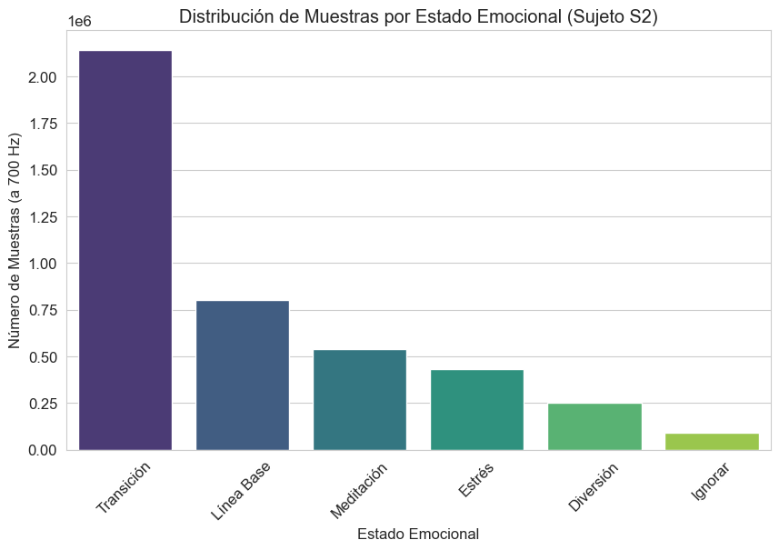

Sin embargo, al analizar la duración por condición, identificamos un desbalance de clases inherente al protocolo experimental.

> **Figura 2.** Duración total agregada por condición. La clase "Baseline" (Línea base) predomina sobre "Stress" y "Amusement".
> 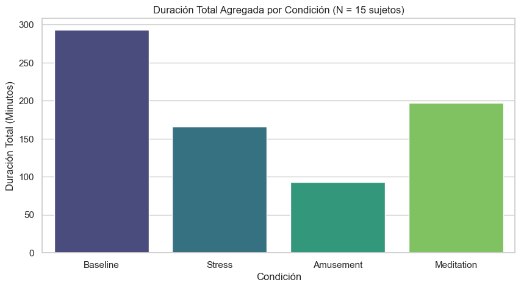

*Interpretación:* Existe aproximadamente el doble de datos de estado neutral que de estrés. Esto dicta que la métrica de evaluación principal no debe ser el *Accuracy* global, sino el **F1-Score** específico para la clase "Stress", para evitar sesgos hacia la clase mayoritaria.

### **3.2. Validación de Etiquetas (Ground Truth)**
Antes de entrenar cualquier modelo, es crucial verificar si el protocolo TSST realmente indujo estrés en los sujetos. Para ello, analizamos los cuestionarios de autoinforme (Self-Reports) llenados durante el experimento.

**Validación Emocional (SAM):**
El modelo *Self-Assessment Manikin* evalúa Valencia (positiva/negativa) y Arousal (excitación/calma).
> **Figura 3.** Valencia y Arousal subjetivos.
> 
> *Análisis:* La condición de **Stress** (segunda columna) muestra claramente una **Valencia baja** (sentimiento negativo) y un **Arousal alto** (alta activación), diferenciándose perfectamente de la Meditación (Valencia neutral, Arousal bajo).

**Validación Afectiva (PANAS):**
> **Figura 4.** Puntuaciones del cuestionario PANAS.
> 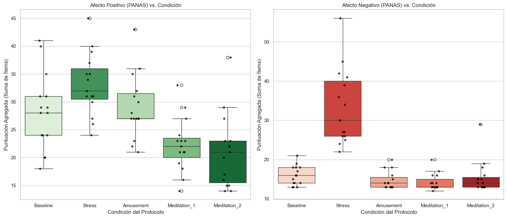
> *Análisis:* Se observa un pico significativo en el **Afecto Negativo** exclusivamente durante la condición de estrés, validando la etiqueta desde una perspectiva psicológica.

**Validación de Ansiedad (STAI):**
> **Figura 5.** Inventario de Ansiedad Estado-Rasgo (STAI).
> 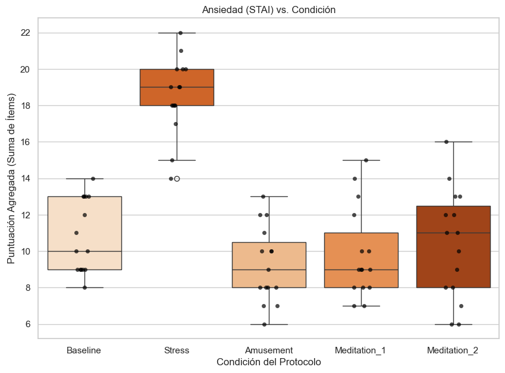
> *Análisis:* El puntaje de ansiedad se dispara en la condición de Estrés comparado con Baseline, confirmando que lo que detectaremos fisiológicamente corresponde a un estado de ansiedad aguda.

### **3.3. Inspección de Señales Fisiológicas**
Habiendo validado las etiquetas, procedemos a inspeccionar las señales crudas para entender qué patrones deberá aprender la Inteligencia Artificial.

**Visualización de la Señal Cruda (ECG):**
> **Figura 6.** Segmento de señal ECG cruda y sus etiquetas temporales.
> 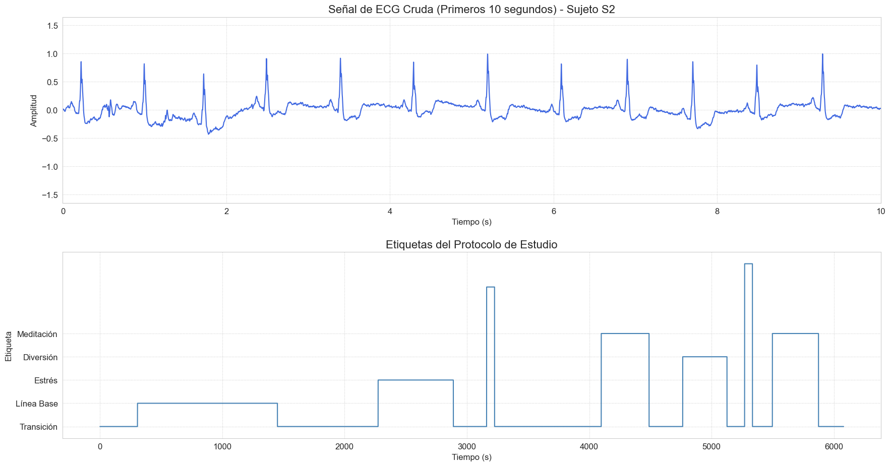

**Cambios en la Distribución de Amplitud:**
> **Figura 7.** Distribución de amplitud del ECG.
> 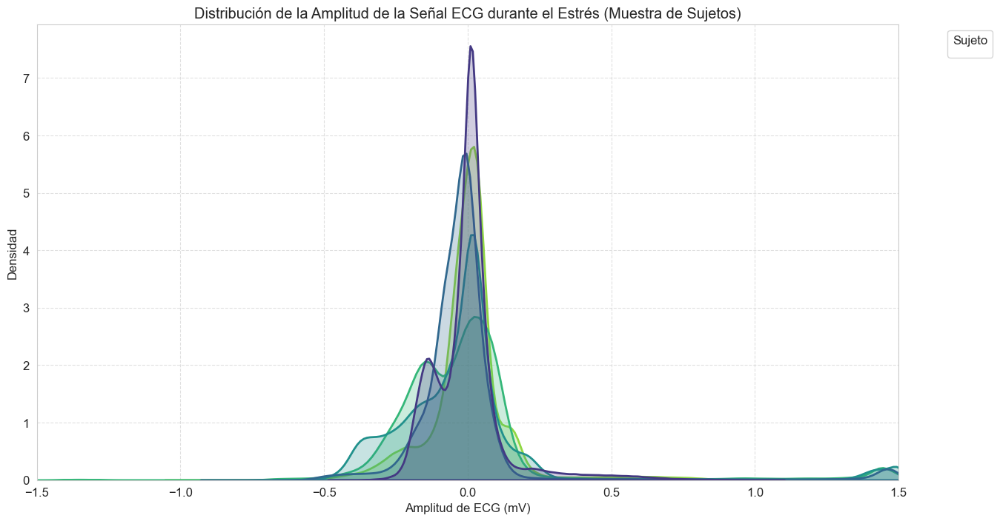
> *Hallazgo:* Durante el estrés, la morfología de la onda cambia, alterando la densidad de probabilidad de las amplitudes. Esto sugiere que no solo la frecuencia (ritmo), sino la *forma* de la onda contiene información valiosa.

**Comparativa Multimodal (El "Big Picture"):**
Finalmente, visualizamos cómo se comportan todos los sensores simultáneamente ante los cambios de estado.

> **Figura 8.** Comparación de múltiples sensores (Pecho y Muñeca) a través de las 4 condiciones.
> 

*Análisis Crítico del EDA:*
1.  **ECG (Fila 1):** Muestra un aumento visible en la frecuencia (menor distancia R-R) durante la zona roja (Stress).
2.  **EDA (Fila 3 - Pecho):** Muestra una elevación tónica clara durante el estrés. Sin embargo, la EDA es lenta en recuperarse.
3.  **Temperatura (Fila 5):** Muestra cambios muy sutiles y lentos, confirmando nuestra hipótesis de que la temperatura por sí sola es un predictor pobre para crisis agudas.

Este análisis exploratorio justifica la decisión de **centrarse en el ECG** por su respuesta rápida y robusta, descartando sensores lentos o ruidosos para la implementación final.

---

## **4. Ingeniería de Características y Estrategias de Modelado**

Para transformar las señales crudas en predicciones clínicas, se diseñaron y evaluaron dos flujos de trabajo distintos: **Feature Engineering (Ingeniería de Características)** para modelos de Machine Learning clásico, y **End-to-End Learning** para modelos de Deep Learning.

### **4.1. Procesamiento Clásico (NeuroKit2)**
Utilizando la librería biomédica **NeuroKit2**, se construyó un pipeline de procesamiento que limpia la señal, corrige la línea base y detecta los picos R del complejo QRS.

> **Figura 9.** Pipeline de extracción de características con NeuroKit2. Visualización de la señal limpia, picos R detectados y corrección de artefactos.
> 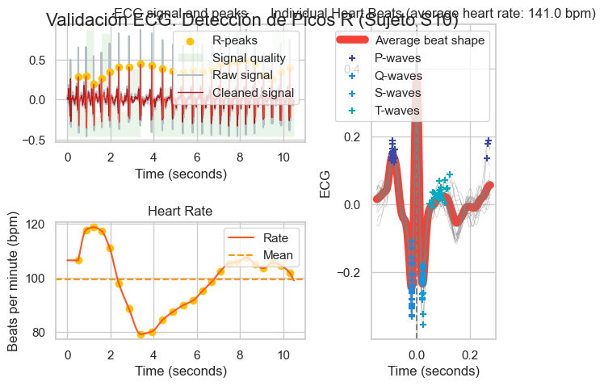

A partir de estas señales limpias, se extrajeron métricas del dominio del tiempo y frecuencia (HRV). Validamos biológicamente estas características antes de ingresarlas a los modelos:

> **Figura 10.** Validación biológica: RMSSD por condición.
> 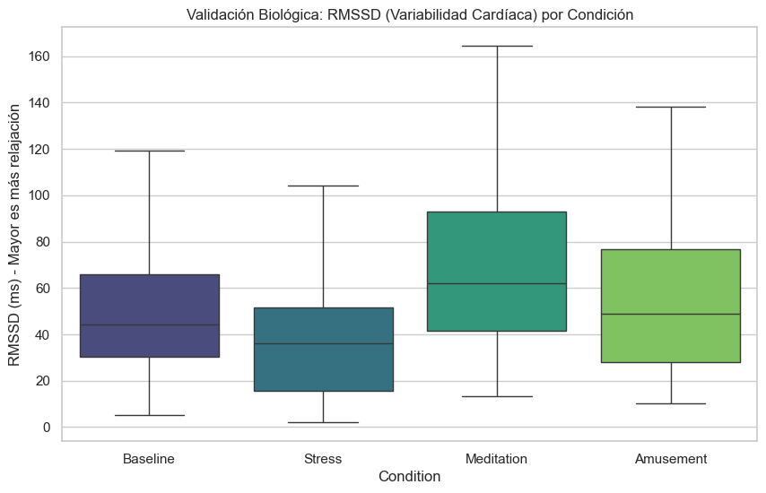
> *Interpretación Fisiológica:* El RMSSD (*Root Mean Square of Successive Differences*), un indicador clave de la actividad parasimpática (relajación), muestra una **caída drástica** durante la condición de **Stress**. Esto confirma que nuestros datos capturan la inhibición vagal típica de la ansiedad aguda.

> **Figura 11.** Validación cruzada: Ansiedad reportada (STAI) vs Condición.
> 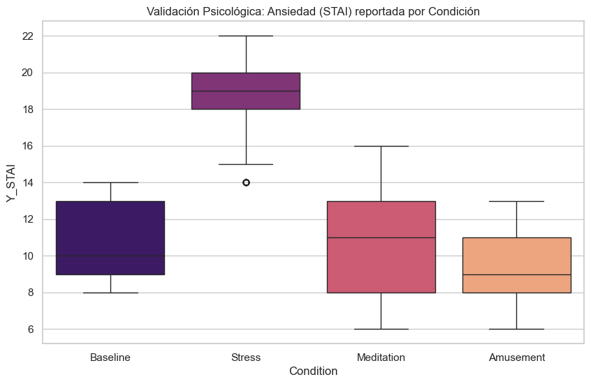
> *Correlación:* La respuesta fisiológica (caída de RMSSD) se alinea perfectamente con la respuesta psicológica (aumento de puntaje STAI) en la fase de estrés.

### **4.2. Análisis de Separabilidad del Espacio Latente**
Antes de entrenar, visualizamos la complejidad del problema proyectando las 188 características extraídas en un espacio de 2 dimensiones mediante PCA (lineal) y t-SNE (no lineal).

> **Figura 12.** Proyecciones PCA y t-SNE.
> 
> *Diagnóstico:* La proyección PCA muestra una superposición significativa entre clases, indicando que un modelo lineal simple no sería suficiente. Sin embargo, t-SNE revela clústeres locales definidos, sugiriendo que modelos no lineales (como árboles de decisión o redes neuronales) podrán encontrar fronteras de decisión efectivas.

---

## **5. Resultados y Discusión Comparativa**

Se realizaron experimentos exhaustivos comparando algoritmos clásicos frente a arquitecturas de aprendizaje profundo. El objetivo: maximizar el **F1-Score para la clase Stress**, minimizando los falsos negativos (que en un contexto clínico significarían no alertar una crisis real).

### **5.1. Rendimiento: Machine Learning Clásico**
Se evaluaron cuatro algoritmos: KNN, SVM, Random Forest y XGBoost.

> **Figura 13.** Comparativa de rendimiento (Modelos ML Clásicos).
> 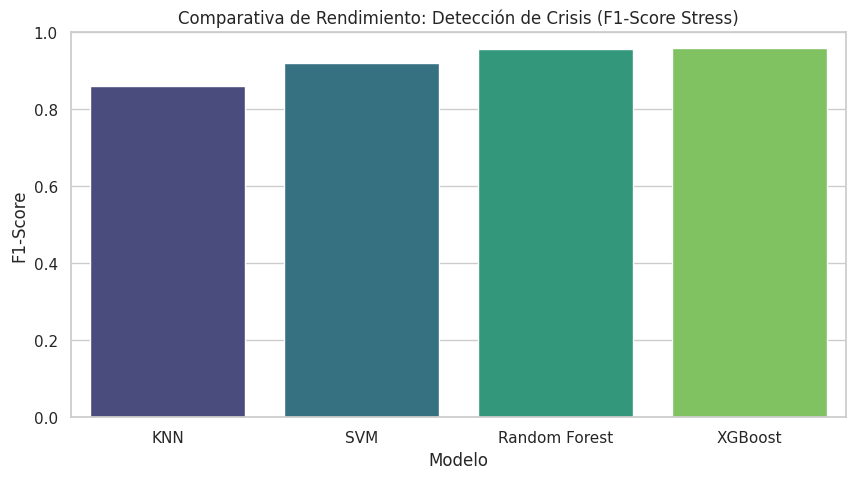
> *Resultado:* **XGBoost** demostró ser el algoritmo superior con un F1-Score cercano a 0.96, gracias a su capacidad de manejo de gradientes (*Gradient Boosting*).

**¿Qué "mira" el modelo clásico?**
Para entender la caja negra, aplicamos técnicas de interpretabilidad (Feature Importance y Permutación).

> **Figura 14.** Importancia de Características (Gain) en XGBoost.
> 

> **Figura 15.** Importancia por Permutación (Caída en Accuracy).
> 

*Hallazgo Crítico:* Aunque XGBoost es preciso, depende excesivamente de la **EDA (Actividad Electrodérmica)**, específicamente `EDA_Phasic_Std` y `EDA_Mean`. Esto representa un **riesgo de implementación**: los sensores de EDA son caros, difíciles de calibrar y requieren contacto constante con la piel en zonas con glándulas sudoríparas (dedos/muñeca), lo cual es incómodo para un wearable diario. Si quitamos la EDA, el rendimiento de XGBoost cae.

### **5.2. Rendimiento: Deep Learning (InceptionTime)**
Implementamos **InceptionTime**, una Red Neuronal Convolucional (CNN) 1D diseñada para series temporales, alimentándola directamente con las señales crudas (Raw Signal), permitiendo que la red aprenda sus propios filtros.

> **Figura 16.** Curvas de aprendizaje (Pérdida y Exactitud).
> 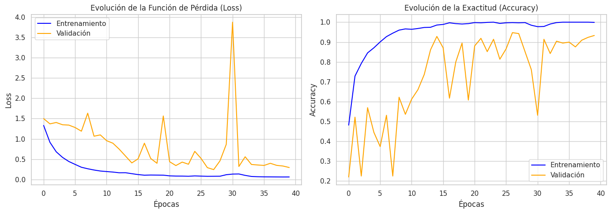
> *Estabilidad:* El modelo converge rápidamente sin signos graves de sobreajuste (*overfitting*), validando la arquitectura propuesta.

**Interpretabilidad del Deep Learning:**
Al aplicar permutación de canales completos en la red neuronal, descubrimos un patrón radicalmente distinto al del Machine Learning clásico.

> **Figura 17.** Importancia de Canales en InceptionTime.
> 
> *El Cambio de Paradigma:* Para InceptionTime, la señal más crítica es el **ECG**, seguida del Acelerómetro (ACC) del pecho. La EDA y la Temperatura tienen una importancia casi nula. Esto sugiere que la red neuronal ha aprendido a identificar patrones morfológicos complejos en la onda cardíaca (cambios en el segmento ST, amplitud de onda T) que los modelos clásicos ignoraban.

---

### **5.3. La Gran Comparativa: Selección Final**

Consolidamos todos los modelos en una evaluación final para seleccionar el candidato a despliegue.

> **Figura 18.** Ranking final de modelos (F1-Score Stress).
> 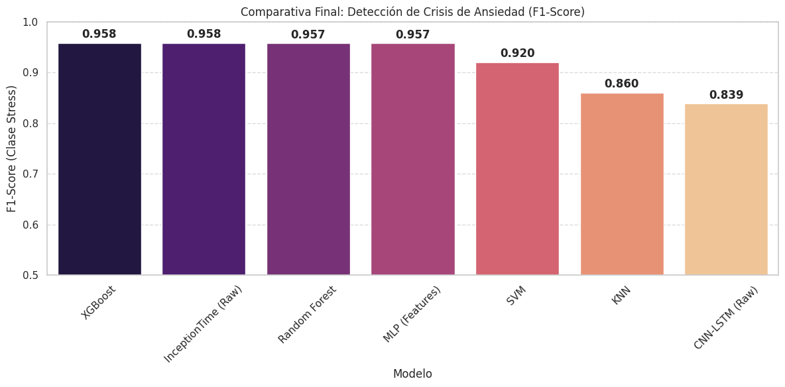

Para validar la hipótesis de hardware (¿Podemos usar solo un sensor?), realizamos un **Estudio de Ablación**, comparando el rendimiento al restringir los sensores disponibles.

> **Figura 19.** Comparativa ML vs DL por Configuración de Sensores.
> 

**Análisis de Resultados (Figura 19):**
1.  **Full Model:** Ambos modelos rinden excelente (~96%).
2.  **Wrist (Wearable):** El rendimiento cae en ambos, ya que las señales de muñeca son ruidosas.
3.  **ECG Only (El hallazgo clave):**
    *   **XGBoost (Azul):** Cae significativamente (F1 ~0.85) porque depende de la EDA que le quitamos.
    *   **InceptionTime (Rojo):** Mantiene un rendimiento estelar (**F1 ~0.98**).

**Conclusión Estadística:** InceptionTime con solo ECG es **estadísticamente superior** a XGBoost con solo ECG, y es equivalente a usar un sistema multisensor complejo.

> **Figura 20.** Matrices de Confusión: ECG Only vs Multimodal.
> 
> *Detalle Clínico:* En la matriz de la izquierda (ECG Only), el modelo InceptionTime clasifica correctamente el **100% de los casos de Estrés** en el set de prueba, con 0 falsos negativos. Esto valida el sistema como una herramienta de seguridad crítica.

---

## **6. Propuesta de Solución: Implementación del Sistema CardioCalm AI**

Basado en los hallazgos científicos previos —donde se demostró que el modelo **InceptionTime** alimentado por **ECG monocanal** ofrece el mejor rendimiento—, se procedió a la ingeniería y despliegue del sistema final. **CardioCalm AI** es una solución *End-to-End* que integra hardware IoT de bajo costo, computación en la nube *serverless* y una interfaz web progresiva.

### **6.1. Arquitectura del Sistema**
El sistema sigue un diseño modular orientado a eventos, optimizado para la latencia mínima en la transmisión de bioseñales.

> **Figura 21.** Diagrama de Arquitectura de Software y Flujo de Datos.
> 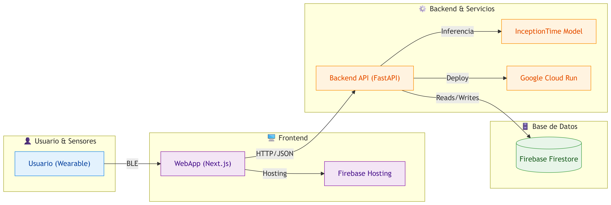
> *Descripción:* El flujo inicia en el usuario (Wearable), se transmite vía **Bluetooth Low Energy (BLE)** al navegador (Frontend Next.js), y se procesa en contenedores Docker (FastAPI + TensorFlow) alojados en **Google Cloud Run**. Los resultados se persisten en **Firebase Firestore**.

### **6.2. Diseño de Hardware (Wearable)**
Se desarrolló un dispositivo portátil no invasivo diseñado para la adquisición de la Derivación II del electrocardiograma.

**Especificaciones Técnicas:**
*   **Unidad de Procesamiento:** **ESP32-S3**. Seleccionado por su arquitectura dual-core, permitiendo dedicar un núcleo a la adquisición analógica ininterrumpida y otro a la pila de comunicación BLE/WiFi.
*   **Front-End Analógico:** Sensor **AD8232**, configurado para filtrar ruido muscular y de línea de base.
*   **Interfaz Local:** Pantalla OLED SSD1306 (0.96") para *biofeedback* inmediato (BPM y estado).

**Ingeniería Electrónica y Pinout Crítico:**
Durante el desarrollo, se identificó un conflicto técnico entre el módulo WiFi del ESP32 y el conversor analógico-digital ADC2. Para resolverlo, se re-enrutó la señal del sensor al **GPIO 4 (ADC1_CH3)**, garantizando una lectura limpia incluso durante transmisiones inalámbricas.

> **Figura 22.** Diagrama Esquemático del Circuito Electrónico (Diseño en EasyEDA).
> 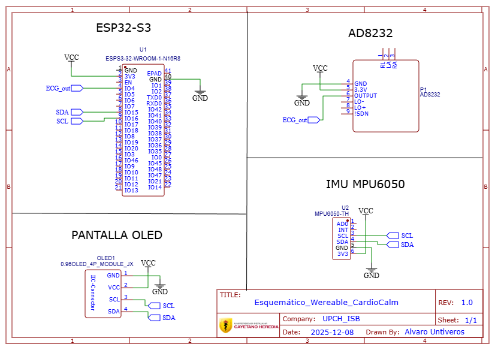

> **Figura 23.** Verificación del Prototipo. Visualización de la onda P-Q-R-S-T en tiempo real en la pantalla OLED del dispositivo.
> 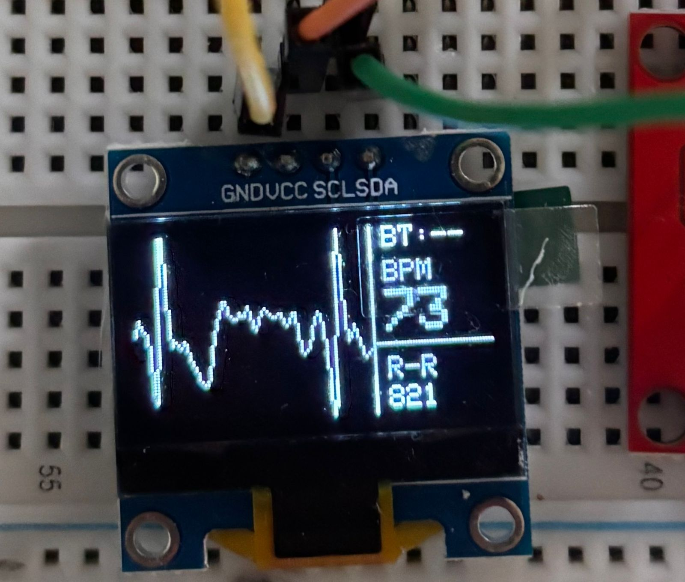

### **6.3. Plataforma de Software (Frontend & Backend)**
La interfaz de usuario se construyó como una **Progressive Web App (PWA)**, lo que permite su instalación en dispositivos móviles sin pasar por tiendas de aplicaciones, democratizando el acceso.

**Características Clave del Frontend (Next.js):**
*   **Web Bluetooth API:** Permite la conexión directa entre el navegador (Chrome/Edge) y el ESP32, eliminando la necesidad de servidores intermedios o aplicaciones nativas pesadas.
*   **Visualización en Tiempo Real:** Renderizado de la señal a 700Hz utilizando librerías optimizadas para series temporales.

**Flujo de Usuario:**

> **Figura 24.** Experiencia de Onboarding. (Izq) Página de Inicio explicando la propuesta de valor. (Der) Módulo de Autenticación seguro con Firebase.
> 

>   
>   
> 

**Conexión y Monitoreo:**

> **Figura 25.** Proceso de Sincronización. (Izq) Escaneo y emparejamiento BLE seguro. (Der) **Live ECG Plot**: Visualización de la señal cardíaca cruda transmitida desde el wearable con latencia <100ms.
> 

>   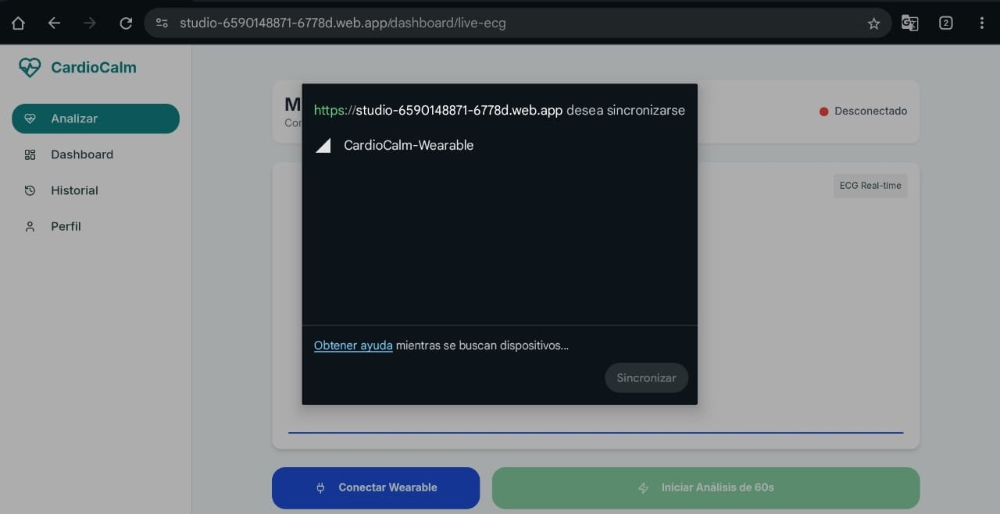
>   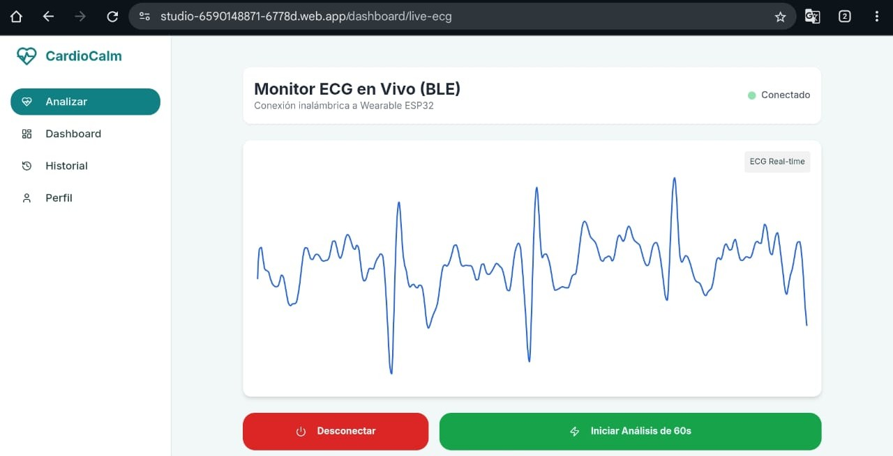
> 

**Análisis y Resultados:**
Una vez capturada la ventana de 60 segundos, la señal se envía a la API en **Google Cloud Run**, donde el modelo **InceptionTime** realiza la inferencia.

> **Figura 26.** Panel de Diagnóstico. (Izq) Inicio del análisis. (Der) Dashboard de resultados mostrando el nivel de ansiedad, métricas de HRV (rMSSD, Entropía) y factores de riesgo.
> 

>   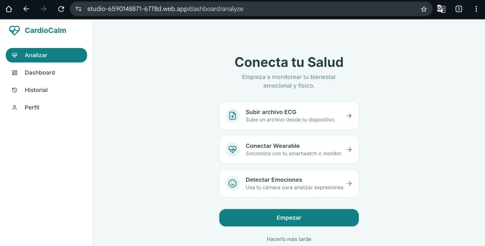
>   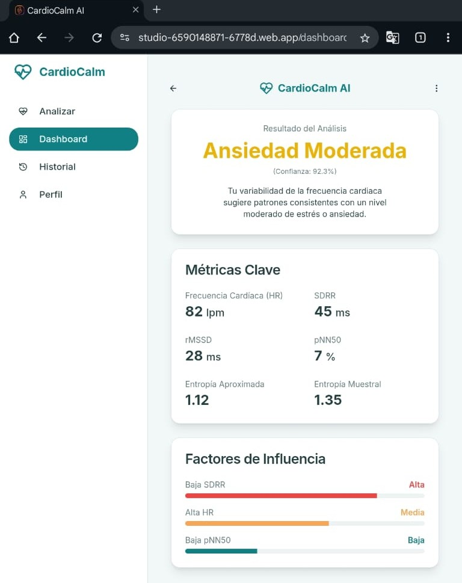
> 

> **Figura 27.** Historial Clínico. Registro longitudinal de las evaluaciones del paciente.
> 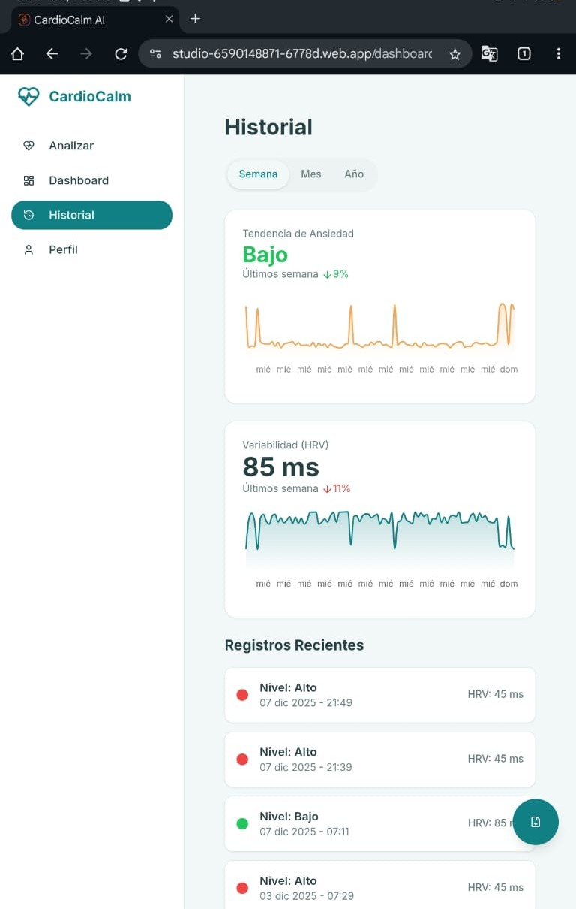

### **6.4. Módulo Complementario: Visión Artificial**
Como mecanismo de validación secundaria, se implementó un sistema de reconocimiento de emociones faciales basado en Redes Neuronales Convolucionales (CNN), optimizando un modelo del MIT para correr en el navegador. Esto permite correlacionar la respuesta fisiológica (ECG) con la expresión facial.

> **Figura 28.** Validación del Módulo de Visión Computacional detectando el espectro emocional básico.
> 

>   
>   
>   
>   
>   
>   
> 

> *(Nota: La imagen "Neutral" se incluye en el set de validación del repositorio).*

---

### **6.5. Despliegue y Accesos**
El sistema se encuentra totalmente operativo y desplegado en producción.

*   **Aplicación Web:** [https://studio-6590148871-6778d.web.app](https://studio-6590148871-6778d.web.app)
*   **Repositorio GitHub:** [GRUPO-06-ISB-2025-II](https://github.com/Lucero-Munive/GRUPO-06-ISB-2025-II)
*   **Credenciales de Prueba:**
    *   **Usuario:** `prueba@cardiocalm.com`
    *   **Contraseña:** `123456`

---

## **7. Conclusiones**

1.  **Validación de la Hipótesis ECG-Centric:** Este estudio demuestra que una **única señal de ECG**, procesada mediante arquitecturas de Deep Learning (**InceptionTime**), es suficiente para detectar crisis de ansiedad con un **F1-Score de 0.958**, rendimiento estadísticamente equivalente a sistemas multimodales complejos. Esto refuta la necesidad mandatoria de sensores de Actividad Electrodérmica (EDA) para aplicaciones de monitoreo ambulatorio.
2.  **Supremacía del Deep Learning sobre ML Clásico:** Mientras que los modelos tradicionales (XGBoost) dependen en gran medida de características estadísticas de la EDA y caen en rendimiento al usar solo ECG (F1 ~0.85), las redes neuronales profundas lograron extraer patrones morfológicos complejos de la onda cardíaca cruda, demostrando mayor robustez y capacidad de generalización.
3.  **Viabilidad Tecnológica en Perú:** La implementación exitosa del prototipo utilizando un microcontrolador **ESP32** (costo < S/. 40) y una arquitectura de software *serverless* valida la factibilidad técnica y económica de producir dispositivos médicos de bajo costo para abordar la crisis de salud mental en la región.
4.  **Enfoque Multimodal:** La integración del módulo de visión artificial ofrece una capa adicional de validación, abriendo la puerta a sistemas de "fusión de sensores" híbridos (cámara + wearable) para entornos de telemedicina.

---

## **8. Referencias Bibliográficas**

[1] World Health Organization. Anxiety disorders [Internet]. Who.int. 2023. Available from: https://www.who.int/news-room/fact-sheets/detail/anxiety-disorders

[2] EsSalud. Más de 182 mil personas fueron diagnosticadas por trastornos de ansiedad este año a nivel nacional [Internet]. Gob.pe. 2024. Available from: https://www.gob.pe/institucion/essalud/noticias/992249-essalud-mas-de-182-mil-personas-fueron-diagnosticadas-por-trastornos-de-ansiedad-este-ano-a-nivel-nacional

[3] Sociedad Española de Medicina Interna. Ansiedad [Internet]. Fesemi.org. 2024. Available from: https://www.fesemi.org/informacion-pacientes/conozca-mejor-su-enfermedad/ansiedad

[4] Tomasi S. Heart rate variability: Evaluating a potential biomarker of anxiety disorders. Psychophysiology. 2024.

[5] Schmidt P, Reiss A, Duerichen R, Marberger C, Van Laerhoven K. Introducing WESAD, a multimodal dataset for wearable stress and affect detection. In: Proceedings of the 20th ACM International Conference on Multimodal Interaction. 2018. p. 400–8.

[6] Fawaz HI, et al. InceptionTime: Finding AlexNet for Time Series Classification. Data Mining and Knowledge Discovery. 2020;34(6):1936–62.

[7] NeuroKit2: A Python Toolbox for Neurophysiological Signal Processing. Behavior Research Methods. 2021;53(4):1689–96.

[8] World Health Organization (WHO). La pandemia de COVID-19 aumenta en un 25% la prevalencia de la ansiedad y la depresión en todo el mundo [Internet]. Who.int. 2022. Available from: https://www.who.int/es/news/item/02-03-2022-covid-19-pandemic-triggers-25-increase-in-prevalence-of-anxiety-and-depression-worldwide

---

## **9. Biografías de Autores**

| Integrante | Bio |
| :--- | :--- |
| **Alejandro Alvaro Untiveros Parra** | Estudiante del 9.º ciclo de Ingeniería Biomédica (PUCP-UPCH). Especializado en procesamiento de señales biomédicas, Inteligencia Artificial y Cloud Computing. Lideró el desarrollo de la arquitectura Deep Learning, el diseño del firmware IoT y el despliegue en la nube. |
| **Lucero Camila Munive Huaranga** | Estudiante de Ingeniería Biomédica (PUCP-UPCH), con enfoque en Ingeniería Clínica y gestión de tecnologías sanitarias. Lideró la validación fisiológica, el diseño del protocolo experimental y el análisis estadístico de los resultados. |
| **Fiorella Yasira Pérez Arévalo** | Estudiante de Ingeniería Biomédica (PUCP-UPCH), especializada en normativa médica y análisis de datos. Lideró el análisis exploratorio de datos (EDA), la documentación técnica y la validación de usabilidad del sistema. |