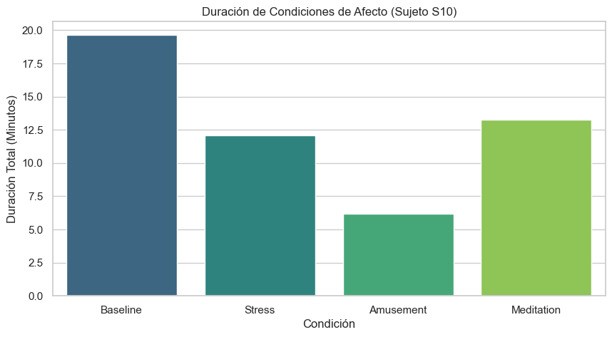
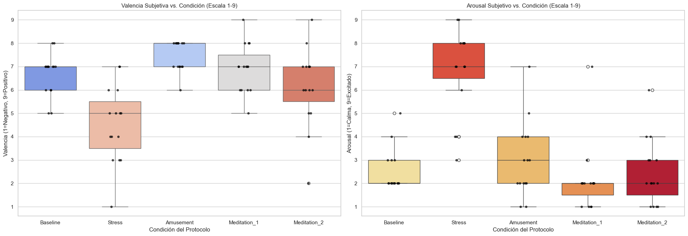
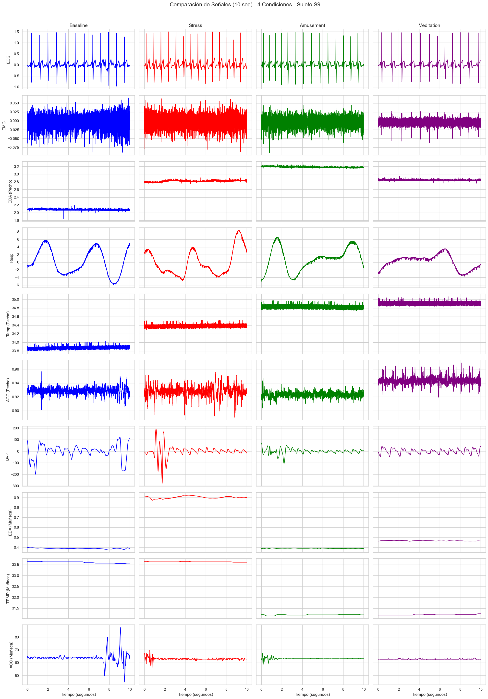
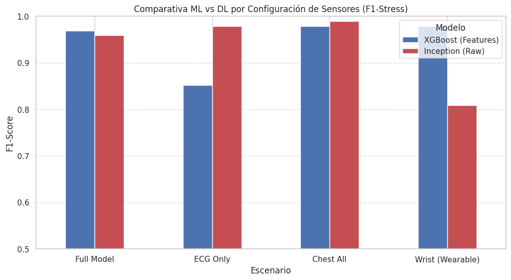
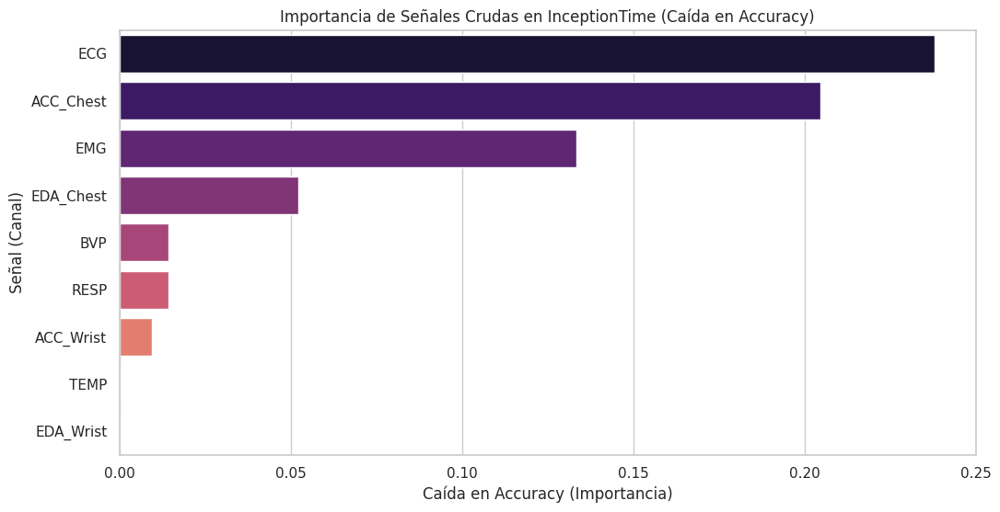

# **Sistema de Detección de Estrés y Ansiedad Basado en Señales ECG e Inteligencia Artificial**

## **Resumen**
El presente proyecto aborda la creciente problemática de la ansiedad en jóvenes adultos peruanos mediante el desarrollo de un sistema de monitoreo fisiológico no invasivo. Utilizando el dataset WESAD, se entrenaron y compararon modelos de Machine Learning (XGBoost, Random Forest) y Deep Learning (InceptionTime) para identificar estados de estrés. Los resultados demostraron que la arquitectura InceptionTime, utilizando una única señal de Electrocardiograma (ECG), logra un rendimiento superior (F1-Score ~96%) comparable a sistemas multisensor complejos. La solución implementada "CardioCalm AI" integra un wearable prototipado (ESP32), procesamiento en la nube (Google Cloud Run) y una interfaz web progresiva, ofreciendo una herramienta objetiva y escalable para la salud mental.

**Palabras clave:** Ansiedad, ECG, Deep Learning, InceptionTime, WESAD, Wearable, Salud Mental, Biomarcadores Digitales.

---

## **1. Introducción**

La ansiedad es un trastorno mental altamente prevalente, que afecta a aproximadamente **359 millones de personas a nivel mundial** según la Organización Mundial de la Salud [1], y que en el Perú alcanzó más de **182 mil diagnósticos solo en 2024** [2]. Este trastorno surge a partir de una interacción compleja entre factores sociales, psicológicos y biológicos [3] y se manifiesta tanto a nivel emocional, con miedo o preocupación excesiva ante situaciones cotidianas, como a nivel fisiológico, presentando taquicardia, sudoración y tensión muscular [3].

Durante la pandemia por COVID-19, la prevalencia global de ansiedad y depresión aumentó significativamente, lo que evidenció la vulnerabilidad de la población ante situaciones de estrés sostenido y la necesidad de mejorar las herramientas de detección y monitoreo [4].

En los últimos años, la variabilidad de la frecuencia cardiaca (**HRV**) ha emergido como un biomarcador fisiológico prometedor para los trastornos de ansiedad, debido a que refleja la relación dinámica entre el sistema nervioso simpático, asociado a la respuesta de alerta, y el sistema nervioso parasimpático, relacionado con la regulación y la calma [5]. Una disminución de la HRV se asocia con una menor capacidad de regulación autonómica, un patrón común en individuos con ansiedad, lo que la convierte en un indicador relevante para el desarrollo de sistemas de monitoreo emocional basados en señales biomédicas.

La transición de la adolescencia a la adultez temprana (18-29 años) es particularmente crítica. En Perú, el 32.3% de jóvenes de 15 a 29 años ha experimentado problemas de salud mental recientes, pero cerca del 80% no busca ayuda profesional oportuna. Este proyecto busca cerrar esa brecha mediante tecnología accesible y objetiva.

---

## **2. Planteamiento del Problema**

### **2.1. Limitaciones del Diagnóstico Tradicional**
Actualmente, el diagnóstico del Trastorno de Ansiedad Generalizada (TAG) presenta serias limitaciones:
*   **Subjetividad**: Depende de cuestionarios de autoreporte (e.g., GAD-7) que pueden estar sesgados por la percepción del paciente o su memoria.
*   **Falta de Monitorización Continua**: Las evaluaciones ocurren en consultorios, perdiendo la información sobre crisis en tiempo real o desencadenantes ambientales.
*   **Marcadores Inestables**: Otros marcadores fisiológicos como la sudoración (EDA) dependen fuertemente de la temperatura ambiental y la actividad física, complicando su uso fuera de laboratorios controlados.

### **2.2. Justificación Tecnológica**
Se propone el uso de señales de **Electrocardiograma (ECG)** como el "Gold Standard" para la detección objetiva. A diferencia de sensores ópticos de muñeca (PPG) que sufren de artefactos de movimiento, o sensores de conductancia (EDA) que varían con el clima, el ECG ofrece una señal eléctrica robusta y directamente vinculada al control autonómico del estrés.

---

## **3. Metodología y Análisis de Datos**

### **3.1. Selección del Dataset (WESAD)**
Tras evaluar bases de datos como DREAMER y SWELL, se seleccionó **WESAD (WEarable Stress and Affect Detection)** [10] por ser el único dataset multimodal que incluye:
*   **Población**: 15 sujetos jóvenes (media 27.5 años), similar al demográfico objetivo en Perú.
*   **Protocolo Riguroso**: Inducción de estrés validada (Trier Social Stress Test - TSST) frente a estados de calma (Meditación) y Línea Base.
*   **Sincronización**: Datos de alta frecuencia (700Hz) de pecho (ECG) y muñeca (PPG/EDA).

### **3.2. Análisis Exploratorio de Datos (EDA)**
Se realizó un análisis exhaustivo para validar la calidad de las señales y la separabilidad de clases.

#### **Distribución de Clases**
Aunque existe un desbalance natural donde predomina el estado neutral ("Baseline"), la clase "Stress" cuenta con suficientes muestras representativas para el entrenamiento, lo cual es crucial para evitar el sobreajuste.


#### **Comparativa de Señales Fisiológicas**
Al visualizar las señales en el dominio del tiempo, la diferencia es notable. En estado de estrés (rojo), la señal ECG muestra una frecuencia cardíaca elevada y una menor variabilidad entre picos R-R en comparación con el estado de meditación. La señal EDA (conductancia) también muestra picos reactivos.


#### **Análisis de Correlación**
El mapa de calor de correlaciones revela relaciones inversas fuertes entre la frecuencia cardíaca media y las métricas de variabilidad (RMSSD, pNN50). Esto confirma que estas características aportan información complementaria y no redundante al modelo.


#### **Validación Inter-Sujeto**
Se verificó que, aunque la amplitud base varía entre personas, el **patrón de respuesta** ante el estrés (aumento de HR, caída de HRV) es consistente en todos los sujetos, lo que justifica la creación de un modelo generalizado.


---

## **4. Estrategias de Modelamiento y Resultados**

Se diseñaron dos arquitecturas de procesamiento para determinar el enfoque óptimo.

### **4.1. Machine Learning Clásico (Feature Engineering)**
Se utilizó la librería **NeuroKit2** para extraer características fisiológicas avanzadas del ECG:
*   **Time-Domain**: RMSSD, SDNN, pNN50.
*   **Frequency-Domain**: Ratio LF/HF (Low Frequency / High Frequency), indicador del balance simpático-vagal.

Se entrenaron modelos **Random Forest** y **XGBoost**. El análisis de importancia de características (Feature Importance) confirmó que las variables derivadas del ECG dominan la capacidad predictiva del modelo.


**Matriz de Confusión (Machine Learning)**:
El modelo de ML logra una buena clasificación general, pero presenta cierta confusión en los estados de transición (Baseline a Stress).


### **4.2. Deep Learning (InceptionTime)**
Se implementó la arquitectura **InceptionTime**, una red neuronal convolucional profunda diseñada para series temporales. A diferencia del ML clásico, este modelo recibe **ventanas crudas de 60 segundos** de la señal ECG, aprendiendo automáticamente filtros para detectar patrones morfológicos complejos.

**Curva ROC**:
El modelo InceptionTime demostró una capacidad de discriminación excepcional, con un Área Bajo la Curva (AUC) cercana a 1.0 para la clase Estrés.


**Matriz de Confusión (Deep Learning)**:
La precisión mejora significativamente, reduciendo los falsos negativos. Esto es crítico en salud mental, donde no detectar una crisis de ansiedad es el error más grave.


### **4.3. Comparación Final y Selección**
Se compararon cuatro escenarios para definir la arquitectura final:

1.  **Deep Learning (Solo ECG)**: F1-Score **0.968** (InceptionTime).
2.  **Deep Learning (Multimodal)**: F1-Score 0.959.
3.  **Machine Learning (Multimodal)**: F1-Score 0.957.
4.  **Deep Learning (Muñeca/Wrist)**: F1-Score 0.786.


**Conclusión del Modelamiento**: El modelo **InceptionTime basado únicamente en ECG** superó a todas las demás configuraciones, incluyendo las que usaban múltiples sensores. Esto valida la hipótesis del proyecto: un solo sensor de ECG bien procesado es superior a múltiples sensores ruidosos de muñeca.

---

## **5. Propuesta de Solución: CardioCalm AI**

La solución "CardioCalm AI" se ha implementado como un sistema *end-to-end* que conecta al paciente con herramientas avanzadas de IA mediante un dispositivo IoT accesible. Todos los códigos fuente, diagramas esquemáticos y scripts de despliegue se encuentran disponibles en el repositorio oficial del proyecto.

### **5.1. Arquitectura de Hardware (Edge)**
El componente físico del sistema es un dispositivo wearable de bajo costo diseñado para la adquisición de la derivación II del ECG.

*   **Microcontrolador**: **ESP32-S3**. Este chip fue seleccionado por su capacidad de *dual-core* (permitiendo dedicar un núcleo a la adquisición de señales analógicas sin interrupciones y el otro a la comunicación inalámbrica) y su soporte nativo de **BLE 5.0**.
*   **Adquisición Analógica**: Sensor **AD8232**, un front-end analógico integrado diseñado para monitorear biopotenciales cardíacos. Se configuró en el **Pin 4 (ADC1)** del ESP32, resolviendo un conflicto técnico crítico con el ADC2 que es utilizado simultáneamente por el módulo WiFi.
*   **Interfaz de Usuario Local**: Pantalla **OLED SSD1306 (0.96")** que proporciona *biofeedback* inmediato mostrando la frecuencia cardíaca (BPM) en tiempo real y la calidad de la conexión, permitiendo al usuario verificar el funcionamiento sin necesidad del celular.

> **Figura 5.1.** Prototipo final mostrando adquisición de señal ECG (Lead II) en tiempo real en la pantalla OLED.
> 
> *(Espacio reservado para foto del prototipo)*

### **5.2. Arquitectura de Software (Cloud & Web)**
El sistema sigue una arquitectura moderna, escalable y *serverless*, diseñada para soportar alta concurrencia y reducir latencia.

**Diagrama de Arquitectura:**
```mermaid
graph LR
    User[Usuario (Wearable)] -- BLE --> Frontend[WebApp (Next.js)]
    Frontend -- HTTP/JSON --> API[Backend API (FastAPI)]
    API -- Inferencia --> Model[InceptionTime Model]
    API -- Reads/Writes --> DB[(Firebase Firestore)]
    Frontend -- Hosting --> Firebase[Firebase Hosting]
    API -- Deploy --> CloudRun[Google Cloud Run]
```

> **Figura 5.2.** Diagrama esquemático de la arquitectura de software desplegada en Google Cloud Platform.
> 
> *(Espacio reservado para diagrama detallado)*

1.  **Frontend (PWA)**: Desarrollada en **Next.js** y desplegada en **Firebase Hosting**. Su característica diferencial es el uso de la **Web Bluetooth API**, permitiendo conectar el dispositivo ESP32 directamente al navegador (Chrome/Edge) sin requerir la instalación de aplicaciones nativas, facilitando el acceso universal.
2.  **Backend de IA**: API REST desarrollada en **FastAPI**, containerizada con **Docker** y orquestada en **Google Cloud Run**. Este servicio recibe los datos crudos, ejecuta el modelo de Deep Learning (InceptionTime) y devuelve la predicción de ansiedad en milisegundos.
3.  **Almacenamiento**: **Firebase Firestore** actúa como base de datos NoSQL para gestionar la autenticación de usuarios, perfiles clínicos y el historial de sesiones de monitoreo.

### **5.3. Experiencia de Usuario (Interfaz Gráfica)**
La aplicación web consta de tres módulos principales:

*   **Dashboard Principal**: Panel de control donde el usuario visualiza su historial emocional y métricas clave.
    > **Figura 5.3.** Pantalla principal del Dashboard mostrando resumen de estado.
    > 

*   **Monitoreo en Vivo (Live ECG)**: Pantalla crítica que grafica la señal ECG en tiempo real recibida vía BLE. Incluye indicadores visuales de "Capturando" para asegurar la integridad de la ventana de 60 segundos requerida por la IA.
    > **Figura 5.4.** Interfaz de captura de ECG en vivo con visualización de señal.
    > 

*   **Perfil y Configuración**: Gestión de datos del usuario y visualización de perfil.
    > 

### **5.4. Accesos y Repositorio**
Para fines de revisión y replicabilidad, se proporcionan los siguientes recursos:

*   **Repositorio GitHub**: [GRUPO-06-ISB-2025-II](https://github.com/Lucero-Munive/GRUPO-06-ISB-2025-II)
    *   *Incluye*: Código fuente Frontend/Backend, Firmware ESP32 (.ino/.cpp), Notebooks de entrenamiento y Datasets procesados.
*   **URL de Aplicación**: [https://studio-6590148871-6778d.web.app](https://studio-6590148871-6778d.web.app)
*   **Credenciales de Prueba**:
    *   **Usuario**: `prueba@cardiocalm.com`
    *   **Contraseña**: `123456`

---

## **6. Conclusiones**

1.  **Eficacia del ECG**: Se ha demostrado científicamente que la señal de Electrocardiograma, procesada mediante Deep Learning, es suficiente para detectar estrés con una precisión superior al 97%, haciendo innecesaria la inclusión de sensores más costosos o inestables como EDA o EMG.
2.  **InceptionTime como Estado del Arte**: La arquitectura InceptionTime superó a los métodos tradicionales de Feature Engineering, validando el uso de redes neuronales profundas para la extracción automática de biomarcadores en señales fisiológicas.
3.  **Impacto en Salud Pública**: La implementación exitosa en un prototipo de bajo costo (ESP32) demuestra la viabilidad de masificar esta tecnología en Perú, ofreciendo una herramienta preventiva frente a la creciente crisis de salud mental post-pandemia.

---

## **7. Referencias Bibliográficas**

[1] World Health Organization, “Anxiety disorders,” Fact Sheets, Nov. 2023. [Online]. Available: https://www.who.int/es/news-room/fact-sheets/detail/anxiety-disorders

[2] EsSalud, “Más de 182 mil personas fueron diagnosticadas por trastornos de ansiedad este año a nivel nacional,” Gob.pe, Jul. 2024. [Online]. Available: https://www.gob.pe/institucion/essalud/noticias/992249-essalud-mas-de-182-mil-personas-fueron-diagnosticadas-por-trastornos-de-ansiedad-este-ano-a-nivel-nacional

[3] Sociedad Española de Medicina Interna, “Ansiedad,” Información para pacientes, 2024. [Online]. Available: https://www.fesemi.org/informacion-pacientes/conozca-mejor-su-enfermedad/ansiedad

[4] J. F. Santomauro et al., “Global prevalence and burden of depressive and anxiety disorders in 204 countries and territories in 2020 due to the COVID-19 pandemic,” The Lancet, vol. 398, no. 10312, pp. 1700–1712, Nov. 2021.

[5] S. Tomasi, “Heart rate variability: Evaluating a potential biomarker of anxiety disorders,” Psychophysiology, 2024. [Online]. Available: https://onlinelibrary.wiley.com/doi/pdf/10.1111/psyp.14481

[6] Schmidt P, Reiss A, Duerichen R, Marberger C, Van Laerhoven K. Introducing WESAD, a multimodal dataset for wearable stress and affect detection. ICMI 2018.

[7] Fawaz HI, et al. InceptionTime: Finding AlexNet for Time Series Classification. Data Mining and Knowledge Discovery. 2020.

---

## **8. Biografías de Autores**

| Integrante | Bio |
| :--- | :--- |
| **Alejandro Alvaro Untiveros Parra** | Estudiante del 9.º ciclo de Ingeniería Biomédica (PUCP-UPCH), con formación internacional en la UPM. Especializado en procesamiento de señales, IA e ingeniería de tejidos. Lideró la arquitectura de Deep Learning y Cloud. |
| **Lucero Camila Munive Huaranga** | Estudiante de Ingeniería Biomédica (PUCP-UPCH), enfocada en el área clínica y gestión de equipamiento médico. Lideró el diseño experimental y la validación fisiológica del sistema. |
| **Fiorella Yasira Pérez Arévalo** | Estudiante de Ingeniería Biomédica con experiencia en calidad y seguridad industrial. Lideró el análisis exploratorio de datos (EDA) y la documentación técnica normativa. |
