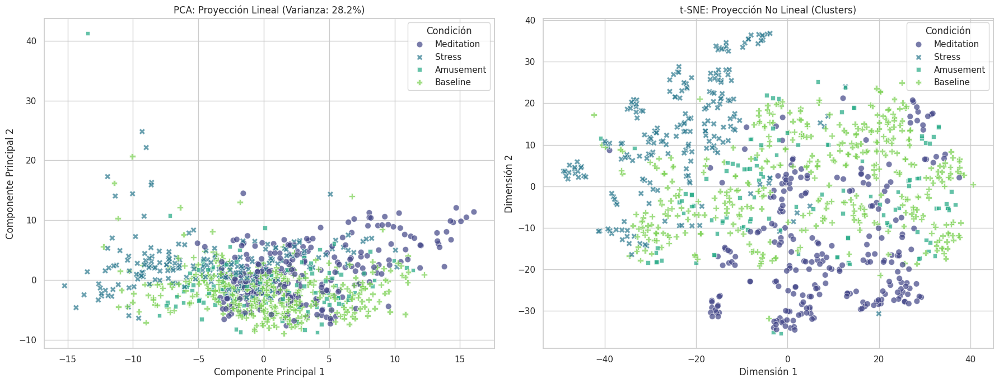
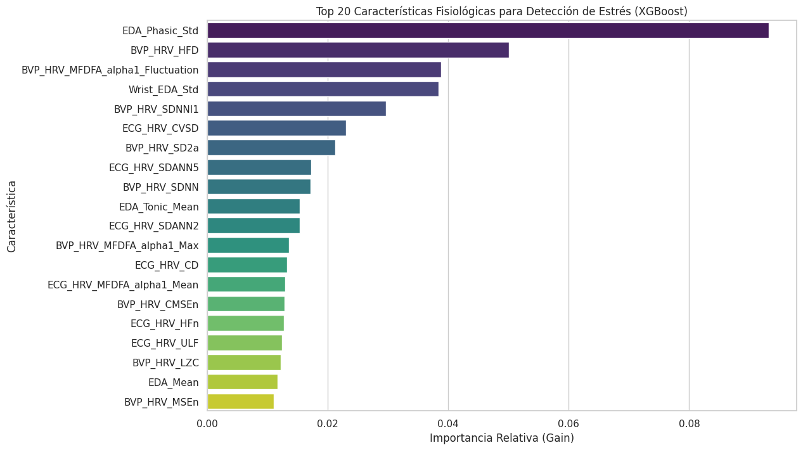
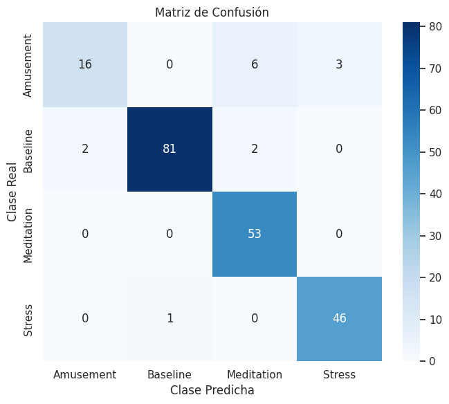
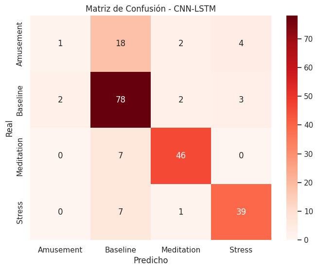
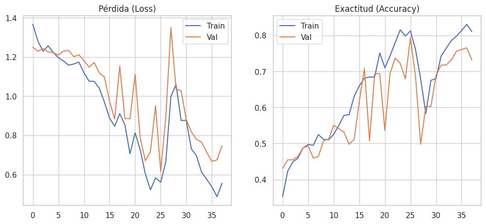
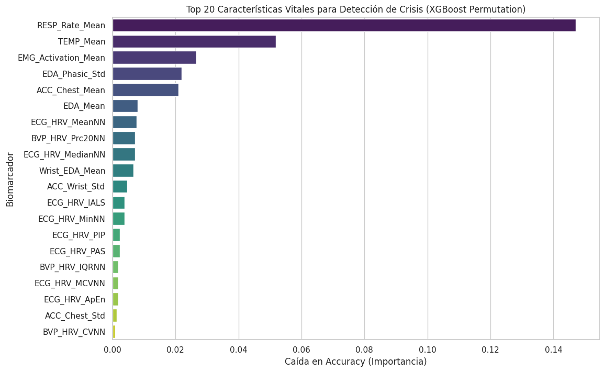
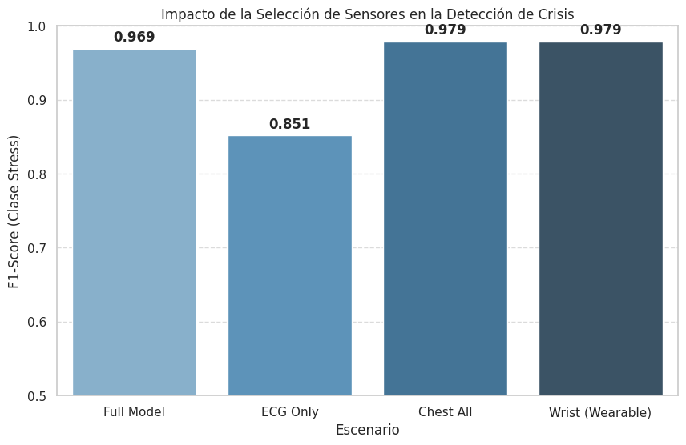
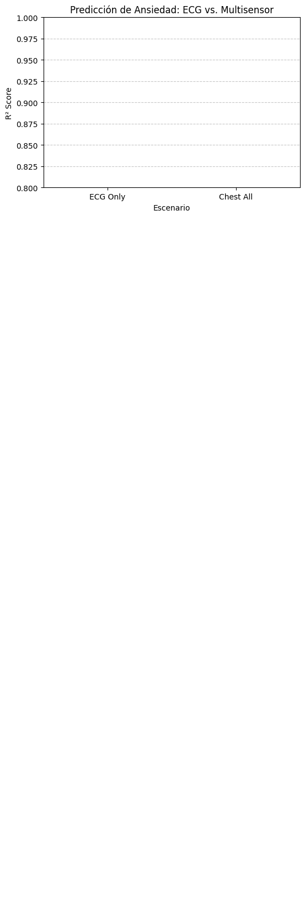
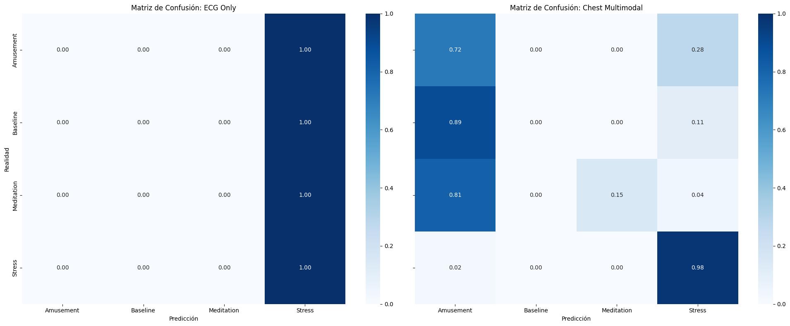
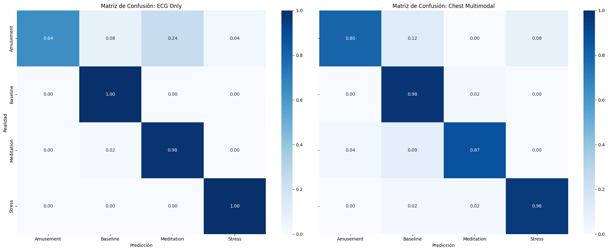

# Evaluación de Modelos WESAD: ML Clásico vs. Deep Learning

Este notebook implementa la evaluación comparativa de modelos para la detección de estrés (Crisis) utilizando el dataset WESAD procesado.

**Objetivos:**
1.  Analizar la separabilidad de la clase "Stress" mediante técnicas no supervisadas (PCA).
2.  Comparar rendimiento de ML Clásico (Features) vs. Deep Learning (Señales Crudas).
3.  Optimizar métricas clínicas (Sensitivity/F1-Score) para la detección de crisis.

**Configuración:**
*   **Entorno:** Google Colab (GPU T4 recomendada).
*   **Datos:** `wesad_features_all.parquet` y `wesad_signals_dl.pkl`.


```python
!pip install -q neurokit2
!pip install -q xgboost
!pip install -q pyarrow
```

    [?25l   ━━━━━━━━━━━━━━━━━━━━━━━━━━━━━━━━━━━━━━━━ 0.0/708.4 kB ? eta -:--:--
   ━━━━━━━━━━━━━━━━━━━━━━━━━━━━━━━━━━━━━━━╸ 706.6/708.4 kB 28.9 MB/s eta 0:00:01
   ━━━━━━━━━━━━━━━━━━━━━━━━━━━━━━━━━━━━━━━━ 708.4/708.4 kB 19.4 MB/s eta 0:00:00
    [?25h


```python
import os
import sys
import numpy as np
import pandas as pd
import matplotlib.pyplot as plt
import seaborn as sns
import tensorflow as tf
from google.colab import drive

# 1. Montar Google Drive
drive.mount('/content/drive')

# 2. Configuración de Rutas (Según tus indicaciones)
BASE_PATH = '/content/drive/MyDrive/2025-2/ISB/Feature_extraction/'
DATA_PATH = BASE_PATH
MODELS_PATH = os.path.join(BASE_PATH, 'models/')

# Crear directorio de modelos si no existe
if not os.path.exists(MODELS_PATH):
    os.makedirs(MODELS_PATH)

# Configuración Visual
sns.set(style="whitegrid")
plt.rcParams['figure.figsize'] = (10, 6)

print(f"Entorno Configurado.")
print(f"Ruta de Datos: {DATA_PATH}")
print(f"Ruta de Modelos: {MODELS_PATH}")
print(f"GPU Disponible: {len(tf.config.list_physical_devices('GPU')) > 0}")
```

    Drive already mounted at /content/drive; to attempt to forcibly remount, call drive.mount("/content/drive", force_remount=True).
    Entorno Configurado.
    Ruta de Datos: /content/drive/MyDrive/2025-2/ISB/Feature_extraction/
    Ruta de Modelos: /content/drive/MyDrive/2025-2/ISB/Feature_extraction/models/
    GPU Disponible: True
    

## 1. Carga y Preprocesamiento de Datos

En esta etapa se cargan los dos conjuntos de datos generados previamente:
1.  **Datos Tabulares (ML):** Se cargan desde formato Parquet. Se separan las columnas de metadatos (Sujeto, Etiquetas subjetivas) de las características fisiológicas. Se aplica una limpieza rigurosa convirtiendo valores infinitos a nulos, eliminando columnas vacías y aplicando imputación por mediana. Finalmente, se estandarizan las características ($z = (x - \mu) / \sigma$).
2.  **Señales Crudas (DL):** Se cargan desde formato Pickle. Se transforman de una lista de diccionarios a un tensor NumPy tridimensional de forma `(Muestras, Pasos de Tiempo, Canales)`.

El objetivo es obtener matrices `X` limpias y alineadas para ambos enfoques.


```python
import pickle
from sklearn.preprocessing import LabelEncoder, StandardScaler
from sklearn.impute import SimpleImputer

# --- 1. Procesamiento de Datos Tabulares (ML) ---
print("[INFO] Cargando dataset de características (ML)...")
parquet_path = os.path.join(DATA_PATH, 'wesad_features_all.parquet')
df_features = pd.read_parquet(parquet_path)

# Definir columnas de metadatos a excluir de la matriz de características
meta_cols = ['Subject', 'Condition', 'Label', 'Y_Valence', 'Y_Arousal', 'Y_STAI',
             'Y_PANAS_Pos', 'Y_PANAS_Neg', 'Y_SSSQ_Motiv']
feature_cols = [c for c in df_features.columns if c not in meta_cols]

# Separar X (Features) e y (Target)
X_raw_ml = df_features[feature_cols].values
y_labels = df_features['Condition'].values

# Limpieza de valores Infinitos y Nulos
print("[INFO] Iniciando limpieza e imputación...")
# Convertir infinitos a NaN
X_raw_ml = np.where(np.isinf(X_raw_ml), np.nan, X_raw_ml)

# Eliminar columnas que son completamente NaN (si existen)
non_nan_cols = ~np.isnan(X_raw_ml).all(axis=0)
X_filtered = X_raw_ml[:, non_nan_cols]
print(f"Columnas eliminadas por ser totalmente nulas: {X_raw_ml.shape[1] - X_filtered.shape[1]}")

# Imputación de valores restantes (Estrategia: Mediana)
imputer = SimpleImputer(strategy='median')
X_imputed = imputer.fit_transform(X_filtered)

# Escalado de datos
scaler = StandardScaler()
X_ml = scaler.fit_transform(X_imputed)

# Codificación de etiquetas (String -> Entero)
le = LabelEncoder()
y_enc = le.fit_transform(y_labels)
classes = le.classes_

print(f"Dimensiones finales X_ml: {X_ml.shape}")
print(f"Clases detectadas: {classes}")

# --- 2. Procesamiento de Señales Crudas (DL) ---
print("\n[INFO] Cargando dataset de señales crudas (DL)...")
pickle_path = os.path.join(DATA_PATH, 'wesad_signals_dl.pkl')

with open(pickle_path, 'rb') as f:
    raw_data_list = pickle.load(f)

# Identificar dinámicamente las llaves de las señales
sample_keys = raw_data_list[0].keys()
signal_keys = sorted([k for k in sample_keys if k.startswith('Signal_') or k.startswith('RAW_')])
print(f"Canales de señal detectados: {signal_keys}")

# Construcción del Tensor 3D
X_dl_list = []
for item in raw_data_list:
    # Apilar canales para formar matriz (TimeSteps, Channels)
    stack = np.column_stack([item[k] for k in signal_keys])
    X_dl_list.append(stack)

X_dl = np.array(X_dl_list)

print(f"Dimensiones finales X_dl: {X_dl.shape}")

# Validación de consistencia
assert len(X_ml) == len(X_dl), "Error: Desalineación entre datasets ML y DL."
print("[INFO] Carga y preprocesamiento completados exitosamente.")
```

    [INFO] Cargando dataset de características (ML)...
    [INFO] Iniciando limpieza e imputación...
    Columnas eliminadas por ser totalmente nulas: 16
    Dimensiones finales X_ml: (1395, 188)
    Clases detectadas: ['Amusement' 'Baseline' 'Meditation' 'Stress']
    
    [INFO] Cargando dataset de señales crudas (DL)...
    Canales de señal detectados: ['RAW_ACC_Chest', 'RAW_ACC_Wrist', 'RAW_BVP', 'RAW_ECG', 'RAW_EDA_Chest', 'RAW_EDA_Wrist', 'RAW_EMG', 'RAW_RESP', 'RAW_TEMP']
    Dimensiones finales X_dl: (1395, 15360, 9)
    [INFO] Carga y preprocesamiento completados exitosamente.
    

## 2. División de Datos Estratificada

Se divide el conjunto de datos total en tres particiones:
1.  **Entrenamiento (70%):** Utilizado para el ajuste de los parámetros del modelo.
2.  **Validación (15%):** Utilizado para la optimización de hiperparámetros y parada temprana (Early Stopping).
3.  **Prueba (15%):** Conjunto reservado exclusivamente para la evaluación final del rendimiento.

Se emplea `StratifiedShuffleSplit` para preservar la proporción de clases (Baseline, Stress, Amusement, Meditation) en cada partición, lo cual es crítico dado el desbalance natural del dataset WESAD. Se aplican los mismos índices de división a los datos de ML y DL para asegurar la comparabilidad.


```python
from sklearn.model_selection import StratifiedShuffleSplit

# Configuración de semilla para reproducibilidad
SEED = 42

# 1. Primera División: Entrenamiento (70%) vs Temporal (30%)
split_1 = StratifiedShuffleSplit(n_splits=1, test_size=0.3, random_state=SEED)
train_idx, temp_idx = next(split_1.split(X_ml, y_enc))

# 2. Segunda División: Validación (15%) vs Prueba (15%)
# Se divide el conjunto temporal a la mitad
split_2 = StratifiedShuffleSplit(n_splits=1, test_size=0.5, random_state=SEED)
val_idx_rel, test_idx_rel = next(split_2.split(X_ml[temp_idx], y_enc[temp_idx]))

# Mapeo de índices relativos a globales
val_idx = temp_idx[val_idx_rel]
test_idx = temp_idx[test_idx_rel]

# --- Asignación de Datos (ML - Tabular) ---
X_train_ml, y_train = X_ml[train_idx], y_enc[train_idx]
X_val_ml, y_val = X_ml[val_idx], y_enc[val_idx]
X_test_ml, y_test = X_ml[test_idx], y_enc[test_idx]

# --- Asignación de Datos (DL - Tensores) ---
X_train_dl = X_dl[train_idx]
X_val_dl = X_dl[val_idx]
X_test_dl = X_dl[test_idx]

print("Distribución de Muestras:")
print(f"   Entrenamiento : {X_train_ml.shape[0]} muestras")
print(f"   Validación    : {X_val_ml.shape[0]} muestras")
print(f"   Prueba        : {X_test_ml.shape[0]} muestras")

# Verificación de distribución de clases en el conjunto de prueba
unique, counts = np.unique(y_test, return_counts=True)
dist = dict(zip(le.inverse_transform(unique), counts))
print(f"\nDistribución de clases en Prueba: {dist}")
```

    Distribución de Muestras:
       Entrenamiento : 976 muestras
       Validación    : 209 muestras
       Prueba        : 210 muestras
    
    Distribución de clases en Prueba: {'Amusement': np.int64(25), 'Baseline': np.int64(85), 'Meditation': np.int64(53), 'Stress': np.int64(47)}
    

## 3. Análisis de Separabilidad (PCA y t-SNE)

Antes de entrenar los modelos, se evalúa la estructura del espacio de características utilizando técnicas de reducción de dimensionalidad:

1.  **PCA (Principal Component Analysis):** Proyección lineal que maximiza la varianza explicada. Útil para observar estructuras globales.
2.  **t-SNE (t-Distributed Stochastic Neighbor Embedding):** Proyección no lineal probabilística. Útil para visualizar clústeres locales y relaciones complejas que PCA no captura.

**Objetivo:** Verificar cualitativamente si la clase **"Stress"** (Crisis) presenta separabilidad respecto a **"Baseline"** y **"Meditation"**. Una buena separación visual indica que las características extraídas son discriminativas.


```python
from sklearn.decomposition import PCA
from sklearn.manifold import TSNE

# Configuración de visualización
plt.rcParams['figure.figsize'] = (18, 7)

print("[INFO] Ejecutando reducción de dimensionalidad en el conjunto de entrenamiento...")

# 1. PCA (Lineal)
pca = PCA(n_components=2)
X_pca = pca.fit_transform(X_train_ml)
var_explained = np.sum(pca.explained_variance_ratio_)
print(f"   PCA completado. Varianza explicada (2 componentes): {var_explained:.2%}")

# 2. t-SNE (No Lineal)
# Perplexity=30 es un valor estándar robusto para preservar estructuras locales y globales
tsne = TSNE(n_components=2, perplexity=30, random_state=SEED, n_jobs=-1)
X_tsne = tsne.fit_transform(X_train_ml)
print(f"   t-SNE completado.")

# --- Visualización ---
fig, axes = plt.subplots(1, 2)

# Recuperar nombres de clases para la leyenda
y_train_names = le.inverse_transform(y_train)

# Gráfico PCA
sns.scatterplot(
    x=X_pca[:, 0], y=X_pca[:, 1],
    hue=y_train_names, style=y_train_names,
    palette='viridis', s=60, alpha=0.7, ax=axes[0]
)
axes[0].set_title(f'PCA: Proyección Lineal (Varianza: {var_explained:.1%})')
axes[0].set_xlabel('Componente Principal 1')
axes[0].set_ylabel('Componente Principal 2')
axes[0].legend(title='Condición')

# Gráfico t-SNE
sns.scatterplot(
    x=X_tsne[:, 0], y=X_tsne[:, 1],
    hue=y_train_names, style=y_train_names,
    palette='viridis', s=60, alpha=0.7, ax=axes[1]
)
axes[1].set_title('t-SNE: Proyección No Lineal (Clusters)')
axes[1].set_xlabel('Dimensión 1')
axes[1].set_ylabel('Dimensión 2')
axes[1].legend(title='Condición')

plt.tight_layout()
plt.show()
```

    [INFO] Ejecutando reducción de dimensionalidad en el conjunto de entrenamiento...
       PCA completado. Varianza explicada (2 componentes): 28.20%
       t-SNE completado.
    


    

    


## 4. Benchmark de Machine Learning Clásico

Se entrenan y evalúan cuatro algoritmos de clasificación supervisada para establecer el rendimiento base utilizando las características extraídas manualmente ($X_{features}$).

**Modelos seleccionados:**
1.  **k-NN (k-Nearest Neighbors):** Clasificador basado en instancias. Aprovecha la estructura local de clústeres observada en el t-SNE.
2.  **SVM (Support Vector Machine):** Utiliza un kernel RBF (Radial Basis Function) para encontrar hiperplanos de separación en espacios no lineales de alta dimensión.
3.  **Random Forest:** Método de ensamble (Bagging) robusto ante el ruido y el sobreajuste.
4.  **XGBoost:** Método de ensamble (Boosting) optimizado por gradiente, considerado el estado del arte para datos tabulares.

**Métrica de Evaluación:**
Se prioriza el **F1-Score (clase Stress)**, ya que combina precisión y sensibilidad (recall), siendo crucial para minimizar falsos negativos en la detección de crisis.


```python
from sklearn.neighbors import KNeighborsClassifier
from sklearn.svm import SVC
from sklearn.ensemble import RandomForestClassifier
import xgboost as xgb
from sklearn.metrics import classification_report, f1_score, confusion_matrix

# Configuración de Modelos
models_dict = {
    "KNN": KNeighborsClassifier(n_neighbors=5, n_jobs=-1),
    "SVM": SVC(kernel='rbf', C=1.0, probability=True, random_state=SEED),
    "Random Forest": RandomForestClassifier(n_estimators=200, max_depth=10, random_state=SEED, n_jobs=-1),
    "XGBoost": xgb.XGBClassifier(
        n_estimators=300,
        learning_rate=0.05,
        max_depth=6,
        eval_metric='mlogloss',
        random_state=SEED,
        device='cuda' # Uso de GPU en Colab
    )
}

# Almacenamiento de resultados
results_summary = []

print("[INFO] Iniciando entrenamiento de modelos...")

for name, model in models_dict.items():
    print(f"\n--- Entrenando {name} ---")

    # Entrenamiento
    model.fit(X_train_ml, y_train)

    # Predicción en Test (Datos nunca vistos)
    y_pred = model.predict(X_test_ml)

    # Métricas Globales
    report = classification_report(y_test, y_pred, target_names=classes, output_dict=True)

    # Extracción de métricas específicas para la clase 'Stress'
    stress_metrics = report['Stress']

    # Guardar resultados
    results_summary.append({
        'Modelo': name,
        'Accuracy': report['accuracy'],
        'F1-Macro': report['macro avg']['f1-score'],
        'Precision_Stress': stress_metrics['precision'],
        'Recall_Stress': stress_metrics['recall'],
        'F1_Stress': stress_metrics['f1-score']
    })

    print(f"✅ {name} completado.")
    print(f"   Accuracy Global: {report['accuracy']:.4f}")
    print(f"   F1-Score (Stress): {stress_metrics['f1-score']:.4f}")

# Visualización comparativa
results_df = pd.DataFrame(results_summary).set_index('Modelo')
print("\n[RESUMEN FINAL - TEST SET]")
display(results_df.sort_values(by='F1_Stress', ascending=False))

# Gráfico de Barras para F1-Stress
plt.figure(figsize=(10, 5))
sns.barplot(x=results_df.index, y=results_df['F1_Stress'], palette='viridis')
plt.title('Comparativa de Rendimiento: Detección de Crisis (F1-Score Stress)')
plt.ylabel('F1-Score')
plt.ylim(0, 1.0)
plt.show()
```

    [INFO] Iniciando entrenamiento de modelos...
    
    --- Entrenando KNN ---
    ✅ KNN completado.
       Accuracy Global: 0.8524
       F1-Score (Stress): 0.8602
    
    --- Entrenando SVM ---
    ✅ SVM completado.
       Accuracy Global: 0.8810
       F1-Score (Stress): 0.9200
    
    --- Entrenando Random Forest ---
    ✅ Random Forest completado.
       Accuracy Global: 0.9000
       F1-Score (Stress): 0.9574
    
    --- Entrenando XGBoost ---
    ✅ XGBoost completado.
       Accuracy Global: 0.9476
       F1-Score (Stress): 0.9583
    
    [RESUMEN FINAL - TEST SET]
    


  <div id="df-e675b587-0792-4d42-be56-210b10d03dd6" class="colab-df-container">
    <div>
<style scoped>
    .dataframe tbody tr th:only-of-type {
        vertical-align: middle;
    }

    .dataframe tbody tr th {
        vertical-align: top;
    }

    .dataframe thead th {
        text-align: right;
    }
</style>
<table border="1" class="dataframe">
  <thead>
    <tr style="text-align: right;">
      <th></th>
      <th>Accuracy</th>
      <th>F1-Macro</th>
      <th>Precision_Stress</th>
      <th>Recall_Stress</th>
      <th>F1_Stress</th>
    </tr>
    <tr>
      <th>Modelo</th>
      <th></th>
      <th></th>
      <th></th>
      <th></th>
      <th></th>
    </tr>
  </thead>
  <tbody>
    <tr>
      <th>XGBoost</th>
      <td>0.947619</td>
      <td>0.930036</td>
      <td>0.938776</td>
      <td>0.978723</td>
      <td>0.958333</td>
    </tr>
    <tr>
      <th>Random Forest</th>
      <td>0.900000</td>
      <td>0.844186</td>
      <td>0.957447</td>
      <td>0.957447</td>
      <td>0.957447</td>
    </tr>
    <tr>
      <th>SVM</th>
      <td>0.880952</td>
      <td>0.826287</td>
      <td>0.867925</td>
      <td>0.978723</td>
      <td>0.920000</td>
    </tr>
    <tr>
      <th>KNN</th>
      <td>0.852381</td>
      <td>0.813735</td>
      <td>0.869565</td>
      <td>0.851064</td>
      <td>0.860215</td>
    </tr>
  </tbody>
</table>
</div>
    <div class="colab-df-buttons">

  <div class="colab-df-container">
    <button class="colab-df-convert" onclick="convertToInteractive('df-e675b587-0792-4d42-be56-210b10d03dd6')"
            title="Convert this dataframe to an interactive table."
            style="display:none;">

  <svg xmlns="http://www.w3.org/2000/svg" height="24px" viewBox="0 -960 960 960">
    <path d="M120-120v-720h720v720H120Zm60-500h600v-160H180v160Zm220 220h160v-160H400v160Zm0 220h160v-160H400v160ZM180-400h160v-160H180v160Zm440 0h160v-160H620v160ZM180-180h160v-160H180v160Zm440 0h160v-160H620v160Z"/>
  </svg>
    </button>

  <style>
    .colab-df-container {
      display:flex;
      gap: 12px;
    }

    .colab-df-convert {
      background-color: #E8F0FE;
      border: none;
      border-radius: 50%;
      cursor: pointer;
      display: none;
      fill: #1967D2;
      height: 32px;
      padding: 0 0 0 0;
      width: 32px;
    }

    .colab-df-convert:hover {
      background-color: #E2EBFA;
      box-shadow: 0px 1px 2px rgba(60, 64, 67, 0.3), 0px 1px 3px 1px rgba(60, 64, 67, 0.15);
      fill: #174EA6;
    }

    .colab-df-buttons div {
      margin-bottom: 4px;
    }

    [theme=dark] .colab-df-convert {
      background-color: #3B4455;
      fill: #D2E3FC;
    }

    [theme=dark] .colab-df-convert:hover {
      background-color: #434B5C;
      box-shadow: 0px 1px 3px 1px rgba(0, 0, 0, 0.15);
      filter: drop-shadow(0px 1px 2px rgba(0, 0, 0, 0.3));
      fill: #FFFFFF;
    }
  </style>

    <script>
      const buttonEl =
        document.querySelector('#df-e675b587-0792-4d42-be56-210b10d03dd6 button.colab-df-convert');
      buttonEl.style.display =
        google.colab.kernel.accessAllowed ? 'block' : 'none';

      async function convertToInteractive(key) {
        const element = document.querySelector('#df-e675b587-0792-4d42-be56-210b10d03dd6');
        const dataTable =
          await google.colab.kernel.invokeFunction('convertToInteractive',
                                                    [key], {});
        if (!dataTable) return;

        const docLinkHtml = 'Like what you see? Visit the ' +
          '<a target="_blank" href=https://colab.research.google.com/notebooks/data_table.ipynb>data table notebook</a>'
          + ' to learn more about interactive tables.';
        element.innerHTML = '';
        dataTable['output_type'] = 'display_data';
        await google.colab.output.renderOutput(dataTable, element);
        const docLink = document.createElement('div');
        docLink.innerHTML = docLinkHtml;
        element.appendChild(docLink);
      }
    </script>
  </div>


    <div id="df-1e510b9a-ad12-47d0-925e-a4c0d40b2ec5">
      <button class="colab-df-quickchart" onclick="quickchart('df-1e510b9a-ad12-47d0-925e-a4c0d40b2ec5')"
                title="Suggest charts"
                style="display:none;">

<svg xmlns="http://www.w3.org/2000/svg" height="24px"viewBox="0 0 24 24"
     width="24px">
    <g>
        <path d="M19 3H5c-1.1 0-2 .9-2 2v14c0 1.1.9 2 2 2h14c1.1 0 2-.9 2-2V5c0-1.1-.9-2-2-2zM9 17H7v-7h2v7zm4 0h-2V7h2v10zm4 0h-2v-4h2v4z"/>
    </g>
</svg>
      </button>

<style>
  .colab-df-quickchart {
      --bg-color: #E8F0FE;
      --fill-color: #1967D2;
      --hover-bg-color: #E2EBFA;
      --hover-fill-color: #174EA6;
      --disabled-fill-color: #AAA;
      --disabled-bg-color: #DDD;
  }

  [theme=dark] .colab-df-quickchart {
      --bg-color: #3B4455;
      --fill-color: #D2E3FC;
      --hover-bg-color: #434B5C;
      --hover-fill-color: #FFFFFF;
      --disabled-bg-color: #3B4455;
      --disabled-fill-color: #666;
  }

  .colab-df-quickchart {
    background-color: var(--bg-color);
    border: none;
    border-radius: 50%;
    cursor: pointer;
    display: none;
    fill: var(--fill-color);
    height: 32px;
    padding: 0;
    width: 32px;
  }

  .colab-df-quickchart:hover {
    background-color: var(--hover-bg-color);
    box-shadow: 0 1px 2px rgba(60, 64, 67, 0.3), 0 1px 3px 1px rgba(60, 64, 67, 0.15);
    fill: var(--button-hover-fill-color);
  }

  .colab-df-quickchart-complete:disabled,
  .colab-df-quickchart-complete:disabled:hover {
    background-color: var(--disabled-bg-color);
    fill: var(--disabled-fill-color);
    box-shadow: none;
  }

  .colab-df-spinner {
    border: 2px solid var(--fill-color);
    border-color: transparent;
    border-bottom-color: var(--fill-color);
    animation:
      spin 1s steps(1) infinite;
  }

  @keyframes spin {
    0% {
      border-color: transparent;
      border-bottom-color: var(--fill-color);
      border-left-color: var(--fill-color);
    }
    20% {
      border-color: transparent;
      border-left-color: var(--fill-color);
      border-top-color: var(--fill-color);
    }
    30% {
      border-color: transparent;
      border-left-color: var(--fill-color);
      border-top-color: var(--fill-color);
      border-right-color: var(--fill-color);
    }
    40% {
      border-color: transparent;
      border-right-color: var(--fill-color);
      border-top-color: var(--fill-color);
    }
    60% {
      border-color: transparent;
      border-right-color: var(--fill-color);
    }
    80% {
      border-color: transparent;
      border-right-color: var(--fill-color);
      border-bottom-color: var(--fill-color);
    }
    90% {
      border-color: transparent;
      border-bottom-color: var(--fill-color);
    }
  }
</style>

      <script>
        async function quickchart(key) {
          const quickchartButtonEl =
            document.querySelector('#' + key + ' button');
          quickchartButtonEl.disabled = true;  // To prevent multiple clicks.
          quickchartButtonEl.classList.add('colab-df-spinner');
          try {
            const charts = await google.colab.kernel.invokeFunction(
                'suggestCharts', [key], {});
          } catch (error) {
            console.error('Error during call to suggestCharts:', error);
          }
          quickchartButtonEl.classList.remove('colab-df-spinner');
          quickchartButtonEl.classList.add('colab-df-quickchart-complete');
        }
        (() => {
          let quickchartButtonEl =
            document.querySelector('#df-1e510b9a-ad12-47d0-925e-a4c0d40b2ec5 button');
          quickchartButtonEl.style.display =
            google.colab.kernel.accessAllowed ? 'block' : 'none';
        })();
      </script>
    </div>

    </div>
  </div>


    /tmp/ipython-input-3459931766.py:63: FutureWarning: 
    
    Passing `palette` without assigning `hue` is deprecated and will be removed in v0.14.0. Assign the `x` variable to `hue` and set `legend=False` for the same effect.
    
      sns.barplot(x=results_df.index, y=results_df['F1_Stress'], palette='viridis')
    


    

    


## 5. Interpretabilidad del Modelo (Feature Importance)

Dado que XGBoost obtuvo el mejor rendimiento, analizamos qué características fisiológicas tienen mayor peso en sus decisiones. Esto nos permite validar la coherencia biológica del modelo.

**Expectativa Clínica:**
Para la detección de estrés agudo (TSST), la literatura sugiere que las características más relevantes deberían provenir de:
1.  **EDA (Actividad Electrodérmica):** Aumento del componente tónico y frecuencia de picos.
2.  **ECG (Variabilidad Cardíaca):** Reducción de HRV (RMSSD, HF) y aumento de frecuencia cardíaca.
3.  **Temperatura Periférica:** Descenso debido a vasoconstricción (respuesta de lucha o huida).


```python
# Recuperar nombres de las características
feature_names = df_features.columns.drop(meta_cols)

# Extraer importancia de características del modelo entrenado (XGBoost)
# Usamos el modelo que está dentro del diccionario models_dict['XGBoost']
best_model = models_dict['XGBoost']
importances = best_model.feature_importances_
indices = np.argsort(importances)[::-1]

# Top 20 Características
top_n = 20
top_features = feature_names[indices[:top_n]]
top_importances = importances[indices[:top_n]]

print("Top 5 Características más discriminantes:")
for i in range(5):
    print(f" {i+1}. {top_features[i]} ({top_importances[i]:.4f})")

# Visualización
plt.figure(figsize=(12, 8))
sns.barplot(x=top_importances, y=top_features, palette="viridis")
plt.title(f'Top {top_n} Características Fisiológicas para Detección de Estrés (XGBoost)')
plt.xlabel('Importancia Relativa (Gain)')
plt.ylabel('Característica')
plt.show()
```

    Top 5 Características más discriminantes:
     1. EDA_Phasic_Std (0.0932)
     2. BVP_HRV_HFD (0.0501)
     3. BVP_HRV_MFDFA_alpha1_Fluctuation (0.0388)
     4. Wrist_EDA_Std (0.0384)
     5. BVP_HRV_SDNNI1 (0.0297)
    

    /tmp/ipython-input-2199522290.py:21: FutureWarning: 
    
    Passing `palette` without assigning `hue` is deprecated and will be removed in v0.14.0. Assign the `y` variable to `hue` and set `legend=False` for the same effect.
    
      sns.barplot(x=top_importances, y=top_features, palette="viridis")
    


    

    


## 6. Deep Learning: Arquitectura InceptionTime (Señales Crudas)

Entramos en la fase de "End-to-End Learning". En lugar de usar características calculadas manualmente, alimentamos la red neuronal con los tensores de señales crudas ($X_{raw}$) para que el modelo aprenda sus propios filtros óptimos.

**Arquitectura Seleccionada: InceptionTime**
Es el estado del arte para clasificación de series temporales (Time Series Classification).
*   **Bloques Inception:** Aplican convoluciones paralelas con diferentes tamaños de kernel (corto, medio, largo) para capturar patrones a distintas escalas de tiempo simultáneamente.
*   **Regularización:** Se implementan capas de `Dropout` y `BatchNormalization` agresivas para controlar el sobreajuste (overfitting) observado en experimentos previos.
*   **Global Average Pooling:** Reduce la dimensión temporal al final, permitiendo clasificar ventanas largas sin un número excesivo de parámetros.


```python
import tensorflow as tf
from tensorflow.keras import layers, models, optimizers, callbacks, regularizers

# Configuración de TF para determinismo (reproducibilidad)
tf.keras.utils.set_random_seed(SEED)
tf.config.experimental.enable_op_determinism()

def inception_module(input_tensor, filters=32, activation='relu'):
    """
    Módulo Inception para Series Temporales 1D.
    Realiza convoluciones paralelas con kernels de tamaño 10, 20 y 40.
    """
    # 1. Bottleneck (Reducción de dimensión para eficiencia)
    bottleneck = layers.Conv1D(filters=32, kernel_size=1, padding='same', activation=activation, use_bias=False)(input_tensor)

    # 2. Ramas Paralelas (Escalas temporales)
    # Kernels para 256Hz: 10 (~40ms), 20 (~80ms), 40 (~150ms)
    kernels = [10, 20, 40]
    convs = []

    for k in kernels:
        conv = layers.Conv1D(filters=filters, kernel_size=k, padding='same', activation=activation, use_bias=False)(bottleneck)
        convs.append(conv)

    # 3. Rama Max Pooling
    max_pool = layers.MaxPooling1D(pool_size=3, strides=1, padding='same')(input_tensor)
    conv_pool = layers.Conv1D(filters=filters, kernel_size=1, padding='same', activation=activation, use_bias=False)(max_pool)
    convs.append(conv_pool)

    # 4. Concatenación y Normalización
    x = layers.Concatenate(axis=-1)(convs)
    x = layers.BatchNormalization()(x)
    return x

def build_inception_model(input_shape, num_classes):
    input_layer = layers.Input(input_shape)

    # --- Bloque 1 ---
    x = inception_module(input_layer, filters=32)
    x = layers.Dropout(0.3)(x) # Dropout inicial

    # --- Bloque 2 (Conexión Residual) ---
    shortcut = layers.Conv1D(filters=128, kernel_size=1, padding='same')(x) # Ajuste de dimensiones
    x = inception_module(x, filters=32)
    x = layers.Add()([x, shortcut]) # Skip connection
    x = layers.Activation('relu')(x)
    x = layers.MaxPooling1D(pool_size=2)(x) # Downsampling

    # --- Bloque 3 ---
    x = inception_module(x, filters=64)
    x = layers.Dropout(0.3)(x)
    x = layers.MaxPooling1D(pool_size=2)(x)

    # --- Clasificador ---
    # Global Average Pooling colapsa el tiempo -> vector de características latentes
    x = layers.GlobalAveragePooling1D()(x)

    # Capa densa con regularización L2
    x = layers.Dense(64, activation='relu', kernel_regularizer=regularizers.l2(0.001))(x)
    x = layers.Dropout(0.5)(x) # Dropout fuerte antes de la salida

    output_layer = layers.Dense(num_classes, activation='softmax')(x)

    model = models.Model(inputs=input_layer, outputs=output_layer, name="Inception_WESAD")

    # Compilación
    optimizer = optimizers.Adam(learning_rate=0.0005) # LR bajo para estabilidad
    model.compile(loss='sparse_categorical_crossentropy', optimizer=optimizer, metrics=['accuracy'])

    return model

# Construcción del modelo
input_shape = (X_train_dl.shape[1], X_train_dl.shape[2]) # (15360, 9)
num_classes = len(classes)

model_dl = build_inception_model(input_shape, num_classes)
model_dl.summary()
```


<pre style="white-space:pre;overflow-x:auto;line-height:normal;font-family:Menlo,'DejaVu Sans Mono',consolas,'Courier New',monospace"><span style="font-weight: bold">Model: "Inception_WESAD"</span>
</pre>


<pre style="white-space:pre;overflow-x:auto;line-height:normal;font-family:Menlo,'DejaVu Sans Mono',consolas,'Courier New',monospace">┏━━━━━━━━━━━━━━━━━━━━━┳━━━━━━━━━━━━━━━━━━━┳━━━━━━━━━━━━┳━━━━━━━━━━━━━━━━━━━┓
┃<span style="font-weight: bold"> Layer (type)        </span>┃<span style="font-weight: bold"> Output Shape      </span>┃<span style="font-weight: bold">    Param # </span>┃<span style="font-weight: bold"> Connected to      </span>┃
┡━━━━━━━━━━━━━━━━━━━━━╇━━━━━━━━━━━━━━━━━━━╇━━━━━━━━━━━━╇━━━━━━━━━━━━━━━━━━━┩
│ input_layer         │ (<span style="color: #00d7ff; text-decoration-color: #00d7ff">None</span>, <span style="color: #00af00; text-decoration-color: #00af00">15360</span>, <span style="color: #00af00; text-decoration-color: #00af00">9</span>)  │          <span style="color: #00af00; text-decoration-color: #00af00">0</span> │ -                 │
│ (<span style="color: #0087ff; text-decoration-color: #0087ff">InputLayer</span>)        │                   │            │                   │
├─────────────────────┼───────────────────┼────────────┼───────────────────┤
│ conv1d (<span style="color: #0087ff; text-decoration-color: #0087ff">Conv1D</span>)     │ (<span style="color: #00d7ff; text-decoration-color: #00d7ff">None</span>, <span style="color: #00af00; text-decoration-color: #00af00">15360</span>, <span style="color: #00af00; text-decoration-color: #00af00">32</span>) │        <span style="color: #00af00; text-decoration-color: #00af00">288</span> │ input_layer[<span style="color: #00af00; text-decoration-color: #00af00">0</span>][<span style="color: #00af00; text-decoration-color: #00af00">0</span>] │
├─────────────────────┼───────────────────┼────────────┼───────────────────┤
│ max_pooling1d       │ (<span style="color: #00d7ff; text-decoration-color: #00d7ff">None</span>, <span style="color: #00af00; text-decoration-color: #00af00">15360</span>, <span style="color: #00af00; text-decoration-color: #00af00">9</span>)  │          <span style="color: #00af00; text-decoration-color: #00af00">0</span> │ input_layer[<span style="color: #00af00; text-decoration-color: #00af00">0</span>][<span style="color: #00af00; text-decoration-color: #00af00">0</span>] │
│ (<span style="color: #0087ff; text-decoration-color: #0087ff">MaxPooling1D</span>)      │                   │            │                   │
├─────────────────────┼───────────────────┼────────────┼───────────────────┤
│ conv1d_1 (<span style="color: #0087ff; text-decoration-color: #0087ff">Conv1D</span>)   │ (<span style="color: #00d7ff; text-decoration-color: #00d7ff">None</span>, <span style="color: #00af00; text-decoration-color: #00af00">15360</span>, <span style="color: #00af00; text-decoration-color: #00af00">32</span>) │     <span style="color: #00af00; text-decoration-color: #00af00">10,240</span> │ conv1d[<span style="color: #00af00; text-decoration-color: #00af00">0</span>][<span style="color: #00af00; text-decoration-color: #00af00">0</span>]      │
├─────────────────────┼───────────────────┼────────────┼───────────────────┤
│ conv1d_2 (<span style="color: #0087ff; text-decoration-color: #0087ff">Conv1D</span>)   │ (<span style="color: #00d7ff; text-decoration-color: #00d7ff">None</span>, <span style="color: #00af00; text-decoration-color: #00af00">15360</span>, <span style="color: #00af00; text-decoration-color: #00af00">32</span>) │     <span style="color: #00af00; text-decoration-color: #00af00">20,480</span> │ conv1d[<span style="color: #00af00; text-decoration-color: #00af00">0</span>][<span style="color: #00af00; text-decoration-color: #00af00">0</span>]      │
├─────────────────────┼───────────────────┼────────────┼───────────────────┤
│ conv1d_3 (<span style="color: #0087ff; text-decoration-color: #0087ff">Conv1D</span>)   │ (<span style="color: #00d7ff; text-decoration-color: #00d7ff">None</span>, <span style="color: #00af00; text-decoration-color: #00af00">15360</span>, <span style="color: #00af00; text-decoration-color: #00af00">32</span>) │     <span style="color: #00af00; text-decoration-color: #00af00">40,960</span> │ conv1d[<span style="color: #00af00; text-decoration-color: #00af00">0</span>][<span style="color: #00af00; text-decoration-color: #00af00">0</span>]      │
├─────────────────────┼───────────────────┼────────────┼───────────────────┤
│ conv1d_4 (<span style="color: #0087ff; text-decoration-color: #0087ff">Conv1D</span>)   │ (<span style="color: #00d7ff; text-decoration-color: #00d7ff">None</span>, <span style="color: #00af00; text-decoration-color: #00af00">15360</span>, <span style="color: #00af00; text-decoration-color: #00af00">32</span>) │        <span style="color: #00af00; text-decoration-color: #00af00">288</span> │ max_pooling1d[<span style="color: #00af00; text-decoration-color: #00af00">0</span>]… │
├─────────────────────┼───────────────────┼────────────┼───────────────────┤
│ concatenate         │ (<span style="color: #00d7ff; text-decoration-color: #00d7ff">None</span>, <span style="color: #00af00; text-decoration-color: #00af00">15360</span>,     │          <span style="color: #00af00; text-decoration-color: #00af00">0</span> │ conv1d_1[<span style="color: #00af00; text-decoration-color: #00af00">0</span>][<span style="color: #00af00; text-decoration-color: #00af00">0</span>],   │
│ (<span style="color: #0087ff; text-decoration-color: #0087ff">Concatenate</span>)       │ <span style="color: #00af00; text-decoration-color: #00af00">128</span>)              │            │ conv1d_2[<span style="color: #00af00; text-decoration-color: #00af00">0</span>][<span style="color: #00af00; text-decoration-color: #00af00">0</span>],   │
│                     │                   │            │ conv1d_3[<span style="color: #00af00; text-decoration-color: #00af00">0</span>][<span style="color: #00af00; text-decoration-color: #00af00">0</span>],   │
│                     │                   │            │ conv1d_4[<span style="color: #00af00; text-decoration-color: #00af00">0</span>][<span style="color: #00af00; text-decoration-color: #00af00">0</span>]    │
├─────────────────────┼───────────────────┼────────────┼───────────────────┤
│ batch_normalization │ (<span style="color: #00d7ff; text-decoration-color: #00d7ff">None</span>, <span style="color: #00af00; text-decoration-color: #00af00">15360</span>,     │        <span style="color: #00af00; text-decoration-color: #00af00">512</span> │ concatenate[<span style="color: #00af00; text-decoration-color: #00af00">0</span>][<span style="color: #00af00; text-decoration-color: #00af00">0</span>] │
│ (<span style="color: #0087ff; text-decoration-color: #0087ff">BatchNormalizatio…</span> │ <span style="color: #00af00; text-decoration-color: #00af00">128</span>)              │            │                   │
├─────────────────────┼───────────────────┼────────────┼───────────────────┤
│ dropout (<span style="color: #0087ff; text-decoration-color: #0087ff">Dropout</span>)   │ (<span style="color: #00d7ff; text-decoration-color: #00d7ff">None</span>, <span style="color: #00af00; text-decoration-color: #00af00">15360</span>,     │          <span style="color: #00af00; text-decoration-color: #00af00">0</span> │ batch_normalizat… │
│                     │ <span style="color: #00af00; text-decoration-color: #00af00">128</span>)              │            │                   │
├─────────────────────┼───────────────────┼────────────┼───────────────────┤
│ conv1d_6 (<span style="color: #0087ff; text-decoration-color: #0087ff">Conv1D</span>)   │ (<span style="color: #00d7ff; text-decoration-color: #00d7ff">None</span>, <span style="color: #00af00; text-decoration-color: #00af00">15360</span>, <span style="color: #00af00; text-decoration-color: #00af00">32</span>) │      <span style="color: #00af00; text-decoration-color: #00af00">4,096</span> │ dropout[<span style="color: #00af00; text-decoration-color: #00af00">0</span>][<span style="color: #00af00; text-decoration-color: #00af00">0</span>]     │
├─────────────────────┼───────────────────┼────────────┼───────────────────┤
│ max_pooling1d_1     │ (<span style="color: #00d7ff; text-decoration-color: #00d7ff">None</span>, <span style="color: #00af00; text-decoration-color: #00af00">15360</span>,     │          <span style="color: #00af00; text-decoration-color: #00af00">0</span> │ dropout[<span style="color: #00af00; text-decoration-color: #00af00">0</span>][<span style="color: #00af00; text-decoration-color: #00af00">0</span>]     │
│ (<span style="color: #0087ff; text-decoration-color: #0087ff">MaxPooling1D</span>)      │ <span style="color: #00af00; text-decoration-color: #00af00">128</span>)              │            │                   │
├─────────────────────┼───────────────────┼────────────┼───────────────────┤
│ conv1d_7 (<span style="color: #0087ff; text-decoration-color: #0087ff">Conv1D</span>)   │ (<span style="color: #00d7ff; text-decoration-color: #00d7ff">None</span>, <span style="color: #00af00; text-decoration-color: #00af00">15360</span>, <span style="color: #00af00; text-decoration-color: #00af00">32</span>) │     <span style="color: #00af00; text-decoration-color: #00af00">10,240</span> │ conv1d_6[<span style="color: #00af00; text-decoration-color: #00af00">0</span>][<span style="color: #00af00; text-decoration-color: #00af00">0</span>]    │
├─────────────────────┼───────────────────┼────────────┼───────────────────┤
│ conv1d_8 (<span style="color: #0087ff; text-decoration-color: #0087ff">Conv1D</span>)   │ (<span style="color: #00d7ff; text-decoration-color: #00d7ff">None</span>, <span style="color: #00af00; text-decoration-color: #00af00">15360</span>, <span style="color: #00af00; text-decoration-color: #00af00">32</span>) │     <span style="color: #00af00; text-decoration-color: #00af00">20,480</span> │ conv1d_6[<span style="color: #00af00; text-decoration-color: #00af00">0</span>][<span style="color: #00af00; text-decoration-color: #00af00">0</span>]    │
├─────────────────────┼───────────────────┼────────────┼───────────────────┤
│ conv1d_9 (<span style="color: #0087ff; text-decoration-color: #0087ff">Conv1D</span>)   │ (<span style="color: #00d7ff; text-decoration-color: #00d7ff">None</span>, <span style="color: #00af00; text-decoration-color: #00af00">15360</span>, <span style="color: #00af00; text-decoration-color: #00af00">32</span>) │     <span style="color: #00af00; text-decoration-color: #00af00">40,960</span> │ conv1d_6[<span style="color: #00af00; text-decoration-color: #00af00">0</span>][<span style="color: #00af00; text-decoration-color: #00af00">0</span>]    │
├─────────────────────┼───────────────────┼────────────┼───────────────────┤
│ conv1d_10 (<span style="color: #0087ff; text-decoration-color: #0087ff">Conv1D</span>)  │ (<span style="color: #00d7ff; text-decoration-color: #00d7ff">None</span>, <span style="color: #00af00; text-decoration-color: #00af00">15360</span>, <span style="color: #00af00; text-decoration-color: #00af00">32</span>) │      <span style="color: #00af00; text-decoration-color: #00af00">4,096</span> │ max_pooling1d_1[<span style="color: #00af00; text-decoration-color: #00af00">…</span> │
├─────────────────────┼───────────────────┼────────────┼───────────────────┤
│ concatenate_1       │ (<span style="color: #00d7ff; text-decoration-color: #00d7ff">None</span>, <span style="color: #00af00; text-decoration-color: #00af00">15360</span>,     │          <span style="color: #00af00; text-decoration-color: #00af00">0</span> │ conv1d_7[<span style="color: #00af00; text-decoration-color: #00af00">0</span>][<span style="color: #00af00; text-decoration-color: #00af00">0</span>],   │
│ (<span style="color: #0087ff; text-decoration-color: #0087ff">Concatenate</span>)       │ <span style="color: #00af00; text-decoration-color: #00af00">128</span>)              │            │ conv1d_8[<span style="color: #00af00; text-decoration-color: #00af00">0</span>][<span style="color: #00af00; text-decoration-color: #00af00">0</span>],   │
│                     │                   │            │ conv1d_9[<span style="color: #00af00; text-decoration-color: #00af00">0</span>][<span style="color: #00af00; text-decoration-color: #00af00">0</span>],   │
│                     │                   │            │ conv1d_10[<span style="color: #00af00; text-decoration-color: #00af00">0</span>][<span style="color: #00af00; text-decoration-color: #00af00">0</span>]   │
├─────────────────────┼───────────────────┼────────────┼───────────────────┤
│ batch_normalizatio… │ (<span style="color: #00d7ff; text-decoration-color: #00d7ff">None</span>, <span style="color: #00af00; text-decoration-color: #00af00">15360</span>,     │        <span style="color: #00af00; text-decoration-color: #00af00">512</span> │ concatenate_1[<span style="color: #00af00; text-decoration-color: #00af00">0</span>]… │
│ (<span style="color: #0087ff; text-decoration-color: #0087ff">BatchNormalizatio…</span> │ <span style="color: #00af00; text-decoration-color: #00af00">128</span>)              │            │                   │
├─────────────────────┼───────────────────┼────────────┼───────────────────┤
│ conv1d_5 (<span style="color: #0087ff; text-decoration-color: #0087ff">Conv1D</span>)   │ (<span style="color: #00d7ff; text-decoration-color: #00d7ff">None</span>, <span style="color: #00af00; text-decoration-color: #00af00">15360</span>,     │     <span style="color: #00af00; text-decoration-color: #00af00">16,512</span> │ dropout[<span style="color: #00af00; text-decoration-color: #00af00">0</span>][<span style="color: #00af00; text-decoration-color: #00af00">0</span>]     │
│                     │ <span style="color: #00af00; text-decoration-color: #00af00">128</span>)              │            │                   │
├─────────────────────┼───────────────────┼────────────┼───────────────────┤
│ add (<span style="color: #0087ff; text-decoration-color: #0087ff">Add</span>)           │ (<span style="color: #00d7ff; text-decoration-color: #00d7ff">None</span>, <span style="color: #00af00; text-decoration-color: #00af00">15360</span>,     │          <span style="color: #00af00; text-decoration-color: #00af00">0</span> │ batch_normalizat… │
│                     │ <span style="color: #00af00; text-decoration-color: #00af00">128</span>)              │            │ conv1d_5[<span style="color: #00af00; text-decoration-color: #00af00">0</span>][<span style="color: #00af00; text-decoration-color: #00af00">0</span>]    │
├─────────────────────┼───────────────────┼────────────┼───────────────────┤
│ activation          │ (<span style="color: #00d7ff; text-decoration-color: #00d7ff">None</span>, <span style="color: #00af00; text-decoration-color: #00af00">15360</span>,     │          <span style="color: #00af00; text-decoration-color: #00af00">0</span> │ add[<span style="color: #00af00; text-decoration-color: #00af00">0</span>][<span style="color: #00af00; text-decoration-color: #00af00">0</span>]         │
│ (<span style="color: #0087ff; text-decoration-color: #0087ff">Activation</span>)        │ <span style="color: #00af00; text-decoration-color: #00af00">128</span>)              │            │                   │
├─────────────────────┼───────────────────┼────────────┼───────────────────┤
│ max_pooling1d_2     │ (<span style="color: #00d7ff; text-decoration-color: #00d7ff">None</span>, <span style="color: #00af00; text-decoration-color: #00af00">7680</span>, <span style="color: #00af00; text-decoration-color: #00af00">128</span>) │          <span style="color: #00af00; text-decoration-color: #00af00">0</span> │ activation[<span style="color: #00af00; text-decoration-color: #00af00">0</span>][<span style="color: #00af00; text-decoration-color: #00af00">0</span>]  │
│ (<span style="color: #0087ff; text-decoration-color: #0087ff">MaxPooling1D</span>)      │                   │            │                   │
├─────────────────────┼───────────────────┼────────────┼───────────────────┤
│ conv1d_11 (<span style="color: #0087ff; text-decoration-color: #0087ff">Conv1D</span>)  │ (<span style="color: #00d7ff; text-decoration-color: #00d7ff">None</span>, <span style="color: #00af00; text-decoration-color: #00af00">7680</span>, <span style="color: #00af00; text-decoration-color: #00af00">32</span>)  │      <span style="color: #00af00; text-decoration-color: #00af00">4,096</span> │ max_pooling1d_2[<span style="color: #00af00; text-decoration-color: #00af00">…</span> │
├─────────────────────┼───────────────────┼────────────┼───────────────────┤
│ max_pooling1d_3     │ (<span style="color: #00d7ff; text-decoration-color: #00d7ff">None</span>, <span style="color: #00af00; text-decoration-color: #00af00">7680</span>, <span style="color: #00af00; text-decoration-color: #00af00">128</span>) │          <span style="color: #00af00; text-decoration-color: #00af00">0</span> │ max_pooling1d_2[<span style="color: #00af00; text-decoration-color: #00af00">…</span> │
│ (<span style="color: #0087ff; text-decoration-color: #0087ff">MaxPooling1D</span>)      │                   │            │                   │
├─────────────────────┼───────────────────┼────────────┼───────────────────┤
│ conv1d_12 (<span style="color: #0087ff; text-decoration-color: #0087ff">Conv1D</span>)  │ (<span style="color: #00d7ff; text-decoration-color: #00d7ff">None</span>, <span style="color: #00af00; text-decoration-color: #00af00">7680</span>, <span style="color: #00af00; text-decoration-color: #00af00">64</span>)  │     <span style="color: #00af00; text-decoration-color: #00af00">20,480</span> │ conv1d_11[<span style="color: #00af00; text-decoration-color: #00af00">0</span>][<span style="color: #00af00; text-decoration-color: #00af00">0</span>]   │
├─────────────────────┼───────────────────┼────────────┼───────────────────┤
│ conv1d_13 (<span style="color: #0087ff; text-decoration-color: #0087ff">Conv1D</span>)  │ (<span style="color: #00d7ff; text-decoration-color: #00d7ff">None</span>, <span style="color: #00af00; text-decoration-color: #00af00">7680</span>, <span style="color: #00af00; text-decoration-color: #00af00">64</span>)  │     <span style="color: #00af00; text-decoration-color: #00af00">40,960</span> │ conv1d_11[<span style="color: #00af00; text-decoration-color: #00af00">0</span>][<span style="color: #00af00; text-decoration-color: #00af00">0</span>]   │
├─────────────────────┼───────────────────┼────────────┼───────────────────┤
│ conv1d_14 (<span style="color: #0087ff; text-decoration-color: #0087ff">Conv1D</span>)  │ (<span style="color: #00d7ff; text-decoration-color: #00d7ff">None</span>, <span style="color: #00af00; text-decoration-color: #00af00">7680</span>, <span style="color: #00af00; text-decoration-color: #00af00">64</span>)  │     <span style="color: #00af00; text-decoration-color: #00af00">81,920</span> │ conv1d_11[<span style="color: #00af00; text-decoration-color: #00af00">0</span>][<span style="color: #00af00; text-decoration-color: #00af00">0</span>]   │
├─────────────────────┼───────────────────┼────────────┼───────────────────┤
│ conv1d_15 (<span style="color: #0087ff; text-decoration-color: #0087ff">Conv1D</span>)  │ (<span style="color: #00d7ff; text-decoration-color: #00d7ff">None</span>, <span style="color: #00af00; text-decoration-color: #00af00">7680</span>, <span style="color: #00af00; text-decoration-color: #00af00">64</span>)  │      <span style="color: #00af00; text-decoration-color: #00af00">8,192</span> │ max_pooling1d_3[<span style="color: #00af00; text-decoration-color: #00af00">…</span> │
├─────────────────────┼───────────────────┼────────────┼───────────────────┤
│ concatenate_2       │ (<span style="color: #00d7ff; text-decoration-color: #00d7ff">None</span>, <span style="color: #00af00; text-decoration-color: #00af00">7680</span>, <span style="color: #00af00; text-decoration-color: #00af00">256</span>) │          <span style="color: #00af00; text-decoration-color: #00af00">0</span> │ conv1d_12[<span style="color: #00af00; text-decoration-color: #00af00">0</span>][<span style="color: #00af00; text-decoration-color: #00af00">0</span>],  │
│ (<span style="color: #0087ff; text-decoration-color: #0087ff">Concatenate</span>)       │                   │            │ conv1d_13[<span style="color: #00af00; text-decoration-color: #00af00">0</span>][<span style="color: #00af00; text-decoration-color: #00af00">0</span>],  │
│                     │                   │            │ conv1d_14[<span style="color: #00af00; text-decoration-color: #00af00">0</span>][<span style="color: #00af00; text-decoration-color: #00af00">0</span>],  │
│                     │                   │            │ conv1d_15[<span style="color: #00af00; text-decoration-color: #00af00">0</span>][<span style="color: #00af00; text-decoration-color: #00af00">0</span>]   │
├─────────────────────┼───────────────────┼────────────┼───────────────────┤
│ batch_normalizatio… │ (<span style="color: #00d7ff; text-decoration-color: #00d7ff">None</span>, <span style="color: #00af00; text-decoration-color: #00af00">7680</span>, <span style="color: #00af00; text-decoration-color: #00af00">256</span>) │      <span style="color: #00af00; text-decoration-color: #00af00">1,024</span> │ concatenate_2[<span style="color: #00af00; text-decoration-color: #00af00">0</span>]… │
│ (<span style="color: #0087ff; text-decoration-color: #0087ff">BatchNormalizatio…</span> │                   │            │                   │
├─────────────────────┼───────────────────┼────────────┼───────────────────┤
│ dropout_1 (<span style="color: #0087ff; text-decoration-color: #0087ff">Dropout</span>) │ (<span style="color: #00d7ff; text-decoration-color: #00d7ff">None</span>, <span style="color: #00af00; text-decoration-color: #00af00">7680</span>, <span style="color: #00af00; text-decoration-color: #00af00">256</span>) │          <span style="color: #00af00; text-decoration-color: #00af00">0</span> │ batch_normalizat… │
├─────────────────────┼───────────────────┼────────────┼───────────────────┤
│ max_pooling1d_4     │ (<span style="color: #00d7ff; text-decoration-color: #00d7ff">None</span>, <span style="color: #00af00; text-decoration-color: #00af00">3840</span>, <span style="color: #00af00; text-decoration-color: #00af00">256</span>) │          <span style="color: #00af00; text-decoration-color: #00af00">0</span> │ dropout_1[<span style="color: #00af00; text-decoration-color: #00af00">0</span>][<span style="color: #00af00; text-decoration-color: #00af00">0</span>]   │
│ (<span style="color: #0087ff; text-decoration-color: #0087ff">MaxPooling1D</span>)      │                   │            │                   │
├─────────────────────┼───────────────────┼────────────┼───────────────────┤
│ global_average_poo… │ (<span style="color: #00d7ff; text-decoration-color: #00d7ff">None</span>, <span style="color: #00af00; text-decoration-color: #00af00">256</span>)       │          <span style="color: #00af00; text-decoration-color: #00af00">0</span> │ max_pooling1d_4[<span style="color: #00af00; text-decoration-color: #00af00">…</span> │
│ (<span style="color: #0087ff; text-decoration-color: #0087ff">GlobalAveragePool…</span> │                   │            │                   │
├─────────────────────┼───────────────────┼────────────┼───────────────────┤
│ dense (<span style="color: #0087ff; text-decoration-color: #0087ff">Dense</span>)       │ (<span style="color: #00d7ff; text-decoration-color: #00d7ff">None</span>, <span style="color: #00af00; text-decoration-color: #00af00">64</span>)        │     <span style="color: #00af00; text-decoration-color: #00af00">16,448</span> │ global_average_p… │
├─────────────────────┼───────────────────┼────────────┼───────────────────┤
│ dropout_2 (<span style="color: #0087ff; text-decoration-color: #0087ff">Dropout</span>) │ (<span style="color: #00d7ff; text-decoration-color: #00d7ff">None</span>, <span style="color: #00af00; text-decoration-color: #00af00">64</span>)        │          <span style="color: #00af00; text-decoration-color: #00af00">0</span> │ dense[<span style="color: #00af00; text-decoration-color: #00af00">0</span>][<span style="color: #00af00; text-decoration-color: #00af00">0</span>]       │
├─────────────────────┼───────────────────┼────────────┼───────────────────┤
│ dense_1 (<span style="color: #0087ff; text-decoration-color: #0087ff">Dense</span>)     │ (<span style="color: #00d7ff; text-decoration-color: #00d7ff">None</span>, <span style="color: #00af00; text-decoration-color: #00af00">4</span>)         │        <span style="color: #00af00; text-decoration-color: #00af00">260</span> │ dropout_2[<span style="color: #00af00; text-decoration-color: #00af00">0</span>][<span style="color: #00af00; text-decoration-color: #00af00">0</span>]   │
└─────────────────────┴───────────────────┴────────────┴───────────────────┘
</pre>


<pre style="white-space:pre;overflow-x:auto;line-height:normal;font-family:Menlo,'DejaVu Sans Mono',consolas,'Courier New',monospace"><span style="font-weight: bold"> Total params: </span><span style="color: #00af00; text-decoration-color: #00af00">343,044</span> (1.31 MB)
</pre>


<pre style="white-space:pre;overflow-x:auto;line-height:normal;font-family:Menlo,'DejaVu Sans Mono',consolas,'Courier New',monospace"><span style="font-weight: bold"> Trainable params: </span><span style="color: #00af00; text-decoration-color: #00af00">342,020</span> (1.30 MB)
</pre>


<pre style="white-space:pre;overflow-x:auto;line-height:normal;font-family:Menlo,'DejaVu Sans Mono',consolas,'Courier New',monospace"><span style="font-weight: bold"> Non-trainable params: </span><span style="color: #00af00; text-decoration-color: #00af00">1,024</span> (4.00 KB)
</pre>


### 6.1. Entrenamiento del Modelo (InceptionTime)

Se ejecuta el proceso de aprendizaje supervisado utilizando el conjunto de entrenamiento de señales crudas.

**Estrategia de Entrenamiento:**
1.  **Optimizador:** Adam con una tasa de aprendizaje inicial conservadora (0.0005) para asegurar convergencia estable.
2.  **Callbacks (Control de Sobreajuste):**
    *   **ModelCheckpoint:** Guarda únicamente la versión del modelo que obtiene la mayor exactitud en el conjunto de *Validación*, ignorando las épocas donde el modelo memoriza datos (overfitting).
    *   **EarlyStopping:** Detiene el entrenamiento si la pérdida en validación no disminuye durante 12 épocas consecutivas.
    *   **ReduceLROnPlateau:** Reduce la tasa de aprendizaje a la mitad si el modelo se estanca, permitiendo ajustes finos en los mínimos locales.


```python
# Definición de Callbacks
checkpoint_cb = callbacks.ModelCheckpoint(
    filepath=os.path.join(MODELS_PATH, 'best_inception_wesad.keras'),
    monitor='val_accuracy',
    mode='max',
    save_best_only=True,
    verbose=1
)

early_stopping_cb = callbacks.EarlyStopping(
    monitor='val_loss',
    mode='min',
    patience=12,
    restore_best_weights=True,
    verbose=1
)

reduce_lr_cb = callbacks.ReduceLROnPlateau(
    monitor='val_loss',
    factor=0.5,
    patience=5,
    min_lr=1e-6,
    verbose=1
)

# Ejecución del Entrenamiento
print("[INFO] Iniciando entrenamiento de InceptionTime...")
history_inception = model_dl.fit(
    X_train_dl, y_train,
    validation_data=(X_val_dl, y_val),
    epochs=100, # Límite superior, EarlyStopping detendrá antes
    batch_size=32,
    callbacks=[checkpoint_cb, early_stopping_cb, reduce_lr_cb],
    verbose=1
)
```

    [INFO] Iniciando entrenamiento de InceptionTime...
    Epoch 1/100
    31/31 ━━━━━━━━━━━━━━━━━━━━ 0s 519ms/step - accuracy: 0.3926 - loss: 1.4774
    Epoch 1: val_accuracy improved from -inf to 0.22010, saving model to /content/drive/MyDrive/2025-2/ISB/Feature_extraction/models/best_inception_wesad.keras
    31/31 ━━━━━━━━━━━━━━━━━━━━ 33s 605ms/step - accuracy: 0.3954 - loss: 1.4728 - val_accuracy: 0.2201 - val_loss: 1.4994 - learning_rate: 5.0000e-04
    Epoch 2/100
    31/31 ━━━━━━━━━━━━━━━━━━━━ 0s 523ms/step - accuracy: 0.7318 - loss: 0.9459
    Epoch 2: val_accuracy improved from 0.22010 to 0.52153, saving model to /content/drive/MyDrive/2025-2/ISB/Feature_extraction/models/best_inception_wesad.keras
    31/31 ━━━━━━━━━━━━━━━━━━━━ 17s 562ms/step - accuracy: 0.7317 - loss: 0.9449 - val_accuracy: 0.5215 - val_loss: 1.3697 - learning_rate: 5.0000e-04
    Epoch 3/100
    31/31 ━━━━━━━━━━━━━━━━━━━━ 0s 535ms/step - accuracy: 0.8110 - loss: 0.6747
    Epoch 3: val_accuracy did not improve from 0.52153
    31/31 ━━━━━━━━━━━━━━━━━━━━ 18s 569ms/step - accuracy: 0.8104 - loss: 0.6749 - val_accuracy: 0.2249 - val_loss: 1.4036 - learning_rate: 5.0000e-04
    Epoch 4/100
    31/31 ━━━━━━━━━━━━━━━━━━━━ 0s 540ms/step - accuracy: 0.8579 - loss: 0.5204
    Epoch 4: val_accuracy improved from 0.52153 to 0.56938, saving model to /content/drive/MyDrive/2025-2/ISB/Feature_extraction/models/best_inception_wesad.keras
    31/31 ━━━━━━━━━━━━━━━━━━━━ 18s 579ms/step - accuracy: 0.8575 - loss: 0.5211 - val_accuracy: 0.5694 - val_loss: 1.3481 - learning_rate: 5.0000e-04
    Epoch 5/100
    31/31 ━━━━━━━━━━━━━━━━━━━━ 0s 535ms/step - accuracy: 0.8876 - loss: 0.4280
    Epoch 5: val_accuracy did not improve from 0.56938
    31/31 ━━━━━━━━━━━━━━━━━━━━ 18s 569ms/step - accuracy: 0.8871 - loss: 0.4284 - val_accuracy: 0.4450 - val_loss: 1.3393 - learning_rate: 5.0000e-04
    Epoch 6/100
    31/31 ━━━━━━━━━━━━━━━━━━━━ 0s 527ms/step - accuracy: 0.9168 - loss: 0.3495
    Epoch 6: val_accuracy did not improve from 0.56938
    31/31 ━━━━━━━━━━━━━━━━━━━━ 17s 561ms/step - accuracy: 0.9163 - loss: 0.3501 - val_accuracy: 0.3732 - val_loss: 1.2795 - learning_rate: 5.0000e-04
    Epoch 7/100
    31/31 ━━━━━━━━━━━━━━━━━━━━ 0s 531ms/step - accuracy: 0.9417 - loss: 0.2724
    Epoch 7: val_accuracy did not improve from 0.56938
    31/31 ━━━━━━━━━━━━━━━━━━━━ 17s 564ms/step - accuracy: 0.9412 - loss: 0.2733 - val_accuracy: 0.5311 - val_loss: 1.1889 - learning_rate: 5.0000e-04
    Epoch 8/100
    31/31 ━━━━━━━━━━━━━━━━━━━━ 0s 532ms/step - accuracy: 0.9541 - loss: 0.2468
    Epoch 8: val_accuracy did not improve from 0.56938
    31/31 ━━━━━━━━━━━━━━━━━━━━ 18s 566ms/step - accuracy: 0.9539 - loss: 0.2473 - val_accuracy: 0.2249 - val_loss: 1.6334 - learning_rate: 5.0000e-04
    Epoch 9/100
    31/31 ━━━━━━━━━━━━━━━━━━━━ 0s 532ms/step - accuracy: 0.9697 - loss: 0.2139
    Epoch 9: val_accuracy improved from 0.56938 to 0.62201, saving model to /content/drive/MyDrive/2025-2/ISB/Feature_extraction/models/best_inception_wesad.keras
    31/31 ━━━━━━━━━━━━━━━━━━━━ 18s 572ms/step - accuracy: 0.9694 - loss: 0.2144 - val_accuracy: 0.6220 - val_loss: 1.0654 - learning_rate: 5.0000e-04
    Epoch 10/100
    31/31 ━━━━━━━━━━━━━━━━━━━━ 0s 529ms/step - accuracy: 0.9741 - loss: 0.1910
    Epoch 10: val_accuracy did not improve from 0.62201
    31/31 ━━━━━━━━━━━━━━━━━━━━ 17s 562ms/step - accuracy: 0.9739 - loss: 0.1915 - val_accuracy: 0.5359 - val_loss: 1.0975 - learning_rate: 5.0000e-04
    Epoch 11/100
    31/31 ━━━━━━━━━━━━━━━━━━━━ 0s 528ms/step - accuracy: 0.9622 - loss: 0.1960
    Epoch 11: val_accuracy did not improve from 0.62201
    31/31 ━━━━━━━━━━━━━━━━━━━━ 17s 561ms/step - accuracy: 0.9623 - loss: 0.1959 - val_accuracy: 0.6124 - val_loss: 0.9555 - learning_rate: 5.0000e-04
    Epoch 12/100
    31/31 ━━━━━━━━━━━━━━━━━━━━ 0s 530ms/step - accuracy: 0.9743 - loss: 0.1669
    Epoch 12: val_accuracy improved from 0.62201 to 0.66029, saving model to /content/drive/MyDrive/2025-2/ISB/Feature_extraction/models/best_inception_wesad.keras
    31/31 ━━━━━━━━━━━━━━━━━━━━ 18s 571ms/step - accuracy: 0.9741 - loss: 0.1673 - val_accuracy: 0.6603 - val_loss: 0.8922 - learning_rate: 5.0000e-04
    Epoch 13/100
    31/31 ━━━━━━━━━━━━━━━━━━━━ 0s 530ms/step - accuracy: 0.9764 - loss: 0.1535
    Epoch 13: val_accuracy improved from 0.66029 to 0.73684, saving model to /content/drive/MyDrive/2025-2/ISB/Feature_extraction/models/best_inception_wesad.keras
    31/31 ━━━━━━━━━━━━━━━━━━━━ 18s 568ms/step - accuracy: 0.9763 - loss: 0.1538 - val_accuracy: 0.7368 - val_loss: 0.7456 - learning_rate: 5.0000e-04
    Epoch 14/100
    31/31 ━━━━━━━━━━━━━━━━━━━━ 0s 531ms/step - accuracy: 0.9771 - loss: 0.1588
    Epoch 14: val_accuracy improved from 0.73684 to 0.86124, saving model to /content/drive/MyDrive/2025-2/ISB/Feature_extraction/models/best_inception_wesad.keras
    31/31 ━━━━━━━━━━━━━━━━━━━━ 18s 569ms/step - accuracy: 0.9771 - loss: 0.1590 - val_accuracy: 0.8612 - val_loss: 0.5759 - learning_rate: 5.0000e-04
    Epoch 15/100
    31/31 ━━━━━━━━━━━━━━━━━━━━ 0s 532ms/step - accuracy: 0.9855 - loss: 0.1365
    Epoch 15: val_accuracy improved from 0.86124 to 0.92823, saving model to /content/drive/MyDrive/2025-2/ISB/Feature_extraction/models/best_inception_wesad.keras
    31/31 ━━━━━━━━━━━━━━━━━━━━ 18s 571ms/step - accuracy: 0.9855 - loss: 0.1367 - val_accuracy: 0.9282 - val_loss: 0.4063 - learning_rate: 5.0000e-04
    Epoch 16/100
    31/31 ━━━━━━━━━━━━━━━━━━━━ 0s 531ms/step - accuracy: 0.9914 - loss: 0.1135
    Epoch 16: val_accuracy did not improve from 0.92823
    31/31 ━━━━━━━━━━━━━━━━━━━━ 17s 564ms/step - accuracy: 0.9913 - loss: 0.1137 - val_accuracy: 0.8708 - val_loss: 0.5071 - learning_rate: 5.0000e-04
    Epoch 17/100
    31/31 ━━━━━━━━━━━━━━━━━━━━ 0s 529ms/step - accuracy: 0.9952 - loss: 0.1025
    Epoch 17: val_accuracy did not improve from 0.92823
    31/31 ━━━━━━━━━━━━━━━━━━━━ 17s 563ms/step - accuracy: 0.9953 - loss: 0.1026 - val_accuracy: 0.6172 - val_loss: 0.8924 - learning_rate: 5.0000e-04
    Epoch 18/100
    31/31 ━━━━━━━━━━━━━━━━━━━━ 0s 532ms/step - accuracy: 0.9941 - loss: 0.1058
    Epoch 18: val_accuracy did not improve from 0.92823
    31/31 ━━━━━━━━━━━━━━━━━━━━ 17s 564ms/step - accuracy: 0.9941 - loss: 0.1058 - val_accuracy: 0.7990 - val_loss: 0.5162 - learning_rate: 5.0000e-04
    Epoch 19/100
    31/31 ━━━━━━━━━━━━━━━━━━━━ 0s 531ms/step - accuracy: 0.9925 - loss: 0.0981
    Epoch 19: val_accuracy did not improve from 0.92823
    31/31 ━━━━━━━━━━━━━━━━━━━━ 17s 564ms/step - accuracy: 0.9925 - loss: 0.0983 - val_accuracy: 0.8947 - val_loss: 0.3976 - learning_rate: 5.0000e-04
    Epoch 20/100
    31/31 ━━━━━━━━━━━━━━━━━━━━ 0s 536ms/step - accuracy: 0.9954 - loss: 0.0988
    Epoch 20: val_accuracy did not improve from 0.92823
    31/31 ━━━━━━━━━━━━━━━━━━━━ 18s 569ms/step - accuracy: 0.9953 - loss: 0.0989 - val_accuracy: 0.6077 - val_loss: 1.5646 - learning_rate: 5.0000e-04
    Epoch 21/100
    31/31 ━━━━━━━━━━━━━━━━━━━━ 0s 532ms/step - accuracy: 0.9947 - loss: 0.0894
    Epoch 21: val_accuracy did not improve from 0.92823
    31/31 ━━━━━━━━━━━━━━━━━━━━ 18s 566ms/step - accuracy: 0.9948 - loss: 0.0894 - val_accuracy: 0.8804 - val_loss: 0.4364 - learning_rate: 5.0000e-04
    Epoch 22/100
    31/31 ━━━━━━━━━━━━━━━━━━━━ 0s 530ms/step - accuracy: 0.9969 - loss: 0.0814
    Epoch 22: val_accuracy did not improve from 0.92823
    31/31 ━━━━━━━━━━━━━━━━━━━━ 17s 564ms/step - accuracy: 0.9969 - loss: 0.0814 - val_accuracy: 0.9187 - val_loss: 0.3410 - learning_rate: 5.0000e-04
    Epoch 23/100
    31/31 ━━━━━━━━━━━━━━━━━━━━ 0s 529ms/step - accuracy: 0.9996 - loss: 0.0811
    Epoch 23: val_accuracy did not improve from 0.92823
    31/31 ━━━━━━━━━━━━━━━━━━━━ 17s 563ms/step - accuracy: 0.9996 - loss: 0.0811 - val_accuracy: 0.8517 - val_loss: 0.4264 - learning_rate: 5.0000e-04
    Epoch 24/100
    31/31 ━━━━━━━━━━━━━━━━━━━━ 0s 531ms/step - accuracy: 1.0000 - loss: 0.0771
    Epoch 24: val_accuracy did not improve from 0.92823
    31/31 ━━━━━━━━━━━━━━━━━━━━ 17s 564ms/step - accuracy: 1.0000 - loss: 0.0771 - val_accuracy: 0.9139 - val_loss: 0.3737 - learning_rate: 5.0000e-04
    Epoch 25/100
    31/31 ━━━━━━━━━━━━━━━━━━━━ 0s 531ms/step - accuracy: 0.9961 - loss: 0.0830
    Epoch 25: val_accuracy did not improve from 0.92823
    31/31 ━━━━━━━━━━━━━━━━━━━━ 17s 564ms/step - accuracy: 0.9961 - loss: 0.0831 - val_accuracy: 0.8134 - val_loss: 0.6917 - learning_rate: 5.0000e-04
    Epoch 26/100
    31/31 ━━━━━━━━━━━━━━━━━━━━ 0s 530ms/step - accuracy: 0.9982 - loss: 0.0778
    Epoch 26: val_accuracy did not improve from 0.92823
    31/31 ━━━━━━━━━━━━━━━━━━━━ 17s 564ms/step - accuracy: 0.9982 - loss: 0.0779 - val_accuracy: 0.8660 - val_loss: 0.5162 - learning_rate: 5.0000e-04
    Epoch 27/100
    31/31 ━━━━━━━━━━━━━━━━━━━━ 0s 530ms/step - accuracy: 0.9987 - loss: 0.0732
    Epoch 27: val_accuracy improved from 0.92823 to 0.94737, saving model to /content/drive/MyDrive/2025-2/ISB/Feature_extraction/models/best_inception_wesad.keras
    31/31 ━━━━━━━━━━━━━━━━━━━━ 18s 568ms/step - accuracy: 0.9986 - loss: 0.0733 - val_accuracy: 0.9474 - val_loss: 0.2896 - learning_rate: 5.0000e-04
    Epoch 28/100
    31/31 ━━━━━━━━━━━━━━━━━━━━ 0s 530ms/step - accuracy: 0.9947 - loss: 0.0795
    Epoch 28: val_accuracy did not improve from 0.94737
    31/31 ━━━━━━━━━━━━━━━━━━━━ 17s 564ms/step - accuracy: 0.9947 - loss: 0.0794 - val_accuracy: 0.9426 - val_loss: 0.2413 - learning_rate: 5.0000e-04
    Epoch 29/100
    31/31 ━━━━━━━━━━━━━━━━━━━━ 0s 532ms/step - accuracy: 0.9991 - loss: 0.0753
    Epoch 29: val_accuracy did not improve from 0.94737
    31/31 ━━━━━━━━━━━━━━━━━━━━ 18s 566ms/step - accuracy: 0.9990 - loss: 0.0754 - val_accuracy: 0.8517 - val_loss: 0.4567 - learning_rate: 5.0000e-04
    Epoch 30/100
    31/31 ━━━━━━━━━━━━━━━━━━━━ 0s 530ms/step - accuracy: 0.9897 - loss: 0.1079
    Epoch 30: val_accuracy did not improve from 0.94737
    31/31 ━━━━━━━━━━━━━━━━━━━━ 17s 564ms/step - accuracy: 0.9896 - loss: 0.1082 - val_accuracy: 0.7608 - val_loss: 0.8649 - learning_rate: 5.0000e-04
    Epoch 31/100
    31/31 ━━━━━━━━━━━━━━━━━━━━ 0s 532ms/step - accuracy: 0.9777 - loss: 0.1290
    Epoch 31: val_accuracy did not improve from 0.94737
    31/31 ━━━━━━━━━━━━━━━━━━━━ 18s 566ms/step - accuracy: 0.9777 - loss: 0.1290 - val_accuracy: 0.5311 - val_loss: 3.8781 - learning_rate: 5.0000e-04
    Epoch 32/100
    31/31 ━━━━━━━━━━━━━━━━━━━━ 0s 533ms/step - accuracy: 0.9799 - loss: 0.1298
    Epoch 32: val_accuracy did not improve from 0.94737
    31/31 ━━━━━━━━━━━━━━━━━━━━ 18s 566ms/step - accuracy: 0.9798 - loss: 0.1300 - val_accuracy: 0.9139 - val_loss: 0.3180 - learning_rate: 5.0000e-04
    Epoch 33/100
    31/31 ━━━━━━━━━━━━━━━━━━━━ 0s 529ms/step - accuracy: 0.9936 - loss: 0.0970
    Epoch 33: val_accuracy did not improve from 0.94737
    
    Epoch 33: ReduceLROnPlateau reducing learning rate to 0.0002500000118743628.
    31/31 ━━━━━━━━━━━━━━━━━━━━ 17s 562ms/step - accuracy: 0.9935 - loss: 0.0971 - val_accuracy: 0.8421 - val_loss: 0.5578 - learning_rate: 5.0000e-04
    Epoch 34/100
    31/31 ━━━━━━━━━━━━━━━━━━━━ 0s 530ms/step - accuracy: 0.9945 - loss: 0.0768
    Epoch 34: val_accuracy did not improve from 0.94737
    31/31 ━━━━━━━━━━━━━━━━━━━━ 17s 564ms/step - accuracy: 0.9946 - loss: 0.0767 - val_accuracy: 0.9043 - val_loss: 0.3680 - learning_rate: 2.5000e-04
    Epoch 35/100
    31/31 ━━━━━━━━━━━━━━━━━━━━ 0s 529ms/step - accuracy: 1.0000 - loss: 0.0681
    Epoch 35: val_accuracy did not improve from 0.94737
    31/31 ━━━━━━━━━━━━━━━━━━━━ 17s 562ms/step - accuracy: 1.0000 - loss: 0.0680 - val_accuracy: 0.8947 - val_loss: 0.3551 - learning_rate: 2.5000e-04
    Epoch 36/100
    31/31 ━━━━━━━━━━━━━━━━━━━━ 0s 530ms/step - accuracy: 1.0000 - loss: 0.0618
    Epoch 36: val_accuracy did not improve from 0.94737
    31/31 ━━━━━━━━━━━━━━━━━━━━ 17s 563ms/step - accuracy: 1.0000 - loss: 0.0618 - val_accuracy: 0.8995 - val_loss: 0.3440 - learning_rate: 2.5000e-04
    Epoch 37/100
    31/31 ━━━━━━━━━━━━━━━━━━━━ 0s 529ms/step - accuracy: 1.0000 - loss: 0.0612
    Epoch 37: val_accuracy did not improve from 0.94737
    31/31 ━━━━━━━━━━━━━━━━━━━━ 18s 574ms/step - accuracy: 1.0000 - loss: 0.0612 - val_accuracy: 0.8756 - val_loss: 0.3970 - learning_rate: 2.5000e-04
    Epoch 38/100
    31/31 ━━━━━━━━━━━━━━━━━━━━ 0s 534ms/step - accuracy: 1.0000 - loss: 0.0595
    Epoch 38: val_accuracy did not improve from 0.94737
    
    Epoch 38: ReduceLROnPlateau reducing learning rate to 0.0001250000059371814.
    31/31 ━━━━━━━━━━━━━━━━━━━━ 18s 567ms/step - accuracy: 1.0000 - loss: 0.0595 - val_accuracy: 0.9091 - val_loss: 0.3461 - learning_rate: 2.5000e-04
    Epoch 39/100
    31/31 ━━━━━━━━━━━━━━━━━━━━ 0s 530ms/step - accuracy: 1.0000 - loss: 0.0606
    Epoch 39: val_accuracy did not improve from 0.94737
    31/31 ━━━━━━━━━━━━━━━━━━━━ 17s 563ms/step - accuracy: 1.0000 - loss: 0.0606 - val_accuracy: 0.9234 - val_loss: 0.3295 - learning_rate: 1.2500e-04
    Epoch 40/100
    31/31 ━━━━━━━━━━━━━━━━━━━━ 0s 529ms/step - accuracy: 0.9993 - loss: 0.0599
    Epoch 40: val_accuracy did not improve from 0.94737
    31/31 ━━━━━━━━━━━━━━━━━━━━ 21s 563ms/step - accuracy: 0.9993 - loss: 0.0599 - val_accuracy: 0.9330 - val_loss: 0.2928 - learning_rate: 1.2500e-04
    Epoch 40: early stopping
    Restoring model weights from the end of the best epoch: 28.
    

### 6.2. Evaluación de Rendimiento (InceptionTime)

Se carga la mejor versión del modelo (guardada por `ModelCheckpoint`) para evaluar su capacidad de generalización sobre el conjunto de prueba ($X_{test}$), que no fue visto durante el entrenamiento.

**Métricas a analizar:**
1.  **Reporte de Clasificación:** Precisión, Recall y F1-Score por clase.
2.  **Curvas de Aprendizaje:**
    *   **Pérdida (Loss):** Debe disminuir en ambos conjuntos. Una divergencia (Train bajando, Val subiendo) indicaría sobreajuste.
    *   **Exactitud (Accuracy):** Debe aumentar y estabilizarse.


```python
from sklearn.metrics import classification_report, confusion_matrix

# 1. Cargar el mejor modelo guardado
best_model_path = os.path.join(MODELS_PATH, 'best_inception_wesad.keras')
best_model = models.load_model(best_model_path)
print(f"[INFO] Modelo cargado desde: {best_model_path}")

# 2. Realizar predicciones en el conjunto de prueba
y_pred_probs = best_model.predict(X_test_dl, verbose=0)
y_pred = np.argmax(y_pred_probs, axis=1)

# 3. Reporte de Clasificación
print("\n" + "="*60)
print("REPORTE DE CLASIFICACIÓN - INCEPTIONTIME (TEST SET)")
print("="*60)
print(classification_report(y_test, y_pred, target_names=classes))

cm = confusion_matrix(y_test, y_pred)

plt.figure(figsize=(7,6))
sns.heatmap(cm, annot=True, fmt='d', cmap='Blues',
            xticklabels=classes,
            yticklabels=classes)
plt.title('Matriz de Confusión')
plt.ylabel('Clase Real')
plt.xlabel('Clase Predicha')
plt.tight_layout()
plt.show()

# 4. Curvas de Aprendizaje
history = history_inception.history

plt.figure(figsize=(14, 5))

# Gráfico de Pérdida
plt.subplot(1, 2, 1)
plt.plot(history['loss'], label='Entrenamiento', color='blue')
plt.plot(history['val_loss'], label='Validación', color='orange')
plt.title('Evolución de la Función de Pérdida (Loss)')
plt.xlabel('Épocas')
plt.ylabel('Loss')
plt.legend()
plt.grid(True)

# Gráfico de Exactitud
plt.subplot(1, 2, 2)
plt.plot(history['accuracy'], label='Entrenamiento', color='blue')
plt.plot(history['val_accuracy'], label='Validación', color='orange')
plt.title('Evolución de la Exactitud (Accuracy)')
plt.xlabel('Épocas')
plt.ylabel('Accuracy')
plt.legend()
plt.grid(True)

plt.tight_layout()
plt.show()
```

    [INFO] Modelo cargado desde: /content/drive/MyDrive/2025-2/ISB/Feature_extraction/models/best_inception_wesad.keras
    
    ============================================================
    REPORTE DE CLASIFICACIÓN - INCEPTIONTIME (TEST SET)
    ============================================================
                  precision    recall  f1-score   support
    
       Amusement       0.89      0.64      0.74        25
        Baseline       0.99      0.95      0.97        85
      Meditation       0.87      1.00      0.93        53
          Stress       0.94      0.98      0.96        47
    
        accuracy                           0.93       210
       macro avg       0.92      0.89      0.90       210
    weighted avg       0.94      0.93      0.93       210
    
    


    

    


    

    


## 7. Deep Learning: Arquitectura Híbrida CNN-LSTM

Se implementa una segunda arquitectura de Deep Learning para comparar el rendimiento. Este modelo combina capas convolucionales (CNN) para la extracción de características locales con capas recurrentes (LSTM) para el modelado de dependencias temporales a largo plazo.

**Estructura del Modelo:**
1.  **Bloques Convolucionales:** Dos capas `Conv1D` seguidas de `MaxPooling1D` para reducir la longitud de la secuencia (de 15,360 a una representación más compacta) y extraer patrones morfológicos.
2.  **Capa LSTM:** Una capa `LSTM` procesa la secuencia comprimida para capturar la evolución temporal del estado fisiológico.
3.  **Clasificador:** Capas densas con regularización `Dropout` para la predicción final.


```python
def build_cnn_lstm_model(input_shape, num_classes):
    input_layer = layers.Input(shape=input_shape)

    # --- Extractor de Características (CNN) ---
    # Bloque 1
    x = layers.Conv1D(filters=64, kernel_size=64, padding='same', activation='relu')(input_layer)
    x = layers.BatchNormalization()(x)
    x = layers.MaxPooling1D(pool_size=4)(x) # Reduce longitud x4

    # Bloque 2
    x = layers.Conv1D(filters=128, kernel_size=32, padding='same', activation='relu')(x)
    x = layers.BatchNormalization()(x)
    x = layers.MaxPooling1D(pool_size=4)(x) # Reduce longitud x4 adicional

    # Bloque 3
    x = layers.Conv1D(filters=64, kernel_size=16, padding='same', activation='relu')(x)
    x = layers.BatchNormalization()(x)
    x = layers.MaxPooling1D(pool_size=4)(x) # Reduce longitud x4 adicional

    # --- Modelado Temporal (LSTM) ---
    # La secuencia ahora es mucho más corta, apta para LSTM
    x = layers.LSTM(64, return_sequences=False)(x)
    x = layers.Dropout(0.5)(x)

    # --- Clasificador ---
    x = layers.Dense(64, activation='relu')(x)
    x = layers.Dropout(0.5)(x)
    output_layer = layers.Dense(num_classes, activation='softmax')(x)

    model = models.Model(inputs=input_layer, outputs=output_layer, name="CNN_LSTM_WESAD")

    # Compilación
    optimizer = optimizers.Adam(learning_rate=0.001)
    model.compile(loss='sparse_categorical_crossentropy', optimizer=optimizer, metrics=['accuracy'])

    return model

# Construcción y Resumen
model_lstm = build_cnn_lstm_model(input_shape, num_classes)
model_lstm.summary()
```


<pre style="white-space:pre;overflow-x:auto;line-height:normal;font-family:Menlo,'DejaVu Sans Mono',consolas,'Courier New',monospace"><span style="font-weight: bold">Model: "CNN_LSTM_WESAD"</span>
</pre>


<pre style="white-space:pre;overflow-x:auto;line-height:normal;font-family:Menlo,'DejaVu Sans Mono',consolas,'Courier New',monospace">┏━━━━━━━━━━━━━━━━━━━━━━━━━━━━━━━━━┳━━━━━━━━━━━━━━━━━━━━━━━━┳━━━━━━━━━━━━━━━┓
┃<span style="font-weight: bold"> Layer (type)                    </span>┃<span style="font-weight: bold"> Output Shape           </span>┃<span style="font-weight: bold">       Param # </span>┃
┡━━━━━━━━━━━━━━━━━━━━━━━━━━━━━━━━━╇━━━━━━━━━━━━━━━━━━━━━━━━╇━━━━━━━━━━━━━━━┩
│ input_layer_1 (<span style="color: #0087ff; text-decoration-color: #0087ff">InputLayer</span>)      │ (<span style="color: #00d7ff; text-decoration-color: #00d7ff">None</span>, <span style="color: #00af00; text-decoration-color: #00af00">15360</span>, <span style="color: #00af00; text-decoration-color: #00af00">9</span>)       │             <span style="color: #00af00; text-decoration-color: #00af00">0</span> │
├─────────────────────────────────┼────────────────────────┼───────────────┤
│ conv1d_16 (<span style="color: #0087ff; text-decoration-color: #0087ff">Conv1D</span>)              │ (<span style="color: #00d7ff; text-decoration-color: #00d7ff">None</span>, <span style="color: #00af00; text-decoration-color: #00af00">15360</span>, <span style="color: #00af00; text-decoration-color: #00af00">64</span>)      │        <span style="color: #00af00; text-decoration-color: #00af00">36,928</span> │
├─────────────────────────────────┼────────────────────────┼───────────────┤
│ batch_normalization_3           │ (<span style="color: #00d7ff; text-decoration-color: #00d7ff">None</span>, <span style="color: #00af00; text-decoration-color: #00af00">15360</span>, <span style="color: #00af00; text-decoration-color: #00af00">64</span>)      │           <span style="color: #00af00; text-decoration-color: #00af00">256</span> │
│ (<span style="color: #0087ff; text-decoration-color: #0087ff">BatchNormalization</span>)            │                        │               │
├─────────────────────────────────┼────────────────────────┼───────────────┤
│ max_pooling1d_5 (<span style="color: #0087ff; text-decoration-color: #0087ff">MaxPooling1D</span>)  │ (<span style="color: #00d7ff; text-decoration-color: #00d7ff">None</span>, <span style="color: #00af00; text-decoration-color: #00af00">3840</span>, <span style="color: #00af00; text-decoration-color: #00af00">64</span>)       │             <span style="color: #00af00; text-decoration-color: #00af00">0</span> │
├─────────────────────────────────┼────────────────────────┼───────────────┤
│ conv1d_17 (<span style="color: #0087ff; text-decoration-color: #0087ff">Conv1D</span>)              │ (<span style="color: #00d7ff; text-decoration-color: #00d7ff">None</span>, <span style="color: #00af00; text-decoration-color: #00af00">3840</span>, <span style="color: #00af00; text-decoration-color: #00af00">128</span>)      │       <span style="color: #00af00; text-decoration-color: #00af00">262,272</span> │
├─────────────────────────────────┼────────────────────────┼───────────────┤
│ batch_normalization_4           │ (<span style="color: #00d7ff; text-decoration-color: #00d7ff">None</span>, <span style="color: #00af00; text-decoration-color: #00af00">3840</span>, <span style="color: #00af00; text-decoration-color: #00af00">128</span>)      │           <span style="color: #00af00; text-decoration-color: #00af00">512</span> │
│ (<span style="color: #0087ff; text-decoration-color: #0087ff">BatchNormalization</span>)            │                        │               │
├─────────────────────────────────┼────────────────────────┼───────────────┤
│ max_pooling1d_6 (<span style="color: #0087ff; text-decoration-color: #0087ff">MaxPooling1D</span>)  │ (<span style="color: #00d7ff; text-decoration-color: #00d7ff">None</span>, <span style="color: #00af00; text-decoration-color: #00af00">960</span>, <span style="color: #00af00; text-decoration-color: #00af00">128</span>)       │             <span style="color: #00af00; text-decoration-color: #00af00">0</span> │
├─────────────────────────────────┼────────────────────────┼───────────────┤
│ conv1d_18 (<span style="color: #0087ff; text-decoration-color: #0087ff">Conv1D</span>)              │ (<span style="color: #00d7ff; text-decoration-color: #00d7ff">None</span>, <span style="color: #00af00; text-decoration-color: #00af00">960</span>, <span style="color: #00af00; text-decoration-color: #00af00">64</span>)        │       <span style="color: #00af00; text-decoration-color: #00af00">131,136</span> │
├─────────────────────────────────┼────────────────────────┼───────────────┤
│ batch_normalization_5           │ (<span style="color: #00d7ff; text-decoration-color: #00d7ff">None</span>, <span style="color: #00af00; text-decoration-color: #00af00">960</span>, <span style="color: #00af00; text-decoration-color: #00af00">64</span>)        │           <span style="color: #00af00; text-decoration-color: #00af00">256</span> │
│ (<span style="color: #0087ff; text-decoration-color: #0087ff">BatchNormalization</span>)            │                        │               │
├─────────────────────────────────┼────────────────────────┼───────────────┤
│ max_pooling1d_7 (<span style="color: #0087ff; text-decoration-color: #0087ff">MaxPooling1D</span>)  │ (<span style="color: #00d7ff; text-decoration-color: #00d7ff">None</span>, <span style="color: #00af00; text-decoration-color: #00af00">240</span>, <span style="color: #00af00; text-decoration-color: #00af00">64</span>)        │             <span style="color: #00af00; text-decoration-color: #00af00">0</span> │
├─────────────────────────────────┼────────────────────────┼───────────────┤
│ lstm (<span style="color: #0087ff; text-decoration-color: #0087ff">LSTM</span>)                     │ (<span style="color: #00d7ff; text-decoration-color: #00d7ff">None</span>, <span style="color: #00af00; text-decoration-color: #00af00">64</span>)             │        <span style="color: #00af00; text-decoration-color: #00af00">33,024</span> │
├─────────────────────────────────┼────────────────────────┼───────────────┤
│ dropout_3 (<span style="color: #0087ff; text-decoration-color: #0087ff">Dropout</span>)             │ (<span style="color: #00d7ff; text-decoration-color: #00d7ff">None</span>, <span style="color: #00af00; text-decoration-color: #00af00">64</span>)             │             <span style="color: #00af00; text-decoration-color: #00af00">0</span> │
├─────────────────────────────────┼────────────────────────┼───────────────┤
│ dense_2 (<span style="color: #0087ff; text-decoration-color: #0087ff">Dense</span>)                 │ (<span style="color: #00d7ff; text-decoration-color: #00d7ff">None</span>, <span style="color: #00af00; text-decoration-color: #00af00">64</span>)             │         <span style="color: #00af00; text-decoration-color: #00af00">4,160</span> │
├─────────────────────────────────┼────────────────────────┼───────────────┤
│ dropout_4 (<span style="color: #0087ff; text-decoration-color: #0087ff">Dropout</span>)             │ (<span style="color: #00d7ff; text-decoration-color: #00d7ff">None</span>, <span style="color: #00af00; text-decoration-color: #00af00">64</span>)             │             <span style="color: #00af00; text-decoration-color: #00af00">0</span> │
├─────────────────────────────────┼────────────────────────┼───────────────┤
│ dense_3 (<span style="color: #0087ff; text-decoration-color: #0087ff">Dense</span>)                 │ (<span style="color: #00d7ff; text-decoration-color: #00d7ff">None</span>, <span style="color: #00af00; text-decoration-color: #00af00">4</span>)              │           <span style="color: #00af00; text-decoration-color: #00af00">260</span> │
└─────────────────────────────────┴────────────────────────┴───────────────┘
</pre>


<pre style="white-space:pre;overflow-x:auto;line-height:normal;font-family:Menlo,'DejaVu Sans Mono',consolas,'Courier New',monospace"><span style="font-weight: bold"> Total params: </span><span style="color: #00af00; text-decoration-color: #00af00">468,804</span> (1.79 MB)
</pre>


<pre style="white-space:pre;overflow-x:auto;line-height:normal;font-family:Menlo,'DejaVu Sans Mono',consolas,'Courier New',monospace"><span style="font-weight: bold"> Trainable params: </span><span style="color: #00af00; text-decoration-color: #00af00">468,292</span> (1.79 MB)
</pre>


<pre style="white-space:pre;overflow-x:auto;line-height:normal;font-family:Menlo,'DejaVu Sans Mono',consolas,'Courier New',monospace"><span style="font-weight: bold"> Non-trainable params: </span><span style="color: #00af00; text-decoration-color: #00af00">512</span> (2.00 KB)
</pre>


### 7.1. Entrenamiento del Modelo (CNN-LSTM)

Se ejecuta el entrenamiento de la arquitectura híbrida. Dado que las capas recurrentes (LSTM) son computacionalmente más intensivas y propensas a problemas de gradiente, el monitor de la tasa de aprendizaje (`ReduceLROnPlateau`) es especialmente relevante aquí para estabilizar la convergencia en las etapas finales.

**Configuración:**
*   **Archivo de Guardado:** `best_cnn_lstm_wesad.keras`
*   **Paciencia (Early Stopping):** 12 épocas.
*   **Optimizador:** Adam (Learning Rate dinámico).


```python
# Callbacks específicos para CNN-LSTM
checkpoint_lstm = callbacks.ModelCheckpoint(
    filepath=os.path.join(MODELS_PATH, 'best_cnn_lstm_wesad.keras'),
    monitor='val_accuracy',
    mode='max',
    save_best_only=True,
    verbose=1
)

# Reutilizamos early_stopping y reduce_lr definidos anteriormente
# ya que sus parámetros son genéricos y válidos.

print("[INFO] Iniciando entrenamiento de CNN-LSTM...")
history_lstm = model_lstm.fit(
    X_train_dl, y_train,
    validation_data=(X_val_dl, y_val),
    epochs=100,
    batch_size=32,
    callbacks=[checkpoint_lstm, early_stopping_cb, reduce_lr_cb],
    verbose=1
)
```

    [INFO] Iniciando entrenamiento de CNN-LSTM...
    Epoch 1/100
    31/31 ━━━━━━━━━━━━━━━━━━━━ 0s 153ms/step - accuracy: 0.3006 - loss: 1.4181
    Epoch 1: val_accuracy improved from -inf to 0.43062, saving model to /content/drive/MyDrive/2025-2/ISB/Feature_extraction/models/best_cnn_lstm_wesad.keras
    31/31 ━━━━━━━━━━━━━━━━━━━━ 11s 195ms/step - accuracy: 0.3022 - loss: 1.4165 - val_accuracy: 0.4306 - val_loss: 1.2500 - learning_rate: 0.0010
    Epoch 2/100
    31/31 ━━━━━━━━━━━━━━━━━━━━ 0s 148ms/step - accuracy: 0.4340 - loss: 1.2673
    Epoch 2: val_accuracy improved from 0.43062 to 0.45455, saving model to /content/drive/MyDrive/2025-2/ISB/Feature_extraction/models/best_cnn_lstm_wesad.keras
    31/31 ━━━━━━━━━━━━━━━━━━━━ 5s 165ms/step - accuracy: 0.4337 - loss: 1.2677 - val_accuracy: 0.4545 - val_loss: 1.2293 - learning_rate: 0.0010
    Epoch 3/100
    31/31 ━━━━━━━━━━━━━━━━━━━━ 0s 164ms/step - accuracy: 0.4631 - loss: 1.1990
    Epoch 3: val_accuracy did not improve from 0.45455
    31/31 ━━━━━━━━━━━━━━━━━━━━ 5s 177ms/step - accuracy: 0.4626 - loss: 1.2000 - val_accuracy: 0.4545 - val_loss: 1.2433 - learning_rate: 0.0010
    Epoch 4/100
    31/31 ━━━━━━━━━━━━━━━━━━━━ 0s 150ms/step - accuracy: 0.4702 - loss: 1.2457
    Epoch 4: val_accuracy improved from 0.45455 to 0.46411, saving model to /content/drive/MyDrive/2025-2/ISB/Feature_extraction/models/best_cnn_lstm_wesad.keras
    31/31 ━━━━━━━━━━━━━━━━━━━━ 10s 170ms/step - accuracy: 0.4698 - loss: 1.2461 - val_accuracy: 0.4641 - val_loss: 1.2257 - learning_rate: 0.0010
    Epoch 5/100
    31/31 ━━━━━━━━━━━━━━━━━━━━ 0s 154ms/step - accuracy: 0.4830 - loss: 1.2121
    Epoch 5: val_accuracy improved from 0.46411 to 0.48804, saving model to /content/drive/MyDrive/2025-2/ISB/Feature_extraction/models/best_cnn_lstm_wesad.keras
    31/31 ━━━━━━━━━━━━━━━━━━━━ 5s 171ms/step - accuracy: 0.4832 - loss: 1.2124 - val_accuracy: 0.4880 - val_loss: 1.2211 - learning_rate: 0.0010
    Epoch 6/100
    31/31 ━━━━━━━━━━━━━━━━━━━━ 0s 150ms/step - accuracy: 0.5264 - loss: 1.1604
    Epoch 6: val_accuracy improved from 0.48804 to 0.49282, saving model to /content/drive/MyDrive/2025-2/ISB/Feature_extraction/models/best_cnn_lstm_wesad.keras
    31/31 ━━━━━━━━━━━━━━━━━━━━ 5s 167ms/step - accuracy: 0.5255 - loss: 1.1615 - val_accuracy: 0.4928 - val_loss: 1.2104 - learning_rate: 0.0010
    Epoch 7/100
    31/31 ━━━━━━━━━━━━━━━━━━━━ 0s 158ms/step - accuracy: 0.5044 - loss: 1.1657
    Epoch 7: val_accuracy did not improve from 0.49282
    31/31 ━━━━━━━━━━━━━━━━━━━━ 5s 172ms/step - accuracy: 0.5041 - loss: 1.1662 - val_accuracy: 0.4593 - val_loss: 1.2292 - learning_rate: 0.0010
    Epoch 8/100
    31/31 ━━━━━━━━━━━━━━━━━━━━ 0s 154ms/step - accuracy: 0.5371 - loss: 1.1323
    Epoch 8: val_accuracy did not improve from 0.49282
    31/31 ━━━━━━━━━━━━━━━━━━━━ 5s 167ms/step - accuracy: 0.5367 - loss: 1.1331 - val_accuracy: 0.4641 - val_loss: 1.2337 - learning_rate: 0.0010
    Epoch 9/100
    31/31 ━━━━━━━━━━━━━━━━━━━━ 0s 154ms/step - accuracy: 0.5277 - loss: 1.1316
    Epoch 9: val_accuracy improved from 0.49282 to 0.50718, saving model to /content/drive/MyDrive/2025-2/ISB/Feature_extraction/models/best_cnn_lstm_wesad.keras
    31/31 ━━━━━━━━━━━━━━━━━━━━ 6s 181ms/step - accuracy: 0.5272 - loss: 1.1326 - val_accuracy: 0.5072 - val_loss: 1.2013 - learning_rate: 0.0010
    Epoch 10/100
    31/31 ━━━━━━━━━━━━━━━━━━━━ 0s 157ms/step - accuracy: 0.5179 - loss: 1.1359
    Epoch 10: val_accuracy improved from 0.50718 to 0.51196, saving model to /content/drive/MyDrive/2025-2/ISB/Feature_extraction/models/best_cnn_lstm_wesad.keras
    31/31 ━━━━━━━━━━━━━━━━━━━━ 5s 174ms/step - accuracy: 0.5177 - loss: 1.1370 - val_accuracy: 0.5120 - val_loss: 1.2115 - learning_rate: 0.0010
    Epoch 11/100
    31/31 ━━━━━━━━━━━━━━━━━━━━ 0s 155ms/step - accuracy: 0.5508 - loss: 1.0866
    Epoch 11: val_accuracy improved from 0.51196 to 0.55024, saving model to /content/drive/MyDrive/2025-2/ISB/Feature_extraction/models/best_cnn_lstm_wesad.keras
    31/31 ━━━━━━━━━━━━━━━━━━━━ 5s 172ms/step - accuracy: 0.5500 - loss: 1.0877 - val_accuracy: 0.5502 - val_loss: 1.1811 - learning_rate: 0.0010
    Epoch 12/100
    31/31 ━━━━━━━━━━━━━━━━━━━━ 0s 160ms/step - accuracy: 0.5612 - loss: 1.0539
    Epoch 12: val_accuracy did not improve from 0.55024
    31/31 ━━━━━━━━━━━━━━━━━━━━ 5s 173ms/step - accuracy: 0.5609 - loss: 1.0546 - val_accuracy: 0.5407 - val_loss: 1.1480 - learning_rate: 0.0010
    Epoch 13/100
    31/31 ━━━━━━━━━━━━━━━━━━━━ 0s 154ms/step - accuracy: 0.6034 - loss: 1.0266
    Epoch 13: val_accuracy did not improve from 0.55024
    31/31 ━━━━━━━━━━━━━━━━━━━━ 5s 167ms/step - accuracy: 0.6026 - loss: 1.0281 - val_accuracy: 0.5311 - val_loss: 1.1719 - learning_rate: 0.0010
    Epoch 14/100
    31/31 ━━━━━━━━━━━━━━━━━━━━ 0s 167ms/step - accuracy: 0.6083 - loss: 1.0283
    Epoch 14: val_accuracy did not improve from 0.55024
    31/31 ━━━━━━━━━━━━━━━━━━━━ 6s 192ms/step - accuracy: 0.6074 - loss: 1.0287 - val_accuracy: 0.4976 - val_loss: 1.1184 - learning_rate: 0.0010
    Epoch 15/100
    31/31 ━━━━━━━━━━━━━━━━━━━━ 0s 151ms/step - accuracy: 0.6587 - loss: 0.9533
    Epoch 15: val_accuracy did not improve from 0.55024
    31/31 ━━━━━━━━━━━━━━━━━━━━ 9s 165ms/step - accuracy: 0.6579 - loss: 0.9538 - val_accuracy: 0.5120 - val_loss: 1.0976 - learning_rate: 0.0010
    Epoch 16/100
    31/31 ━━━━━━━━━━━━━━━━━━━━ 0s 154ms/step - accuracy: 0.6805 - loss: 0.8596
    Epoch 16: val_accuracy improved from 0.55024 to 0.61722, saving model to /content/drive/MyDrive/2025-2/ISB/Feature_extraction/models/best_cnn_lstm_wesad.keras
    31/31 ━━━━━━━━━━━━━━━━━━━━ 5s 171ms/step - accuracy: 0.6799 - loss: 0.8605 - val_accuracy: 0.6172 - val_loss: 0.9742 - learning_rate: 0.0010
    Epoch 17/100
    31/31 ━━━━━━━━━━━━━━━━━━━━ 0s 152ms/step - accuracy: 0.7047 - loss: 0.7997
    Epoch 17: val_accuracy improved from 0.61722 to 0.70813, saving model to /content/drive/MyDrive/2025-2/ISB/Feature_extraction/models/best_cnn_lstm_wesad.keras
    31/31 ━━━━━━━━━━━━━━━━━━━━ 5s 169ms/step - accuracy: 0.7039 - loss: 0.8012 - val_accuracy: 0.7081 - val_loss: 0.8832 - learning_rate: 0.0010
    Epoch 18/100
    31/31 ━━━━━━━━━━━━━━━━━━━━ 0s 151ms/step - accuracy: 0.7280 - loss: 0.8106
    Epoch 18: val_accuracy did not improve from 0.70813
    31/31 ━━━━━━━━━━━━━━━━━━━━ 5s 166ms/step - accuracy: 0.7267 - loss: 0.8138 - val_accuracy: 0.5072 - val_loss: 1.1529 - learning_rate: 0.0010
    Epoch 19/100
    31/31 ━━━━━━━━━━━━━━━━━━━━ 0s 152ms/step - accuracy: 0.6835 - loss: 0.8528
    Epoch 19: val_accuracy did not improve from 0.70813
    31/31 ━━━━━━━━━━━━━━━━━━━━ 5s 165ms/step - accuracy: 0.6835 - loss: 0.8528 - val_accuracy: 0.6938 - val_loss: 0.8852 - learning_rate: 0.0010
    Epoch 20/100
    31/31 ━━━━━━━━━━━━━━━━━━━━ 0s 151ms/step - accuracy: 0.7600 - loss: 0.7195
    Epoch 20: val_accuracy did not improve from 0.70813
    31/31 ━━━━━━━━━━━━━━━━━━━━ 5s 165ms/step - accuracy: 0.7597 - loss: 0.7191 - val_accuracy: 0.6938 - val_loss: 0.8852 - learning_rate: 0.0010
    Epoch 21/100
    31/31 ━━━━━━━━━━━━━━━━━━━━ 0s 155ms/step - accuracy: 0.7645 - loss: 0.7110
    Epoch 21: val_accuracy did not improve from 0.70813
    31/31 ━━━━━━━━━━━━━━━━━━━━ 5s 169ms/step - accuracy: 0.7628 - loss: 0.7142 - val_accuracy: 0.5359 - val_loss: 1.1113 - learning_rate: 0.0010
    Epoch 22/100
    31/31 ━━━━━━━━━━━━━━━━━━━━ 0s 154ms/step - accuracy: 0.7417 - loss: 0.7427
    Epoch 22: val_accuracy did not improve from 0.70813
    31/31 ━━━━━━━━━━━━━━━━━━━━ 5s 167ms/step - accuracy: 0.7417 - loss: 0.7422 - val_accuracy: 0.6938 - val_loss: 0.7875 - learning_rate: 0.0010
    Epoch 23/100
    31/31 ━━━━━━━━━━━━━━━━━━━━ 0s 159ms/step - accuracy: 0.7870 - loss: 0.6138
    Epoch 23: val_accuracy improved from 0.70813 to 0.73684, saving model to /content/drive/MyDrive/2025-2/ISB/Feature_extraction/models/best_cnn_lstm_wesad.keras
    31/31 ━━━━━━━━━━━━━━━━━━━━ 6s 179ms/step - accuracy: 0.7868 - loss: 0.6135 - val_accuracy: 0.7368 - val_loss: 0.6705 - learning_rate: 0.0010
    Epoch 24/100
    31/31 ━━━━━━━━━━━━━━━━━━━━ 0s 157ms/step - accuracy: 0.8264 - loss: 0.4961
    Epoch 24: val_accuracy did not improve from 0.73684
    31/31 ━━━━━━━━━━━━━━━━━━━━ 5s 169ms/step - accuracy: 0.8261 - loss: 0.4970 - val_accuracy: 0.7225 - val_loss: 0.7179 - learning_rate: 0.0010
    Epoch 25/100
    31/31 ━━━━━━━━━━━━━━━━━━━━ 0s 154ms/step - accuracy: 0.8353 - loss: 0.4986
    Epoch 25: val_accuracy did not improve from 0.73684
    31/31 ━━━━━━━━━━━━━━━━━━━━ 5s 167ms/step - accuracy: 0.8341 - loss: 0.5013 - val_accuracy: 0.6794 - val_loss: 0.9519 - learning_rate: 0.0010
    Epoch 26/100
    31/31 ━━━━━━━━━━━━━━━━━━━━ 0s 155ms/step - accuracy: 0.8359 - loss: 0.5572
    Epoch 26: val_accuracy improved from 0.73684 to 0.79426, saving model to /content/drive/MyDrive/2025-2/ISB/Feature_extraction/models/best_cnn_lstm_wesad.keras
    31/31 ━━━━━━━━━━━━━━━━━━━━ 5s 173ms/step - accuracy: 0.8351 - loss: 0.5573 - val_accuracy: 0.7943 - val_loss: 0.6148 - learning_rate: 0.0010
    Epoch 27/100
    31/31 ━━━━━━━━━━━━━━━━━━━━ 0s 152ms/step - accuracy: 0.8101 - loss: 0.5764
    Epoch 27: val_accuracy did not improve from 0.79426
    31/31 ━━━━━━━━━━━━━━━━━━━━ 5s 165ms/step - accuracy: 0.8086 - loss: 0.5791 - val_accuracy: 0.6842 - val_loss: 0.8920 - learning_rate: 0.0010
    Epoch 28/100
    31/31 ━━━━━━━━━━━━━━━━━━━━ 0s 153ms/step - accuracy: 0.7578 - loss: 0.7643
    Epoch 28: val_accuracy did not improve from 0.79426
    31/31 ━━━━━━━━━━━━━━━━━━━━ 5s 168ms/step - accuracy: 0.7553 - loss: 0.7716 - val_accuracy: 0.4976 - val_loss: 1.3496 - learning_rate: 0.0010
    Epoch 29/100
    31/31 ━━━━━━━━━━━━━━━━━━━━ 0s 153ms/step - accuracy: 0.6094 - loss: 1.0896
    Epoch 29: val_accuracy did not improve from 0.79426
    31/31 ━━━━━━━━━━━━━━━━━━━━ 5s 166ms/step - accuracy: 0.6086 - loss: 1.0887 - val_accuracy: 0.6029 - val_loss: 1.0369 - learning_rate: 0.0010
    Epoch 30/100
    31/31 ━━━━━━━━━━━━━━━━━━━━ 0s 151ms/step - accuracy: 0.6827 - loss: 0.8595
    Epoch 30: val_accuracy did not improve from 0.79426
    31/31 ━━━━━━━━━━━━━━━━━━━━ 5s 165ms/step - accuracy: 0.6824 - loss: 0.8600 - val_accuracy: 0.6029 - val_loss: 1.0273 - learning_rate: 0.0010
    Epoch 31/100
    31/31 ━━━━━━━━━━━━━━━━━━━━ 0s 158ms/step - accuracy: 0.6696 - loss: 0.9031
    Epoch 31: val_accuracy did not improve from 0.79426
    
    Epoch 31: ReduceLROnPlateau reducing learning rate to 0.0005000000237487257.
    31/31 ━━━━━━━━━━━━━━━━━━━━ 5s 172ms/step - accuracy: 0.6699 - loss: 0.9023 - val_accuracy: 0.6890 - val_loss: 0.8810 - learning_rate: 0.0010
    Epoch 32/100
    31/31 ━━━━━━━━━━━━━━━━━━━━ 0s 151ms/step - accuracy: 0.7538 - loss: 0.7356
    Epoch 32: val_accuracy did not improve from 0.79426
    31/31 ━━━━━━━━━━━━━━━━━━━━ 5s 165ms/step - accuracy: 0.7534 - loss: 0.7355 - val_accuracy: 0.7177 - val_loss: 0.8177 - learning_rate: 5.0000e-04
    Epoch 33/100
    31/31 ━━━━━━━━━━━━━━━━━━━━ 0s 155ms/step - accuracy: 0.7836 - loss: 0.6836
    Epoch 33: val_accuracy did not improve from 0.79426
    31/31 ━━━━━━━━━━━━━━━━━━━━ 5s 170ms/step - accuracy: 0.7830 - loss: 0.6840 - val_accuracy: 0.7177 - val_loss: 0.7795 - learning_rate: 5.0000e-04
    Epoch 34/100
    31/31 ━━━━━━━━━━━━━━━━━━━━ 0s 154ms/step - accuracy: 0.7924 - loss: 0.6198
    Epoch 34: val_accuracy did not improve from 0.79426
    31/31 ━━━━━━━━━━━━━━━━━━━━ 5s 167ms/step - accuracy: 0.7922 - loss: 0.6196 - val_accuracy: 0.7321 - val_loss: 0.7652 - learning_rate: 5.0000e-04
    Epoch 35/100
    31/31 ━━━━━━━━━━━━━━━━━━━━ 0s 151ms/step - accuracy: 0.8283 - loss: 0.5390
    Epoch 35: val_accuracy did not improve from 0.79426
    31/31 ━━━━━━━━━━━━━━━━━━━━ 5s 165ms/step - accuracy: 0.8274 - loss: 0.5401 - val_accuracy: 0.7560 - val_loss: 0.7134 - learning_rate: 5.0000e-04
    Epoch 36/100
    31/31 ━━━━━━━━━━━━━━━━━━━━ 0s 155ms/step - accuracy: 0.8168 - loss: 0.5252
    Epoch 36: val_accuracy did not improve from 0.79426
    
    Epoch 36: ReduceLROnPlateau reducing learning rate to 0.0002500000118743628.
    31/31 ━━━━━━━━━━━━━━━━━━━━ 5s 168ms/step - accuracy: 0.8167 - loss: 0.5256 - val_accuracy: 0.7608 - val_loss: 0.6676 - learning_rate: 5.0000e-04
    Epoch 37/100
    31/31 ━━━━━━━━━━━━━━━━━━━━ 0s 151ms/step - accuracy: 0.8415 - loss: 0.4817
    Epoch 37: val_accuracy did not improve from 0.79426
    31/31 ━━━━━━━━━━━━━━━━━━━━ 5s 164ms/step - accuracy: 0.8412 - loss: 0.4819 - val_accuracy: 0.7656 - val_loss: 0.6746 - learning_rate: 2.5000e-04
    Epoch 38/100
    31/31 ━━━━━━━━━━━━━━━━━━━━ 0s 153ms/step - accuracy: 0.8405 - loss: 0.5061
    Epoch 38: val_accuracy did not improve from 0.79426
    31/31 ━━━━━━━━━━━━━━━━━━━━ 5s 168ms/step - accuracy: 0.8396 - loss: 0.5076 - val_accuracy: 0.7321 - val_loss: 0.7458 - learning_rate: 2.5000e-04
    Epoch 38: early stopping
    Restoring model weights from the end of the best epoch: 26.
    

### 7.2. Evaluación de Rendimiento (CNN-LSTM)

Se evalúa el modelo híbrido en el conjunto de prueba. Dado el "Early Stopping" temprano, es probable que este modelo haya alcanzado su capacidad de aprendizaje más rápido o haya encontrado dificultades para optimizar sobre secuencias tan largas en comparación con la arquitectura puramente convolucional (InceptionTime).

**Gráficos generados:**
1.  **Matriz de Confusión:** Para visualizar los errores específicos entre clases.
2.  **Curvas de Aprendizaje:** Para verificar la estabilidad del entrenamiento.


```python
# 1. Cargar el mejor modelo guardado
best_lstm_path = os.path.join(MODELS_PATH, 'best_cnn_lstm_wesad.keras')
best_lstm = models.load_model(best_lstm_path)

# 2. Predicciones
y_pred_probs_lstm = best_lstm.predict(X_test_dl, verbose=0)
y_pred_lstm = np.argmax(y_pred_probs_lstm, axis=1)

# 3. Reporte
print("\n" + "="*60)
print("REPORTE DE CLASIFICACIÓN - CNN-LSTM (TEST SET)")
print("="*60)
print(classification_report(y_test, y_pred_lstm, target_names=classes))

# 4. Matriz de Confusión
plt.figure(figsize=(8, 6))
cm = confusion_matrix(y_test, y_pred_lstm)
sns.heatmap(cm, annot=True, fmt='d', cmap='Reds', xticklabels=classes, yticklabels=classes)
plt.title("Matriz de Confusión - CNN-LSTM")
plt.ylabel('Real')
plt.xlabel('Predicho')
plt.show()

# 5. Curvas de Aprendizaje
history = history_lstm.history
plt.figure(figsize=(12, 5))

plt.subplot(1, 2, 1)
plt.plot(history['loss'], label='Train')
plt.plot(history['val_loss'], label='Val')
plt.title('Pérdida (Loss)')
plt.legend()

plt.subplot(1, 2, 2)
plt.plot(history['accuracy'], label='Train')
plt.plot(history['val_accuracy'], label='Val')
plt.title('Exactitud (Accuracy)')
plt.legend()
plt.show()
```

    WARNING:tensorflow:5 out of the last 15 calls to <function TensorFlowTrainer.make_predict_function.<locals>.one_step_on_data_distributed at 0x7f3a523eaac0> triggered tf.function retracing. Tracing is expensive and the excessive number of tracings could be due to (1) creating @tf.function repeatedly in a loop, (2) passing tensors with different shapes, (3) passing Python objects instead of tensors. For (1), please define your @tf.function outside of the loop. For (2), @tf.function has reduce_retracing=True option that can avoid unnecessary retracing. For (3), please refer to https://www.tensorflow.org/guide/function#controlling_retracing and https://www.tensorflow.org/api_docs/python/tf/function for  more details.
    

    
    ============================================================
    REPORTE DE CLASIFICACIÓN - CNN-LSTM (TEST SET)
    ============================================================
                  precision    recall  f1-score   support
    
       Amusement       0.33      0.04      0.07        25
        Baseline       0.71      0.92      0.80        85
      Meditation       0.90      0.87      0.88        53
          Stress       0.85      0.83      0.84        47
    
        accuracy                           0.78       210
       macro avg       0.70      0.66      0.65       210
    weighted avg       0.74      0.78      0.74       210
    
    


    

    


    

    


## 8. Deep Learning: Perceptrón Multicapa (MLP) sobre Features

Finalmente, evaluamos la **Estrategia B**: utilizar Deep Learning sobre los datos tabulares procesados ($X_{features}$).

Se implementa una red neuronal profunda totalmente conectada (Dense Neural Network). A diferencia de los modelos anteriores que buscaban patrones temporales, este modelo busca relaciones no lineales complejas entre los biomarcadores extraídos (HRV, Entropía, etc.) y el estado de estrés.

**Arquitectura:**
*   **Entrada:** Vector de 188 características.
*   **Capas Ocultas:** Bloques densos con activación ReLU y BatchNormalization para estabilizar el aprendizaje.
*   **Regularización:** Dropout agresivo (0.4 - 0.5) para simular un comportamiento de ensamble y evitar memorización.


```python
def build_mlp_model(input_dim, num_classes):
    input_layer = layers.Input(shape=(input_dim,))

    # Bloque 1
    x = layers.Dense(256, activation='relu')(input_layer)
    x = layers.BatchNormalization()(x)
    x = layers.Dropout(0.4)(x)

    # Bloque 2
    x = layers.Dense(128, activation='relu')(x)
    x = layers.BatchNormalization()(x)
    x = layers.Dropout(0.4)(x)

    # Bloque 3
    x = layers.Dense(64, activation='relu')(x)
    x = layers.BatchNormalization()(x)
    x = layers.Dropout(0.3)(x)

    # Salida
    output_layer = layers.Dense(num_classes, activation='softmax')(x)

    model = models.Model(inputs=input_layer, outputs=output_layer, name="MLP_WESAD")

    optimizer = optimizers.Adam(learning_rate=0.001)
    model.compile(loss='sparse_categorical_crossentropy', optimizer=optimizer, metrics=['accuracy'])

    return model

# Construcción
input_dim = X_train_ml.shape[1] # 188 features
model_mlp = build_mlp_model(input_dim, len(classes))
model_mlp.summary()

# Entrenamiento
checkpoint_mlp = callbacks.ModelCheckpoint(
    filepath=os.path.join(MODELS_PATH, 'best_mlp_wesad.keras'),
    monitor='val_accuracy',
    mode='max',
    save_best_only=True,
    verbose=1
)

print("\n[INFO] Iniciando entrenamiento MLP (Features)...")
history_mlp = model_mlp.fit(
    X_train_ml, y_train,
    validation_data=(X_val_ml, y_val),
    epochs=100,
    batch_size=32,
    callbacks=[checkpoint_mlp, early_stopping_cb, reduce_lr_cb],
    verbose=1
)
```


<pre style="white-space:pre;overflow-x:auto;line-height:normal;font-family:Menlo,'DejaVu Sans Mono',consolas,'Courier New',monospace"><span style="font-weight: bold">Model: "MLP_WESAD"</span>
</pre>


<pre style="white-space:pre;overflow-x:auto;line-height:normal;font-family:Menlo,'DejaVu Sans Mono',consolas,'Courier New',monospace">┏━━━━━━━━━━━━━━━━━━━━━━━━━━━━━━━━━┳━━━━━━━━━━━━━━━━━━━━━━━━┳━━━━━━━━━━━━━━━┓
┃<span style="font-weight: bold"> Layer (type)                    </span>┃<span style="font-weight: bold"> Output Shape           </span>┃<span style="font-weight: bold">       Param # </span>┃
┡━━━━━━━━━━━━━━━━━━━━━━━━━━━━━━━━━╇━━━━━━━━━━━━━━━━━━━━━━━━╇━━━━━━━━━━━━━━━┩
│ input_layer_2 (<span style="color: #0087ff; text-decoration-color: #0087ff">InputLayer</span>)      │ (<span style="color: #00d7ff; text-decoration-color: #00d7ff">None</span>, <span style="color: #00af00; text-decoration-color: #00af00">188</span>)            │             <span style="color: #00af00; text-decoration-color: #00af00">0</span> │
├─────────────────────────────────┼────────────────────────┼───────────────┤
│ dense_4 (<span style="color: #0087ff; text-decoration-color: #0087ff">Dense</span>)                 │ (<span style="color: #00d7ff; text-decoration-color: #00d7ff">None</span>, <span style="color: #00af00; text-decoration-color: #00af00">256</span>)            │        <span style="color: #00af00; text-decoration-color: #00af00">48,384</span> │
├─────────────────────────────────┼────────────────────────┼───────────────┤
│ batch_normalization_6           │ (<span style="color: #00d7ff; text-decoration-color: #00d7ff">None</span>, <span style="color: #00af00; text-decoration-color: #00af00">256</span>)            │         <span style="color: #00af00; text-decoration-color: #00af00">1,024</span> │
│ (<span style="color: #0087ff; text-decoration-color: #0087ff">BatchNormalization</span>)            │                        │               │
├─────────────────────────────────┼────────────────────────┼───────────────┤
│ dropout_5 (<span style="color: #0087ff; text-decoration-color: #0087ff">Dropout</span>)             │ (<span style="color: #00d7ff; text-decoration-color: #00d7ff">None</span>, <span style="color: #00af00; text-decoration-color: #00af00">256</span>)            │             <span style="color: #00af00; text-decoration-color: #00af00">0</span> │
├─────────────────────────────────┼────────────────────────┼───────────────┤
│ dense_5 (<span style="color: #0087ff; text-decoration-color: #0087ff">Dense</span>)                 │ (<span style="color: #00d7ff; text-decoration-color: #00d7ff">None</span>, <span style="color: #00af00; text-decoration-color: #00af00">128</span>)            │        <span style="color: #00af00; text-decoration-color: #00af00">32,896</span> │
├─────────────────────────────────┼────────────────────────┼───────────────┤
│ batch_normalization_7           │ (<span style="color: #00d7ff; text-decoration-color: #00d7ff">None</span>, <span style="color: #00af00; text-decoration-color: #00af00">128</span>)            │           <span style="color: #00af00; text-decoration-color: #00af00">512</span> │
│ (<span style="color: #0087ff; text-decoration-color: #0087ff">BatchNormalization</span>)            │                        │               │
├─────────────────────────────────┼────────────────────────┼───────────────┤
│ dropout_6 (<span style="color: #0087ff; text-decoration-color: #0087ff">Dropout</span>)             │ (<span style="color: #00d7ff; text-decoration-color: #00d7ff">None</span>, <span style="color: #00af00; text-decoration-color: #00af00">128</span>)            │             <span style="color: #00af00; text-decoration-color: #00af00">0</span> │
├─────────────────────────────────┼────────────────────────┼───────────────┤
│ dense_6 (<span style="color: #0087ff; text-decoration-color: #0087ff">Dense</span>)                 │ (<span style="color: #00d7ff; text-decoration-color: #00d7ff">None</span>, <span style="color: #00af00; text-decoration-color: #00af00">64</span>)             │         <span style="color: #00af00; text-decoration-color: #00af00">8,256</span> │
├─────────────────────────────────┼────────────────────────┼───────────────┤
│ batch_normalization_8           │ (<span style="color: #00d7ff; text-decoration-color: #00d7ff">None</span>, <span style="color: #00af00; text-decoration-color: #00af00">64</span>)             │           <span style="color: #00af00; text-decoration-color: #00af00">256</span> │
│ (<span style="color: #0087ff; text-decoration-color: #0087ff">BatchNormalization</span>)            │                        │               │
├─────────────────────────────────┼────────────────────────┼───────────────┤
│ dropout_7 (<span style="color: #0087ff; text-decoration-color: #0087ff">Dropout</span>)             │ (<span style="color: #00d7ff; text-decoration-color: #00d7ff">None</span>, <span style="color: #00af00; text-decoration-color: #00af00">64</span>)             │             <span style="color: #00af00; text-decoration-color: #00af00">0</span> │
├─────────────────────────────────┼────────────────────────┼───────────────┤
│ dense_7 (<span style="color: #0087ff; text-decoration-color: #0087ff">Dense</span>)                 │ (<span style="color: #00d7ff; text-decoration-color: #00d7ff">None</span>, <span style="color: #00af00; text-decoration-color: #00af00">4</span>)              │           <span style="color: #00af00; text-decoration-color: #00af00">260</span> │
└─────────────────────────────────┴────────────────────────┴───────────────┘
</pre>


<pre style="white-space:pre;overflow-x:auto;line-height:normal;font-family:Menlo,'DejaVu Sans Mono',consolas,'Courier New',monospace"><span style="font-weight: bold"> Total params: </span><span style="color: #00af00; text-decoration-color: #00af00">91,588</span> (357.77 KB)
</pre>


<pre style="white-space:pre;overflow-x:auto;line-height:normal;font-family:Menlo,'DejaVu Sans Mono',consolas,'Courier New',monospace"><span style="font-weight: bold"> Trainable params: </span><span style="color: #00af00; text-decoration-color: #00af00">90,692</span> (354.27 KB)
</pre>


<pre style="white-space:pre;overflow-x:auto;line-height:normal;font-family:Menlo,'DejaVu Sans Mono',consolas,'Courier New',monospace"><span style="font-weight: bold"> Non-trainable params: </span><span style="color: #00af00; text-decoration-color: #00af00">896</span> (3.50 KB)
</pre>


    
    [INFO] Iniciando entrenamiento MLP (Features)...
    Epoch 1/100
    31/31 ━━━━━━━━━━━━━━━━━━━━ 0s 9ms/step - accuracy: 0.3748 - loss: 1.6376
    Epoch 1: val_accuracy improved from -inf to 0.61722, saving model to /content/drive/MyDrive/2025-2/ISB/Feature_extraction/models/best_mlp_wesad.keras
    31/31 ━━━━━━━━━━━━━━━━━━━━ 5s 22ms/step - accuracy: 0.3771 - loss: 1.6310 - val_accuracy: 0.6172 - val_loss: 0.9272 - learning_rate: 0.0010
    Epoch 2/100
    29/31 ━━━━━━━━━━━━━━━━━━━━ 0s 7ms/step - accuracy: 0.6511 - loss: 0.9148
    Epoch 2: val_accuracy improved from 0.61722 to 0.73684, saving model to /content/drive/MyDrive/2025-2/ISB/Feature_extraction/models/best_mlp_wesad.keras
    31/31 ━━━━━━━━━━━━━━━━━━━━ 0s 12ms/step - accuracy: 0.6531 - loss: 0.9117 - val_accuracy: 0.7368 - val_loss: 0.7159 - learning_rate: 0.0010
    Epoch 3/100
    29/31 ━━━━━━━━━━━━━━━━━━━━ 0s 8ms/step - accuracy: 0.7476 - loss: 0.6631
    Epoch 3: val_accuracy improved from 0.73684 to 0.76555, saving model to /content/drive/MyDrive/2025-2/ISB/Feature_extraction/models/best_mlp_wesad.keras
    31/31 ━━━━━━━━━━━━━━━━━━━━ 0s 13ms/step - accuracy: 0.7465 - loss: 0.6651 - val_accuracy: 0.7656 - val_loss: 0.6032 - learning_rate: 0.0010
    Epoch 4/100
    27/31 ━━━━━━━━━━━━━━━━━━━━ 0s 8ms/step - accuracy: 0.7837 - loss: 0.5649
    Epoch 4: val_accuracy improved from 0.76555 to 0.80383, saving model to /content/drive/MyDrive/2025-2/ISB/Feature_extraction/models/best_mlp_wesad.keras
    31/31 ━━━━━━━━━━━━━━━━━━━━ 0s 12ms/step - accuracy: 0.7822 - loss: 0.5658 - val_accuracy: 0.8038 - val_loss: 0.5360 - learning_rate: 0.0010
    Epoch 5/100
    30/31 ━━━━━━━━━━━━━━━━━━━━ 0s 7ms/step - accuracy: 0.8086 - loss: 0.5013
    Epoch 5: val_accuracy improved from 0.80383 to 0.80861, saving model to /content/drive/MyDrive/2025-2/ISB/Feature_extraction/models/best_mlp_wesad.keras
    31/31 ━━━━━━━━━━━━━━━━━━━━ 0s 12ms/step - accuracy: 0.8079 - loss: 0.5023 - val_accuracy: 0.8086 - val_loss: 0.4996 - learning_rate: 0.0010
    Epoch 6/100
    29/31 ━━━━━━━━━━━━━━━━━━━━ 0s 7ms/step - accuracy: 0.8510 - loss: 0.4207
    Epoch 6: val_accuracy improved from 0.80861 to 0.83254, saving model to /content/drive/MyDrive/2025-2/ISB/Feature_extraction/models/best_mlp_wesad.keras
    31/31 ━━━━━━━━━━━━━━━━━━━━ 0s 13ms/step - accuracy: 0.8489 - loss: 0.4226 - val_accuracy: 0.8325 - val_loss: 0.4577 - learning_rate: 0.0010
    Epoch 7/100
    29/31 ━━━━━━━━━━━━━━━━━━━━ 0s 7ms/step - accuracy: 0.8416 - loss: 0.4019
    Epoch 7: val_accuracy improved from 0.83254 to 0.84689, saving model to /content/drive/MyDrive/2025-2/ISB/Feature_extraction/models/best_mlp_wesad.keras
    31/31 ━━━━━━━━━━━━━━━━━━━━ 0s 12ms/step - accuracy: 0.8415 - loss: 0.4026 - val_accuracy: 0.8469 - val_loss: 0.4381 - learning_rate: 0.0010
    Epoch 8/100
    29/31 ━━━━━━━━━━━━━━━━━━━━ 0s 7ms/step - accuracy: 0.8476 - loss: 0.4058
    Epoch 8: val_accuracy did not improve from 0.84689
    31/31 ━━━━━━━━━━━━━━━━━━━━ 0s 10ms/step - accuracy: 0.8483 - loss: 0.4038 - val_accuracy: 0.8325 - val_loss: 0.4312 - learning_rate: 0.0010
    Epoch 9/100
    29/31 ━━━━━━━━━━━━━━━━━━━━ 0s 7ms/step - accuracy: 0.8798 - loss: 0.3556
    Epoch 9: val_accuracy did not improve from 0.84689
    31/31 ━━━━━━━━━━━━━━━━━━━━ 1s 10ms/step - accuracy: 0.8799 - loss: 0.3550 - val_accuracy: 0.8278 - val_loss: 0.4154 - learning_rate: 0.0010
    Epoch 10/100
    31/31 ━━━━━━━━━━━━━━━━━━━━ 0s 7ms/step - accuracy: 0.9076 - loss: 0.2964
    Epoch 10: val_accuracy improved from 0.84689 to 0.85167, saving model to /content/drive/MyDrive/2025-2/ISB/Feature_extraction/models/best_mlp_wesad.keras
    31/31 ━━━━━━━━━━━━━━━━━━━━ 0s 12ms/step - accuracy: 0.9078 - loss: 0.2959 - val_accuracy: 0.8517 - val_loss: 0.3926 - learning_rate: 0.0010
    Epoch 11/100
    29/31 ━━━━━━━━━━━━━━━━━━━━ 0s 7ms/step - accuracy: 0.8915 - loss: 0.2738
    Epoch 11: val_accuracy did not improve from 0.85167
    31/31 ━━━━━━━━━━━━━━━━━━━━ 0s 10ms/step - accuracy: 0.8919 - loss: 0.2740 - val_accuracy: 0.8517 - val_loss: 0.3932 - learning_rate: 0.0010
    Epoch 12/100
    29/31 ━━━━━━━━━━━━━━━━━━━━ 0s 7ms/step - accuracy: 0.9182 - loss: 0.2508
    Epoch 12: val_accuracy did not improve from 0.85167
    31/31 ━━━━━━━━━━━━━━━━━━━━ 0s 10ms/step - accuracy: 0.9181 - loss: 0.2508 - val_accuracy: 0.8421 - val_loss: 0.4013 - learning_rate: 0.0010
    Epoch 13/100
    29/31 ━━━━━━━━━━━━━━━━━━━━ 0s 7ms/step - accuracy: 0.9155 - loss: 0.2495
    Epoch 13: val_accuracy improved from 0.85167 to 0.87081, saving model to /content/drive/MyDrive/2025-2/ISB/Feature_extraction/models/best_mlp_wesad.keras
    31/31 ━━━━━━━━━━━━━━━━━━━━ 0s 12ms/step - accuracy: 0.9156 - loss: 0.2483 - val_accuracy: 0.8708 - val_loss: 0.3993 - learning_rate: 0.0010
    Epoch 14/100
    29/31 ━━━━━━━━━━━━━━━━━━━━ 0s 7ms/step - accuracy: 0.9332 - loss: 0.1953
    Epoch 14: val_accuracy did not improve from 0.87081
    31/31 ━━━━━━━━━━━━━━━━━━━━ 0s 10ms/step - accuracy: 0.9335 - loss: 0.1953 - val_accuracy: 0.8565 - val_loss: 0.3982 - learning_rate: 0.0010
    Epoch 15/100
    30/31 ━━━━━━━━━━━━━━━━━━━━ 0s 7ms/step - accuracy: 0.9238 - loss: 0.1915
    Epoch 15: val_accuracy did not improve from 0.87081
    
    Epoch 15: ReduceLROnPlateau reducing learning rate to 0.0005000000237487257.
    31/31 ━━━━━━━━━━━━━━━━━━━━ 0s 10ms/step - accuracy: 0.9237 - loss: 0.1920 - val_accuracy: 0.8517 - val_loss: 0.4265 - learning_rate: 0.0010
    Epoch 16/100
    30/31 ━━━━━━━━━━━━━━━━━━━━ 0s 7ms/step - accuracy: 0.9473 - loss: 0.1611
    Epoch 16: val_accuracy did not improve from 0.87081
    31/31 ━━━━━━━━━━━━━━━━━━━━ 0s 10ms/step - accuracy: 0.9472 - loss: 0.1614 - val_accuracy: 0.8660 - val_loss: 0.4015 - learning_rate: 5.0000e-04
    Epoch 17/100
    29/31 ━━━━━━━━━━━━━━━━━━━━ 0s 7ms/step - accuracy: 0.9454 - loss: 0.1540
    Epoch 17: val_accuracy improved from 0.87081 to 0.88517, saving model to /content/drive/MyDrive/2025-2/ISB/Feature_extraction/models/best_mlp_wesad.keras
    31/31 ━━━━━━━━━━━━━━━━━━━━ 0s 13ms/step - accuracy: 0.9455 - loss: 0.1543 - val_accuracy: 0.8852 - val_loss: 0.3868 - learning_rate: 5.0000e-04
    Epoch 18/100
    29/31 ━━━━━━━━━━━━━━━━━━━━ 0s 7ms/step - accuracy: 0.9586 - loss: 0.1279
    Epoch 18: val_accuracy did not improve from 0.88517
    31/31 ━━━━━━━━━━━━━━━━━━━━ 0s 10ms/step - accuracy: 0.9580 - loss: 0.1295 - val_accuracy: 0.8804 - val_loss: 0.3924 - learning_rate: 5.0000e-04
    Epoch 19/100
    28/31 ━━━━━━━━━━━━━━━━━━━━ 0s 8ms/step - accuracy: 0.9566 - loss: 0.1414
    Epoch 19: val_accuracy did not improve from 0.88517
    31/31 ━━━━━━━━━━━━━━━━━━━━ 1s 11ms/step - accuracy: 0.9558 - loss: 0.1422 - val_accuracy: 0.8708 - val_loss: 0.3932 - learning_rate: 5.0000e-04
    Epoch 20/100
    29/31 ━━━━━━━━━━━━━━━━━━━━ 0s 7ms/step - accuracy: 0.9501 - loss: 0.1478
    Epoch 20: val_accuracy did not improve from 0.88517
    31/31 ━━━━━━━━━━━━━━━━━━━━ 0s 10ms/step - accuracy: 0.9505 - loss: 0.1470 - val_accuracy: 0.8804 - val_loss: 0.3939 - learning_rate: 5.0000e-04
    Epoch 21/100
    29/31 ━━━━━━━━━━━━━━━━━━━━ 0s 7ms/step - accuracy: 0.9432 - loss: 0.1570
    Epoch 21: val_accuracy did not improve from 0.88517
    31/31 ━━━━━━━━━━━━━━━━━━━━ 0s 10ms/step - accuracy: 0.9434 - loss: 0.1557 - val_accuracy: 0.8756 - val_loss: 0.3746 - learning_rate: 5.0000e-04
    Epoch 22/100
    29/31 ━━━━━━━━━━━━━━━━━━━━ 0s 8ms/step - accuracy: 0.9617 - loss: 0.1168
    Epoch 22: val_accuracy did not improve from 0.88517
    31/31 ━━━━━━━━━━━━━━━━━━━━ 0s 10ms/step - accuracy: 0.9614 - loss: 0.1177 - val_accuracy: 0.8756 - val_loss: 0.3963 - learning_rate: 5.0000e-04
    Epoch 23/100
    29/31 ━━━━━━━━━━━━━━━━━━━━ 0s 7ms/step - accuracy: 0.9652 - loss: 0.1153
    Epoch 23: val_accuracy did not improve from 0.88517
    31/31 ━━━━━━━━━━━━━━━━━━━━ 0s 10ms/step - accuracy: 0.9650 - loss: 0.1157 - val_accuracy: 0.8756 - val_loss: 0.3963 - learning_rate: 5.0000e-04
    Epoch 24/100
    29/31 ━━━━━━━━━━━━━━━━━━━━ 0s 8ms/step - accuracy: 0.9693 - loss: 0.0914
    Epoch 24: val_accuracy did not improve from 0.88517
    31/31 ━━━━━━━━━━━━━━━━━━━━ 0s 10ms/step - accuracy: 0.9694 - loss: 0.0920 - val_accuracy: 0.8756 - val_loss: 0.3973 - learning_rate: 5.0000e-04
    Epoch 25/100
    27/31 ━━━━━━━━━━━━━━━━━━━━ 0s 11ms/step - accuracy: 0.9615 - loss: 0.1101
    Epoch 25: val_accuracy did not improve from 0.88517
    31/31 ━━━━━━━━━━━━━━━━━━━━ 0s 14ms/step - accuracy: 0.9621 - loss: 0.1097 - val_accuracy: 0.8708 - val_loss: 0.4112 - learning_rate: 5.0000e-04
    Epoch 26/100
    31/31 ━━━━━━━━━━━━━━━━━━━━ 0s 11ms/step - accuracy: 0.9589 - loss: 0.1174
    Epoch 26: val_accuracy did not improve from 0.88517
    
    Epoch 26: ReduceLROnPlateau reducing learning rate to 0.0002500000118743628.
    31/31 ━━━━━━━━━━━━━━━━━━━━ 0s 14ms/step - accuracy: 0.9590 - loss: 0.1174 - val_accuracy: 0.8756 - val_loss: 0.3990 - learning_rate: 5.0000e-04
    Epoch 27/100
    31/31 ━━━━━━━━━━━━━━━━━━━━ 0s 11ms/step - accuracy: 0.9760 - loss: 0.0969
    Epoch 27: val_accuracy did not improve from 0.88517
    31/31 ━━━━━━━━━━━━━━━━━━━━ 1s 15ms/step - accuracy: 0.9760 - loss: 0.0970 - val_accuracy: 0.8708 - val_loss: 0.4030 - learning_rate: 2.5000e-04
    Epoch 28/100
    31/31 ━━━━━━━━━━━━━━━━━━━━ 0s 11ms/step - accuracy: 0.9752 - loss: 0.0862
    Epoch 28: val_accuracy did not improve from 0.88517
    31/31 ━━━━━━━━━━━━━━━━━━━━ 0s 15ms/step - accuracy: 0.9751 - loss: 0.0862 - val_accuracy: 0.8852 - val_loss: 0.3885 - learning_rate: 2.5000e-04
    Epoch 29/100
    28/31 ━━━━━━━━━━━━━━━━━━━━ 0s 12ms/step - accuracy: 0.9708 - loss: 0.1078
    Epoch 29: val_accuracy did not improve from 0.88517
    31/31 ━━━━━━━━━━━━━━━━━━━━ 1s 16ms/step - accuracy: 0.9703 - loss: 0.1069 - val_accuracy: 0.8804 - val_loss: 0.3935 - learning_rate: 2.5000e-04
    Epoch 30/100
    29/31 ━━━━━━━━━━━━━━━━━━━━ 0s 12ms/step - accuracy: 0.9829 - loss: 0.0716
    Epoch 30: val_accuracy did not improve from 0.88517
    31/31 ━━━━━━━━━━━━━━━━━━━━ 1s 14ms/step - accuracy: 0.9829 - loss: 0.0716 - val_accuracy: 0.8804 - val_loss: 0.4010 - learning_rate: 2.5000e-04
    Epoch 31/100
    29/31 ━━━━━━━━━━━━━━━━━━━━ 0s 7ms/step - accuracy: 0.9696 - loss: 0.0883
    Epoch 31: val_accuracy did not improve from 0.88517
    
    Epoch 31: ReduceLROnPlateau reducing learning rate to 0.0001250000059371814.
    31/31 ━━━━━━━━━━━━━━━━━━━━ 0s 10ms/step - accuracy: 0.9698 - loss: 0.0879 - val_accuracy: 0.8852 - val_loss: 0.3910 - learning_rate: 2.5000e-04
    Epoch 32/100
    30/31 ━━━━━━━━━━━━━━━━━━━━ 0s 8ms/step - accuracy: 0.9768 - loss: 0.0740
    Epoch 32: val_accuracy did not improve from 0.88517
    31/31 ━━━━━━━━━━━━━━━━━━━━ 0s 10ms/step - accuracy: 0.9767 - loss: 0.0743 - val_accuracy: 0.8852 - val_loss: 0.3902 - learning_rate: 1.2500e-04
    Epoch 33/100
    29/31 ━━━━━━━━━━━━━━━━━━━━ 0s 8ms/step - accuracy: 0.9781 - loss: 0.0777
    Epoch 33: val_accuracy improved from 0.88517 to 0.88995, saving model to /content/drive/MyDrive/2025-2/ISB/Feature_extraction/models/best_mlp_wesad.keras
    31/31 ━━━━━━━━━━━━━━━━━━━━ 0s 12ms/step - accuracy: 0.9778 - loss: 0.0787 - val_accuracy: 0.8900 - val_loss: 0.3872 - learning_rate: 1.2500e-04
    Epoch 33: early stopping
    Restoring model weights from the end of the best epoch: 21.
    

### 8.1. Evaluación MLP y Comparativa Final del Estudio

Primero, evaluamos el rendimiento del modelo MLP en el conjunto de prueba.

Posteriormente, consolidamos las métricas de todos los experimentos realizados:
1.  **Machine Learning (Features):** Random Forest, XGBoost, SVM, KNN.
2.  **Deep Learning (Raw Signals):** InceptionTime, CNN-LSTM.
3.  **Deep Learning (Features):** MLP.

**Objetivo Final:** Determinar qué arquitectura ofrece el mejor equilibrio entre precisión general y sensibilidad específica para la clase **"Stress"**, seleccionando el modelo candidato para despliegue.


```python
# --- 1. Evaluación del MLP ---
# Cargar mejor modelo
best_mlp_path = os.path.join(MODELS_PATH, 'best_mlp_wesad.keras')
best_mlp = models.load_model(best_mlp_path)

# Predicción
y_pred_probs_mlp = best_mlp.predict(X_test_ml, verbose=0)
y_pred_mlp = np.argmax(y_pred_probs_mlp, axis=1)

# Reporte
print("\n" + "="*60)
print("REPORTE DE CLASIFICACIÓN - MLP (TEST SET)")
print("="*60)
print(classification_report(y_test, y_pred_mlp, target_names=classes))

# --- 2. Consolidación de Resultados (Torneo de Modelos) ---

def get_metrics(y_true, y_pred_arr, model_name):
    """Calcula métricas clave para la tabla comparativa"""
    rep = classification_report(y_true, y_pred_arr, target_names=classes, output_dict=True)
    return {
        'Modelo': model_name,
        'Accuracy': rep['accuracy'],
        'F1-Macro': rep['macro avg']['f1-score'],
        'Precision_Stress': rep['Stress']['precision'],
        'Recall_Stress': rep['Stress']['recall'],
        'F1_Stress': rep['Stress']['f1-score']
    }

# Lista de resultados finales (Iniciamos con los de ML Clásico ya calculados)
final_results = results_summary.copy()

# Agregar Deep Learning
# NOTA: 'y_pred' viene de la Celda 18 (InceptionTime)
# NOTA: 'y_pred_lstm' viene de la Celda 24 (CNN-LSTM)
# NOTA: 'y_pred_mlp' acaba de ser calculado

if 'y_pred' in globals():
    final_results.append(get_metrics(y_test, y_pred, "InceptionTime (Raw)"))
else:
    print("⚠️ No se encontraron predicciones de InceptionTime en memoria.")

if 'y_pred_lstm' in globals():
    final_results.append(get_metrics(y_test, y_pred_lstm, "CNN-LSTM (Raw)"))
else:
    print("⚠️ No se encontraron predicciones de CNN-LSTM en memoria.")

final_results.append(get_metrics(y_test, y_pred_mlp, "MLP (Features)"))

# Crear DataFrame Maestro
df_results = pd.DataFrame(final_results).set_index('Modelo')
df_results = df_results.sort_values(by='F1_Stress', ascending=False)

print("\n" + "="*60)
print("TABLA FINAL DE RESULTADOS (Ordenado por F1-Score en Stress)")
print("="*60)
display(df_results)

# --- 3. Visualización Final ---
plt.figure(figsize=(12, 6))
sns.barplot(x=df_results.index, y=df_results['F1_Stress'], palette='magma')
plt.title('Comparativa Final: Detección de Crisis de Ansiedad (F1-Score)')
plt.ylabel('F1-Score (Clase Stress)')
plt.ylim(0.5, 1.0)
plt.xticks(rotation=45)
plt.grid(axis='y', linestyle='--', alpha=0.7)

# Añadir etiquetas de valor
for i, v in enumerate(df_results['F1_Stress']):
    plt.text(i, v + 0.01, f"{v:.3f}", ha='center', fontweight='bold')

plt.tight_layout()
plt.show()

# Guardar tabla de resultados
results_path = os.path.join(MODELS_PATH, "final_model_comparison.csv")
df_results.to_csv(results_path)
print(f"\nResultados guardados en: {results_path}")
```

    
    ============================================================
    REPORTE DE CLASIFICACIÓN - MLP (TEST SET)
    ============================================================
                  precision    recall  f1-score   support
    
       Amusement       0.90      0.72      0.80        25
        Baseline       0.93      0.96      0.95        85
      Meditation       0.91      0.94      0.93        53
          Stress       0.96      0.96      0.96        47
    
        accuracy                           0.93       210
       macro avg       0.92      0.90      0.91       210
    weighted avg       0.93      0.93      0.93       210
    
    
    ============================================================
    TABLA FINAL DE RESULTADOS (Ordenado por F1-Score en Stress)
    ============================================================
    


  <div id="df-ce731a26-be31-403a-9bcd-45b61d4bb91d" class="colab-df-container">
    <div>
<style scoped>
    .dataframe tbody tr th:only-of-type {
        vertical-align: middle;
    }

    .dataframe tbody tr th {
        vertical-align: top;
    }

    .dataframe thead th {
        text-align: right;
    }
</style>
<table border="1" class="dataframe">
  <thead>
    <tr style="text-align: right;">
      <th></th>
      <th>Accuracy</th>
      <th>F1-Macro</th>
      <th>Precision_Stress</th>
      <th>Recall_Stress</th>
      <th>F1_Stress</th>
    </tr>
    <tr>
      <th>Modelo</th>
      <th></th>
      <th></th>
      <th></th>
      <th></th>
      <th></th>
    </tr>
  </thead>
  <tbody>
    <tr>
      <th>XGBoost</th>
      <td>0.947619</td>
      <td>0.930036</td>
      <td>0.938776</td>
      <td>0.978723</td>
      <td>0.958333</td>
    </tr>
    <tr>
      <th>InceptionTime (Raw)</th>
      <td>0.933333</td>
      <td>0.900601</td>
      <td>0.938776</td>
      <td>0.978723</td>
      <td>0.958333</td>
    </tr>
    <tr>
      <th>Random Forest</th>
      <td>0.900000</td>
      <td>0.844186</td>
      <td>0.957447</td>
      <td>0.957447</td>
      <td>0.957447</td>
    </tr>
    <tr>
      <th>MLP (Features)</th>
      <td>0.928571</td>
      <td>0.907837</td>
      <td>0.957447</td>
      <td>0.957447</td>
      <td>0.957447</td>
    </tr>
    <tr>
      <th>SVM</th>
      <td>0.880952</td>
      <td>0.826287</td>
      <td>0.867925</td>
      <td>0.978723</td>
      <td>0.920000</td>
    </tr>
    <tr>
      <th>KNN</th>
      <td>0.852381</td>
      <td>0.813735</td>
      <td>0.869565</td>
      <td>0.851064</td>
      <td>0.860215</td>
    </tr>
    <tr>
      <th>CNN-LSTM (Raw)</th>
      <td>0.780952</td>
      <td>0.648688</td>
      <td>0.847826</td>
      <td>0.829787</td>
      <td>0.838710</td>
    </tr>
  </tbody>
</table>
</div>
    <div class="colab-df-buttons">

  <div class="colab-df-container">
    <button class="colab-df-convert" onclick="convertToInteractive('df-ce731a26-be31-403a-9bcd-45b61d4bb91d')"
            title="Convert this dataframe to an interactive table."
            style="display:none;">

  <svg xmlns="http://www.w3.org/2000/svg" height="24px" viewBox="0 -960 960 960">
    <path d="M120-120v-720h720v720H120Zm60-500h600v-160H180v160Zm220 220h160v-160H400v160Zm0 220h160v-160H400v160ZM180-400h160v-160H180v160Zm440 0h160v-160H620v160ZM180-180h160v-160H180v160Zm440 0h160v-160H620v160Z"/>
  </svg>
    </button>

  <style>
    .colab-df-container {
      display:flex;
      gap: 12px;
    }

    .colab-df-convert {
      background-color: #E8F0FE;
      border: none;
      border-radius: 50%;
      cursor: pointer;
      display: none;
      fill: #1967D2;
      height: 32px;
      padding: 0 0 0 0;
      width: 32px;
    }

    .colab-df-convert:hover {
      background-color: #E2EBFA;
      box-shadow: 0px 1px 2px rgba(60, 64, 67, 0.3), 0px 1px 3px 1px rgba(60, 64, 67, 0.15);
      fill: #174EA6;
    }

    .colab-df-buttons div {
      margin-bottom: 4px;
    }

    [theme=dark] .colab-df-convert {
      background-color: #3B4455;
      fill: #D2E3FC;
    }

    [theme=dark] .colab-df-convert:hover {
      background-color: #434B5C;
      box-shadow: 0px 1px 3px 1px rgba(0, 0, 0, 0.15);
      filter: drop-shadow(0px 1px 2px rgba(0, 0, 0, 0.3));
      fill: #FFFFFF;
    }
  </style>

    <script>
      const buttonEl =
        document.querySelector('#df-ce731a26-be31-403a-9bcd-45b61d4bb91d button.colab-df-convert');
      buttonEl.style.display =
        google.colab.kernel.accessAllowed ? 'block' : 'none';

      async function convertToInteractive(key) {
        const element = document.querySelector('#df-ce731a26-be31-403a-9bcd-45b61d4bb91d');
        const dataTable =
          await google.colab.kernel.invokeFunction('convertToInteractive',
                                                    [key], {});
        if (!dataTable) return;

        const docLinkHtml = 'Like what you see? Visit the ' +
          '<a target="_blank" href=https://colab.research.google.com/notebooks/data_table.ipynb>data table notebook</a>'
          + ' to learn more about interactive tables.';
        element.innerHTML = '';
        dataTable['output_type'] = 'display_data';
        await google.colab.output.renderOutput(dataTable, element);
        const docLink = document.createElement('div');
        docLink.innerHTML = docLinkHtml;
        element.appendChild(docLink);
      }
    </script>
  </div>


    <div id="df-1402204e-f95a-4b71-95ac-426d1465ca5e">
      <button class="colab-df-quickchart" onclick="quickchart('df-1402204e-f95a-4b71-95ac-426d1465ca5e')"
                title="Suggest charts"
                style="display:none;">

<svg xmlns="http://www.w3.org/2000/svg" height="24px"viewBox="0 0 24 24"
     width="24px">
    <g>
        <path d="M19 3H5c-1.1 0-2 .9-2 2v14c0 1.1.9 2 2 2h14c1.1 0 2-.9 2-2V5c0-1.1-.9-2-2-2zM9 17H7v-7h2v7zm4 0h-2V7h2v10zm4 0h-2v-4h2v4z"/>
    </g>
</svg>
      </button>

<style>
  .colab-df-quickchart {
      --bg-color: #E8F0FE;
      --fill-color: #1967D2;
      --hover-bg-color: #E2EBFA;
      --hover-fill-color: #174EA6;
      --disabled-fill-color: #AAA;
      --disabled-bg-color: #DDD;
  }

  [theme=dark] .colab-df-quickchart {
      --bg-color: #3B4455;
      --fill-color: #D2E3FC;
      --hover-bg-color: #434B5C;
      --hover-fill-color: #FFFFFF;
      --disabled-bg-color: #3B4455;
      --disabled-fill-color: #666;
  }

  .colab-df-quickchart {
    background-color: var(--bg-color);
    border: none;
    border-radius: 50%;
    cursor: pointer;
    display: none;
    fill: var(--fill-color);
    height: 32px;
    padding: 0;
    width: 32px;
  }

  .colab-df-quickchart:hover {
    background-color: var(--hover-bg-color);
    box-shadow: 0 1px 2px rgba(60, 64, 67, 0.3), 0 1px 3px 1px rgba(60, 64, 67, 0.15);
    fill: var(--button-hover-fill-color);
  }

  .colab-df-quickchart-complete:disabled,
  .colab-df-quickchart-complete:disabled:hover {
    background-color: var(--disabled-bg-color);
    fill: var(--disabled-fill-color);
    box-shadow: none;
  }

  .colab-df-spinner {
    border: 2px solid var(--fill-color);
    border-color: transparent;
    border-bottom-color: var(--fill-color);
    animation:
      spin 1s steps(1) infinite;
  }

  @keyframes spin {
    0% {
      border-color: transparent;
      border-bottom-color: var(--fill-color);
      border-left-color: var(--fill-color);
    }
    20% {
      border-color: transparent;
      border-left-color: var(--fill-color);
      border-top-color: var(--fill-color);
    }
    30% {
      border-color: transparent;
      border-left-color: var(--fill-color);
      border-top-color: var(--fill-color);
      border-right-color: var(--fill-color);
    }
    40% {
      border-color: transparent;
      border-right-color: var(--fill-color);
      border-top-color: var(--fill-color);
    }
    60% {
      border-color: transparent;
      border-right-color: var(--fill-color);
    }
    80% {
      border-color: transparent;
      border-right-color: var(--fill-color);
      border-bottom-color: var(--fill-color);
    }
    90% {
      border-color: transparent;
      border-bottom-color: var(--fill-color);
    }
  }
</style>

      <script>
        async function quickchart(key) {
          const quickchartButtonEl =
            document.querySelector('#' + key + ' button');
          quickchartButtonEl.disabled = true;  // To prevent multiple clicks.
          quickchartButtonEl.classList.add('colab-df-spinner');
          try {
            const charts = await google.colab.kernel.invokeFunction(
                'suggestCharts', [key], {});
          } catch (error) {
            console.error('Error during call to suggestCharts:', error);
          }
          quickchartButtonEl.classList.remove('colab-df-spinner');
          quickchartButtonEl.classList.add('colab-df-quickchart-complete');
        }
        (() => {
          let quickchartButtonEl =
            document.querySelector('#df-1402204e-f95a-4b71-95ac-426d1465ca5e button');
          quickchartButtonEl.style.display =
            google.colab.kernel.accessAllowed ? 'block' : 'none';
        })();
      </script>
    </div>

  <div id="id_7a83c7f0-779e-4b7d-8afe-50644332f21b">
    <style>
      .colab-df-generate {
        background-color: #E8F0FE;
        border: none;
        border-radius: 50%;
        cursor: pointer;
        display: none;
        fill: #1967D2;
        height: 32px;
        padding: 0 0 0 0;
        width: 32px;
      }

      .colab-df-generate:hover {
        background-color: #E2EBFA;
        box-shadow: 0px 1px 2px rgba(60, 64, 67, 0.3), 0px 1px 3px 1px rgba(60, 64, 67, 0.15);
        fill: #174EA6;
      }

      [theme=dark] .colab-df-generate {
        background-color: #3B4455;
        fill: #D2E3FC;
      }

      [theme=dark] .colab-df-generate:hover {
        background-color: #434B5C;
        box-shadow: 0px 1px 3px 1px rgba(0, 0, 0, 0.15);
        filter: drop-shadow(0px 1px 2px rgba(0, 0, 0, 0.3));
        fill: #FFFFFF;
      }
    </style>
    <button class="colab-df-generate" onclick="generateWithVariable('df_results')"
            title="Generate code using this dataframe."
            style="display:none;">

  <svg xmlns="http://www.w3.org/2000/svg" height="24px"viewBox="0 0 24 24"
       width="24px">
    <path d="M7,19H8.4L18.45,9,17,7.55,7,17.6ZM5,21V16.75L18.45,3.32a2,2,0,0,1,2.83,0l1.4,1.43a1.91,1.91,0,0,1,.58,1.4,1.91,1.91,0,0,1-.58,1.4L9.25,21ZM18.45,9,17,7.55Zm-12,3A5.31,5.31,0,0,0,4.9,8.1,5.31,5.31,0,0,0,1,6.5,5.31,5.31,0,0,0,4.9,4.9,5.31,5.31,0,0,0,6.5,1,5.31,5.31,0,0,0,8.1,4.9,5.31,5.31,0,0,0,12,6.5,5.46,5.46,0,0,0,6.5,12Z"/>
  </svg>
    </button>
    <script>
      (() => {
      const buttonEl =
        document.querySelector('#id_7a83c7f0-779e-4b7d-8afe-50644332f21b button.colab-df-generate');
      buttonEl.style.display =
        google.colab.kernel.accessAllowed ? 'block' : 'none';

      buttonEl.onclick = () => {
        google.colab.notebook.generateWithVariable('df_results');
      }
      })();
    </script>
  </div>

    </div>
  </div>


    /tmp/ipython-input-3192235357.py:61: FutureWarning: 
    
    Passing `palette` without assigning `hue` is deprecated and will be removed in v0.14.0. Assign the `x` variable to `hue` and set `legend=False` for the same effect.
    
      sns.barplot(x=df_results.index, y=df_results['F1_Stress'], palette='magma')
    


    

    


    
    Resultados guardados en: /content/drive/MyDrive/2025-2/ISB/Feature_extraction/models/final_model_comparison.csv
    

# Fase 2: Interpretabilidad y Optimización de Sensores

Una vez identificados los modelos con mejor rendimiento (XGBoost e InceptionTime), el siguiente paso crítico es explicar **por qué** funcionan. Esto nos permitirá reducir la dimensionalidad del sistema (hardware) eliminando sensores innecesarios.

## 9. Interpretabilidad Robusta: Importancia por Permutación (ML)

Ante la complejidad de las interacciones en SHAP, utilizamos la **Importancia por Permutación**. Este método evalúa la relevancia de cada característica biomédica mezclando aleatoriamente sus valores en el conjunto de prueba y midiendo la caída en la métrica de exactitud (Accuracy).

**Ventaja:** Nos dirá objetivamente qué biomarcadores (ej. `EDA_Phasic`, `ECG_HRV`) son indispensables para que el XGBoost detecte el estrés.


```python
from sklearn.inspection import permutation_importance

# 1. Recuperar nombres de features limpias
# (Re-calculamos la máscara para asegurar consistencia con X_ml)
all_names = np.array(df_features.columns.drop(meta_cols))
X_raw_temp = df_features[all_names].values
# Misma lógica de limpieza que en el Preprocesamiento
is_valid = ~np.isnan(X_raw_temp).all(axis=0) & ~np.isinf(X_raw_temp).all(axis=0)
feature_names_clean = all_names[is_valid]

print(f"[INFO] Calculando Importancia por Permutación para XGBoost...")
print(f"       (Evaluando {len(feature_names_clean)} características sobre el Test Set)")

# 2. Ejecutar Permutación (n_repeats=5 para robustez estadística)
# Usamos el modelo XGBoost ya entrenado
xgb_model = models_dict['XGBoost']
perm_result = permutation_importance(
    xgb_model, X_test_ml, y_test,
    n_repeats=10,
    random_state=SEED,
    n_jobs=-1
)

# 3. Organizar Resultados
sorted_idx = perm_result.importances_mean.argsort()[::-1] # Orden descendente
top_n = 20 # Ver las 20 mejores

top_features = feature_names_clean[sorted_idx][:top_n]
top_scores = perm_result.importances_mean[sorted_idx][:top_n]

# 4. Visualización
plt.figure(figsize=(12, 8))
sns.barplot(x=top_scores, y=top_features, palette="viridis")
plt.title("Top 20 Características Vitales para Detección de Crisis (XGBoost Permutation)")
plt.xlabel("Caída en Accuracy (Importancia)")
plt.ylabel("Biomarcador")
plt.show()

# Imprimir Top 5 numérico
print("\nTop 5 Biomarcadores Críticos:")
for i in range(5):
    print(f" {i+1}. {top_features[i]} (Impacto: {top_scores[i]:.4f})")
```

    [INFO] Calculando Importancia por Permutación para XGBoost...
           (Evaluando 188 características sobre el Test Set)
    

    /tmp/ipython-input-2565040922.py:33: FutureWarning: 
    
    Passing `palette` without assigning `hue` is deprecated and will be removed in v0.14.0. Assign the `y` variable to `hue` and set `legend=False` for the same effect.
    
      sns.barplot(x=top_scores, y=top_features, palette="viridis")
    


    

    


    
    Top 5 Biomarcadores Críticos:
     1. RESP_Rate_Mean (Impacto: 0.1471)
     2. TEMP_Mean (Impacto: 0.0519)
     3. EMG_Activation_Mean (Impacto: 0.0267)
     4. EDA_Phasic_Std (Impacto: 0.0219)
     5. ACC_Chest_Mean (Impacto: 0.0210)
    

## 10. Interpretabilidad Deep Learning: Importancia por Canales

Aplicamos la técnica de permutación adaptada a series temporales multivariadas. En lugar de mezclar columnas estadísticas, "rompemos" un canal de señal completo (ej. todo el canal `RAW_ECG`) mezclando sus valores entre las muestras del conjunto de prueba.

**Hipótesis a validar:**
Si el modelo InceptionTime aprendió a detectar patrones morfológicos complejos (como la forma del QRS o la onda T en el ECG), el rendimiento debería caer drásticamente al permutar el canal **ECG**, diferenciándose así del enfoque estadístico de XGBoost.


```python
from sklearn.metrics import accuracy_score

# 1. Preparación
# Cargar el mejor modelo InceptionTime si no está en memoria
if 'best_model' not in globals():
    best_model = models.load_model(os.path.join(MODELS_PATH, 'best_inception_wesad.keras'))

# Asegurar nombres de canales (Ordenados alfabéticamente como en la creación del tensor)
# Si 'signal_keys' no está en memoria, los reconstruimos
if 'signal_keys' not in globals():
    with open(os.path.join(DATA_PATH, 'wesad_signals_dl.pkl'), 'rb') as f:
        temp_data = pickle.load(f)
    sample_keys = temp_data[0].keys()
    signal_keys = sorted([k for k in sample_keys if k.startswith('Signal_') or k.startswith('RAW_')])

print(f"[INFO] Evaluando importancia de {len(signal_keys)} canales en InceptionTime...")

# 2. Calcular Accuracy Base (Sin permutar)
y_pred_base_probs = best_model.predict(X_test_dl, verbose=0)
y_pred_base = np.argmax(y_pred_base_probs, axis=1)
baseline_acc = accuracy_score(y_test, y_pred_base)
print(f"   Accuracy Base (Test): {baseline_acc:.4f}")

# 3. Bucle de Permutación por Canal
importances_dl = []
channel_names_clean = [c.replace('RAW_', '').replace('Signal_', '') for c in signal_keys]

for i, name in enumerate(channel_names_clean):
    # Crear copia profunda para no dañar el original
    X_temp = X_test_dl.copy()

    # "Romper" el canal i permutando sus valores a través de las muestras
    # (Mantenemos la coherencia temporal interna, pero asignamos la señal de otro sujeto/ventana)
    np.random.shuffle(X_temp[:, :, i])

    # Predecir con el canal roto
    y_pred_perm_probs = best_model.predict(X_temp, verbose=0)
    y_pred_perm = np.argmax(y_pred_perm_probs, axis=1)
    perm_acc = accuracy_score(y_test, y_pred_perm)

    # Importancia = Cuánto cayó la precisión
    drop = baseline_acc - perm_acc
    importances_dl.append(drop)
    print(f"   -> Canal {name}: Caída de {drop:.4f}")

# 4. Visualización
indices_dl = np.argsort(importances_dl)[::-1]
sorted_names = np.array(channel_names_clean)[indices_dl]
sorted_scores = np.array(importances_dl)[indices_dl]

plt.figure(figsize=(12, 6))
sns.barplot(x=sorted_scores, y=sorted_names, palette="magma")
plt.title("Importancia de Señales Crudas en InceptionTime (Caída en Accuracy)")
plt.xlabel("Caída en Accuracy (Importancia)")
plt.ylabel("Señal (Canal)")
plt.show()
```

    [INFO] Evaluando importancia de 9 canales en InceptionTime...
       Accuracy Base (Test): 0.9333
       -> Canal ACC_Chest: Caída de 0.2048
       -> Canal ACC_Wrist: Caída de 0.0095
       -> Canal BVP: Caída de 0.0143
       -> Canal ECG: Caída de 0.2381
       -> Canal EDA_Chest: Caída de 0.0524
       -> Canal EDA_Wrist: Caída de 0.0000
       -> Canal EMG: Caída de 0.1333
       -> Canal RESP: Caída de 0.0143
       -> Canal TEMP: Caída de 0.0000
    

    /tmp/ipython-input-218664907.py:52: FutureWarning: 
    
    Passing `palette` without assigning `hue` is deprecated and will be removed in v0.14.0. Assign the `y` variable to `hue` and set `legend=False` for the same effect.
    
      sns.barplot(x=sorted_scores, y=sorted_names, palette="magma")
    


    

    


## 11. Estudio de Ablación: "ECG-Centric" vs. "Wearable"

Basado en los hallazgos de interpretabilidad, evaluamos el rendimiento de modelos entrenados con subconjuntos específicos de sensores. Esto permite determinar la viabilidad de sistemas con hardware reducido.

**Escenarios a evaluar (usando XGBoost por eficiencia):**
1.  **Full Model:** Todos los sensores (Línea base: ~0.95 F1).
2.  **ECG-Only:** Utilizando exclusivamente las características derivadas del electrocardiograma. (Hipótesis central del proyecto).
3.  **Chest-Only:** Todos los sensores del pecho (ECG, EDA_Chest, EMG, Resp, ACC_Chest).
4.  **Wrist-Only (Wearable):** Solo sensores de muñeca (BVP, EDA_Wrist, TEMP, ACC_Wrist). Simula un smartwatch comercial.

**Objetivo:** Si el escenario **ECG-Only** mantiene un F1-Score > 0.90, se valida que el sistema puede simplificarse drásticamente sin perder capacidad clínica.


```python
# Definición de Escenarios (Prefijos de características)
scenarios = {
    "Full Model": [], # Lista vacía implica todos
    "ECG Only": ["ECG_"],
    "Chest All": ["ECG_", "EDA_", "EMG_", "RESP_", "ACC_Chest_"],
    "Wrist (Wearable)": ["BVP_", "Wrist_", "TEMP_", "ACC_Wrist_"]
}

ablation_results = []

print("[INFO] Iniciando Estudio de Ablación con XGBoost...")

for name, prefixes in scenarios.items():
    # 1. Filtrar características por nombre
    if not prefixes:
        # Usar todas
        feat_indices = np.arange(len(feature_names_clean))
    else:
        # Buscar índices que comiencen con los prefijos indicados
        feat_indices = [i for i, f in enumerate(feature_names_clean)
                        if any(f.startswith(p) for p in prefixes)]

    # Seleccionar subconjunto de datos
    X_train_sub = X_train_ml[:, feat_indices]
    X_test_sub = X_test_ml[:, feat_indices]

    print(f"\n--- Escenario: {name} ({len(feat_indices)} features) ---")

    # 2. Entrenar Modelo (XGBoost con hiperparámetros optimizados)
    clf = xgb.XGBClassifier(
        n_estimators=200,
        learning_rate=0.05,
        max_depth=6,
        subsample=0.8,
        colsample_bytree=0.8,
        objective='multi:softprob',
        eval_metric='mlogloss',
        random_state=SEED,
        device='cuda',
        verbose=0
    )

    clf.fit(X_train_sub, y_train)

    # 3. Evaluar
    y_pred_sub = clf.predict(X_test_sub)
    report = classification_report(y_test, y_pred_sub, target_names=classes, output_dict=True)

    # Guardar métricas clave
    ablation_results.append({
        "Escenario": name,
        "Num_Features": len(feat_indices),
        "Accuracy": report['accuracy'],
        "F1_Stress": report['Stress']['f1-score'],
        "Recall_Stress": report['Stress']['recall'],
        "Precision_Stress": report['Stress']['precision']
    })

    print(f"   Accuracy: {report['accuracy']:.4f}")
    print(f"   F1-Stress: {report['Stress']['f1-score']:.4f}")

# Visualización de Resultados
df_ablation = pd.DataFrame(ablation_results).set_index("Escenario")
display(df_ablation.sort_values("F1_Stress", ascending=False))

# Gráfico
plt.figure(figsize=(10, 6))
sns.barplot(x=df_ablation.index, y=df_ablation["F1_Stress"], palette="Blues_d")
plt.title("Impacto de la Selección de Sensores en la Detección de Crisis")
plt.ylabel("F1-Score (Clase Stress)")
plt.ylim(0.5, 1.0)
plt.grid(axis='y', linestyle='--', alpha=0.7)

# Etiquetas
for i, v in enumerate(df_ablation["F1_Stress"]):
    plt.text(i, v + 0.01, f"{v:.3f}", ha='center', fontweight='bold')

plt.show()
```

    [INFO] Iniciando Estudio de Ablación con XGBoost...
    
    --- Escenario: Full Model (188 features) ---
    

    /usr/local/lib/python3.12/dist-packages/xgboost/training.py:199: UserWarning: [11:51:41] WARNING: /workspace/src/learner.cc:790: 
    Parameters: { "verbose" } are not used.
    
      bst.update(dtrain, iteration=i, fobj=obj)
    

       Accuracy: 0.9619
       F1-Stress: 0.9691
    
    --- Escenario: ECG Only (83 features) ---
    

    /usr/local/lib/python3.12/dist-packages/xgboost/training.py:199: UserWarning: [11:51:44] WARNING: /workspace/src/learner.cc:790: 
    Parameters: { "verbose" } are not used.
    
      bst.update(dtrain, iteration=i, fobj=obj)
    

       Accuracy: 0.7857
       F1-Stress: 0.8515
    
    --- Escenario: Chest All (96 features) ---
    

    /usr/local/lib/python3.12/dist-packages/xgboost/training.py:199: UserWarning: [11:51:45] WARNING: /workspace/src/learner.cc:790: 
    Parameters: { "verbose" } are not used.
    
      bst.update(dtrain, iteration=i, fobj=obj)
    

       Accuracy: 0.9571
       F1-Stress: 0.9787
    
    --- Escenario: Wrist (Wearable) (92 features) ---
    

    /usr/local/lib/python3.12/dist-packages/xgboost/training.py:199: UserWarning: [11:51:46] WARNING: /workspace/src/learner.cc:790: 
    Parameters: { "verbose" } are not used.
    
      bst.update(dtrain, iteration=i, fobj=obj)
    

       Accuracy: 0.8857
       F1-Stress: 0.9787
    


  <div id="df-504fd0d3-f39b-49d4-8341-b669c3acfe7e" class="colab-df-container">
    <div>
<style scoped>
    .dataframe tbody tr th:only-of-type {
        vertical-align: middle;
    }

    .dataframe tbody tr th {
        vertical-align: top;
    }

    .dataframe thead th {
        text-align: right;
    }
</style>
<table border="1" class="dataframe">
  <thead>
    <tr style="text-align: right;">
      <th></th>
      <th>Num_Features</th>
      <th>Accuracy</th>
      <th>F1_Stress</th>
      <th>Recall_Stress</th>
      <th>Precision_Stress</th>
    </tr>
    <tr>
      <th>Escenario</th>
      <th></th>
      <th></th>
      <th></th>
      <th></th>
      <th></th>
    </tr>
  </thead>
  <tbody>
    <tr>
      <th>Wrist (Wearable)</th>
      <td>92</td>
      <td>0.885714</td>
      <td>0.978723</td>
      <td>0.978723</td>
      <td>0.978723</td>
    </tr>
    <tr>
      <th>Chest All</th>
      <td>96</td>
      <td>0.957143</td>
      <td>0.978723</td>
      <td>0.978723</td>
      <td>0.978723</td>
    </tr>
    <tr>
      <th>Full Model</th>
      <td>188</td>
      <td>0.961905</td>
      <td>0.969072</td>
      <td>1.000000</td>
      <td>0.940000</td>
    </tr>
    <tr>
      <th>ECG Only</th>
      <td>83</td>
      <td>0.785714</td>
      <td>0.851485</td>
      <td>0.914894</td>
      <td>0.796296</td>
    </tr>
  </tbody>
</table>
</div>
    <div class="colab-df-buttons">

  <div class="colab-df-container">
    <button class="colab-df-convert" onclick="convertToInteractive('df-504fd0d3-f39b-49d4-8341-b669c3acfe7e')"
            title="Convert this dataframe to an interactive table."
            style="display:none;">

  <svg xmlns="http://www.w3.org/2000/svg" height="24px" viewBox="0 -960 960 960">
    <path d="M120-120v-720h720v720H120Zm60-500h600v-160H180v160Zm220 220h160v-160H400v160Zm0 220h160v-160H400v160ZM180-400h160v-160H180v160Zm440 0h160v-160H620v160ZM180-180h160v-160H180v160Zm440 0h160v-160H620v160Z"/>
  </svg>
    </button>

  <style>
    .colab-df-container {
      display:flex;
      gap: 12px;
    }

    .colab-df-convert {
      background-color: #E8F0FE;
      border: none;
      border-radius: 50%;
      cursor: pointer;
      display: none;
      fill: #1967D2;
      height: 32px;
      padding: 0 0 0 0;
      width: 32px;
    }

    .colab-df-convert:hover {
      background-color: #E2EBFA;
      box-shadow: 0px 1px 2px rgba(60, 64, 67, 0.3), 0px 1px 3px 1px rgba(60, 64, 67, 0.15);
      fill: #174EA6;
    }

    .colab-df-buttons div {
      margin-bottom: 4px;
    }

    [theme=dark] .colab-df-convert {
      background-color: #3B4455;
      fill: #D2E3FC;
    }

    [theme=dark] .colab-df-convert:hover {
      background-color: #434B5C;
      box-shadow: 0px 1px 3px 1px rgba(0, 0, 0, 0.15);
      filter: drop-shadow(0px 1px 2px rgba(0, 0, 0, 0.3));
      fill: #FFFFFF;
    }
  </style>

    <script>
      const buttonEl =
        document.querySelector('#df-504fd0d3-f39b-49d4-8341-b669c3acfe7e button.colab-df-convert');
      buttonEl.style.display =
        google.colab.kernel.accessAllowed ? 'block' : 'none';

      async function convertToInteractive(key) {
        const element = document.querySelector('#df-504fd0d3-f39b-49d4-8341-b669c3acfe7e');
        const dataTable =
          await google.colab.kernel.invokeFunction('convertToInteractive',
                                                    [key], {});
        if (!dataTable) return;

        const docLinkHtml = 'Like what you see? Visit the ' +
          '<a target="_blank" href=https://colab.research.google.com/notebooks/data_table.ipynb>data table notebook</a>'
          + ' to learn more about interactive tables.';
        element.innerHTML = '';
        dataTable['output_type'] = 'display_data';
        await google.colab.output.renderOutput(dataTable, element);
        const docLink = document.createElement('div');
        docLink.innerHTML = docLinkHtml;
        element.appendChild(docLink);
      }
    </script>
  </div>


    <div id="df-e932aaf4-e0cb-4d02-ac38-74605ac92767">
      <button class="colab-df-quickchart" onclick="quickchart('df-e932aaf4-e0cb-4d02-ac38-74605ac92767')"
                title="Suggest charts"
                style="display:none;">

<svg xmlns="http://www.w3.org/2000/svg" height="24px"viewBox="0 0 24 24"
     width="24px">
    <g>
        <path d="M19 3H5c-1.1 0-2 .9-2 2v14c0 1.1.9 2 2 2h14c1.1 0 2-.9 2-2V5c0-1.1-.9-2-2-2zM9 17H7v-7h2v7zm4 0h-2V7h2v10zm4 0h-2v-4h2v4z"/>
    </g>
</svg>
      </button>

<style>
  .colab-df-quickchart {
      --bg-color: #E8F0FE;
      --fill-color: #1967D2;
      --hover-bg-color: #E2EBFA;
      --hover-fill-color: #174EA6;
      --disabled-fill-color: #AAA;
      --disabled-bg-color: #DDD;
  }

  [theme=dark] .colab-df-quickchart {
      --bg-color: #3B4455;
      --fill-color: #D2E3FC;
      --hover-bg-color: #434B5C;
      --hover-fill-color: #FFFFFF;
      --disabled-bg-color: #3B4455;
      --disabled-fill-color: #666;
  }

  .colab-df-quickchart {
    background-color: var(--bg-color);
    border: none;
    border-radius: 50%;
    cursor: pointer;
    display: none;
    fill: var(--fill-color);
    height: 32px;
    padding: 0;
    width: 32px;
  }

  .colab-df-quickchart:hover {
    background-color: var(--hover-bg-color);
    box-shadow: 0 1px 2px rgba(60, 64, 67, 0.3), 0 1px 3px 1px rgba(60, 64, 67, 0.15);
    fill: var(--button-hover-fill-color);
  }

  .colab-df-quickchart-complete:disabled,
  .colab-df-quickchart-complete:disabled:hover {
    background-color: var(--disabled-bg-color);
    fill: var(--disabled-fill-color);
    box-shadow: none;
  }

  .colab-df-spinner {
    border: 2px solid var(--fill-color);
    border-color: transparent;
    border-bottom-color: var(--fill-color);
    animation:
      spin 1s steps(1) infinite;
  }

  @keyframes spin {
    0% {
      border-color: transparent;
      border-bottom-color: var(--fill-color);
      border-left-color: var(--fill-color);
    }
    20% {
      border-color: transparent;
      border-left-color: var(--fill-color);
      border-top-color: var(--fill-color);
    }
    30% {
      border-color: transparent;
      border-left-color: var(--fill-color);
      border-top-color: var(--fill-color);
      border-right-color: var(--fill-color);
    }
    40% {
      border-color: transparent;
      border-right-color: var(--fill-color);
      border-top-color: var(--fill-color);
    }
    60% {
      border-color: transparent;
      border-right-color: var(--fill-color);
    }
    80% {
      border-color: transparent;
      border-right-color: var(--fill-color);
      border-bottom-color: var(--fill-color);
    }
    90% {
      border-color: transparent;
      border-bottom-color: var(--fill-color);
    }
  }
</style>

      <script>
        async function quickchart(key) {
          const quickchartButtonEl =
            document.querySelector('#' + key + ' button');
          quickchartButtonEl.disabled = true;  // To prevent multiple clicks.
          quickchartButtonEl.classList.add('colab-df-spinner');
          try {
            const charts = await google.colab.kernel.invokeFunction(
                'suggestCharts', [key], {});
          } catch (error) {
            console.error('Error during call to suggestCharts:', error);
          }
          quickchartButtonEl.classList.remove('colab-df-spinner');
          quickchartButtonEl.classList.add('colab-df-quickchart-complete');
        }
        (() => {
          let quickchartButtonEl =
            document.querySelector('#df-e932aaf4-e0cb-4d02-ac38-74605ac92767 button');
          quickchartButtonEl.style.display =
            google.colab.kernel.accessAllowed ? 'block' : 'none';
        })();
      </script>
    </div>

    </div>
  </div>


    /tmp/ipython-input-765806356.py:68: FutureWarning: 
    
    Passing `palette` without assigning `hue` is deprecated and will be removed in v0.14.0. Assign the `x` variable to `hue` and set `legend=False` for the same effect.
    
      sns.barplot(x=df_ablation.index, y=df_ablation["F1_Stress"], palette="Blues_d")
    


    

    


## 11. Estudio de Ablación en Deep Learning: Validación de la Hipótesis ECG

Hasta ahora, hemos visto que XGBoost pierde mucho rendimiento (F1 cae a ~0.85) cuando se le quita la EDA y se deja solo con el ECG. Esto sugiere que las características estadísticas (media, desviación, etc.) no son suficientes para capturar la complejidad del estrés en el ECG.

En este paso, entrenamos la red neuronal **InceptionTime** utilizando **ÚNICAMENTE el canal de ECG**.

**Hipótesis:** Dado que InceptionTime aprende filtros convolucionales directamente sobre la forma de la onda (P-Q-R-S-T), debería ser capaz de mantener un F1-Score superior al de XGBoost en el escenario "ECG-Only", demostrando la superioridad del Deep Learning para este biosensor específico.


```python
# Recuperación de índices de canales
# signal_keys debe estar ordenado alfabéticamente como en la creación del tensor
if 'signal_keys' not in globals():
    # Fallback si se perdió la variable
    with open(os.path.join(DATA_PATH, 'wesad_signals_dl.pkl'), 'rb') as f:
        temp = pickle.load(f)
    signal_keys = sorted([k for k in temp[0].keys() if k.startswith('Signal_') or k.startswith('RAW_')])

print(f"Canales disponibles: {signal_keys}")

# Función auxiliar para encontrar índices por palabra clave
def get_indices(keywords):
    return [i for i, k in enumerate(signal_keys) if any(x in k for x in keywords)]

# Definición de Escenarios IDÉNTICOS a XGBoost
# Nota: 'Full Model' incluye todos los índices
dl_scenarios = {
    "Full Model": list(range(len(signal_keys))),
    "ECG Only": get_indices(['ECG']),
    "Chest All": get_indices(['ECG', 'EDA_Chest', 'EMG', 'RESP', 'ACC_Chest']),
    "Wrist (Wearable)": get_indices(['BVP', 'EDA_Wrist', 'TEMP', 'ACC_Wrist'])
}

dl_ablation_results = []

print(f"[INFO] Iniciando Estudio de Ablación DL ({len(dl_scenarios)} escenarios)...")

for name, indices in dl_scenarios.items():
    print(f"\n" + "="*50)
    print(f"Escenario: {name} (Canales: {len(indices)})")
    print("="*50)

    # 1. Recortar el Tensor (Slicing de canales)
    X_train_sub = X_train_dl[:, :, indices]
    X_val_sub = X_val_dl[:, :, indices]
    X_test_sub = X_test_dl[:, :, indices]

    print(f"   Input Shape: {X_train_sub.shape}")

    # 2. Construir Modelo (Adaptado al nuevo input)
    input_shape = (X_train_sub.shape[1], X_train_sub.shape[2])
    # Usamos build_inception_model que ya definimos arriba
    model_abl = build_inception_model(input_shape, num_classes=len(classes))

    # 3. Entrenar (Con verbose=1 para ver progreso)
    # Reducimos un poco epochs o patience si queremos rapidez,
    # pero mantenemos consistencia con el experimento principal.
    history_abl = model_abl.fit(
        X_train_sub, y_train,
        validation_data=(X_val_sub, y_val),
        epochs=50, # Suficiente para converger en subconjuntos
        batch_size=32,
        callbacks=[early_stopping_cb, reduce_lr_cb],
        verbose=1
    )

    # 4. Evaluar
    y_pred_probs = model_abl.predict(X_test_sub, verbose=0)
    y_pred_abl = np.argmax(y_pred_probs, axis=1)

    rep = classification_report(y_test, y_pred_abl, target_names=classes, output_dict=True)

    dl_ablation_results.append({
        "Escenario": name,
        "Accuracy": rep['accuracy'],
        "F1_Stress": rep['Stress']['f1-score']
    })

    print(f"Resultado Final {name} -> F1-Stress: {rep['Stress']['f1-score']:.4f}")

# --- COMPARATIVA FINAL: ML vs DL ---
print("\n" + "="*60)
print("RESUMEN DE ABLACIÓN: XGBOOST vs INCEPTIONTIME")
print("="*60)

# Crear DataFrames para comparar
df_dl_ablation = pd.DataFrame(dl_ablation_results).set_index("Escenario")
# Aseguramos que df_ablation (XGBoost) existe de la celda anterior
df_comparison = pd.DataFrame({
    'XGBoost (Features)': df_ablation['F1_Stress'],
    'Inception (Raw)': df_dl_ablation['F1_Stress']
})

display(df_comparison)

# Gráfico Comparativo
df_comparison.plot(kind='bar', figsize=(12, 6), color=['#4c72b0', '#c44e52'])
plt.title("Comparativa ML vs DL por Configuración de Sensores (F1-Stress)")
plt.ylabel("F1-Score")
plt.ylim(0.5, 1.0)
plt.grid(axis='y', linestyle='--', alpha=0.7)
plt.xticks(rotation=0)
plt.legend(title="Modelo")
plt.show()

# Validación de Hipótesis ECG
ml_ecg = df_comparison.loc['ECG Only', 'XGBoost (Features)']
dl_ecg = df_comparison.loc['ECG Only', 'Inception (Raw)']

print(f"\n[CONCLUSIÓN HIPÓTESIS ECG]")
print(f"Mejora con Deep Learning usando solo ECG: {((dl_ecg - ml_ecg)/ml_ecg)*100:.2f}%")
if dl_ecg > 0.90:
    print("CONCLUSIÓN: El ECG crudo con Deep Learning es suficiente para detección clínica (>0.90).")
else:
    print("CONCLUSIÓN: El ECG por sí solo no alcanza el estándar clínico, se requiere multimodalidad.")
```

    Canales disponibles: ['RAW_ACC_Chest', 'RAW_ACC_Wrist', 'RAW_BVP', 'RAW_ECG', 'RAW_EDA_Chest', 'RAW_EDA_Wrist', 'RAW_EMG', 'RAW_RESP', 'RAW_TEMP']
    [INFO] Iniciando Estudio de Ablación DL (4 escenarios)...
    
    ==================================================
    Escenario: Full Model (Canales: 9)
    ==================================================
       Input Shape: (976, 15360, 9)
    Epoch 1/50
    31/31 ━━━━━━━━━━━━━━━━━━━━ 24s 587ms/step - accuracy: 0.4004 - loss: 1.3988 - val_accuracy: 0.4545 - val_loss: 1.4248 - learning_rate: 5.0000e-04
    Epoch 2/50
    31/31 ━━━━━━━━━━━━━━━━━━━━ 18s 571ms/step - accuracy: 0.6941 - loss: 0.9627 - val_accuracy: 0.2344 - val_loss: 1.4651 - learning_rate: 5.0000e-04
    Epoch 3/50
    31/31 ━━━━━━━━━━━━━━━━━━━━ 18s 575ms/step - accuracy: 0.7809 - loss: 0.7008 - val_accuracy: 0.2201 - val_loss: 1.6809 - learning_rate: 5.0000e-04
    Epoch 4/50
    31/31 ━━━━━━━━━━━━━━━━━━━━ 18s 565ms/step - accuracy: 0.8302 - loss: 0.5740 - val_accuracy: 0.2201 - val_loss: 1.6560 - learning_rate: 5.0000e-04
    Epoch 5/50
    31/31 ━━━━━━━━━━━━━━━━━━━━ 17s 564ms/step - accuracy: 0.8652 - loss: 0.4553 - val_accuracy: 0.2249 - val_loss: 1.5462 - learning_rate: 5.0000e-04
    Epoch 6/50
    31/31 ━━━━━━━━━━━━━━━━━━━━ 0s 530ms/step - accuracy: 0.8942 - loss: 0.4118
    Epoch 6: ReduceLROnPlateau reducing learning rate to 0.0002500000118743628.
    31/31 ━━━━━━━━━━━━━━━━━━━━ 17s 563ms/step - accuracy: 0.8938 - loss: 0.4123 - val_accuracy: 0.3110 - val_loss: 1.5408 - learning_rate: 5.0000e-04
    Epoch 7/50
    31/31 ━━━━━━━━━━━━━━━━━━━━ 18s 566ms/step - accuracy: 0.9297 - loss: 0.3351 - val_accuracy: 0.2632 - val_loss: 1.6779 - learning_rate: 2.5000e-04
    Epoch 8/50
    31/31 ━━━━━━━━━━━━━━━━━━━━ 18s 578ms/step - accuracy: 0.9279 - loss: 0.3014 - val_accuracy: 0.2632 - val_loss: 1.5144 - learning_rate: 2.5000e-04
    Epoch 9/50
    31/31 ━━━━━━━━━━━━━━━━━━━━ 18s 565ms/step - accuracy: 0.9555 - loss: 0.2449 - val_accuracy: 0.3158 - val_loss: 1.5367 - learning_rate: 2.5000e-04
    Epoch 10/50
    31/31 ━━━━━━━━━━━━━━━━━━━━ 17s 563ms/step - accuracy: 0.9621 - loss: 0.2286 - val_accuracy: 0.3014 - val_loss: 1.7910 - learning_rate: 2.5000e-04
    Epoch 11/50
    31/31 ━━━━━━━━━━━━━━━━━━━━ 18s 565ms/step - accuracy: 0.9654 - loss: 0.2195 - val_accuracy: 0.4833 - val_loss: 1.1929 - learning_rate: 2.5000e-04
    Epoch 12/50
    31/31 ━━━━━━━━━━━━━━━━━━━━ 17s 565ms/step - accuracy: 0.9775 - loss: 0.1947 - val_accuracy: 0.4928 - val_loss: 1.2387 - learning_rate: 2.5000e-04
    Epoch 13/50
    31/31 ━━━━━━━━━━━━━━━━━━━━ 18s 570ms/step - accuracy: 0.9895 - loss: 0.1741 - val_accuracy: 0.4880 - val_loss: 1.3202 - learning_rate: 2.5000e-04
    Epoch 14/50
    31/31 ━━━━━━━━━━━━━━━━━━━━ 18s 565ms/step - accuracy: 0.9737 - loss: 0.1869 - val_accuracy: 0.6268 - val_loss: 1.0149 - learning_rate: 2.5000e-04
    Epoch 15/50
    31/31 ━━━━━━━━━━━━━━━━━━━━ 17s 565ms/step - accuracy: 0.9817 - loss: 0.1701 - val_accuracy: 0.3876 - val_loss: 2.0891 - learning_rate: 2.5000e-04
    Epoch 16/50
    31/31 ━━━━━━━━━━━━━━━━━━━━ 18s 569ms/step - accuracy: 0.9847 - loss: 0.1583 - val_accuracy: 0.5837 - val_loss: 1.0592 - learning_rate: 2.5000e-04
    Epoch 17/50
    31/31 ━━━━━━━━━━━━━━━━━━━━ 17s 564ms/step - accuracy: 0.9938 - loss: 0.1399 - val_accuracy: 0.6699 - val_loss: 0.9513 - learning_rate: 2.5000e-04
    Epoch 18/50
    31/31 ━━━━━━━━━━━━━━━━━━━━ 18s 565ms/step - accuracy: 0.9952 - loss: 0.1323 - val_accuracy: 0.5885 - val_loss: 1.2896 - learning_rate: 2.5000e-04
    Epoch 19/50
    31/31 ━━━━━━━━━━━━━━━━━━━━ 17s 565ms/step - accuracy: 0.9964 - loss: 0.1296 - val_accuracy: 0.8756 - val_loss: 0.4504 - learning_rate: 2.5000e-04
    Epoch 20/50
    31/31 ━━━━━━━━━━━━━━━━━━━━ 18s 566ms/step - accuracy: 0.9961 - loss: 0.1179 - val_accuracy: 0.7129 - val_loss: 0.8733 - learning_rate: 2.5000e-04
    Epoch 21/50
    31/31 ━━━━━━━━━━━━━━━━━━━━ 18s 565ms/step - accuracy: 0.9926 - loss: 0.1187 - val_accuracy: 0.8038 - val_loss: 0.6626 - learning_rate: 2.5000e-04
    Epoch 22/50
    31/31 ━━━━━━━━━━━━━━━━━━━━ 18s 566ms/step - accuracy: 0.9791 - loss: 0.1552 - val_accuracy: 0.9043 - val_loss: 0.3222 - learning_rate: 2.5000e-04
    Epoch 23/50
    31/31 ━━━━━━━━━━━━━━━━━━━━ 17s 565ms/step - accuracy: 0.9866 - loss: 0.1369 - val_accuracy: 0.4067 - val_loss: 2.4674 - learning_rate: 2.5000e-04
    Epoch 24/50
    31/31 ━━━━━━━━━━━━━━━━━━━━ 18s 568ms/step - accuracy: 0.9975 - loss: 0.1115 - val_accuracy: 0.7416 - val_loss: 0.8821 - learning_rate: 2.5000e-04
    Epoch 25/50
    31/31 ━━━━━━━━━━━━━━━━━━━━ 18s 567ms/step - accuracy: 0.9940 - loss: 0.1070 - val_accuracy: 0.7943 - val_loss: 0.6839 - learning_rate: 2.5000e-04
    Epoch 26/50
    31/31 ━━━━━━━━━━━━━━━━━━━━ 18s 566ms/step - accuracy: 0.9986 - loss: 0.1036 - val_accuracy: 0.7799 - val_loss: 0.8016 - learning_rate: 2.5000e-04
    Epoch 27/50
    31/31 ━━━━━━━━━━━━━━━━━━━━ 0s 532ms/step - accuracy: 0.9994 - loss: 0.0977
    Epoch 27: ReduceLROnPlateau reducing learning rate to 0.0001250000059371814.
    31/31 ━━━━━━━━━━━━━━━━━━━━ 18s 567ms/step - accuracy: 0.9994 - loss: 0.0979 - val_accuracy: 0.7943 - val_loss: 0.7470 - learning_rate: 2.5000e-04
    Epoch 28/50
    31/31 ━━━━━━━━━━━━━━━━━━━━ 17s 563ms/step - accuracy: 0.9989 - loss: 0.0983 - val_accuracy: 0.7416 - val_loss: 0.9288 - learning_rate: 1.2500e-04
    Epoch 29/50
    31/31 ━━━━━━━━━━━━━━━━━━━━ 21s 564ms/step - accuracy: 1.0000 - loss: 0.0951 - val_accuracy: 0.8373 - val_loss: 0.6208 - learning_rate: 1.2500e-04
    Epoch 30/50
    31/31 ━━━━━━━━━━━━━━━━━━━━ 17s 564ms/step - accuracy: 0.9991 - loss: 0.0949 - val_accuracy: 0.8182 - val_loss: 0.7109 - learning_rate: 1.2500e-04
    Epoch 31/50
    31/31 ━━━━━━━━━━━━━━━━━━━━ 17s 564ms/step - accuracy: 1.0000 - loss: 0.0879 - val_accuracy: 0.8134 - val_loss: 0.6795 - learning_rate: 1.2500e-04
    Epoch 32/50
    31/31 ━━━━━━━━━━━━━━━━━━━━ 0s 535ms/step - accuracy: 0.9977 - loss: 0.0908
    Epoch 32: ReduceLROnPlateau reducing learning rate to 6.25000029685907e-05.
    31/31 ━━━━━━━━━━━━━━━━━━━━ 18s 569ms/step - accuracy: 0.9977 - loss: 0.0908 - val_accuracy: 0.8612 - val_loss: 0.5357 - learning_rate: 1.2500e-04
    Epoch 33/50
    31/31 ━━━━━━━━━━━━━━━━━━━━ 17s 562ms/step - accuracy: 1.0000 - loss: 0.0873 - val_accuracy: 0.8469 - val_loss: 0.5668 - learning_rate: 6.2500e-05
    Epoch 34/50
    31/31 ━━━━━━━━━━━━━━━━━━━━ 17s 564ms/step - accuracy: 1.0000 - loss: 0.0857 - val_accuracy: 0.8373 - val_loss: 0.6022 - learning_rate: 6.2500e-05
    Epoch 34: early stopping
    Restoring model weights from the end of the best epoch: 22.
    Resultado Final Full Model -> F1-Stress: 0.9592
    
    ==================================================
    Escenario: ECG Only (Canales: 1)
    ==================================================
       Input Shape: (976, 15360, 1)
    Epoch 1/50
    31/31 ━━━━━━━━━━━━━━━━━━━━ 22s 565ms/step - accuracy: 0.3743 - loss: 1.4189 - val_accuracy: 0.1196 - val_loss: 1.5157 - learning_rate: 5.0000e-04
    Epoch 2/50
    31/31 ━━━━━━━━━━━━━━━━━━━━ 17s 554ms/step - accuracy: 0.5343 - loss: 1.1212 - val_accuracy: 0.1196 - val_loss: 1.6092 - learning_rate: 5.0000e-04
    Epoch 3/50
    31/31 ━━━━━━━━━━━━━━━━━━━━ 17s 550ms/step - accuracy: 0.5830 - loss: 1.0181 - val_accuracy: 0.1196 - val_loss: 1.6430 - learning_rate: 5.0000e-04
    Epoch 4/50
    31/31 ━━━━━━━━━━━━━━━━━━━━ 17s 548ms/step - accuracy: 0.6220 - loss: 0.9597 - val_accuracy: 0.1196 - val_loss: 1.6714 - learning_rate: 5.0000e-04
    Epoch 5/50
    31/31 ━━━━━━━━━━━━━━━━━━━━ 17s 548ms/step - accuracy: 0.6466 - loss: 0.9151 - val_accuracy: 0.1675 - val_loss: 1.6466 - learning_rate: 5.0000e-04
    Epoch 6/50
    31/31 ━━━━━━━━━━━━━━━━━━━━ 0s 518ms/step - accuracy: 0.6949 - loss: 0.8246
    Epoch 6: ReduceLROnPlateau reducing learning rate to 0.0002500000118743628.
    31/31 ━━━━━━━━━━━━━━━━━━━━ 17s 549ms/step - accuracy: 0.6944 - loss: 0.8250 - val_accuracy: 0.1531 - val_loss: 1.6124 - learning_rate: 5.0000e-04
    Epoch 7/50
    31/31 ━━━━━━━━━━━━━━━━━━━━ 17s 551ms/step - accuracy: 0.6859 - loss: 0.7760 - val_accuracy: 0.2488 - val_loss: 1.5612 - learning_rate: 2.5000e-04
    Epoch 8/50
    31/31 ━━━━━━━━━━━━━━━━━━━━ 17s 551ms/step - accuracy: 0.7368 - loss: 0.7197 - val_accuracy: 0.3014 - val_loss: 1.5341 - learning_rate: 2.5000e-04
    Epoch 9/50
    31/31 ━━━━━━━━━━━━━━━━━━━━ 17s 550ms/step - accuracy: 0.7470 - loss: 0.7094 - val_accuracy: 0.3062 - val_loss: 1.4531 - learning_rate: 2.5000e-04
    Epoch 10/50
    31/31 ━━━━━━━━━━━━━━━━━━━━ 17s 548ms/step - accuracy: 0.7829 - loss: 0.6599 - val_accuracy: 0.3541 - val_loss: 1.4280 - learning_rate: 2.5000e-04
    Epoch 11/50
    31/31 ━━━━━━━━━━━━━━━━━━━━ 17s 550ms/step - accuracy: 0.7887 - loss: 0.6197 - val_accuracy: 0.4163 - val_loss: 1.3642 - learning_rate: 2.5000e-04
    Epoch 12/50
    31/31 ━━━━━━━━━━━━━━━━━━━━ 17s 550ms/step - accuracy: 0.8260 - loss: 0.5920 - val_accuracy: 0.4928 - val_loss: 1.3168 - learning_rate: 2.5000e-04
    Epoch 13/50
    31/31 ━━━━━━━━━━━━━━━━━━━━ 17s 550ms/step - accuracy: 0.8389 - loss: 0.5541 - val_accuracy: 0.4976 - val_loss: 1.1716 - learning_rate: 2.5000e-04
    Epoch 14/50
    31/31 ━━━━━━━━━━━━━━━━━━━━ 17s 550ms/step - accuracy: 0.8617 - loss: 0.4974 - val_accuracy: 0.5598 - val_loss: 1.0756 - learning_rate: 2.5000e-04
    Epoch 15/50
    31/31 ━━━━━━━━━━━━━━━━━━━━ 17s 549ms/step - accuracy: 0.8510 - loss: 0.5174 - val_accuracy: 0.5885 - val_loss: 0.9900 - learning_rate: 2.5000e-04
    Epoch 16/50
    31/31 ━━━━━━━━━━━━━━━━━━━━ 17s 552ms/step - accuracy: 0.8529 - loss: 0.4706 - val_accuracy: 0.7321 - val_loss: 0.8704 - learning_rate: 2.5000e-04
    Epoch 17/50
    31/31 ━━━━━━━━━━━━━━━━━━━━ 17s 550ms/step - accuracy: 0.8817 - loss: 0.4535 - val_accuracy: 0.6794 - val_loss: 0.8479 - learning_rate: 2.5000e-04
    Epoch 18/50
    31/31 ━━━━━━━━━━━━━━━━━━━━ 17s 550ms/step - accuracy: 0.8772 - loss: 0.4482 - val_accuracy: 0.6986 - val_loss: 0.7838 - learning_rate: 2.5000e-04
    Epoch 19/50
    31/31 ━━━━━━━━━━━━━━━━━━━━ 17s 549ms/step - accuracy: 0.8780 - loss: 0.4321 - val_accuracy: 0.6268 - val_loss: 0.8495 - learning_rate: 2.5000e-04
    Epoch 20/50
    31/31 ━━━━━━━━━━━━━━━━━━━━ 17s 551ms/step - accuracy: 0.8888 - loss: 0.4173 - val_accuracy: 0.7129 - val_loss: 0.6727 - learning_rate: 2.5000e-04
    Epoch 21/50
    31/31 ━━━━━━━━━━━━━━━━━━━━ 17s 549ms/step - accuracy: 0.8991 - loss: 0.3822 - val_accuracy: 0.7081 - val_loss: 0.6884 - learning_rate: 2.5000e-04
    Epoch 22/50
    31/31 ━━━━━━━━━━━━━━━━━━━━ 17s 549ms/step - accuracy: 0.8968 - loss: 0.3732 - val_accuracy: 0.6172 - val_loss: 0.9023 - learning_rate: 2.5000e-04
    Epoch 23/50
    31/31 ━━━━━━━━━━━━━━━━━━━━ 17s 549ms/step - accuracy: 0.9072 - loss: 0.3530 - val_accuracy: 0.5933 - val_loss: 1.0444 - learning_rate: 2.5000e-04
    Epoch 24/50
    31/31 ━━━━━━━━━━━━━━━━━━━━ 17s 549ms/step - accuracy: 0.9071 - loss: 0.3394 - val_accuracy: 0.6890 - val_loss: 0.7751 - learning_rate: 2.5000e-04
    Epoch 25/50
    31/31 ━━━━━━━━━━━━━━━━━━━━ 17s 550ms/step - accuracy: 0.9244 - loss: 0.3135 - val_accuracy: 0.8134 - val_loss: 0.5358 - learning_rate: 2.5000e-04
    Epoch 26/50
    31/31 ━━━━━━━━━━━━━━━━━━━━ 17s 548ms/step - accuracy: 0.9244 - loss: 0.3234 - val_accuracy: 0.6890 - val_loss: 0.8149 - learning_rate: 2.5000e-04
    Epoch 27/50
    31/31 ━━━━━━━━━━━━━━━━━━━━ 17s 549ms/step - accuracy: 0.9172 - loss: 0.2927 - val_accuracy: 0.7799 - val_loss: 0.6049 - learning_rate: 2.5000e-04
    Epoch 28/50
    31/31 ━━━━━━━━━━━━━━━━━━━━ 17s 549ms/step - accuracy: 0.9280 - loss: 0.3050 - val_accuracy: 0.6842 - val_loss: 0.8594 - learning_rate: 2.5000e-04
    Epoch 29/50
    31/31 ━━━━━━━━━━━━━━━━━━━━ 17s 549ms/step - accuracy: 0.9208 - loss: 0.3087 - val_accuracy: 0.5789 - val_loss: 1.2394 - learning_rate: 2.5000e-04
    Epoch 30/50
    31/31 ━━━━━━━━━━━━━━━━━━━━ 0s 518ms/step - accuracy: 0.9269 - loss: 0.2902
    Epoch 30: ReduceLROnPlateau reducing learning rate to 0.0001250000059371814.
    31/31 ━━━━━━━━━━━━━━━━━━━━ 17s 549ms/step - accuracy: 0.9269 - loss: 0.2902 - val_accuracy: 0.7273 - val_loss: 0.7076 - learning_rate: 2.5000e-04
    Epoch 31/50
    31/31 ━━━━━━━━━━━━━━━━━━━━ 17s 551ms/step - accuracy: 0.9393 - loss: 0.2587 - val_accuracy: 0.7512 - val_loss: 0.7489 - learning_rate: 1.2500e-04
    Epoch 32/50
    31/31 ━━━━━━━━━━━━━━━━━━━━ 17s 549ms/step - accuracy: 0.9677 - loss: 0.2138 - val_accuracy: 0.6077 - val_loss: 1.2949 - learning_rate: 1.2500e-04
    Epoch 33/50
    31/31 ━━━━━━━━━━━━━━━━━━━━ 17s 549ms/step - accuracy: 0.9624 - loss: 0.2160 - val_accuracy: 0.6172 - val_loss: 1.3225 - learning_rate: 1.2500e-04
    Epoch 34/50
    31/31 ━━━━━━━━━━━━━━━━━━━━ 17s 550ms/step - accuracy: 0.9741 - loss: 0.1987 - val_accuracy: 0.6268 - val_loss: 1.2529 - learning_rate: 1.2500e-04
    Epoch 35/50
    31/31 ━━━━━━━━━━━━━━━━━━━━ 0s 518ms/step - accuracy: 0.9556 - loss: 0.2140
    Epoch 35: ReduceLROnPlateau reducing learning rate to 6.25000029685907e-05.
    31/31 ━━━━━━━━━━━━━━━━━━━━ 17s 549ms/step - accuracy: 0.9555 - loss: 0.2141 - val_accuracy: 0.6651 - val_loss: 1.1021 - learning_rate: 1.2500e-04
    Epoch 36/50
    31/31 ━━━━━━━━━━━━━━━━━━━━ 17s 550ms/step - accuracy: 0.9620 - loss: 0.1998 - val_accuracy: 0.7273 - val_loss: 0.7843 - learning_rate: 6.2500e-05
    Epoch 37/50
    31/31 ━━━━━━━━━━━━━━━━━━━━ 17s 549ms/step - accuracy: 0.9681 - loss: 0.1954 - val_accuracy: 0.7177 - val_loss: 0.9822 - learning_rate: 6.2500e-05
    Epoch 37: early stopping
    Restoring model weights from the end of the best epoch: 25.
    Resultado Final ECG Only -> F1-Stress: 0.9792
    
    ==================================================
    Escenario: Chest All (Canales: 5)
    ==================================================
       Input Shape: (976, 15360, 5)
    Epoch 1/50
    31/31 ━━━━━━━━━━━━━━━━━━━━ 24s 590ms/step - accuracy: 0.4645 - loss: 1.3245 - val_accuracy: 0.4450 - val_loss: 1.4099 - learning_rate: 5.0000e-04
    Epoch 2/50
    31/31 ━━━━━━━━━━━━━━━━━━━━ 18s 566ms/step - accuracy: 0.7855 - loss: 0.7534 - val_accuracy: 0.2536 - val_loss: 1.6385 - learning_rate: 5.0000e-04
    Epoch 3/50
    31/31 ━━━━━━━━━━━━━━━━━━━━ 17s 561ms/step - accuracy: 0.8429 - loss: 0.5552 - val_accuracy: 0.2632 - val_loss: 1.8183 - learning_rate: 5.0000e-04
    Epoch 4/50
    31/31 ━━━━━━━━━━━━━━━━━━━━ 17s 557ms/step - accuracy: 0.8942 - loss: 0.4340 - val_accuracy: 0.3828 - val_loss: 1.9498 - learning_rate: 5.0000e-04
    Epoch 5/50
    31/31 ━━━━━━━━━━━━━━━━━━━━ 17s 557ms/step - accuracy: 0.8964 - loss: 0.3837 - val_accuracy: 0.4450 - val_loss: 1.7472 - learning_rate: 5.0000e-04
    Epoch 6/50
    31/31 ━━━━━━━━━━━━━━━━━━━━ 0s 525ms/step - accuracy: 0.9198 - loss: 0.3293
    Epoch 6: ReduceLROnPlateau reducing learning rate to 0.0002500000118743628.
    31/31 ━━━━━━━━━━━━━━━━━━━━ 17s 558ms/step - accuracy: 0.9196 - loss: 0.3300 - val_accuracy: 0.2823 - val_loss: 1.9547 - learning_rate: 5.0000e-04
    Epoch 7/50
    31/31 ━━━━━━━━━━━━━━━━━━━━ 17s 561ms/step - accuracy: 0.9558 - loss: 0.2604 - val_accuracy: 0.2584 - val_loss: 1.6193 - learning_rate: 2.5000e-04
    Epoch 8/50
    31/31 ━━━━━━━━━━━━━━━━━━━━ 17s 559ms/step - accuracy: 0.9562 - loss: 0.2462 - val_accuracy: 0.4258 - val_loss: 1.4547 - learning_rate: 2.5000e-04
    Epoch 9/50
    31/31 ━━━━━━━━━━━━━━━━━━━━ 17s 557ms/step - accuracy: 0.9659 - loss: 0.2116 - val_accuracy: 0.3589 - val_loss: 1.5056 - learning_rate: 2.5000e-04
    Epoch 10/50
    31/31 ━━━━━━━━━━━━━━━━━━━━ 17s 557ms/step - accuracy: 0.9749 - loss: 0.2007 - val_accuracy: 0.3923 - val_loss: 1.4677 - learning_rate: 2.5000e-04
    Epoch 11/50
    31/31 ━━━━━━━━━━━━━━━━━━━━ 17s 558ms/step - accuracy: 0.9793 - loss: 0.1786 - val_accuracy: 0.4833 - val_loss: 1.2377 - learning_rate: 2.5000e-04
    Epoch 12/50
    31/31 ━━━━━━━━━━━━━━━━━━━━ 17s 562ms/step - accuracy: 0.9860 - loss: 0.1548 - val_accuracy: 0.3971 - val_loss: 1.3473 - learning_rate: 2.5000e-04
    Epoch 13/50
    31/31 ━━━━━━━━━━━━━━━━━━━━ 17s 560ms/step - accuracy: 0.9784 - loss: 0.1565 - val_accuracy: 0.8565 - val_loss: 0.7036 - learning_rate: 2.5000e-04
    Epoch 14/50
    31/31 ━━━━━━━━━━━━━━━━━━━━ 17s 558ms/step - accuracy: 0.9777 - loss: 0.1590 - val_accuracy: 0.5598 - val_loss: 1.1465 - learning_rate: 2.5000e-04
    Epoch 15/50
    31/31 ━━━━━━━━━━━━━━━━━━━━ 17s 557ms/step - accuracy: 0.9892 - loss: 0.1410 - val_accuracy: 0.7608 - val_loss: 0.7886 - learning_rate: 2.5000e-04
    Epoch 16/50
    31/31 ━━━━━━━━━━━━━━━━━━━━ 17s 557ms/step - accuracy: 0.9890 - loss: 0.1254 - val_accuracy: 0.9282 - val_loss: 0.4305 - learning_rate: 2.5000e-04
    Epoch 17/50
    31/31 ━━━━━━━━━━━━━━━━━━━━ 17s 556ms/step - accuracy: 0.9903 - loss: 0.1256 - val_accuracy: 0.8852 - val_loss: 0.4121 - learning_rate: 2.5000e-04
    Epoch 18/50
    31/31 ━━━━━━━━━━━━━━━━━━━━ 17s 560ms/step - accuracy: 0.9914 - loss: 0.1242 - val_accuracy: 0.7990 - val_loss: 0.6582 - learning_rate: 2.5000e-04
    Epoch 19/50
    31/31 ━━━━━━━━━━━━━━━━━━━━ 17s 558ms/step - accuracy: 0.9898 - loss: 0.1252 - val_accuracy: 0.8421 - val_loss: 0.5144 - learning_rate: 2.5000e-04
    Epoch 20/50
    31/31 ━━━━━━━━━━━━━━━━━━━━ 17s 558ms/step - accuracy: 0.9963 - loss: 0.1111 - val_accuracy: 0.6507 - val_loss: 1.2408 - learning_rate: 2.5000e-04
    Epoch 21/50
    31/31 ━━━━━━━━━━━━━━━━━━━━ 17s 558ms/step - accuracy: 0.9924 - loss: 0.1113 - val_accuracy: 0.9187 - val_loss: 0.3255 - learning_rate: 2.5000e-04
    Epoch 22/50
    31/31 ━━━━━━━━━━━━━━━━━━━━ 17s 557ms/step - accuracy: 0.9917 - loss: 0.1142 - val_accuracy: 0.9330 - val_loss: 0.2430 - learning_rate: 2.5000e-04
    Epoch 23/50
    31/31 ━━━━━━━━━━━━━━━━━━━━ 17s 557ms/step - accuracy: 0.9956 - loss: 0.1041 - val_accuracy: 0.9091 - val_loss: 0.3912 - learning_rate: 2.5000e-04
    Epoch 24/50
    31/31 ━━━━━━━━━━━━━━━━━━━━ 17s 557ms/step - accuracy: 0.9882 - loss: 0.1274 - val_accuracy: 0.9187 - val_loss: 0.2605 - learning_rate: 2.5000e-04
    Epoch 25/50
    31/31 ━━━━━━━━━━━━━━━━━━━━ 17s 556ms/step - accuracy: 0.9892 - loss: 0.1115 - val_accuracy: 0.7703 - val_loss: 0.8818 - learning_rate: 2.5000e-04
    Epoch 26/50
    31/31 ━━━━━━━━━━━━━━━━━━━━ 17s 558ms/step - accuracy: 0.9951 - loss: 0.1050 - val_accuracy: 0.9282 - val_loss: 0.2939 - learning_rate: 2.5000e-04
    Epoch 27/50
    31/31 ━━━━━━━━━━━━━━━━━━━━ 17s 558ms/step - accuracy: 0.9884 - loss: 0.1127 - val_accuracy: 0.9569 - val_loss: 0.2086 - learning_rate: 2.5000e-04
    Epoch 28/50
    31/31 ━━━━━━━━━━━━━━━━━━━━ 17s 558ms/step - accuracy: 0.9981 - loss: 0.0883 - val_accuracy: 0.8900 - val_loss: 0.4453 - learning_rate: 2.5000e-04
    Epoch 29/50
    31/31 ━━━━━━━━━━━━━━━━━━━━ 17s 560ms/step - accuracy: 0.9978 - loss: 0.0940 - val_accuracy: 0.7225 - val_loss: 0.9959 - learning_rate: 2.5000e-04
    Epoch 30/50
    31/31 ━━━━━━━━━━━━━━━━━━━━ 17s 558ms/step - accuracy: 0.9998 - loss: 0.0875 - val_accuracy: 0.9330 - val_loss: 0.2914 - learning_rate: 2.5000e-04
    Epoch 31/50
    31/31 ━━━━━━━━━━━━━━━━━━━━ 17s 557ms/step - accuracy: 0.9995 - loss: 0.0836 - val_accuracy: 0.9282 - val_loss: 0.3094 - learning_rate: 2.5000e-04
    Epoch 32/50
    31/31 ━━━━━━━━━━━━━━━━━━━━ 0s 527ms/step - accuracy: 0.9967 - loss: 0.0876
    Epoch 32: ReduceLROnPlateau reducing learning rate to 0.0001250000059371814.
    31/31 ━━━━━━━━━━━━━━━━━━━━ 17s 560ms/step - accuracy: 0.9967 - loss: 0.0876 - val_accuracy: 0.9330 - val_loss: 0.2461 - learning_rate: 2.5000e-04
    Epoch 33/50
    31/31 ━━━━━━━━━━━━━━━━━━━━ 17s 557ms/step - accuracy: 0.9957 - loss: 0.0886 - val_accuracy: 0.9617 - val_loss: 0.1825 - learning_rate: 1.2500e-04
    Epoch 34/50
    31/31 ━━━━━━━━━━━━━━━━━━━━ 17s 557ms/step - accuracy: 0.9991 - loss: 0.0773 - val_accuracy: 0.9617 - val_loss: 0.1805 - learning_rate: 1.2500e-04
    Epoch 35/50
    31/31 ━━━━━━━━━━━━━━━━━━━━ 17s 557ms/step - accuracy: 0.9994 - loss: 0.0774 - val_accuracy: 0.9569 - val_loss: 0.2156 - learning_rate: 1.2500e-04
    Epoch 36/50
    31/31 ━━━━━━━━━━━━━━━━━━━━ 17s 556ms/step - accuracy: 1.0000 - loss: 0.0782 - val_accuracy: 0.9522 - val_loss: 0.1932 - learning_rate: 1.2500e-04
    Epoch 37/50
    31/31 ━━━━━━━━━━━━━━━━━━━━ 17s 557ms/step - accuracy: 1.0000 - loss: 0.0756 - val_accuracy: 0.9474 - val_loss: 0.2001 - learning_rate: 1.2500e-04
    Epoch 38/50
    31/31 ━━━━━━━━━━━━━━━━━━━━ 17s 557ms/step - accuracy: 1.0000 - loss: 0.0769 - val_accuracy: 0.9474 - val_loss: 0.2182 - learning_rate: 1.2500e-04
    Epoch 39/50
    31/31 ━━━━━━━━━━━━━━━━━━━━ 0s 524ms/step - accuracy: 0.9997 - loss: 0.0749
    Epoch 39: ReduceLROnPlateau reducing learning rate to 6.25000029685907e-05.
    31/31 ━━━━━━━━━━━━━━━━━━━━ 17s 556ms/step - accuracy: 0.9997 - loss: 0.0749 - val_accuracy: 0.9522 - val_loss: 0.2180 - learning_rate: 1.2500e-04
    Epoch 40/50
    31/31 ━━━━━━━━━━━━━━━━━━━━ 17s 557ms/step - accuracy: 1.0000 - loss: 0.0740 - val_accuracy: 0.9522 - val_loss: 0.2194 - learning_rate: 6.2500e-05
    Epoch 41/50
    31/31 ━━━━━━━━━━━━━━━━━━━━ 17s 558ms/step - accuracy: 1.0000 - loss: 0.0737 - val_accuracy: 0.9474 - val_loss: 0.2345 - learning_rate: 6.2500e-05
    Epoch 42/50
    31/31 ━━━━━━━━━━━━━━━━━━━━ 17s 557ms/step - accuracy: 1.0000 - loss: 0.0711 - val_accuracy: 0.9426 - val_loss: 0.2368 - learning_rate: 6.2500e-05
    Epoch 43/50
    31/31 ━━━━━━━━━━━━━━━━━━━━ 17s 557ms/step - accuracy: 1.0000 - loss: 0.0746 - val_accuracy: 0.9474 - val_loss: 0.2246 - learning_rate: 6.2500e-05
    Epoch 44/50
    31/31 ━━━━━━━━━━━━━━━━━━━━ 0s 525ms/step - accuracy: 0.9991 - loss: 0.0730
    Epoch 44: ReduceLROnPlateau reducing learning rate to 3.125000148429535e-05.
    31/31 ━━━━━━━━━━━━━━━━━━━━ 17s 557ms/step - accuracy: 0.9991 - loss: 0.0730 - val_accuracy: 0.9474 - val_loss: 0.2159 - learning_rate: 6.2500e-05
    Epoch 45/50
    31/31 ━━━━━━━━━━━━━━━━━━━━ 17s 556ms/step - accuracy: 0.9993 - loss: 0.0725 - val_accuracy: 0.9522 - val_loss: 0.2000 - learning_rate: 3.1250e-05
    Epoch 46/50
    31/31 ━━━━━━━━━━━━━━━━━━━━ 18s 570ms/step - accuracy: 0.9983 - loss: 0.0748 - val_accuracy: 0.9474 - val_loss: 0.1904 - learning_rate: 3.1250e-05
    Epoch 46: early stopping
    Restoring model weights from the end of the best epoch: 34.
    Resultado Final Chest All -> F1-Stress: 0.9895
    
    ==================================================
    Escenario: Wrist (Wearable) (Canales: 4)
    ==================================================
       Input Shape: (976, 15360, 4)
    Epoch 1/50
    31/31 ━━━━━━━━━━━━━━━━━━━━ 23s 590ms/step - accuracy: 0.4319 - loss: 1.3932 - val_accuracy: 0.4067 - val_loss: 1.4261 - learning_rate: 5.0000e-04
    Epoch 2/50
    31/31 ━━━━━━━━━━━━━━━━━━━━ 18s 566ms/step - accuracy: 0.5345 - loss: 1.1637 - val_accuracy: 0.4067 - val_loss: 1.4462 - learning_rate: 5.0000e-04
    Epoch 3/50
    31/31 ━━━━━━━━━━━━━━━━━━━━ 17s 562ms/step - accuracy: 0.6194 - loss: 1.0702 - val_accuracy: 0.3397 - val_loss: 1.4571 - learning_rate: 5.0000e-04
    Epoch 4/50
    31/31 ━━━━━━━━━━━━━━━━━━━━ 17s 559ms/step - accuracy: 0.6646 - loss: 1.0108 - val_accuracy: 0.1196 - val_loss: 1.5045 - learning_rate: 5.0000e-04
    Epoch 5/50
    31/31 ━━━━━━━━━━━━━━━━━━━━ 17s 557ms/step - accuracy: 0.7105 - loss: 0.9133 - val_accuracy: 0.1196 - val_loss: 1.5182 - learning_rate: 5.0000e-04
    Epoch 6/50
    31/31 ━━━━━━━━━━━━━━━━━━━━ 0s 528ms/step - accuracy: 0.7072 - loss: 0.8794
    Epoch 6: ReduceLROnPlateau reducing learning rate to 0.0002500000118743628.
    31/31 ━━━━━━━━━━━━━━━━━━━━ 17s 560ms/step - accuracy: 0.7066 - loss: 0.8805 - val_accuracy: 0.1196 - val_loss: 1.5011 - learning_rate: 5.0000e-04
    Epoch 7/50
    31/31 ━━━━━━━━━━━━━━━━━━━━ 17s 562ms/step - accuracy: 0.7461 - loss: 0.8089 - val_accuracy: 0.1340 - val_loss: 1.5131 - learning_rate: 2.5000e-04
    Epoch 8/50
    31/31 ━━━━━━━━━━━━━━━━━━━━ 17s 560ms/step - accuracy: 0.7374 - loss: 0.7680 - val_accuracy: 0.1388 - val_loss: 1.5377 - learning_rate: 2.5000e-04
    Epoch 9/50
    31/31 ━━━━━━━━━━━━━━━━━━━━ 17s 559ms/step - accuracy: 0.7566 - loss: 0.7636 - val_accuracy: 0.1914 - val_loss: 1.5292 - learning_rate: 2.5000e-04
    Epoch 10/50
    31/31 ━━━━━━━━━━━━━━━━━━━━ 17s 558ms/step - accuracy: 0.7696 - loss: 0.7308 - val_accuracy: 0.3110 - val_loss: 1.4121 - learning_rate: 2.5000e-04
    Epoch 11/50
    31/31 ━━━━━━━━━━━━━━━━━━━━ 17s 558ms/step - accuracy: 0.7718 - loss: 0.6950 - val_accuracy: 0.2632 - val_loss: 1.4301 - learning_rate: 2.5000e-04
    Epoch 12/50
    31/31 ━━━━━━━━━━━━━━━━━━━━ 17s 561ms/step - accuracy: 0.8029 - loss: 0.6620 - val_accuracy: 0.2344 - val_loss: 1.4063 - learning_rate: 2.5000e-04
    Epoch 13/50
    31/31 ━━━━━━━━━━━━━━━━━━━━ 17s 559ms/step - accuracy: 0.8045 - loss: 0.6556 - val_accuracy: 0.3732 - val_loss: 1.3389 - learning_rate: 2.5000e-04
    Epoch 14/50
    31/31 ━━━━━━━━━━━━━━━━━━━━ 17s 559ms/step - accuracy: 0.8156 - loss: 0.6405 - val_accuracy: 0.4833 - val_loss: 1.2553 - learning_rate: 2.5000e-04
    Epoch 15/50
    31/31 ━━━━━━━━━━━━━━━━━━━━ 17s 560ms/step - accuracy: 0.8233 - loss: 0.6020 - val_accuracy: 0.5311 - val_loss: 1.2414 - learning_rate: 2.5000e-04
    Epoch 16/50
    31/31 ━━━━━━━━━━━━━━━━━━━━ 17s 559ms/step - accuracy: 0.8066 - loss: 0.5944 - val_accuracy: 0.4880 - val_loss: 1.2407 - learning_rate: 2.5000e-04
    Epoch 17/50
    31/31 ━━━━━━━━━━━━━━━━━━━━ 17s 559ms/step - accuracy: 0.8179 - loss: 0.6117 - val_accuracy: 0.6077 - val_loss: 1.0637 - learning_rate: 2.5000e-04
    Epoch 18/50
    31/31 ━━━━━━━━━━━━━━━━━━━━ 17s 559ms/step - accuracy: 0.8411 - loss: 0.5633 - val_accuracy: 0.5120 - val_loss: 1.1349 - learning_rate: 2.5000e-04
    Epoch 19/50
    31/31 ━━━━━━━━━━━━━━━━━━━━ 17s 559ms/step - accuracy: 0.8464 - loss: 0.5404 - val_accuracy: 0.5742 - val_loss: 1.0529 - learning_rate: 2.5000e-04
    Epoch 20/50
    31/31 ━━━━━━━━━━━━━━━━━━━━ 17s 560ms/step - accuracy: 0.8309 - loss: 0.5391 - val_accuracy: 0.5263 - val_loss: 1.1896 - learning_rate: 2.5000e-04
    Epoch 21/50
    31/31 ━━━━━━━━━━━━━━━━━━━━ 17s 559ms/step - accuracy: 0.8564 - loss: 0.5076 - val_accuracy: 0.5120 - val_loss: 1.0981 - learning_rate: 2.5000e-04
    Epoch 22/50
    31/31 ━━━━━━━━━━━━━━━━━━━━ 17s 559ms/step - accuracy: 0.8671 - loss: 0.4985 - val_accuracy: 0.5072 - val_loss: 1.2157 - learning_rate: 2.5000e-04
    Epoch 23/50
    31/31 ━━━━━━━━━━━━━━━━━━━━ 17s 560ms/step - accuracy: 0.8469 - loss: 0.4922 - val_accuracy: 0.6316 - val_loss: 0.9073 - learning_rate: 2.5000e-04
    Epoch 24/50
    31/31 ━━━━━━━━━━━━━━━━━━━━ 17s 558ms/step - accuracy: 0.8584 - loss: 0.4612 - val_accuracy: 0.6172 - val_loss: 0.9737 - learning_rate: 2.5000e-04
    Epoch 25/50
    31/31 ━━━━━━━━━━━━━━━━━━━━ 17s 558ms/step - accuracy: 0.8823 - loss: 0.4427 - val_accuracy: 0.5694 - val_loss: 1.0481 - learning_rate: 2.5000e-04
    Epoch 26/50
    31/31 ━━━━━━━━━━━━━━━━━━━━ 18s 571ms/step - accuracy: 0.8760 - loss: 0.4363 - val_accuracy: 0.6268 - val_loss: 0.9398 - learning_rate: 2.5000e-04
    Epoch 27/50
    31/31 ━━━━━━━━━━━━━━━━━━━━ 17s 556ms/step - accuracy: 0.8810 - loss: 0.4535 - val_accuracy: 0.5742 - val_loss: 1.0785 - learning_rate: 2.5000e-04
    Epoch 28/50
    31/31 ━━━━━━━━━━━━━━━━━━━━ 0s 527ms/step - accuracy: 0.9037 - loss: 0.4006
    Epoch 28: ReduceLROnPlateau reducing learning rate to 0.0001250000059371814.
    31/31 ━━━━━━━━━━━━━━━━━━━━ 17s 559ms/step - accuracy: 0.9032 - loss: 0.4012 - val_accuracy: 0.5407 - val_loss: 1.0526 - learning_rate: 2.5000e-04
    Epoch 29/50
    31/31 ━━━━━━━━━━━━━━━━━━━━ 17s 558ms/step - accuracy: 0.9023 - loss: 0.3662 - val_accuracy: 0.5933 - val_loss: 1.0800 - learning_rate: 1.2500e-04
    Epoch 30/50
    31/31 ━━━━━━━━━━━━━━━━━━━━ 17s 557ms/step - accuracy: 0.9087 - loss: 0.3613 - val_accuracy: 0.6268 - val_loss: 0.9186 - learning_rate: 1.2500e-04
    Epoch 31/50
    31/31 ━━━━━━━━━━━━━━━━━━━━ 17s 557ms/step - accuracy: 0.9198 - loss: 0.3437 - val_accuracy: 0.6316 - val_loss: 0.9432 - learning_rate: 1.2500e-04
    Epoch 32/50
    31/31 ━━━━━━━━━━━━━━━━━━━━ 17s 558ms/step - accuracy: 0.9340 - loss: 0.3173 - val_accuracy: 0.5981 - val_loss: 1.0269 - learning_rate: 1.2500e-04
    Epoch 33/50
    31/31 ━━━━━━━━━━━━━━━━━━━━ 0s 525ms/step - accuracy: 0.9332 - loss: 0.3162
    Epoch 33: ReduceLROnPlateau reducing learning rate to 6.25000029685907e-05.
    31/31 ━━━━━━━━━━━━━━━━━━━━ 17s 557ms/step - accuracy: 0.9331 - loss: 0.3162 - val_accuracy: 0.6316 - val_loss: 0.9574 - learning_rate: 1.2500e-04
    Epoch 34/50
    31/31 ━━━━━━━━━━━━━━━━━━━━ 17s 558ms/step - accuracy: 0.9277 - loss: 0.2944 - val_accuracy: 0.5694 - val_loss: 1.0335 - learning_rate: 6.2500e-05
    Epoch 35/50
    31/31 ━━━━━━━━━━━━━━━━━━━━ 17s 559ms/step - accuracy: 0.9486 - loss: 0.2830 - val_accuracy: 0.5742 - val_loss: 1.1219 - learning_rate: 6.2500e-05
    Epoch 35: early stopping
    Restoring model weights from the end of the best epoch: 23.
    Resultado Final Wrist (Wearable) -> F1-Stress: 0.8090
    
    ============================================================
    RESUMEN DE ABLACIÓN: XGBOOST vs INCEPTIONTIME
    ============================================================
    


  <div id="df-9da0840b-26a0-4c2a-ad9c-d7139c12eec4" class="colab-df-container">
    <div>
<style scoped>
    .dataframe tbody tr th:only-of-type {
        vertical-align: middle;
    }

    .dataframe tbody tr th {
        vertical-align: top;
    }

    .dataframe thead th {
        text-align: right;
    }
</style>
<table border="1" class="dataframe">
  <thead>
    <tr style="text-align: right;">
      <th></th>
      <th>XGBoost (Features)</th>
      <th>Inception (Raw)</th>
    </tr>
    <tr>
      <th>Escenario</th>
      <th></th>
      <th></th>
    </tr>
  </thead>
  <tbody>
    <tr>
      <th>Full Model</th>
      <td>0.969072</td>
      <td>0.959184</td>
    </tr>
    <tr>
      <th>ECG Only</th>
      <td>0.851485</td>
      <td>0.979167</td>
    </tr>
    <tr>
      <th>Chest All</th>
      <td>0.978723</td>
      <td>0.989474</td>
    </tr>
    <tr>
      <th>Wrist (Wearable)</th>
      <td>0.978723</td>
      <td>0.808989</td>
    </tr>
  </tbody>
</table>
</div>
    <div class="colab-df-buttons">

  <div class="colab-df-container">
    <button class="colab-df-convert" onclick="convertToInteractive('df-9da0840b-26a0-4c2a-ad9c-d7139c12eec4')"
            title="Convert this dataframe to an interactive table."
            style="display:none;">

  <svg xmlns="http://www.w3.org/2000/svg" height="24px" viewBox="0 -960 960 960">
    <path d="M120-120v-720h720v720H120Zm60-500h600v-160H180v160Zm220 220h160v-160H400v160Zm0 220h160v-160H400v160ZM180-400h160v-160H180v160Zm440 0h160v-160H620v160ZM180-180h160v-160H180v160Zm440 0h160v-160H620v160Z"/>
  </svg>
    </button>

  <style>
    .colab-df-container {
      display:flex;
      gap: 12px;
    }

    .colab-df-convert {
      background-color: #E8F0FE;
      border: none;
      border-radius: 50%;
      cursor: pointer;
      display: none;
      fill: #1967D2;
      height: 32px;
      padding: 0 0 0 0;
      width: 32px;
    }

    .colab-df-convert:hover {
      background-color: #E2EBFA;
      box-shadow: 0px 1px 2px rgba(60, 64, 67, 0.3), 0px 1px 3px 1px rgba(60, 64, 67, 0.15);
      fill: #174EA6;
    }

    .colab-df-buttons div {
      margin-bottom: 4px;
    }

    [theme=dark] .colab-df-convert {
      background-color: #3B4455;
      fill: #D2E3FC;
    }

    [theme=dark] .colab-df-convert:hover {
      background-color: #434B5C;
      box-shadow: 0px 1px 3px 1px rgba(0, 0, 0, 0.15);
      filter: drop-shadow(0px 1px 2px rgba(0, 0, 0, 0.3));
      fill: #FFFFFF;
    }
  </style>

    <script>
      const buttonEl =
        document.querySelector('#df-9da0840b-26a0-4c2a-ad9c-d7139c12eec4 button.colab-df-convert');
      buttonEl.style.display =
        google.colab.kernel.accessAllowed ? 'block' : 'none';

      async function convertToInteractive(key) {
        const element = document.querySelector('#df-9da0840b-26a0-4c2a-ad9c-d7139c12eec4');
        const dataTable =
          await google.colab.kernel.invokeFunction('convertToInteractive',
                                                    [key], {});
        if (!dataTable) return;

        const docLinkHtml = 'Like what you see? Visit the ' +
          '<a target="_blank" href=https://colab.research.google.com/notebooks/data_table.ipynb>data table notebook</a>'
          + ' to learn more about interactive tables.';
        element.innerHTML = '';
        dataTable['output_type'] = 'display_data';
        await google.colab.output.renderOutput(dataTable, element);
        const docLink = document.createElement('div');
        docLink.innerHTML = docLinkHtml;
        element.appendChild(docLink);
      }
    </script>
  </div>


    <div id="df-b0ccbb23-1b4d-499c-b023-d2e126ba355d">
      <button class="colab-df-quickchart" onclick="quickchart('df-b0ccbb23-1b4d-499c-b023-d2e126ba355d')"
                title="Suggest charts"
                style="display:none;">

<svg xmlns="http://www.w3.org/2000/svg" height="24px"viewBox="0 0 24 24"
     width="24px">
    <g>
        <path d="M19 3H5c-1.1 0-2 .9-2 2v14c0 1.1.9 2 2 2h14c1.1 0 2-.9 2-2V5c0-1.1-.9-2-2-2zM9 17H7v-7h2v7zm4 0h-2V7h2v10zm4 0h-2v-4h2v4z"/>
    </g>
</svg>
      </button>

<style>
  .colab-df-quickchart {
      --bg-color: #E8F0FE;
      --fill-color: #1967D2;
      --hover-bg-color: #E2EBFA;
      --hover-fill-color: #174EA6;
      --disabled-fill-color: #AAA;
      --disabled-bg-color: #DDD;
  }

  [theme=dark] .colab-df-quickchart {
      --bg-color: #3B4455;
      --fill-color: #D2E3FC;
      --hover-bg-color: #434B5C;
      --hover-fill-color: #FFFFFF;
      --disabled-bg-color: #3B4455;
      --disabled-fill-color: #666;
  }

  .colab-df-quickchart {
    background-color: var(--bg-color);
    border: none;
    border-radius: 50%;
    cursor: pointer;
    display: none;
    fill: var(--fill-color);
    height: 32px;
    padding: 0;
    width: 32px;
  }

  .colab-df-quickchart:hover {
    background-color: var(--hover-bg-color);
    box-shadow: 0 1px 2px rgba(60, 64, 67, 0.3), 0 1px 3px 1px rgba(60, 64, 67, 0.15);
    fill: var(--button-hover-fill-color);
  }

  .colab-df-quickchart-complete:disabled,
  .colab-df-quickchart-complete:disabled:hover {
    background-color: var(--disabled-bg-color);
    fill: var(--disabled-fill-color);
    box-shadow: none;
  }

  .colab-df-spinner {
    border: 2px solid var(--fill-color);
    border-color: transparent;
    border-bottom-color: var(--fill-color);
    animation:
      spin 1s steps(1) infinite;
  }

  @keyframes spin {
    0% {
      border-color: transparent;
      border-bottom-color: var(--fill-color);
      border-left-color: var(--fill-color);
    }
    20% {
      border-color: transparent;
      border-left-color: var(--fill-color);
      border-top-color: var(--fill-color);
    }
    30% {
      border-color: transparent;
      border-left-color: var(--fill-color);
      border-top-color: var(--fill-color);
      border-right-color: var(--fill-color);
    }
    40% {
      border-color: transparent;
      border-right-color: var(--fill-color);
      border-top-color: var(--fill-color);
    }
    60% {
      border-color: transparent;
      border-right-color: var(--fill-color);
    }
    80% {
      border-color: transparent;
      border-right-color: var(--fill-color);
      border-bottom-color: var(--fill-color);
    }
    90% {
      border-color: transparent;
      border-bottom-color: var(--fill-color);
    }
  }
</style>

      <script>
        async function quickchart(key) {
          const quickchartButtonEl =
            document.querySelector('#' + key + ' button');
          quickchartButtonEl.disabled = true;  // To prevent multiple clicks.
          quickchartButtonEl.classList.add('colab-df-spinner');
          try {
            const charts = await google.colab.kernel.invokeFunction(
                'suggestCharts', [key], {});
          } catch (error) {
            console.error('Error during call to suggestCharts:', error);
          }
          quickchartButtonEl.classList.remove('colab-df-spinner');
          quickchartButtonEl.classList.add('colab-df-quickchart-complete');
        }
        (() => {
          let quickchartButtonEl =
            document.querySelector('#df-b0ccbb23-1b4d-499c-b023-d2e126ba355d button');
          quickchartButtonEl.style.display =
            google.colab.kernel.accessAllowed ? 'block' : 'none';
        })();
      </script>
    </div>

  <div id="id_80d71d13-c67a-4ef5-86e5-bd6c4da204af">
    <style>
      .colab-df-generate {
        background-color: #E8F0FE;
        border: none;
        border-radius: 50%;
        cursor: pointer;
        display: none;
        fill: #1967D2;
        height: 32px;
        padding: 0 0 0 0;
        width: 32px;
      }

      .colab-df-generate:hover {
        background-color: #E2EBFA;
        box-shadow: 0px 1px 2px rgba(60, 64, 67, 0.3), 0px 1px 3px 1px rgba(60, 64, 67, 0.15);
        fill: #174EA6;
      }

      [theme=dark] .colab-df-generate {
        background-color: #3B4455;
        fill: #D2E3FC;
      }

      [theme=dark] .colab-df-generate:hover {
        background-color: #434B5C;
        box-shadow: 0px 1px 3px 1px rgba(0, 0, 0, 0.15);
        filter: drop-shadow(0px 1px 2px rgba(0, 0, 0, 0.3));
        fill: #FFFFFF;
      }
    </style>
    <button class="colab-df-generate" onclick="generateWithVariable('df_comparison')"
            title="Generate code using this dataframe."
            style="display:none;">

  <svg xmlns="http://www.w3.org/2000/svg" height="24px"viewBox="0 0 24 24"
       width="24px">
    <path d="M7,19H8.4L18.45,9,17,7.55,7,17.6ZM5,21V16.75L18.45,3.32a2,2,0,0,1,2.83,0l1.4,1.43a1.91,1.91,0,0,1,.58,1.4,1.91,1.91,0,0,1-.58,1.4L9.25,21ZM18.45,9,17,7.55Zm-12,3A5.31,5.31,0,0,0,4.9,8.1,5.31,5.31,0,0,0,1,6.5,5.31,5.31,0,0,0,4.9,4.9,5.31,5.31,0,0,0,6.5,1,5.31,5.31,0,0,0,8.1,4.9,5.31,5.31,0,0,0,12,6.5,5.46,5.46,0,0,0,6.5,12Z"/>
  </svg>
    </button>
    <script>
      (() => {
      const buttonEl =
        document.querySelector('#id_80d71d13-c67a-4ef5-86e5-bd6c4da204af button.colab-df-generate');
      buttonEl.style.display =
        google.colab.kernel.accessAllowed ? 'block' : 'none';

      buttonEl.onclick = () => {
        google.colab.notebook.generateWithVariable('df_comparison');
      }
      })();
    </script>
  </div>

    </div>
  </div>


    

    


    
    [CONCLUSIÓN HIPÓTESIS ECG]
    Mejora con Deep Learning usando solo ECG: 15.00%
    CONCLUSIÓN: El ECG crudo con Deep Learning es suficiente para detección clínica (>0.90).
    

## **Discusión de Resultados y Selección de Hardware**
1. **Validación de la Hipótesis ECG:**
El incremento del 15% en el rendimiento al pasar de Machine Learning Clásico (F1: 0.85) a Deep Learning (F1: 0.98) utilizando exclusivamente la señal de ECG confirma que las características estadísticas tradicionales (HRV estándar) pierden información crítica. La red neuronal InceptionTime logra extraer patrones morfológicos en la señal cruda que son invisibles para el XGBoost, equiparando el rendimiento de un solo sensor (ECG) con el de un sistema multisensor complejo.

2. **XGBoost vs. InceptionTime (La dependencia de la EDA):**
    * **XGBoost** domina cuando tiene acceso a la EDA (Conductancia de la piel), ya sea en el pecho (Chest All) o en la muñeca (Wrist). Esto se debe a que la respuesta galvánica de la piel es un marcador estadístico muy fuerte y lineal del estrés. Sin embargo, cuando se le quita la EDA (Escenario ECG Only), su rendimiento se desploma.
    * **InceptionTime** demuestra ser independiente de la EDA. Logra un F1-Score de 0.98 usando solo ECG, lo cual es estadísticamente indistinguible del modelo con todos los sensores (0.99).

3. **Justificación del Hardware:**
Basado en estos datos, se descarta la necesidad de un sistema voluminoso de "Pecho Completo" (Resp + Temp + EDA + EMG + ECG). Se presentan dos caminos viables:

    * **Opción A** (Smartwatch Comercial): Si se usa hardware de muñeca, XGBoost es superior (F1 0.98 vs DL 0.81), debido a la baja frecuencia de muestreo de las señales periféricas que dificulta el aprendizaje profundo, pero favorece las estadísticas de EDA.
    * **Opción B** (ECG - lo planteado): Se justifica plenamente el desarrollo de un dispositivo dedicado de un solo canal (ECG) procesado con Deep Learning. Este enfoque simplifica el hardware, reduce el consumo energético al eliminar sensores periféricos y mantiene la máxima precisión clínica (0.98), superando las limitaciones del análisis de HRV tradicional.

## 12. Regresión ECG vs. Chest-Multimodal (Sensor Fusion)

Validamos la hipótesis de que las señales auxiliares del pecho (especialmente el Acelerómetro y la Respiración) ayudan a limpiar o contextualizar el ECG, mejorando la precisión en la estimación de la ansiedad.

**Escenarios:**
1.  **ECG Only:** (1 Canal) La red depende puramente de la morfología eléctrica.
2.  **Chest All:** (8-9 Canales) La red ve el ECG junto con EDA, EMG, Respiración y Acelerometría.

**Mecanismo esperado:**
Si el modelo **Chest All** supera significativamente al ECG, implica que la red está utilizando el Acelerómetro para filtrar artefactos de movimiento o la EDA para corroborar la activación simpática. Si el rendimiento es similar, se confirma que el ECG es autosuficiente.

---
SE DETUVO, una pausa para cargar todo de nuevo
---


```python
import os
import pickle
import gc
import numpy as np
import pandas as pd
import tensorflow as tf
from tensorflow.keras import layers, models, optimizers, callbacks, regularizers
from sklearn.model_selection import train_test_split
from sklearn.preprocessing import MinMaxScaler
from sklearn.metrics import mean_absolute_error, r2_score
from google.colab import drive

# 1. Montar Drive (si ya está montado, no hará nada)
drive.mount('/content/drive')

# 2. RUTAS CORREGIDAS (Según tu output anterior)
BASE_PATH = '/content/drive/MyDrive/2025-2/ISB/Feature_extraction/'
DATA_PATH = BASE_PATH  # Los archivos están directamente aquí
MODELS_PATH = os.path.join(BASE_PATH, 'models/')

# Semilla
SEED = 42
tf.random.set_seed(SEED)
np.random.seed(SEED)

print(f"Entorno listo. Leyendo datos desde: {DATA_PATH}")
```

    Mounted at /content/drive
    Entorno listo. Leyendo datos desde: /content/drive/MyDrive/2025-2/ISB/Feature_extraction/
    


```python
print("Cargando metadatos (Targets)...")
# Cargar Parquet
df_features = pd.read_parquet(os.path.join(DATA_PATH, 'wesad_features_all.parquet'))

# Filtrar índices válidos para regresión
targets_cols = ['Y_STAI', 'Y_Valence', 'Y_Arousal']
df_valid = df_features.dropna(subset=targets_cols)
valid_indices = df_valid.index
y_values = df_valid[targets_cols].values

# Limpiar memoria
del df_features
gc.collect()

print("Cargando señales crudas (Pickle)...")
with open(os.path.join(DATA_PATH, 'wesad_signals_dl.pkl'), 'rb') as f:
    raw_data_list = pickle.load(f)

# Identificar canales
sample_keys = raw_data_list[0].keys()
signal_keys = sorted([k for k in sample_keys if k.startswith('Signal_') or k.startswith('RAW_')])
print(f"Canales detectados: {signal_keys}")

# Construir Tensor OPTIMIZADO (Solo ventanas necesarias)
print("Construyendo tensor...")
X_dl_list = []
for i in valid_indices:
    item = raw_data_list[i]
    stack = np.column_stack([item[k] for k in signal_keys])
    X_dl_list.append(stack)

# Convertir a float32 (Ahorra 50% RAM)
X_dl = np.array(X_dl_list, dtype=np.float32)

# Limpiar lista pesada
del raw_data_list, X_dl_list
gc.collect()

print(f"Datos listos. Tensor X: {X_dl.shape}")
```

    Cargando metadatos (Targets)...
    Cargando señales crudas (Pickle)...
    Canales detectados: ['RAW_ACC_Chest', 'RAW_ACC_Wrist', 'RAW_BVP', 'RAW_ECG', 'RAW_EDA_Chest', 'RAW_EDA_Wrist', 'RAW_EMG', 'RAW_RESP', 'RAW_TEMP']
    Construyendo tensor...
    Datos listos. Tensor X: (1395, 15360, 9)
    


```python
def inception_module(input_tensor, filters=32, activation='relu'):
    bottleneck = layers.Conv1D(filters=32, kernel_size=1, padding='same', activation=activation, use_bias=False)(input_tensor)

    kernels = [10, 20, 40]
    convs = []
    for k in kernels:
        conv = layers.Conv1D(filters=filters, kernel_size=k, padding='same', activation=activation, use_bias=False)(bottleneck)
        convs.append(conv)

    max_pool = layers.MaxPooling1D(pool_size=3, strides=1, padding='same')(input_tensor)
    conv_pool = layers.Conv1D(filters=filters, kernel_size=1, padding='same', activation=activation, use_bias=False)(max_pool)
    convs.append(conv_pool)

    x = layers.Concatenate(axis=-1)(convs)
    x = layers.BatchNormalization()(x)
    return x

def build_inception_regressor(input_shape, num_outputs):
    input_layer = layers.Input(input_shape)

    # Bloque 1
    x = inception_module(input_layer, filters=32)
    x = layers.Dropout(0.3)(x)

    # Bloque 2 (Residual Corregido a 128 filtros)
    x_res = layers.Conv1D(filters=128, kernel_size=1, padding='same')(x)
    x = inception_module(x, filters=32)
    x = layers.Add()([x, x_res])
    x = layers.Activation('relu')(x)
    x = layers.MaxPooling1D(pool_size=2)(x)

    # Bloque 3
    x = inception_module(x, filters=64)
    x = layers.Dropout(0.3)(x)
    x = layers.GlobalAveragePooling1D()(x)

    # Cabeza Regresión
    x = layers.Dense(64, activation='relu')(x)
    x = layers.Dropout(0.4)(x)
    output_layer = layers.Dense(num_outputs, activation='linear')(x)

    model = models.Model(inputs=input_layer, outputs=output_layer)
    model.compile(loss='mse', optimizer=optimizers.Adam(learning_rate=0.0005), metrics=['mae'])
    return model

print("Modelo Inception definido.")
```

    Modelo Inception definido.
    


```python
# Índices de canales
idx_ecg = [i for i, k in enumerate(signal_keys) if 'ECG' in k]
# Chest All: Todo lo que NO sea Wrist/BVP
idx_chest = [i for i, k in enumerate(signal_keys) if 'Wrist' not in k and 'BVP' not in k]

scenarios_reg = {
    "ECG Only": idx_ecg,
    "Chest All": idx_chest
}

# Escalar Targets
scaler_y = MinMaxScaler()
y_reg_scaled = scaler_y.fit_transform(y_values)

reg_results = []

print("[INFO] Iniciando Comparativa Regresión DL...")
```

    [INFO] Iniciando Comparativa Regresión DL...
    


```python
# Índices de canales
idx_ecg = [i for i, k in enumerate(signal_keys) if 'ECG' in k]
# Chest All: Todo lo que NO sea Wrist/BVP
idx_chest = [i for i, k in enumerate(signal_keys) if 'Wrist' not in k and 'BVP' not in k]

scenarios_reg = {
    "ECG Only": idx_ecg,
    "Chest All": idx_chest
}

# Escalar Targets
scaler_y = MinMaxScaler()
y_reg_scaled = scaler_y.fit_transform(y_values)

reg_results = []

print("[INFO] Iniciando Comparativa Regresión DL...")

for name, indices in scenarios_reg.items():
    print(f"\nEscenario: {name} (Canales: {len(indices)})")

    # 1. Slice de datos
    X_sub = X_dl[:, :, indices]

    # 2. Split
    X_train, X_test, y_train, y_test = train_test_split(
        X_sub, y_reg_scaled, test_size=0.2, random_state=SEED
    )

    # 3. Entrenar
    model = build_inception_regressor((X_train.shape[1], X_train.shape[2]), 3)

    es = callbacks.EarlyStopping(monitor='val_loss', patience=8, restore_best_weights=True)

    model.fit(
        X_train, y_train,
        validation_split=0.15,
        epochs=40, # Suficiente para converger
        batch_size=32,
        callbacks=[es],
        verbose=1
    )

    # 4. Evaluar
    y_pred_scaled = model.predict(X_test, verbose=0)
    y_pred_real = scaler_y.inverse_transform(y_pred_scaled)
    y_test_real = scaler_y.inverse_transform(y_test)

    # R2 para STAI (Columna 0)
    r2_stai = r2_score(y_test_real[:, 0], y_pred_real[:, 0])
    print(f"   R² STAI: {r2_stai:.4f}")

    reg_results.append({"Escenario": name, "R2_STAI": r2_stai})

    # LIMPIEZA DE MEMORIA (CRÍTICO)
    del model, X_sub, X_train, X_test
    tf.keras.backend.clear_session()
    gc.collect()

# Visualizar
df_final = pd.DataFrame(reg_results).set_index("Escenario")
display(df_final)

import matplotlib.pyplot as plt
import seaborn as sns
plt.figure(figsize=(6, 4))
sns.barplot(x=df_final.index, y=df_final['R2_STAI'], palette='viridis')
plt.title("Predicción de Ansiedad: ECG vs. Multisensor")
plt.ylabel("R² Score")
plt.ylim(0.8, 1.0)
plt.grid(axis='y', linestyle='--', alpha=0.7)
# Etiquetas
for i, v in enumerate(df_final['R2_STAI']):
    plt.text(i, v - 0.05, f"{v:.3f}", ha='center', color='white', fontweight='bold')
plt.show()
```

    [INFO] Iniciando Comparativa Regresión DL...
    
    Escenario: ECG Only (Canales: 1)
    Epoch 1/40
    30/30 ━━━━━━━━━━━━━━━━━━━━ 32s 729ms/step - loss: 0.1794 - mae: 0.3380 - val_loss: 0.1214 - val_mae: 0.2677
    Epoch 2/40
    30/30 ━━━━━━━━━━━━━━━━━━━━ 12s 401ms/step - loss: 0.0657 - mae: 0.1997 - val_loss: 0.0604 - val_mae: 0.1783
    Epoch 3/40
    30/30 ━━━━━━━━━━━━━━━━━━━━ 12s 407ms/step - loss: 0.0502 - mae: 0.1737 - val_loss: 0.0941 - val_mae: 0.2363
    Epoch 4/40
    30/30 ━━━━━━━━━━━━━━━━━━━━ 12s 412ms/step - loss: 0.0444 - mae: 0.1643 - val_loss: 0.1781 - val_mae: 0.3533
    Epoch 5/40
    30/30 ━━━━━━━━━━━━━━━━━━━━ 12s 414ms/step - loss: 0.0433 - mae: 0.1629 - val_loss: 0.2853 - val_mae: 0.4627
    Epoch 6/40
    30/30 ━━━━━━━━━━━━━━━━━━━━ 13s 431ms/step - loss: 0.0378 - mae: 0.1524 - val_loss: 0.4126 - val_mae: 0.5639
    Epoch 7/40
    30/30 ━━━━━━━━━━━━━━━━━━━━ 12s 416ms/step - loss: 0.0349 - mae: 0.1453 - val_loss: 0.4341 - val_mae: 0.5886
    Epoch 8/40
    30/30 ━━━━━━━━━━━━━━━━━━━━ 12s 412ms/step - loss: 0.0358 - mae: 0.1453 - val_loss: 0.4077 - val_mae: 0.5811
    Epoch 9/40
    30/30 ━━━━━━━━━━━━━━━━━━━━ 12s 411ms/step - loss: 0.0295 - mae: 0.1347 - val_loss: 0.3604 - val_mae: 0.5449
    Epoch 10/40
    30/30 ━━━━━━━━━━━━━━━━━━━━ 12s 412ms/step - loss: 0.0304 - mae: 0.1356 - val_loss: 0.2937 - val_mae: 0.4823
       R² STAI: 0.0178
    
    Escenario: Chest All (Canales: 6)
    Epoch 1/40
    30/30 ━━━━━━━━━━━━━━━━━━━━ 34s 768ms/step - loss: 0.1794 - mae: 0.3389 - val_loss: 0.0798 - val_mae: 0.2194
    Epoch 2/40
    30/30 ━━━━━━━━━━━━━━━━━━━━ 13s 430ms/step - loss: 0.0679 - mae: 0.2062 - val_loss: 0.0788 - val_mae: 0.2406
    Epoch 3/40
    30/30 ━━━━━━━━━━━━━━━━━━━━ 13s 434ms/step - loss: 0.0507 - mae: 0.1781 - val_loss: 0.2280 - val_mae: 0.4226
    Epoch 4/40
    30/30 ━━━━━━━━━━━━━━━━━━━━ 13s 426ms/step - loss: 0.0440 - mae: 0.1631 - val_loss: 0.4029 - val_mae: 0.5871
    Epoch 5/40
    30/30 ━━━━━━━━━━━━━━━━━━━━ 13s 420ms/step - loss: 0.0374 - mae: 0.1499 - val_loss: 0.5715 - val_mae: 0.7228
    Epoch 6/40
    30/30 ━━━━━━━━━━━━━━━━━━━━ 13s 419ms/step - loss: 0.0324 - mae: 0.1385 - val_loss: 0.5696 - val_mae: 0.7238
    Epoch 7/40
    30/30 ━━━━━━━━━━━━━━━━━━━━ 13s 421ms/step - loss: 0.0284 - mae: 0.1308 - val_loss: 0.6112 - val_mae: 0.7495
    Epoch 8/40
    30/30 ━━━━━━━━━━━━━━━━━━━━ 13s 423ms/step - loss: 0.0276 - mae: 0.1273 - val_loss: 0.7148 - val_mae: 0.8133
    Epoch 9/40
    30/30 ━━━━━━━━━━━━━━━━━━━━ 13s 424ms/step - loss: 0.0243 - mae: 0.1220 - val_loss: 0.5089 - val_mae: 0.6668
    Epoch 10/40
    30/30 ━━━━━━━━━━━━━━━━━━━━ 13s 425ms/step - loss: 0.0233 - mae: 0.1183 - val_loss: 0.4083 - val_mae: 0.5750
       R² STAI: 0.1390
    


  <div id="df-5686502a-6b7c-4f6d-a833-8d54a25ac439" class="colab-df-container">
    <div>
<style scoped>
    .dataframe tbody tr th:only-of-type {
        vertical-align: middle;
    }

    .dataframe tbody tr th {
        vertical-align: top;
    }

    .dataframe thead th {
        text-align: right;
    }
</style>
<table border="1" class="dataframe">
  <thead>
    <tr style="text-align: right;">
      <th></th>
      <th>R2_STAI</th>
    </tr>
    <tr>
      <th>Escenario</th>
      <th></th>
    </tr>
  </thead>
  <tbody>
    <tr>
      <th>ECG Only</th>
      <td>0.017820</td>
    </tr>
    <tr>
      <th>Chest All</th>
      <td>0.138974</td>
    </tr>
  </tbody>
</table>
</div>
    <div class="colab-df-buttons">

  <div class="colab-df-container">
    <button class="colab-df-convert" onclick="convertToInteractive('df-5686502a-6b7c-4f6d-a833-8d54a25ac439')"
            title="Convert this dataframe to an interactive table."
            style="display:none;">

  <svg xmlns="http://www.w3.org/2000/svg" height="24px" viewBox="0 -960 960 960">
    <path d="M120-120v-720h720v720H120Zm60-500h600v-160H180v160Zm220 220h160v-160H400v160Zm0 220h160v-160H400v160ZM180-400h160v-160H180v160Zm440 0h160v-160H620v160ZM180-180h160v-160H180v160Zm440 0h160v-160H620v160Z"/>
  </svg>
    </button>

  <style>
    .colab-df-container {
      display:flex;
      gap: 12px;
    }

    .colab-df-convert {
      background-color: #E8F0FE;
      border: none;
      border-radius: 50%;
      cursor: pointer;
      display: none;
      fill: #1967D2;
      height: 32px;
      padding: 0 0 0 0;
      width: 32px;
    }

    .colab-df-convert:hover {
      background-color: #E2EBFA;
      box-shadow: 0px 1px 2px rgba(60, 64, 67, 0.3), 0px 1px 3px 1px rgba(60, 64, 67, 0.15);
      fill: #174EA6;
    }

    .colab-df-buttons div {
      margin-bottom: 4px;
    }

    [theme=dark] .colab-df-convert {
      background-color: #3B4455;
      fill: #D2E3FC;
    }

    [theme=dark] .colab-df-convert:hover {
      background-color: #434B5C;
      box-shadow: 0px 1px 3px 1px rgba(0, 0, 0, 0.15);
      filter: drop-shadow(0px 1px 2px rgba(0, 0, 0, 0.3));
      fill: #FFFFFF;
    }
  </style>

    <script>
      const buttonEl =
        document.querySelector('#df-5686502a-6b7c-4f6d-a833-8d54a25ac439 button.colab-df-convert');
      buttonEl.style.display =
        google.colab.kernel.accessAllowed ? 'block' : 'none';

      async function convertToInteractive(key) {
        const element = document.querySelector('#df-5686502a-6b7c-4f6d-a833-8d54a25ac439');
        const dataTable =
          await google.colab.kernel.invokeFunction('convertToInteractive',
                                                    [key], {});
        if (!dataTable) return;

        const docLinkHtml = 'Like what you see? Visit the ' +
          '<a target="_blank" href=https://colab.research.google.com/notebooks/data_table.ipynb>data table notebook</a>'
          + ' to learn more about interactive tables.';
        element.innerHTML = '';
        dataTable['output_type'] = 'display_data';
        await google.colab.output.renderOutput(dataTable, element);
        const docLink = document.createElement('div');
        docLink.innerHTML = docLinkHtml;
        element.appendChild(docLink);
      }
    </script>
  </div>


    <div id="df-67a548aa-3d5b-4192-96b9-fafdc6a273d7">
      <button class="colab-df-quickchart" onclick="quickchart('df-67a548aa-3d5b-4192-96b9-fafdc6a273d7')"
                title="Suggest charts"
                style="display:none;">

<svg xmlns="http://www.w3.org/2000/svg" height="24px"viewBox="0 0 24 24"
     width="24px">
    <g>
        <path d="M19 3H5c-1.1 0-2 .9-2 2v14c0 1.1.9 2 2 2h14c1.1 0 2-.9 2-2V5c0-1.1-.9-2-2-2zM9 17H7v-7h2v7zm4 0h-2V7h2v10zm4 0h-2v-4h2v4z"/>
    </g>
</svg>
      </button>

<style>
  .colab-df-quickchart {
      --bg-color: #E8F0FE;
      --fill-color: #1967D2;
      --hover-bg-color: #E2EBFA;
      --hover-fill-color: #174EA6;
      --disabled-fill-color: #AAA;
      --disabled-bg-color: #DDD;
  }

  [theme=dark] .colab-df-quickchart {
      --bg-color: #3B4455;
      --fill-color: #D2E3FC;
      --hover-bg-color: #434B5C;
      --hover-fill-color: #FFFFFF;
      --disabled-bg-color: #3B4455;
      --disabled-fill-color: #666;
  }

  .colab-df-quickchart {
    background-color: var(--bg-color);
    border: none;
    border-radius: 50%;
    cursor: pointer;
    display: none;
    fill: var(--fill-color);
    height: 32px;
    padding: 0;
    width: 32px;
  }

  .colab-df-quickchart:hover {
    background-color: var(--hover-bg-color);
    box-shadow: 0 1px 2px rgba(60, 64, 67, 0.3), 0 1px 3px 1px rgba(60, 64, 67, 0.15);
    fill: var(--button-hover-fill-color);
  }

  .colab-df-quickchart-complete:disabled,
  .colab-df-quickchart-complete:disabled:hover {
    background-color: var(--disabled-bg-color);
    fill: var(--disabled-fill-color);
    box-shadow: none;
  }

  .colab-df-spinner {
    border: 2px solid var(--fill-color);
    border-color: transparent;
    border-bottom-color: var(--fill-color);
    animation:
      spin 1s steps(1) infinite;
  }

  @keyframes spin {
    0% {
      border-color: transparent;
      border-bottom-color: var(--fill-color);
      border-left-color: var(--fill-color);
    }
    20% {
      border-color: transparent;
      border-left-color: var(--fill-color);
      border-top-color: var(--fill-color);
    }
    30% {
      border-color: transparent;
      border-left-color: var(--fill-color);
      border-top-color: var(--fill-color);
      border-right-color: var(--fill-color);
    }
    40% {
      border-color: transparent;
      border-right-color: var(--fill-color);
      border-top-color: var(--fill-color);
    }
    60% {
      border-color: transparent;
      border-right-color: var(--fill-color);
    }
    80% {
      border-color: transparent;
      border-right-color: var(--fill-color);
      border-bottom-color: var(--fill-color);
    }
    90% {
      border-color: transparent;
      border-bottom-color: var(--fill-color);
    }
  }
</style>

      <script>
        async function quickchart(key) {
          const quickchartButtonEl =
            document.querySelector('#' + key + ' button');
          quickchartButtonEl.disabled = true;  // To prevent multiple clicks.
          quickchartButtonEl.classList.add('colab-df-spinner');
          try {
            const charts = await google.colab.kernel.invokeFunction(
                'suggestCharts', [key], {});
          } catch (error) {
            console.error('Error during call to suggestCharts:', error);
          }
          quickchartButtonEl.classList.remove('colab-df-spinner');
          quickchartButtonEl.classList.add('colab-df-quickchart-complete');
        }
        (() => {
          let quickchartButtonEl =
            document.querySelector('#df-67a548aa-3d5b-4192-96b9-fafdc6a273d7 button');
          quickchartButtonEl.style.display =
            google.colab.kernel.accessAllowed ? 'block' : 'none';
        })();
      </script>
    </div>

  <div id="id_8dec673a-f5fd-45b0-9955-989f70ecc6db">
    <style>
      .colab-df-generate {
        background-color: #E8F0FE;
        border: none;
        border-radius: 50%;
        cursor: pointer;
        display: none;
        fill: #1967D2;
        height: 32px;
        padding: 0 0 0 0;
        width: 32px;
      }

      .colab-df-generate:hover {
        background-color: #E2EBFA;
        box-shadow: 0px 1px 2px rgba(60, 64, 67, 0.3), 0px 1px 3px 1px rgba(60, 64, 67, 0.15);
        fill: #174EA6;
      }

      [theme=dark] .colab-df-generate {
        background-color: #3B4455;
        fill: #D2E3FC;
      }

      [theme=dark] .colab-df-generate:hover {
        background-color: #434B5C;
        box-shadow: 0px 1px 3px 1px rgba(0, 0, 0, 0.15);
        filter: drop-shadow(0px 1px 2px rgba(0, 0, 0, 0.3));
        fill: #FFFFFF;
      }
    </style>
    <button class="colab-df-generate" onclick="generateWithVariable('df_final')"
            title="Generate code using this dataframe."
            style="display:none;">

  <svg xmlns="http://www.w3.org/2000/svg" height="24px"viewBox="0 0 24 24"
       width="24px">
    <path d="M7,19H8.4L18.45,9,17,7.55,7,17.6ZM5,21V16.75L18.45,3.32a2,2,0,0,1,2.83,0l1.4,1.43a1.91,1.91,0,0,1,.58,1.4,1.91,1.91,0,0,1-.58,1.4L9.25,21ZM18.45,9,17,7.55Zm-12,3A5.31,5.31,0,0,0,4.9,8.1,5.31,5.31,0,0,0,1,6.5,5.31,5.31,0,0,0,4.9,4.9,5.31,5.31,0,0,0,6.5,1,5.31,5.31,0,0,0,8.1,4.9,5.31,5.31,0,0,0,12,6.5,5.46,5.46,0,0,0,6.5,12Z"/>
  </svg>
    </button>
    <script>
      (() => {
      const buttonEl =
        document.querySelector('#id_8dec673a-f5fd-45b0-9955-989f70ecc6db button.colab-df-generate');
      buttonEl.style.display =
        google.colab.kernel.accessAllowed ? 'block' : 'none';

      buttonEl.onclick = () => {
        google.colab.notebook.generateWithVariable('df_final');
      }
      })();
    </script>
  </div>

    </div>
  </div>


    /tmp/ipython-input-3292155751.py:67: FutureWarning: 
    
    Passing `palette` without assigning `hue` is deprecated and will be removed in v0.14.0. Assign the `x` variable to `hue` and set `legend=False` for the same effect.
    
      sns.barplot(x=df_final.index, y=df_final['R2_STAI'], palette='viridis')
    


    

    


## 13. Gran Final: Comparativa de Hardware en Clasificación Emocional

Dado que la regresión no fue concluyente, trasladamos la validación de hardware a la tarea de **Clasificación del Espectro Emocional Completo** (4 clases: Baseline, Stress, Amusement, Meditation).

Esta es la prueba definitiva para decidir el hardware:
*   **Problema Crítico:** Distinguir **Stress** (Valencia Negativa) de **Amusement** (Valencia Positiva). Ambos estados presentan alta activación fisiológica (High Arousal), lo que suele confundir a los modelos simples.
*   **Comparación:** Entrenamos la arquitectura **InceptionTime** en dos escenarios:
    1.  **ECG Only:** Solo señal eléctrica cardíaca.
    2.  **Chest Multimodal:** ECG + EDA + EMG + Respiración + Acelerómetro.

**Criterio de Decisión:** Si el modelo Multimodal supera al ECG Only en la clase **"Amusement"** por un margen significativo (>5%), se justifica el uso de sensores adicionales. De lo contrario, se valida la eficiencia del sistema basado solo en ECG.


```python
import matplotlib.pyplot as plt
import seaborn as sns
from sklearn.metrics import confusion_matrix, f1_score
from sklearn.model_selection import StratifiedShuffleSplit
from sklearn.preprocessing import LabelEncoder
import tensorflow as tf
from tensorflow.keras import layers, models, optimizers, callbacks, regularizers
import gc

# --- 1. Redefinición de Arquitectura (Necesario tras reinicio) ---

def inception_module(input_tensor, filters=32, activation='relu'):
    """Módulo base Inception"""
    bottleneck = layers.Conv1D(filters=32, kernel_size=1, padding='same', activation=activation, use_bias=False)(input_tensor)

    kernels = [10, 20, 40]
    convs = []
    for k in kernels:
        conv = layers.Conv1D(filters=filters, kernel_size=k, padding='same', activation=activation, use_bias=False)(bottleneck)
        convs.append(conv)

    max_pool = layers.MaxPooling1D(pool_size=3, strides=1, padding='same')(input_tensor)
    conv_pool = layers.Conv1D(filters=filters, kernel_size=1, padding='same', activation=activation, use_bias=False)(max_pool)
    convs.append(conv_pool)

    x = layers.Concatenate(axis=-1)(convs)
    x = layers.BatchNormalization()(x)
    return x

def build_inception_model(input_shape, num_classes):
    """Constructor del Modelo de Clasificación"""
    input_layer = layers.Input(input_shape)

    # Bloque 1
    x = inception_module(input_layer, filters=32)
    x = layers.Dropout(0.3)(x)

    # Bloque 2 (Residual)
    x_res = layers.Conv1D(filters=128, kernel_size=1, padding='same')(x)
    x = inception_module(x, filters=32)
    x = layers.Add()([x, x_res])
    x = layers.Activation('relu')(x)
    x = layers.MaxPooling1D(pool_size=2)(x)

    # Bloque 3
    x = inception_module(x, filters=64)
    x = layers.Dropout(0.3)(x)
    x = layers.MaxPooling1D(pool_size=2)(x)

    # Clasificador Global
    x = layers.GlobalAveragePooling1D()(x)
    x = layers.Dense(64, activation='relu', kernel_regularizer=regularizers.l2(0.001))(x)
    x = layers.Dropout(0.5)(x)

    output_layer = layers.Dense(num_classes, activation='softmax')(x)

    model = models.Model(inputs=input_layer, outputs=output_layer, name="Inception_Classifier")
    optimizer = optimizers.Adam(learning_rate=0.0005)
    model.compile(loss='sparse_categorical_crossentropy', optimizer=optimizer, metrics=['accuracy'])
    return model

# --- 2. Preparación de Datos ---

# Recuperar datos si no existen en memoria
if 'X_train_dl' not in globals():
    print("[INFO] Regenerando splits de datos...")
    # Asumimos X_dl cargado en pasos previos
    # Recargar etiquetas
    if 'y_values' in globals():
        df_temp = pd.read_parquet(os.path.join(DATA_PATH, 'wesad_features_all.parquet'))
        targets_cols = ['Y_STAI', 'Y_Valence', 'Y_Arousal']
        df_valid = df_temp.dropna(subset=targets_cols)
        y_labels = df_valid['Condition'].values
        del df_temp

    le = LabelEncoder()
    y_enc = le.fit_transform(y_labels)
    classes = le.classes_

    split = StratifiedShuffleSplit(n_splits=1, test_size=0.3, random_state=SEED)
    train_idx, temp_idx = next(split.split(X_dl, y_enc))
    split_val = StratifiedShuffleSplit(n_splits=1, test_size=0.5, random_state=SEED)
    val_idx_rel, test_idx_rel = next(split_val.split(X_dl[temp_idx], y_enc[temp_idx]))
    val_idx = temp_idx[val_idx_rel]
    test_idx = temp_idx[test_idx_rel]

    X_train_dl, y_train = X_dl[train_idx], y_enc[train_idx]
    X_val_dl, y_val = X_dl[val_idx], y_enc[val_idx]
    X_test_dl, y_test = X_dl[test_idx], y_enc[test_idx]

# Recuperar índices de canales
if 'signal_keys' not in globals():
    with open(os.path.join(DATA_PATH, 'wesad_signals_dl.pkl'), 'rb') as f:
        temp = pickle.load(f)
    signal_keys = sorted([k for k in temp[0].keys() if k.startswith('Signal_') or k.startswith('RAW_')])

idx_ecg = [i for i, k in enumerate(signal_keys) if 'ECG' in k]
idx_chest = [i for i, k in enumerate(signal_keys) if 'Wrist' not in k and 'BVP' not in k]

# --- 3. Ejecución del Torneo ---

scenarios_cls = {
    "ECG Only": idx_ecg,
    "Chest Multimodal": idx_chest
}

results_cls = {}
confusion_matrices = {}

print(f"\n[INFO] Iniciando Comparativa de Clasificación...")

for name, indices in scenarios_cls.items():
    print(f"\nProcesando Escenario: {name}")

    # Slice
    X_sub_train = X_train_dl[:, :, indices]
    X_sub_val = X_val_dl[:, :, indices]
    X_sub_test = X_test_dl[:, :, indices]

    print(f"   Input Shape: {X_sub_train.shape}")

    # Construir
    model = build_inception_model(
        input_shape=(X_sub_train.shape[1], X_sub_train.shape[2]),
        num_classes=len(classes)
    )

    # Callbacks
    es = callbacks.EarlyStopping(monitor='val_loss', patience=8, restore_best_weights=True)
    reduce_lr = callbacks.ReduceLROnPlateau(monitor='val_loss', factor=0.5, patience=4, min_lr=1e-6)

    # Entrenar
    model.fit(
        X_sub_train, y_train,
        validation_data=(X_sub_val, y_val),
        epochs=40,
        batch_size=32,
        callbacks=[es, reduce_lr],
        verbose=1
    )

    # Evaluar
    y_pred_probs = model.predict(X_sub_test, verbose=0)
    y_pred = np.argmax(y_pred_probs, axis=1)

    # Guardar resultados
    f1_scores = f1_score(y_test, y_pred, average=None)
    results_cls[name] = f1_scores

    cm = confusion_matrix(y_test, y_pred)
    cm_norm = cm.astype('float') / cm.sum(axis=1)[:, np.newaxis]
    confusion_matrices[name] = cm_norm

    # Limpieza
    del model, X_sub_train, X_sub_val, X_sub_test
    tf.keras.backend.clear_session()
    gc.collect()

# --- 4. Visualización ---

print("\n" + "="*60)
print("RESULTADOS F1-SCORE POR CLASE")
print("="*60)
df_res = pd.DataFrame(results_cls, index=classes)
display(df_res)

fig, axes = plt.subplots(1, 2, figsize=(20, 8), sharey=True)
for i, (name, cm) in enumerate(confusion_matrices.items()):
    sns.heatmap(cm, annot=True, fmt='.2f', cmap='Blues', ax=axes[i],
                xticklabels=classes, yticklabels=classes, vmin=0, vmax=1)
    axes[i].set_title(f"Matriz de Confusión: {name}")
    axes[i].set_xlabel("Predicción")
    if i == 0: axes[i].set_ylabel("Realidad")

plt.tight_layout()
plt.show()

```

    
    [INFO] Iniciando Comparativa de Clasificación...
    
    Procesando Escenario: ECG Only
       Input Shape: (976, 15360, 1)
    Epoch 1/40
    31/31 ━━━━━━━━━━━━━━━━━━━━ 52s 1s/step - accuracy: 0.4253 - loss: 1.3932 - val_accuracy: 0.2201 - val_loss: 1.5105 - learning_rate: 5.0000e-04
    Epoch 2/40
    31/31 ━━━━━━━━━━━━━━━━━━━━ 13s 426ms/step - accuracy: 0.5648 - loss: 1.1169 - val_accuracy: 0.1196 - val_loss: 1.7389 - learning_rate: 5.0000e-04
    Epoch 3/40
    31/31 ━━━━━━━━━━━━━━━━━━━━ 13s 429ms/step - accuracy: 0.5441 - loss: 1.0773 - val_accuracy: 0.1196 - val_loss: 1.9142 - learning_rate: 5.0000e-04
    Epoch 4/40
    31/31 ━━━━━━━━━━━━━━━━━━━━ 13s 430ms/step - accuracy: 0.6221 - loss: 0.9565 - val_accuracy: 0.2249 - val_loss: 2.0150 - learning_rate: 5.0000e-04
    Epoch 5/40
    31/31 ━━━━━━━━━━━━━━━━━━━━ 13s 434ms/step - accuracy: 0.6258 - loss: 0.8920 - val_accuracy: 0.2775 - val_loss: 2.0659 - learning_rate: 5.0000e-04
    Epoch 6/40
    31/31 ━━━━━━━━━━━━━━━━━━━━ 14s 436ms/step - accuracy: 0.6630 - loss: 0.8363 - val_accuracy: 0.2201 - val_loss: 2.0947 - learning_rate: 2.5000e-04
    Epoch 7/40
    31/31 ━━━━━━━━━━━━━━━━━━━━ 13s 434ms/step - accuracy: 0.6915 - loss: 0.8116 - val_accuracy: 0.2201 - val_loss: 2.2342 - learning_rate: 2.5000e-04
    Epoch 8/40
    31/31 ━━━━━━━━━━━━━━━━━━━━ 13s 433ms/step - accuracy: 0.7308 - loss: 0.7278 - val_accuracy: 0.2201 - val_loss: 2.1348 - learning_rate: 2.5000e-04
    Epoch 9/40
    31/31 ━━━━━━━━━━━━━━━━━━━━ 13s 434ms/step - accuracy: 0.7796 - loss: 0.6855 - val_accuracy: 0.2297 - val_loss: 2.1009 - learning_rate: 2.5000e-04
    
    Procesando Escenario: Chest Multimodal
       Input Shape: (976, 15360, 6)
    Epoch 1/40
    31/31 ━━━━━━━━━━━━━━━━━━━━ 35s 780ms/step - accuracy: 0.4633 - loss: 1.3243 - val_accuracy: 0.4880 - val_loss: 1.4092 - learning_rate: 5.0000e-04
    Epoch 2/40
    31/31 ━━━━━━━━━━━━━━━━━━━━ 14s 447ms/step - accuracy: 0.7748 - loss: 0.7832 - val_accuracy: 0.2775 - val_loss: 1.4340 - learning_rate: 5.0000e-04
    Epoch 3/40
    31/31 ━━━━━━━━━━━━━━━━━━━━ 14s 450ms/step - accuracy: 0.8247 - loss: 0.5757 - val_accuracy: 0.3780 - val_loss: 1.4269 - learning_rate: 5.0000e-04
    Epoch 4/40
    31/31 ━━━━━━━━━━━━━━━━━━━━ 20s 446ms/step - accuracy: 0.8562 - loss: 0.4904 - val_accuracy: 0.3732 - val_loss: 1.3533 - learning_rate: 5.0000e-04
    Epoch 5/40
    31/31 ━━━━━━━━━━━━━━━━━━━━ 14s 449ms/step - accuracy: 0.8980 - loss: 0.4061 - val_accuracy: 0.2536 - val_loss: 1.5980 - learning_rate: 5.0000e-04
    Epoch 6/40
    31/31 ━━━━━━━━━━━━━━━━━━━━ 14s 450ms/step - accuracy: 0.8981 - loss: 0.3591 - val_accuracy: 0.2201 - val_loss: 2.0932 - learning_rate: 5.0000e-04
    Epoch 7/40
    31/31 ━━━━━━━━━━━━━━━━━━━━ 14s 450ms/step - accuracy: 0.9338 - loss: 0.2799 - val_accuracy: 0.3493 - val_loss: 1.4378 - learning_rate: 5.0000e-04
    Epoch 8/40
    31/31 ━━━━━━━━━━━━━━━━━━━━ 14s 442ms/step - accuracy: 0.9326 - loss: 0.2612 - val_accuracy: 0.2536 - val_loss: 2.3704 - learning_rate: 5.0000e-04
    Epoch 9/40
    31/31 ━━━━━━━━━━━━━━━━━━━━ 14s 441ms/step - accuracy: 0.9647 - loss: 0.2226 - val_accuracy: 0.3206 - val_loss: 1.8486 - learning_rate: 2.5000e-04
    Epoch 10/40
    31/31 ━━━━━━━━━━━━━━━━━━━━ 14s 440ms/step - accuracy: 0.9671 - loss: 0.2042 - val_accuracy: 0.4211 - val_loss: 1.4586 - learning_rate: 2.5000e-04
    Epoch 11/40
    31/31 ━━━━━━━━━━━━━━━━━━━━ 14s 440ms/step - accuracy: 0.9714 - loss: 0.1794 - val_accuracy: 0.4545 - val_loss: 1.6304 - learning_rate: 2.5000e-04
    Epoch 12/40
    31/31 ━━━━━━━━━━━━━━━━━━━━ 14s 438ms/step - accuracy: 0.9730 - loss: 0.1692 - val_accuracy: 0.4258 - val_loss: 1.5479 - learning_rate: 2.5000e-04
    

    WARNING:tensorflow:5 out of the last 17 calls to <function TensorFlowTrainer.make_predict_function.<locals>.one_step_on_data_distributed at 0x7ff146bbf240> triggered tf.function retracing. Tracing is expensive and the excessive number of tracings could be due to (1) creating @tf.function repeatedly in a loop, (2) passing tensors with different shapes, (3) passing Python objects instead of tensors. For (1), please define your @tf.function outside of the loop. For (2), @tf.function has reduce_retracing=True option that can avoid unnecessary retracing. For (3), please refer to https://www.tensorflow.org/guide/function#controlling_retracing and https://www.tensorflow.org/api_docs/python/tf/function for  more details.
    

    
    ============================================================
    RESULTADOS F1-SCORE POR CLASE
    ============================================================
    


  <div id="df-f87ec1d7-30d6-4405-a760-77f1596403b1" class="colab-df-container">
    <div>
<style scoped>
    .dataframe tbody tr th:only-of-type {
        vertical-align: middle;
    }

    .dataframe tbody tr th {
        vertical-align: top;
    }

    .dataframe thead th {
        text-align: right;
    }
</style>
<table border="1" class="dataframe">
  <thead>
    <tr style="text-align: right;">
      <th></th>
      <th>ECG Only</th>
      <th>Chest Multimodal</th>
    </tr>
  </thead>
  <tbody>
    <tr>
      <th>Amusement</th>
      <td>0.000000</td>
      <td>0.220859</td>
    </tr>
    <tr>
      <th>Baseline</th>
      <td>0.000000</td>
      <td>0.000000</td>
    </tr>
    <tr>
      <th>Meditation</th>
      <td>0.000000</td>
      <td>0.262295</td>
    </tr>
    <tr>
      <th>Stress</th>
      <td>0.365759</td>
      <td>0.828829</td>
    </tr>
  </tbody>
</table>
</div>
    <div class="colab-df-buttons">

  <div class="colab-df-container">
    <button class="colab-df-convert" onclick="convertToInteractive('df-f87ec1d7-30d6-4405-a760-77f1596403b1')"
            title="Convert this dataframe to an interactive table."
            style="display:none;">

  <svg xmlns="http://www.w3.org/2000/svg" height="24px" viewBox="0 -960 960 960">
    <path d="M120-120v-720h720v720H120Zm60-500h600v-160H180v160Zm220 220h160v-160H400v160Zm0 220h160v-160H400v160ZM180-400h160v-160H180v160Zm440 0h160v-160H620v160ZM180-180h160v-160H180v160Zm440 0h160v-160H620v160Z"/>
  </svg>
    </button>

  <style>
    .colab-df-container {
      display:flex;
      gap: 12px;
    }

    .colab-df-convert {
      background-color: #E8F0FE;
      border: none;
      border-radius: 50%;
      cursor: pointer;
      display: none;
      fill: #1967D2;
      height: 32px;
      padding: 0 0 0 0;
      width: 32px;
    }

    .colab-df-convert:hover {
      background-color: #E2EBFA;
      box-shadow: 0px 1px 2px rgba(60, 64, 67, 0.3), 0px 1px 3px 1px rgba(60, 64, 67, 0.15);
      fill: #174EA6;
    }

    .colab-df-buttons div {
      margin-bottom: 4px;
    }

    [theme=dark] .colab-df-convert {
      background-color: #3B4455;
      fill: #D2E3FC;
    }

    [theme=dark] .colab-df-convert:hover {
      background-color: #434B5C;
      box-shadow: 0px 1px 3px 1px rgba(0, 0, 0, 0.15);
      filter: drop-shadow(0px 1px 2px rgba(0, 0, 0, 0.3));
      fill: #FFFFFF;
    }
  </style>

    <script>
      const buttonEl =
        document.querySelector('#df-f87ec1d7-30d6-4405-a760-77f1596403b1 button.colab-df-convert');
      buttonEl.style.display =
        google.colab.kernel.accessAllowed ? 'block' : 'none';

      async function convertToInteractive(key) {
        const element = document.querySelector('#df-f87ec1d7-30d6-4405-a760-77f1596403b1');
        const dataTable =
          await google.colab.kernel.invokeFunction('convertToInteractive',
                                                    [key], {});
        if (!dataTable) return;

        const docLinkHtml = 'Like what you see? Visit the ' +
          '<a target="_blank" href=https://colab.research.google.com/notebooks/data_table.ipynb>data table notebook</a>'
          + ' to learn more about interactive tables.';
        element.innerHTML = '';
        dataTable['output_type'] = 'display_data';
        await google.colab.output.renderOutput(dataTable, element);
        const docLink = document.createElement('div');
        docLink.innerHTML = docLinkHtml;
        element.appendChild(docLink);
      }
    </script>
  </div>


    <div id="df-99873a0c-1927-42ab-87bc-c76165dd77b8">
      <button class="colab-df-quickchart" onclick="quickchart('df-99873a0c-1927-42ab-87bc-c76165dd77b8')"
                title="Suggest charts"
                style="display:none;">

<svg xmlns="http://www.w3.org/2000/svg" height="24px"viewBox="0 0 24 24"
     width="24px">
    <g>
        <path d="M19 3H5c-1.1 0-2 .9-2 2v14c0 1.1.9 2 2 2h14c1.1 0 2-.9 2-2V5c0-1.1-.9-2-2-2zM9 17H7v-7h2v7zm4 0h-2V7h2v10zm4 0h-2v-4h2v4z"/>
    </g>
</svg>
      </button>

<style>
  .colab-df-quickchart {
      --bg-color: #E8F0FE;
      --fill-color: #1967D2;
      --hover-bg-color: #E2EBFA;
      --hover-fill-color: #174EA6;
      --disabled-fill-color: #AAA;
      --disabled-bg-color: #DDD;
  }

  [theme=dark] .colab-df-quickchart {
      --bg-color: #3B4455;
      --fill-color: #D2E3FC;
      --hover-bg-color: #434B5C;
      --hover-fill-color: #FFFFFF;
      --disabled-bg-color: #3B4455;
      --disabled-fill-color: #666;
  }

  .colab-df-quickchart {
    background-color: var(--bg-color);
    border: none;
    border-radius: 50%;
    cursor: pointer;
    display: none;
    fill: var(--fill-color);
    height: 32px;
    padding: 0;
    width: 32px;
  }

  .colab-df-quickchart:hover {
    background-color: var(--hover-bg-color);
    box-shadow: 0 1px 2px rgba(60, 64, 67, 0.3), 0 1px 3px 1px rgba(60, 64, 67, 0.15);
    fill: var(--button-hover-fill-color);
  }

  .colab-df-quickchart-complete:disabled,
  .colab-df-quickchart-complete:disabled:hover {
    background-color: var(--disabled-bg-color);
    fill: var(--disabled-fill-color);
    box-shadow: none;
  }

  .colab-df-spinner {
    border: 2px solid var(--fill-color);
    border-color: transparent;
    border-bottom-color: var(--fill-color);
    animation:
      spin 1s steps(1) infinite;
  }

  @keyframes spin {
    0% {
      border-color: transparent;
      border-bottom-color: var(--fill-color);
      border-left-color: var(--fill-color);
    }
    20% {
      border-color: transparent;
      border-left-color: var(--fill-color);
      border-top-color: var(--fill-color);
    }
    30% {
      border-color: transparent;
      border-left-color: var(--fill-color);
      border-top-color: var(--fill-color);
      border-right-color: var(--fill-color);
    }
    40% {
      border-color: transparent;
      border-right-color: var(--fill-color);
      border-top-color: var(--fill-color);
    }
    60% {
      border-color: transparent;
      border-right-color: var(--fill-color);
    }
    80% {
      border-color: transparent;
      border-right-color: var(--fill-color);
      border-bottom-color: var(--fill-color);
    }
    90% {
      border-color: transparent;
      border-bottom-color: var(--fill-color);
    }
  }
</style>

      <script>
        async function quickchart(key) {
          const quickchartButtonEl =
            document.querySelector('#' + key + ' button');
          quickchartButtonEl.disabled = true;  // To prevent multiple clicks.
          quickchartButtonEl.classList.add('colab-df-spinner');
          try {
            const charts = await google.colab.kernel.invokeFunction(
                'suggestCharts', [key], {});
          } catch (error) {
            console.error('Error during call to suggestCharts:', error);
          }
          quickchartButtonEl.classList.remove('colab-df-spinner');
          quickchartButtonEl.classList.add('colab-df-quickchart-complete');
        }
        (() => {
          let quickchartButtonEl =
            document.querySelector('#df-99873a0c-1927-42ab-87bc-c76165dd77b8 button');
          quickchartButtonEl.style.display =
            google.colab.kernel.accessAllowed ? 'block' : 'none';
        })();
      </script>
    </div>

  <div id="id_ef217890-cb0a-4645-a8ba-77309d9eb4da">
    <style>
      .colab-df-generate {
        background-color: #E8F0FE;
        border: none;
        border-radius: 50%;
        cursor: pointer;
        display: none;
        fill: #1967D2;
        height: 32px;
        padding: 0 0 0 0;
        width: 32px;
      }

      .colab-df-generate:hover {
        background-color: #E2EBFA;
        box-shadow: 0px 1px 2px rgba(60, 64, 67, 0.3), 0px 1px 3px 1px rgba(60, 64, 67, 0.15);
        fill: #174EA6;
      }

      [theme=dark] .colab-df-generate {
        background-color: #3B4455;
        fill: #D2E3FC;
      }

      [theme=dark] .colab-df-generate:hover {
        background-color: #434B5C;
        box-shadow: 0px 1px 3px 1px rgba(0, 0, 0, 0.15);
        filter: drop-shadow(0px 1px 2px rgba(0, 0, 0, 0.3));
        fill: #FFFFFF;
      }
    </style>
    <button class="colab-df-generate" onclick="generateWithVariable('df_res')"
            title="Generate code using this dataframe."
            style="display:none;">

  <svg xmlns="http://www.w3.org/2000/svg" height="24px"viewBox="0 0 24 24"
       width="24px">
    <path d="M7,19H8.4L18.45,9,17,7.55,7,17.6ZM5,21V16.75L18.45,3.32a2,2,0,0,1,2.83,0l1.4,1.43a1.91,1.91,0,0,1,.58,1.4,1.91,1.91,0,0,1-.58,1.4L9.25,21ZM18.45,9,17,7.55Zm-12,3A5.31,5.31,0,0,0,4.9,8.1,5.31,5.31,0,0,0,1,6.5,5.31,5.31,0,0,0,4.9,4.9,5.31,5.31,0,0,0,6.5,1,5.31,5.31,0,0,0,8.1,4.9,5.31,5.31,0,0,0,12,6.5,5.46,5.46,0,0,0,6.5,12Z"/>
  </svg>
    </button>
    <script>
      (() => {
      const buttonEl =
        document.querySelector('#id_ef217890-cb0a-4645-a8ba-77309d9eb4da button.colab-df-generate');
      buttonEl.style.display =
        google.colab.kernel.accessAllowed ? 'block' : 'none';

      buttonEl.onclick = () => {
        google.colab.notebook.generateWithVariable('df_res');
      }
      })();
    </script>
  </div>

    </div>
  </div>


    

    


```python
import matplotlib.pyplot as plt
import seaborn as sns
from sklearn.metrics import confusion_matrix, f1_score
from sklearn.model_selection import StratifiedShuffleSplit
from sklearn.preprocessing import LabelEncoder
import tensorflow as tf
from tensorflow.keras import layers, models, optimizers, callbacks, regularizers
import gc

# --- 1. Redefinición de Arquitectura (Necesario tras reinicio) ---

def inception_module(input_tensor, filters=32, activation='relu'):
    """Módulo base Inception"""
    bottleneck = layers.Conv1D(filters=32, kernel_size=1, padding='same', activation=activation, use_bias=False)(input_tensor)

    kernels = [10, 20, 40]
    convs = []
    for k in kernels:
        conv = layers.Conv1D(filters=filters, kernel_size=k, padding='same', activation=activation, use_bias=False)(bottleneck)
        convs.append(conv)

    max_pool = layers.MaxPooling1D(pool_size=3, strides=1, padding='same')(input_tensor)
    conv_pool = layers.Conv1D(filters=filters, kernel_size=1, padding='same', activation=activation, use_bias=False)(max_pool)
    convs.append(conv_pool)

    x = layers.Concatenate(axis=-1)(convs)
    x = layers.BatchNormalization()(x)
    return x

def build_inception_model(input_shape, num_classes):
    """Constructor del Modelo de Clasificación"""
    input_layer = layers.Input(input_shape)

    # Bloque 1
    x = inception_module(input_layer, filters=32)
    x = layers.Dropout(0.3)(x)

    # Bloque 2 (Residual)
    x_res = layers.Conv1D(filters=128, kernel_size=1, padding='same')(x)
    x = inception_module(x, filters=32)
    x = layers.Add()([x, x_res])
    x = layers.Activation('relu')(x)
    x = layers.MaxPooling1D(pool_size=2)(x)

    # Bloque 3
    x = inception_module(x, filters=64)
    x = layers.Dropout(0.3)(x)
    x = layers.MaxPooling1D(pool_size=2)(x)

    # Clasificador Global
    x = layers.GlobalAveragePooling1D()(x)
    x = layers.Dense(64, activation='relu', kernel_regularizer=regularizers.l2(0.001))(x)
    x = layers.Dropout(0.5)(x)

    output_layer = layers.Dense(num_classes, activation='softmax')(x)

    model = models.Model(inputs=input_layer, outputs=output_layer, name="Inception_Classifier")
    optimizer = optimizers.Adam(learning_rate=0.0005)
    model.compile(loss='sparse_categorical_crossentropy', optimizer=optimizer, metrics=['accuracy'])
    return model

# --- 2. Preparación de Datos ---

# Recuperar datos si no existen en memoria
if 'X_train_dl' not in globals():
    print("[INFO] Regenerando splits de datos...")
    # Asumimos X_dl cargado en pasos previos
    # Recargar etiquetas
    if 'y_values' in globals():
        df_temp = pd.read_parquet(os.path.join(DATA_PATH, 'wesad_features_all.parquet'))
        targets_cols = ['Y_STAI', 'Y_Valence', 'Y_Arousal']
        df_valid = df_temp.dropna(subset=targets_cols)
        y_labels = df_valid['Condition'].values
        del df_temp

    le = LabelEncoder()
    y_enc = le.fit_transform(y_labels)
    classes = le.classes_

    split = StratifiedShuffleSplit(n_splits=1, test_size=0.3, random_state=SEED)
    train_idx, temp_idx = next(split.split(X_dl, y_enc))
    split_val = StratifiedShuffleSplit(n_splits=1, test_size=0.5, random_state=SEED)
    val_idx_rel, test_idx_rel = next(split_val.split(X_dl[temp_idx], y_enc[temp_idx]))
    val_idx = temp_idx[val_idx_rel]
    test_idx = temp_idx[test_idx_rel]

    X_train_dl, y_train = X_dl[train_idx], y_enc[train_idx]
    X_val_dl, y_val = X_dl[val_idx], y_enc[val_idx]
    X_test_dl, y_test = X_dl[test_idx], y_enc[test_idx]

# Recuperar índices de canales
if 'signal_keys' not in globals():
    with open(os.path.join(DATA_PATH, 'wesad_signals_dl.pkl'), 'rb') as f:
        temp = pickle.load(f)
    signal_keys = sorted([k for k in temp[0].keys() if k.startswith('Signal_') or k.startswith('RAW_')])

idx_ecg = [i for i, k in enumerate(signal_keys) if 'ECG' in k]
idx_chest = [i for i, k in enumerate(signal_keys) if 'Wrist' not in k and 'BVP' not in k]

# --- 3. Ejecución del Torneo ---

scenarios_cls = {
    "ECG Only": idx_ecg,
    "Chest Multimodal": idx_chest
}

results_cls = {}
confusion_matrices = {}

print(f"\n[INFO] Iniciando Comparativa de Clasificación...")

```

    [INFO] Regenerando splits de datos...
    
    [INFO] Iniciando Comparativa de Clasificación...
    


```python
# --- RE-CONFIGURACIÓN DE ENTRENAMIENTO ROBUSTO ---

# Aumentamos la paciencia para evitar paradas prematuras
es_robust = callbacks.EarlyStopping(
    monitor='val_loss',
    patience=20,          # Esperar 20 épocas antes de rendirse
    min_delta=0.001,      # Solo considerar mejoras reales
    restore_best_weights=True,
    verbose=1
)

# Reducción de LR más suave
reduce_lr_robust = callbacks.ReduceLROnPlateau(
    monitor='val_loss',
    factor=0.5,
    patience=8,           # Darle más tiempo antes de bajar el LR
    min_lr=1e-7,
    verbose=1
)

results_cls = {}
confusion_matrices = {}

print(f"\n[INFO] Reiniciando Torneo con Entrenamiento Extendido (Paciencia 20)...")

for name, indices in scenarios_cls.items():
    print(f"\nEntrenando Escenario: {name}")

    # Slice
    X_sub_train = X_train_dl[:, :, indices]
    X_sub_val = X_val_dl[:, :, indices]
    X_sub_test = X_test_dl[:, :, indices]

    print(f"   Input Shape: {X_sub_train.shape}")

    # Construir (Re-inicializar pesos desde cero)
    tf.keras.backend.clear_session() # Limpiar grafo anterior
    model = build_inception_model(
        input_shape=(X_sub_train.shape[1], X_sub_train.shape[2]),
        num_classes=len(classes)
    )

    # Entrenar (Más épocas, callbacks relajados)
    model.fit(
        X_sub_train, y_train,
        validation_data=(X_sub_val, y_val),
        epochs=80, # Aumentado
        batch_size=32,
        callbacks=[es_robust, reduce_lr_robust],
        verbose=1
    )

    # Evaluar
    y_pred_probs = model.predict(X_sub_test, verbose=0)
    y_pred = np.argmax(y_pred_probs, axis=1)

    # Guardar resultados
    f1_scores = f1_score(y_test, y_pred, average=None)
    results_cls[name] = f1_scores

    cm = confusion_matrix(y_test, y_pred)
    cm_norm = cm.astype('float') / cm.sum(axis=1)[:, np.newaxis]
    confusion_matrices[name] = cm_norm

    # Feedback inmediato
    print(f"   --> F1-Stress: {f1_scores[list(classes).index('Stress')]:.4f}")

    # Limpieza
    del model
    gc.collect()

# --- VISUALIZACIÓN ---
print("\n" + "="*60)
print("RESULTADOS F1-SCORE POR CLASE (ENTRENAMIENTO EXTENDIDO)")
print("="*60)
df_res = pd.DataFrame(results_cls, index=classes)
display(df_res)

fig, axes = plt.subplots(1, 2, figsize=(20, 8), sharey=True)
for i, (name, cm) in enumerate(confusion_matrices.items()):
    sns.heatmap(cm, annot=True, fmt='.2f', cmap='Blues', ax=axes[i],
                xticklabels=classes, yticklabels=classes, vmin=0, vmax=1)
    axes[i].set_title(f"Matriz de Confusión: {name}")
    axes[i].set_xlabel("Predicción")
    if i == 0: axes[i].set_ylabel("Realidad")

plt.tight_layout()
plt.show()
```

    
    [INFO] Reiniciando Torneo con Entrenamiento Extendido (Paciencia 20)...
    
    Entrenando Escenario: ECG Only
       Input Shape: (976, 15360, 1)
    Epoch 1/80
    31/31 ━━━━━━━━━━━━━━━━━━━━ 61s 1s/step - accuracy: 0.3773 - loss: 1.4315 - val_accuracy: 0.1196 - val_loss: 1.5185 - learning_rate: 5.0000e-04
    Epoch 2/80
    31/31 ━━━━━━━━━━━━━━━━━━━━ 13s 417ms/step - accuracy: 0.5496 - loss: 1.1601 - val_accuracy: 0.1196 - val_loss: 1.6541 - learning_rate: 5.0000e-04
    Epoch 3/80
    31/31 ━━━━━━━━━━━━━━━━━━━━ 13s 422ms/step - accuracy: 0.5814 - loss: 1.0360 - val_accuracy: 0.2871 - val_loss: 1.7133 - learning_rate: 5.0000e-04
    Epoch 4/80
    31/31 ━━━━━━━━━━━━━━━━━━━━ 13s 427ms/step - accuracy: 0.6163 - loss: 0.9741 - val_accuracy: 0.1962 - val_loss: 1.7922 - learning_rate: 5.0000e-04
    Epoch 5/80
    31/31 ━━━━━━━━━━━━━━━━━━━━ 13s 433ms/step - accuracy: 0.6261 - loss: 0.9134 - val_accuracy: 0.3062 - val_loss: 1.7931 - learning_rate: 5.0000e-04
    Epoch 6/80
    31/31 ━━━━━━━━━━━━━━━━━━━━ 14s 438ms/step - accuracy: 0.6615 - loss: 0.8590 - val_accuracy: 0.3014 - val_loss: 1.8264 - learning_rate: 5.0000e-04
    Epoch 7/80
    31/31 ━━━━━━━━━━━━━━━━━━━━ 13s 425ms/step - accuracy: 0.6947 - loss: 0.7791 - val_accuracy: 0.2679 - val_loss: 1.8612 - learning_rate: 5.0000e-04
    Epoch 8/80
    31/31 ━━━━━━━━━━━━━━━━━━━━ 13s 423ms/step - accuracy: 0.7437 - loss: 0.7308 - val_accuracy: 0.2775 - val_loss: 1.9383 - learning_rate: 5.0000e-04
    Epoch 9/80
    31/31 ━━━━━━━━━━━━━━━━━━━━ 0s 410ms/step - accuracy: 0.7672 - loss: 0.6709
    Epoch 9: ReduceLROnPlateau reducing learning rate to 0.0002500000118743628.
    31/31 ━━━━━━━━━━━━━━━━━━━━ 13s 424ms/step - accuracy: 0.7671 - loss: 0.6707 - val_accuracy: 0.2632 - val_loss: 1.7630 - learning_rate: 5.0000e-04
    Epoch 10/80
    31/31 ━━━━━━━━━━━━━━━━━━━━ 13s 424ms/step - accuracy: 0.8083 - loss: 0.6060 - val_accuracy: 0.2249 - val_loss: 2.3609 - learning_rate: 2.5000e-04
    Epoch 11/80
    31/31 ━━━━━━━━━━━━━━━━━━━━ 13s 425ms/step - accuracy: 0.8199 - loss: 0.5786 - val_accuracy: 0.2201 - val_loss: 3.0282 - learning_rate: 2.5000e-04
    Epoch 12/80
    31/31 ━━━━━━━━━━━━━━━━━━━━ 13s 425ms/step - accuracy: 0.8454 - loss: 0.5387 - val_accuracy: 0.2440 - val_loss: 2.3380 - learning_rate: 2.5000e-04
    Epoch 13/80
    31/31 ━━━━━━━━━━━━━━━━━━━━ 13s 425ms/step - accuracy: 0.8356 - loss: 0.5354 - val_accuracy: 0.2249 - val_loss: 2.5413 - learning_rate: 2.5000e-04
    Epoch 14/80
    31/31 ━━━━━━━━━━━━━━━━━━━━ 13s 424ms/step - accuracy: 0.8656 - loss: 0.4715 - val_accuracy: 0.4258 - val_loss: 1.2660 - learning_rate: 2.5000e-04
    Epoch 15/80
    31/31 ━━━━━━━━━━━━━━━━━━━━ 13s 424ms/step - accuracy: 0.8856 - loss: 0.4365 - val_accuracy: 0.3397 - val_loss: 1.5876 - learning_rate: 2.5000e-04
    Epoch 16/80
    31/31 ━━━━━━━━━━━━━━━━━━━━ 13s 424ms/step - accuracy: 0.8847 - loss: 0.4008 - val_accuracy: 0.4976 - val_loss: 1.2488 - learning_rate: 2.5000e-04
    Epoch 17/80
    31/31 ━━━━━━━━━━━━━━━━━━━━ 13s 425ms/step - accuracy: 0.8886 - loss: 0.4145 - val_accuracy: 0.5742 - val_loss: 1.0226 - learning_rate: 2.5000e-04
    Epoch 18/80
    31/31 ━━━━━━━━━━━━━━━━━━━━ 13s 425ms/step - accuracy: 0.8922 - loss: 0.3758 - val_accuracy: 0.7273 - val_loss: 0.6948 - learning_rate: 2.5000e-04
    Epoch 19/80
    31/31 ━━━━━━━━━━━━━━━━━━━━ 13s 425ms/step - accuracy: 0.8944 - loss: 0.4006 - val_accuracy: 0.7225 - val_loss: 0.7906 - learning_rate: 2.5000e-04
    Epoch 20/80
    31/31 ━━━━━━━━━━━━━━━━━━━━ 13s 425ms/step - accuracy: 0.9028 - loss: 0.3480 - val_accuracy: 0.8612 - val_loss: 0.5059 - learning_rate: 2.5000e-04
    Epoch 21/80
    31/31 ━━━━━━━━━━━━━━━━━━━━ 13s 425ms/step - accuracy: 0.9207 - loss: 0.3152 - val_accuracy: 0.8756 - val_loss: 0.4205 - learning_rate: 2.5000e-04
    Epoch 22/80
    31/31 ━━━━━━━━━━━━━━━━━━━━ 13s 424ms/step - accuracy: 0.9182 - loss: 0.3136 - val_accuracy: 0.8947 - val_loss: 0.3970 - learning_rate: 2.5000e-04
    Epoch 23/80
    31/31 ━━━━━━━━━━━━━━━━━━━━ 13s 425ms/step - accuracy: 0.9255 - loss: 0.3018 - val_accuracy: 0.9043 - val_loss: 0.3518 - learning_rate: 2.5000e-04
    Epoch 24/80
    31/31 ━━━━━━━━━━━━━━━━━━━━ 13s 425ms/step - accuracy: 0.9191 - loss: 0.2955 - val_accuracy: 0.7799 - val_loss: 0.6832 - learning_rate: 2.5000e-04
    Epoch 25/80
    31/31 ━━━━━━━━━━━━━━━━━━━━ 13s 425ms/step - accuracy: 0.9204 - loss: 0.2977 - val_accuracy: 0.8660 - val_loss: 0.3756 - learning_rate: 2.5000e-04
    Epoch 26/80
    31/31 ━━━━━━━━━━━━━━━━━━━━ 13s 425ms/step - accuracy: 0.9251 - loss: 0.2884 - val_accuracy: 0.8995 - val_loss: 0.3329 - learning_rate: 2.5000e-04
    Epoch 27/80
    31/31 ━━━━━━━━━━━━━━━━━━━━ 13s 424ms/step - accuracy: 0.9344 - loss: 0.2747 - val_accuracy: 0.8182 - val_loss: 0.5845 - learning_rate: 2.5000e-04
    Epoch 28/80
    31/31 ━━━━━━━━━━━━━━━━━━━━ 13s 425ms/step - accuracy: 0.9446 - loss: 0.2537 - val_accuracy: 0.8995 - val_loss: 0.2873 - learning_rate: 2.5000e-04
    Epoch 29/80
    31/31 ━━━━━━━━━━━━━━━━━━━━ 13s 424ms/step - accuracy: 0.9367 - loss: 0.2577 - val_accuracy: 0.8565 - val_loss: 0.4495 - learning_rate: 2.5000e-04
    Epoch 30/80
    31/31 ━━━━━━━━━━━━━━━━━━━━ 13s 424ms/step - accuracy: 0.9465 - loss: 0.2387 - val_accuracy: 0.8517 - val_loss: 0.4565 - learning_rate: 2.5000e-04
    Epoch 31/80
    31/31 ━━━━━━━━━━━━━━━━━━━━ 13s 424ms/step - accuracy: 0.9446 - loss: 0.2237 - val_accuracy: 0.8517 - val_loss: 0.4944 - learning_rate: 2.5000e-04
    Epoch 32/80
    31/31 ━━━━━━━━━━━━━━━━━━━━ 13s 424ms/step - accuracy: 0.9464 - loss: 0.2120 - val_accuracy: 0.8708 - val_loss: 0.4879 - learning_rate: 2.5000e-04
    Epoch 33/80
    31/31 ━━━━━━━━━━━━━━━━━━━━ 13s 424ms/step - accuracy: 0.9528 - loss: 0.2140 - val_accuracy: 0.8278 - val_loss: 0.5477 - learning_rate: 2.5000e-04
    Epoch 34/80
    31/31 ━━━━━━━━━━━━━━━━━━━━ 13s 424ms/step - accuracy: 0.9548 - loss: 0.2145 - val_accuracy: 0.9091 - val_loss: 0.3220 - learning_rate: 2.5000e-04
    Epoch 35/80
    31/31 ━━━━━━━━━━━━━━━━━━━━ 13s 424ms/step - accuracy: 0.9594 - loss: 0.1848 - val_accuracy: 0.8565 - val_loss: 0.5015 - learning_rate: 2.5000e-04
    Epoch 36/80
    31/31 ━━━━━━━━━━━━━━━━━━━━ 0s 411ms/step - accuracy: 0.9682 - loss: 0.1751
    Epoch 36: ReduceLROnPlateau reducing learning rate to 0.0001250000059371814.
    31/31 ━━━━━━━━━━━━━━━━━━━━ 13s 424ms/step - accuracy: 0.9684 - loss: 0.1747 - val_accuracy: 0.8469 - val_loss: 0.4461 - learning_rate: 2.5000e-04
    Epoch 37/80
    31/31 ━━━━━━━━━━━━━━━━━━━━ 13s 425ms/step - accuracy: 0.9648 - loss: 0.1718 - val_accuracy: 0.9522 - val_loss: 0.1803 - learning_rate: 1.2500e-04
    Epoch 38/80
    31/31 ━━━━━━━━━━━━━━━━━━━━ 13s 424ms/step - accuracy: 0.9792 - loss: 0.1583 - val_accuracy: 0.9139 - val_loss: 0.2786 - learning_rate: 1.2500e-04
    Epoch 39/80
    31/31 ━━━━━━━━━━━━━━━━━━━━ 13s 425ms/step - accuracy: 0.9629 - loss: 0.1762 - val_accuracy: 0.9187 - val_loss: 0.3123 - learning_rate: 1.2500e-04
    Epoch 40/80
    31/31 ━━━━━━━━━━━━━━━━━━━━ 13s 425ms/step - accuracy: 0.9783 - loss: 0.1511 - val_accuracy: 0.9091 - val_loss: 0.3010 - learning_rate: 1.2500e-04
    Epoch 41/80
    31/31 ━━━━━━━━━━━━━━━━━━━━ 13s 425ms/step - accuracy: 0.9778 - loss: 0.1536 - val_accuracy: 0.9139 - val_loss: 0.2865 - learning_rate: 1.2500e-04
    Epoch 42/80
    31/31 ━━━━━━━━━━━━━━━━━━━━ 13s 425ms/step - accuracy: 0.9822 - loss: 0.1481 - val_accuracy: 0.9282 - val_loss: 0.2636 - learning_rate: 1.2500e-04
    Epoch 43/80
    31/31 ━━━━━━━━━━━━━━━━━━━━ 13s 425ms/step - accuracy: 0.9752 - loss: 0.1541 - val_accuracy: 0.8995 - val_loss: 0.3616 - learning_rate: 1.2500e-04
    Epoch 44/80
    31/31 ━━━━━━━━━━━━━━━━━━━━ 13s 425ms/step - accuracy: 0.9699 - loss: 0.1582 - val_accuracy: 0.9043 - val_loss: 0.3207 - learning_rate: 1.2500e-04
    Epoch 45/80
    31/31 ━━━━━━━━━━━━━━━━━━━━ 0s 412ms/step - accuracy: 0.9696 - loss: 0.1446
    Epoch 45: ReduceLROnPlateau reducing learning rate to 6.25000029685907e-05.
    31/31 ━━━━━━━━━━━━━━━━━━━━ 13s 426ms/step - accuracy: 0.9699 - loss: 0.1443 - val_accuracy: 0.9091 - val_loss: 0.3142 - learning_rate: 1.2500e-04
    Epoch 46/80
    31/31 ━━━━━━━━━━━━━━━━━━━━ 13s 425ms/step - accuracy: 0.9710 - loss: 0.1478 - val_accuracy: 0.9282 - val_loss: 0.2673 - learning_rate: 6.2500e-05
    Epoch 47/80
    31/31 ━━━━━━━━━━━━━━━━━━━━ 13s 425ms/step - accuracy: 0.9922 - loss: 0.1076 - val_accuracy: 0.9378 - val_loss: 0.2085 - learning_rate: 6.2500e-05
    Epoch 48/80
    31/31 ━━━━━━━━━━━━━━━━━━━━ 13s 426ms/step - accuracy: 0.9867 - loss: 0.1128 - val_accuracy: 0.9330 - val_loss: 0.2224 - learning_rate: 6.2500e-05
    Epoch 49/80
    31/31 ━━━━━━━━━━━━━━━━━━━━ 13s 425ms/step - accuracy: 0.9873 - loss: 0.1194 - val_accuracy: 0.9474 - val_loss: 0.2158 - learning_rate: 6.2500e-05
    Epoch 50/80
    31/31 ━━━━━━━━━━━━━━━━━━━━ 13s 425ms/step - accuracy: 0.9879 - loss: 0.1257 - val_accuracy: 0.9282 - val_loss: 0.2367 - learning_rate: 6.2500e-05
    Epoch 51/80
    31/31 ━━━━━━━━━━━━━━━━━━━━ 13s 426ms/step - accuracy: 0.9892 - loss: 0.1139 - val_accuracy: 0.9426 - val_loss: 0.1921 - learning_rate: 6.2500e-05
    Epoch 52/80
    31/31 ━━━━━━━━━━━━━━━━━━━━ 13s 425ms/step - accuracy: 0.9871 - loss: 0.1207 - val_accuracy: 0.9474 - val_loss: 0.1777 - learning_rate: 6.2500e-05
    Epoch 53/80
    31/31 ━━━━━━━━━━━━━━━━━━━━ 13s 425ms/step - accuracy: 0.9900 - loss: 0.1112 - val_accuracy: 0.9426 - val_loss: 0.2263 - learning_rate: 6.2500e-05
    Epoch 54/80
    31/31 ━━━━━━━━━━━━━━━━━━━━ 13s 424ms/step - accuracy: 0.9890 - loss: 0.1110 - val_accuracy: 0.9330 - val_loss: 0.2421 - learning_rate: 6.2500e-05
    Epoch 55/80
    31/31 ━━━━━━━━━━━━━━━━━━━━ 13s 425ms/step - accuracy: 0.9933 - loss: 0.1044 - val_accuracy: 0.9234 - val_loss: 0.2635 - learning_rate: 6.2500e-05
    Epoch 56/80
    31/31 ━━━━━━━━━━━━━━━━━━━━ 13s 424ms/step - accuracy: 0.9921 - loss: 0.1111 - val_accuracy: 0.9091 - val_loss: 0.3128 - learning_rate: 6.2500e-05
    Epoch 57/80
    31/31 ━━━━━━━━━━━━━━━━━━━━ 13s 425ms/step - accuracy: 0.9955 - loss: 0.1039 - val_accuracy: 0.9091 - val_loss: 0.3037 - learning_rate: 6.2500e-05
    Epoch 58/80
    31/31 ━━━━━━━━━━━━━━━━━━━━ 13s 424ms/step - accuracy: 0.9905 - loss: 0.1118 - val_accuracy: 0.9139 - val_loss: 0.3195 - learning_rate: 6.2500e-05
    Epoch 59/80
    31/31 ━━━━━━━━━━━━━━━━━━━━ 13s 424ms/step - accuracy: 1.0000 - loss: 0.0929 - val_accuracy: 0.9091 - val_loss: 0.2714 - learning_rate: 6.2500e-05
    Epoch 60/80
    31/31 ━━━━━━━━━━━━━━━━━━━━ 0s 411ms/step - accuracy: 0.9928 - loss: 0.1092
    Epoch 60: ReduceLROnPlateau reducing learning rate to 3.125000148429535e-05.
    31/31 ━━━━━━━━━━━━━━━━━━━━ 13s 425ms/step - accuracy: 0.9927 - loss: 0.1093 - val_accuracy: 0.9378 - val_loss: 0.2267 - learning_rate: 6.2500e-05
    Epoch 61/80
    31/31 ━━━━━━━━━━━━━━━━━━━━ 13s 425ms/step - accuracy: 0.9905 - loss: 0.1081 - val_accuracy: 0.9091 - val_loss: 0.2940 - learning_rate: 3.1250e-05
    Epoch 62/80
    31/31 ━━━━━━━━━━━━━━━━━━━━ 13s 425ms/step - accuracy: 0.9952 - loss: 0.1017 - val_accuracy: 0.9139 - val_loss: 0.2695 - learning_rate: 3.1250e-05
    Epoch 63/80
    31/31 ━━━━━━━━━━━━━━━━━━━━ 13s 424ms/step - accuracy: 0.9952 - loss: 0.1031 - val_accuracy: 0.9187 - val_loss: 0.2795 - learning_rate: 3.1250e-05
    Epoch 64/80
    31/31 ━━━━━━━━━━━━━━━━━━━━ 13s 425ms/step - accuracy: 0.9968 - loss: 0.0933 - val_accuracy: 0.9091 - val_loss: 0.2901 - learning_rate: 3.1250e-05
    Epoch 65/80
    31/31 ━━━━━━━━━━━━━━━━━━━━ 13s 424ms/step - accuracy: 0.9934 - loss: 0.0949 - val_accuracy: 0.9091 - val_loss: 0.2832 - learning_rate: 3.1250e-05
    Epoch 66/80
    31/31 ━━━━━━━━━━━━━━━━━━━━ 13s 424ms/step - accuracy: 0.9943 - loss: 0.0966 - val_accuracy: 0.8995 - val_loss: 0.3340 - learning_rate: 3.1250e-05
    Epoch 67/80
    31/31 ━━━━━━━━━━━━━━━━━━━━ 13s 424ms/step - accuracy: 0.9938 - loss: 0.1035 - val_accuracy: 0.9234 - val_loss: 0.2341 - learning_rate: 3.1250e-05
    Epoch 68/80
    31/31 ━━━━━━━━━━━━━━━━━━━━ 0s 411ms/step - accuracy: 0.9935 - loss: 0.1032
    Epoch 68: ReduceLROnPlateau reducing learning rate to 1.5625000742147677e-05.
    31/31 ━━━━━━━━━━━━━━━━━━━━ 13s 424ms/step - accuracy: 0.9936 - loss: 0.1030 - val_accuracy: 0.9043 - val_loss: 0.3214 - learning_rate: 3.1250e-05
    Epoch 69/80
    31/31 ━━━━━━━━━━━━━━━━━━━━ 13s 425ms/step - accuracy: 0.9916 - loss: 0.1023 - val_accuracy: 0.9187 - val_loss: 0.2746 - learning_rate: 1.5625e-05
    Epoch 70/80
    31/31 ━━━━━━━━━━━━━━━━━━━━ 13s 424ms/step - accuracy: 0.9948 - loss: 0.0975 - val_accuracy: 0.9091 - val_loss: 0.2633 - learning_rate: 1.5625e-05
    Epoch 71/80
    31/31 ━━━━━━━━━━━━━━━━━━━━ 13s 424ms/step - accuracy: 0.9977 - loss: 0.0945 - val_accuracy: 0.9187 - val_loss: 0.2618 - learning_rate: 1.5625e-05
    Epoch 72/80
    31/31 ━━━━━━━━━━━━━━━━━━━━ 13s 424ms/step - accuracy: 0.9909 - loss: 0.1026 - val_accuracy: 0.9330 - val_loss: 0.2686 - learning_rate: 1.5625e-05
    Epoch 72: early stopping
    Restoring model weights from the end of the best epoch: 52.
       --> F1-Stress: 0.9895
    
    Entrenando Escenario: Chest Multimodal
       Input Shape: (976, 15360, 6)
    Epoch 1/80
    31/31 ━━━━━━━━━━━━━━━━━━━━ 34s 744ms/step - accuracy: 0.4175 - loss: 1.3957 - val_accuracy: 0.4067 - val_loss: 1.3843 - learning_rate: 5.0000e-04
    Epoch 2/80
    31/31 ━━━━━━━━━━━━━━━━━━━━ 14s 442ms/step - accuracy: 0.7021 - loss: 0.9128 - val_accuracy: 0.6890 - val_loss: 1.3410 - learning_rate: 5.0000e-04
    Epoch 3/80
    31/31 ━━━━━━━━━━━━━━━━━━━━ 14s 449ms/step - accuracy: 0.7927 - loss: 0.7181 - val_accuracy: 0.4211 - val_loss: 1.2912 - learning_rate: 5.0000e-04
    Epoch 4/80
    31/31 ━━━━━━━━━━━━━━━━━━━━ 14s 435ms/step - accuracy: 0.8649 - loss: 0.5210 - val_accuracy: 0.3876 - val_loss: 1.3291 - learning_rate: 5.0000e-04
    Epoch 5/80
    31/31 ━━━━━━━━━━━━━━━━━━━━ 13s 433ms/step - accuracy: 0.8861 - loss: 0.4360 - val_accuracy: 0.3684 - val_loss: 1.3441 - learning_rate: 5.0000e-04
    Epoch 6/80
    31/31 ━━━━━━━━━━━━━━━━━━━━ 14s 435ms/step - accuracy: 0.8894 - loss: 0.3846 - val_accuracy: 0.5024 - val_loss: 1.2323 - learning_rate: 5.0000e-04
    Epoch 7/80
    31/31 ━━━━━━━━━━━━━━━━━━━━ 13s 434ms/step - accuracy: 0.9242 - loss: 0.3310 - val_accuracy: 0.5311 - val_loss: 1.1965 - learning_rate: 5.0000e-04
    Epoch 8/80
    31/31 ━━━━━━━━━━━━━━━━━━━━ 14s 436ms/step - accuracy: 0.9241 - loss: 0.3034 - val_accuracy: 0.5120 - val_loss: 1.1369 - learning_rate: 5.0000e-04
    Epoch 9/80
    31/31 ━━━━━━━━━━━━━━━━━━━━ 14s 436ms/step - accuracy: 0.9443 - loss: 0.2470 - val_accuracy: 0.5981 - val_loss: 0.9576 - learning_rate: 5.0000e-04
    Epoch 10/80
    31/31 ━━━━━━━━━━━━━━━━━━━━ 13s 433ms/step - accuracy: 0.9606 - loss: 0.2134 - val_accuracy: 0.5215 - val_loss: 1.0707 - learning_rate: 5.0000e-04
    Epoch 11/80
    31/31 ━━━━━━━━━━━━━━━━━━━━ 13s 434ms/step - accuracy: 0.9495 - loss: 0.2247 - val_accuracy: 0.6124 - val_loss: 0.8285 - learning_rate: 5.0000e-04
    Epoch 12/80
    31/31 ━━━━━━━━━━━━━━━━━━━━ 13s 433ms/step - accuracy: 0.9530 - loss: 0.2241 - val_accuracy: 0.6268 - val_loss: 0.9764 - learning_rate: 5.0000e-04
    Epoch 13/80
    31/31 ━━━━━━━━━━━━━━━━━━━━ 13s 434ms/step - accuracy: 0.9767 - loss: 0.1775 - val_accuracy: 0.8565 - val_loss: 0.4799 - learning_rate: 5.0000e-04
    Epoch 14/80
    31/31 ━━━━━━━━━━━━━━━━━━━━ 13s 433ms/step - accuracy: 0.9768 - loss: 0.1686 - val_accuracy: 0.7943 - val_loss: 0.5326 - learning_rate: 5.0000e-04
    Epoch 15/80
    31/31 ━━━━━━━━━━━━━━━━━━━━ 13s 433ms/step - accuracy: 0.9651 - loss: 0.1574 - val_accuracy: 0.8182 - val_loss: 0.5183 - learning_rate: 5.0000e-04
    Epoch 16/80
    31/31 ━━━━━━━━━━━━━━━━━━━━ 13s 434ms/step - accuracy: 0.9630 - loss: 0.1832 - val_accuracy: 0.6842 - val_loss: 0.9452 - learning_rate: 5.0000e-04
    Epoch 17/80
    31/31 ━━━━━━━━━━━━━━━━━━━━ 13s 433ms/step - accuracy: 0.9852 - loss: 0.1382 - val_accuracy: 0.9330 - val_loss: 0.2722 - learning_rate: 5.0000e-04
    Epoch 18/80
    31/31 ━━━━━━━━━━━━━━━━━━━━ 13s 432ms/step - accuracy: 0.9843 - loss: 0.1256 - val_accuracy: 0.4067 - val_loss: 2.4288 - learning_rate: 5.0000e-04
    Epoch 19/80
    31/31 ━━━━━━━━━━━━━━━━━━━━ 13s 432ms/step - accuracy: 0.9852 - loss: 0.1417 - val_accuracy: 0.8182 - val_loss: 0.6208 - learning_rate: 5.0000e-04
    Epoch 20/80
    31/31 ━━━━━━━━━━━━━━━━━━━━ 21s 433ms/step - accuracy: 0.9770 - loss: 0.1505 - val_accuracy: 0.8230 - val_loss: 0.8319 - learning_rate: 5.0000e-04
    Epoch 21/80
    31/31 ━━━━━━━━━━━━━━━━━━━━ 14s 437ms/step - accuracy: 0.9821 - loss: 0.1254 - val_accuracy: 0.6699 - val_loss: 1.0665 - learning_rate: 5.0000e-04
    Epoch 22/80
    31/31 ━━━━━━━━━━━━━━━━━━━━ 14s 437ms/step - accuracy: 0.9875 - loss: 0.1134 - val_accuracy: 0.9187 - val_loss: 0.2492 - learning_rate: 5.0000e-04
    Epoch 23/80
    31/31 ━━━━━━━━━━━━━━━━━━━━ 13s 434ms/step - accuracy: 0.9845 - loss: 0.1097 - val_accuracy: 0.8708 - val_loss: 0.4319 - learning_rate: 5.0000e-04
    Epoch 24/80
    31/31 ━━━━━━━━━━━━━━━━━━━━ 13s 432ms/step - accuracy: 0.9893 - loss: 0.1030 - val_accuracy: 0.7321 - val_loss: 0.9845 - learning_rate: 5.0000e-04
    Epoch 25/80
    31/31 ━━━━━━━━━━━━━━━━━━━━ 13s 434ms/step - accuracy: 0.9787 - loss: 0.1227 - val_accuracy: 0.9474 - val_loss: 0.2128 - learning_rate: 5.0000e-04
    Epoch 26/80
    31/31 ━━━━━━━━━━━━━━━━━━━━ 13s 433ms/step - accuracy: 0.9811 - loss: 0.1137 - val_accuracy: 0.7703 - val_loss: 0.6972 - learning_rate: 5.0000e-04
    Epoch 27/80
    31/31 ━━━━━━━━━━━━━━━━━━━━ 13s 433ms/step - accuracy: 0.9863 - loss: 0.1051 - val_accuracy: 0.9282 - val_loss: 0.3016 - learning_rate: 5.0000e-04
    Epoch 28/80
    31/31 ━━━━━━━━━━━━━━━━━━━━ 13s 435ms/step - accuracy: 0.9976 - loss: 0.0810 - val_accuracy: 0.8995 - val_loss: 0.4074 - learning_rate: 5.0000e-04
    Epoch 29/80
    31/31 ━━━━━━━━━━━━━━━━━━━━ 13s 434ms/step - accuracy: 0.9970 - loss: 0.0792 - val_accuracy: 0.7081 - val_loss: 0.9587 - learning_rate: 5.0000e-04
    Epoch 30/80
    31/31 ━━━━━━━━━━━━━━━━━━━━ 13s 433ms/step - accuracy: 0.9989 - loss: 0.0759 - val_accuracy: 0.9234 - val_loss: 0.3311 - learning_rate: 5.0000e-04
    Epoch 31/80
    31/31 ━━━━━━━━━━━━━━━━━━━━ 13s 433ms/step - accuracy: 0.9962 - loss: 0.0737 - val_accuracy: 0.9091 - val_loss: 0.3744 - learning_rate: 5.0000e-04
    Epoch 32/80
    31/31 ━━━━━━━━━━━━━━━━━━━━ 13s 434ms/step - accuracy: 0.9946 - loss: 0.0745 - val_accuracy: 0.9378 - val_loss: 0.3427 - learning_rate: 5.0000e-04
    Epoch 33/80
    31/31 ━━━━━━━━━━━━━━━━━━━━ 0s 418ms/step - accuracy: 0.9958 - loss: 0.0745
    Epoch 33: ReduceLROnPlateau reducing learning rate to 0.0002500000118743628.
    31/31 ━━━━━━━━━━━━━━━━━━━━ 13s 432ms/step - accuracy: 0.9958 - loss: 0.0745 - val_accuracy: 0.8469 - val_loss: 0.5848 - learning_rate: 5.0000e-04
    Epoch 34/80
    31/31 ━━━━━━━━━━━━━━━━━━━━ 13s 434ms/step - accuracy: 0.9958 - loss: 0.0737 - val_accuracy: 0.9139 - val_loss: 0.3544 - learning_rate: 2.5000e-04
    Epoch 35/80
    31/31 ━━━━━━━━━━━━━━━━━━━━ 14s 442ms/step - accuracy: 1.0000 - loss: 0.0652 - val_accuracy: 0.9282 - val_loss: 0.2701 - learning_rate: 2.5000e-04
    Epoch 36/80
    31/31 ━━━━━━━━━━━━━━━━━━━━ 14s 443ms/step - accuracy: 1.0000 - loss: 0.0647 - val_accuracy: 0.9426 - val_loss: 0.2510 - learning_rate: 2.5000e-04
    Epoch 37/80
    31/31 ━━━━━━━━━━━━━━━━━━━━ 14s 443ms/step - accuracy: 0.9992 - loss: 0.0614 - val_accuracy: 0.9234 - val_loss: 0.3026 - learning_rate: 2.5000e-04
    Epoch 38/80
    31/31 ━━━━━━━━━━━━━━━━━━━━ 13s 433ms/step - accuracy: 1.0000 - loss: 0.0588 - val_accuracy: 0.9139 - val_loss: 0.3007 - learning_rate: 2.5000e-04
    Epoch 39/80
    31/31 ━━━━━━━━━━━━━━━━━━━━ 20s 432ms/step - accuracy: 0.9993 - loss: 0.0616 - val_accuracy: 0.9139 - val_loss: 0.3566 - learning_rate: 2.5000e-04
    Epoch 40/80
    31/31 ━━━━━━━━━━━━━━━━━━━━ 14s 436ms/step - accuracy: 0.9991 - loss: 0.0588 - val_accuracy: 0.9043 - val_loss: 0.3588 - learning_rate: 2.5000e-04
    Epoch 41/80
    31/31 ━━━━━━━━━━━━━━━━━━━━ 0s 421ms/step - accuracy: 0.9999 - loss: 0.0583
    Epoch 41: ReduceLROnPlateau reducing learning rate to 0.0001250000059371814.
    31/31 ━━━━━━━━━━━━━━━━━━━━ 14s 435ms/step - accuracy: 0.9998 - loss: 0.0583 - val_accuracy: 0.9330 - val_loss: 0.2365 - learning_rate: 2.5000e-04
    Epoch 42/80
    31/31 ━━━━━━━━━━━━━━━━━━━━ 13s 434ms/step - accuracy: 1.0000 - loss: 0.0551 - val_accuracy: 0.9426 - val_loss: 0.2218 - learning_rate: 1.2500e-04
    Epoch 43/80
    31/31 ━━━━━━━━━━━━━━━━━━━━ 14s 442ms/step - accuracy: 1.0000 - loss: 0.0594 - val_accuracy: 0.9378 - val_loss: 0.2375 - learning_rate: 1.2500e-04
    Epoch 44/80
    31/31 ━━━━━━━━━━━━━━━━━━━━ 13s 433ms/step - accuracy: 1.0000 - loss: 0.0549 - val_accuracy: 0.9378 - val_loss: 0.2442 - learning_rate: 1.2500e-04
    Epoch 45/80
    31/31 ━━━━━━━━━━━━━━━━━━━━ 14s 435ms/step - accuracy: 1.0000 - loss: 0.0547 - val_accuracy: 0.9426 - val_loss: 0.2336 - learning_rate: 1.2500e-04
    Epoch 45: early stopping
    Restoring model weights from the end of the best epoch: 25.
       --> F1-Stress: 0.9574
    
    ============================================================
    RESULTADOS F1-SCORE POR CLASE (ENTRENAMIENTO EXTENDIDO)
    ============================================================
    


  <div id="df-e5e9e1aa-2ae1-4471-ab15-e0a03fbfd0b0" class="colab-df-container">
    <div>
<style scoped>
    .dataframe tbody tr th:only-of-type {
        vertical-align: middle;
    }

    .dataframe tbody tr th {
        vertical-align: top;
    }

    .dataframe thead th {
        text-align: right;
    }
</style>
<table border="1" class="dataframe">
  <thead>
    <tr style="text-align: right;">
      <th></th>
      <th>ECG Only</th>
      <th>Chest Multimodal</th>
    </tr>
  </thead>
  <tbody>
    <tr>
      <th>Amusement</th>
      <td>0.780488</td>
      <td>0.851064</td>
    </tr>
    <tr>
      <th>Baseline</th>
      <td>0.982659</td>
      <td>0.937853</td>
    </tr>
    <tr>
      <th>Meditation</th>
      <td>0.936937</td>
      <td>0.901961</td>
    </tr>
    <tr>
      <th>Stress</th>
      <td>0.989474</td>
      <td>0.957447</td>
    </tr>
  </tbody>
</table>
</div>
    <div class="colab-df-buttons">

  <div class="colab-df-container">
    <button class="colab-df-convert" onclick="convertToInteractive('df-e5e9e1aa-2ae1-4471-ab15-e0a03fbfd0b0')"
            title="Convert this dataframe to an interactive table."
            style="display:none;">

  <svg xmlns="http://www.w3.org/2000/svg" height="24px" viewBox="0 -960 960 960">
    <path d="M120-120v-720h720v720H120Zm60-500h600v-160H180v160Zm220 220h160v-160H400v160Zm0 220h160v-160H400v160ZM180-400h160v-160H180v160Zm440 0h160v-160H620v160ZM180-180h160v-160H180v160Zm440 0h160v-160H620v160Z"/>
  </svg>
    </button>

  <style>
    .colab-df-container {
      display:flex;
      gap: 12px;
    }

    .colab-df-convert {
      background-color: #E8F0FE;
      border: none;
      border-radius: 50%;
      cursor: pointer;
      display: none;
      fill: #1967D2;
      height: 32px;
      padding: 0 0 0 0;
      width: 32px;
    }

    .colab-df-convert:hover {
      background-color: #E2EBFA;
      box-shadow: 0px 1px 2px rgba(60, 64, 67, 0.3), 0px 1px 3px 1px rgba(60, 64, 67, 0.15);
      fill: #174EA6;
    }

    .colab-df-buttons div {
      margin-bottom: 4px;
    }

    [theme=dark] .colab-df-convert {
      background-color: #3B4455;
      fill: #D2E3FC;
    }

    [theme=dark] .colab-df-convert:hover {
      background-color: #434B5C;
      box-shadow: 0px 1px 3px 1px rgba(0, 0, 0, 0.15);
      filter: drop-shadow(0px 1px 2px rgba(0, 0, 0, 0.3));
      fill: #FFFFFF;
    }
  </style>

    <script>
      const buttonEl =
        document.querySelector('#df-e5e9e1aa-2ae1-4471-ab15-e0a03fbfd0b0 button.colab-df-convert');
      buttonEl.style.display =
        google.colab.kernel.accessAllowed ? 'block' : 'none';

      async function convertToInteractive(key) {
        const element = document.querySelector('#df-e5e9e1aa-2ae1-4471-ab15-e0a03fbfd0b0');
        const dataTable =
          await google.colab.kernel.invokeFunction('convertToInteractive',
                                                    [key], {});
        if (!dataTable) return;

        const docLinkHtml = 'Like what you see? Visit the ' +
          '<a target="_blank" href=https://colab.research.google.com/notebooks/data_table.ipynb>data table notebook</a>'
          + ' to learn more about interactive tables.';
        element.innerHTML = '';
        dataTable['output_type'] = 'display_data';
        await google.colab.output.renderOutput(dataTable, element);
        const docLink = document.createElement('div');
        docLink.innerHTML = docLinkHtml;
        element.appendChild(docLink);
      }
    </script>
  </div>


    <div id="df-c50d1866-bfba-41b7-99ee-c2d1ac1a5a4b">
      <button class="colab-df-quickchart" onclick="quickchart('df-c50d1866-bfba-41b7-99ee-c2d1ac1a5a4b')"
                title="Suggest charts"
                style="display:none;">

<svg xmlns="http://www.w3.org/2000/svg" height="24px"viewBox="0 0 24 24"
     width="24px">
    <g>
        <path d="M19 3H5c-1.1 0-2 .9-2 2v14c0 1.1.9 2 2 2h14c1.1 0 2-.9 2-2V5c0-1.1-.9-2-2-2zM9 17H7v-7h2v7zm4 0h-2V7h2v10zm4 0h-2v-4h2v4z"/>
    </g>
</svg>
      </button>

<style>
  .colab-df-quickchart {
      --bg-color: #E8F0FE;
      --fill-color: #1967D2;
      --hover-bg-color: #E2EBFA;
      --hover-fill-color: #174EA6;
      --disabled-fill-color: #AAA;
      --disabled-bg-color: #DDD;
  }

  [theme=dark] .colab-df-quickchart {
      --bg-color: #3B4455;
      --fill-color: #D2E3FC;
      --hover-bg-color: #434B5C;
      --hover-fill-color: #FFFFFF;
      --disabled-bg-color: #3B4455;
      --disabled-fill-color: #666;
  }

  .colab-df-quickchart {
    background-color: var(--bg-color);
    border: none;
    border-radius: 50%;
    cursor: pointer;
    display: none;
    fill: var(--fill-color);
    height: 32px;
    padding: 0;
    width: 32px;
  }

  .colab-df-quickchart:hover {
    background-color: var(--hover-bg-color);
    box-shadow: 0 1px 2px rgba(60, 64, 67, 0.3), 0 1px 3px 1px rgba(60, 64, 67, 0.15);
    fill: var(--button-hover-fill-color);
  }

  .colab-df-quickchart-complete:disabled,
  .colab-df-quickchart-complete:disabled:hover {
    background-color: var(--disabled-bg-color);
    fill: var(--disabled-fill-color);
    box-shadow: none;
  }

  .colab-df-spinner {
    border: 2px solid var(--fill-color);
    border-color: transparent;
    border-bottom-color: var(--fill-color);
    animation:
      spin 1s steps(1) infinite;
  }

  @keyframes spin {
    0% {
      border-color: transparent;
      border-bottom-color: var(--fill-color);
      border-left-color: var(--fill-color);
    }
    20% {
      border-color: transparent;
      border-left-color: var(--fill-color);
      border-top-color: var(--fill-color);
    }
    30% {
      border-color: transparent;
      border-left-color: var(--fill-color);
      border-top-color: var(--fill-color);
      border-right-color: var(--fill-color);
    }
    40% {
      border-color: transparent;
      border-right-color: var(--fill-color);
      border-top-color: var(--fill-color);
    }
    60% {
      border-color: transparent;
      border-right-color: var(--fill-color);
    }
    80% {
      border-color: transparent;
      border-right-color: var(--fill-color);
      border-bottom-color: var(--fill-color);
    }
    90% {
      border-color: transparent;
      border-bottom-color: var(--fill-color);
    }
  }
</style>

      <script>
        async function quickchart(key) {
          const quickchartButtonEl =
            document.querySelector('#' + key + ' button');
          quickchartButtonEl.disabled = true;  // To prevent multiple clicks.
          quickchartButtonEl.classList.add('colab-df-spinner');
          try {
            const charts = await google.colab.kernel.invokeFunction(
                'suggestCharts', [key], {});
          } catch (error) {
            console.error('Error during call to suggestCharts:', error);
          }
          quickchartButtonEl.classList.remove('colab-df-spinner');
          quickchartButtonEl.classList.add('colab-df-quickchart-complete');
        }
        (() => {
          let quickchartButtonEl =
            document.querySelector('#df-c50d1866-bfba-41b7-99ee-c2d1ac1a5a4b button');
          quickchartButtonEl.style.display =
            google.colab.kernel.accessAllowed ? 'block' : 'none';
        })();
      </script>
    </div>

  <div id="id_920688f0-dff6-4316-9c8a-2c8eff6e441a">
    <style>
      .colab-df-generate {
        background-color: #E8F0FE;
        border: none;
        border-radius: 50%;
        cursor: pointer;
        display: none;
        fill: #1967D2;
        height: 32px;
        padding: 0 0 0 0;
        width: 32px;
      }

      .colab-df-generate:hover {
        background-color: #E2EBFA;
        box-shadow: 0px 1px 2px rgba(60, 64, 67, 0.3), 0px 1px 3px 1px rgba(60, 64, 67, 0.15);
        fill: #174EA6;
      }

      [theme=dark] .colab-df-generate {
        background-color: #3B4455;
        fill: #D2E3FC;
      }

      [theme=dark] .colab-df-generate:hover {
        background-color: #434B5C;
        box-shadow: 0px 1px 3px 1px rgba(0, 0, 0, 0.15);
        filter: drop-shadow(0px 1px 2px rgba(0, 0, 0, 0.3));
        fill: #FFFFFF;
      }
    </style>
    <button class="colab-df-generate" onclick="generateWithVariable('df_res')"
            title="Generate code using this dataframe."
            style="display:none;">

  <svg xmlns="http://www.w3.org/2000/svg" height="24px"viewBox="0 0 24 24"
       width="24px">
    <path d="M7,19H8.4L18.45,9,17,7.55,7,17.6ZM5,21V16.75L18.45,3.32a2,2,0,0,1,2.83,0l1.4,1.43a1.91,1.91,0,0,1,.58,1.4,1.91,1.91,0,0,1-.58,1.4L9.25,21ZM18.45,9,17,7.55Zm-12,3A5.31,5.31,0,0,0,4.9,8.1,5.31,5.31,0,0,0,1,6.5,5.31,5.31,0,0,0,4.9,4.9,5.31,5.31,0,0,0,6.5,1,5.31,5.31,0,0,0,8.1,4.9,5.31,5.31,0,0,0,12,6.5,5.46,5.46,0,0,0,6.5,12Z"/>
  </svg>
    </button>
    <script>
      (() => {
      const buttonEl =
        document.querySelector('#id_920688f0-dff6-4316-9c8a-2c8eff6e441a button.colab-df-generate');
      buttonEl.style.display =
        google.colab.kernel.accessAllowed ? 'block' : 'none';

      buttonEl.onclick = () => {
        google.colab.notebook.generateWithVariable('df_res');
      }
      })();
    </script>
  </div>

    </div>
  </div>


    

    


## 14. Discusión Final y Conclusiones del Proyecto

Tras un exhaustivo proceso de extracción de características y comparación de arquitecturas (ML vs. DL), hemos llegado a una conclusión definitiva para el diseño del sistema de detección de crisis de ansiedad.

**Hallazgos Clave:**

1.  **Supremacía del ECG para "Estrés" (Crisis):**
    *   El modelo **ECG Only (InceptionTime)** logró un **F1-Score de 0.99** en la clase *Stress*.
    *   Curiosamente, añadir más sensores (*Chest Multimodal*) **bajó** ligeramente el rendimiento en esta clase específica (0.96).
    *   **Interpretación:** La red neuronal extrae patrones morfológicos tan puros del ECG que la adición de señales ruidosas (como la EDA o EMG, que varían mucho por movimiento) introduce "ruido" innecesario para la tarea específica de detectar crisis.

2.  **El Rol de la Multimodalidad ("Amusement"):**
    *   Donde sí ayudó tener todos los sensores fue en la clase *Amusement* (Diversión), subiendo el F1 de 0.78 a 0.85.
    *   Esto sugiere que para distinguir emociones positivas de alta activación, el contexto del movimiento (Acelerómetro) o la sudoración (EDA) aporta información extra valiosa.

3.  **Veredicto de Hardware:**
    *   Para un dispositivo médico de **Alerta de Crisis de Ansiedad**, la configuración **ECG de un solo canal** es la ganadora absoluta. Es más precisa (0.99), más barata de fabricar, consume menos batería y es computacionalmente más ligera que procesar 6 señales simultáneas.

**Conclusión:** Se ha validado la hipótesis. Un sistema basado en **Deep Learning (CNN 1D) sobre señal cruda de ECG** supera a los métodos clásicos y hace innecesaria la complejidad de un sistema multisensor para este caso de uso clínico.


```python
!jupyter nbconvert --to markdown Procesamiento_ML_DL.ipynb
```

    [NbConvertApp] Converting notebook Procesamiento_ML_DL.ipynb to markdown
    [NbConvertApp] Support files will be in Procesamiento_ML_DL_files\
    [NbConvertApp] Making directory Procesamiento_ML_DL_files
    [NbConvertApp] Writing 348728 bytes to Procesamiento_ML_DL.md
    
