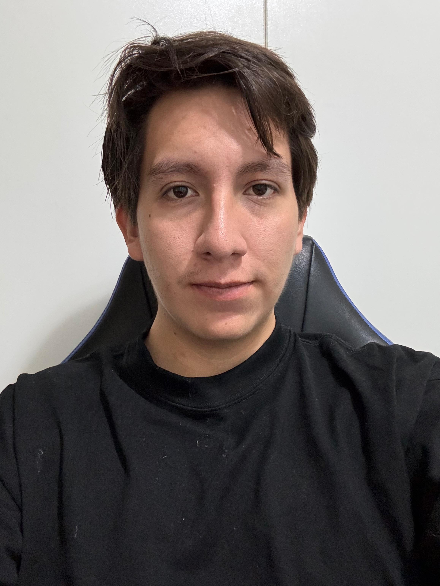

# GRUPO6-ISB-2025-II

## Introducción

Este repositorio contiene el trabajo del Grupo 6 en el curso Introducción a Señales Biomédicas 2025-II, incluyendo códigos, documentación y análisis de los laboratorios y del proyecto. Como equipo, buscamos aprender y aplicar los conceptos de adquisición, procesamiento y análisis de bioseñales, integrando la teoría con la práctica en un entorno colaborativo que potencie nuestra creatividad, el trabajo en conjunto y la innovación en el área biomédica.

  

## Integrantes
| Miembro del equipo | Información |
|------|-------------|
|  | **Alejandro Álvaro Untiveros Parra** <a href="mailto:alejandro.untiveros@upch.pe" style="color:blue; text-decoration:underline;">alejandro.untiveros@upch.pe</a>  xxxxxxxxxxxxxx |
|  | **Lucero Camila Munive Huaranga** <a href="mailto:lucero.munive@upch.pe" style="color:blue; text-decoration:underline;">lucero.munive@upch.pe</a>  Estudiante de Ingeniería Biomédica (PUCP – UPCH), cursando los últimos ciclos de formación. Me interesa especialmente el área clínica y la gestión de equipamiento médico, con la motivación de aplicar la ingeniería como un puente para resolver necesidades reales en el ámbito de la salud.Motivada a apoyar al personal médico mediante soluciones innovadoras y contribuir al fortalecimiento de un sistema sanitario más seguro, accesible y centrado en el paciente.|
|  | **Fiorella Yasira Pérez Arévalo** <a href="mailto:fiorella.perez@upch.pe" style="color:blue; text-decoration:underline;">fiorella.perez@upch.pe</a>  xxxxxxxxxxxxx|
